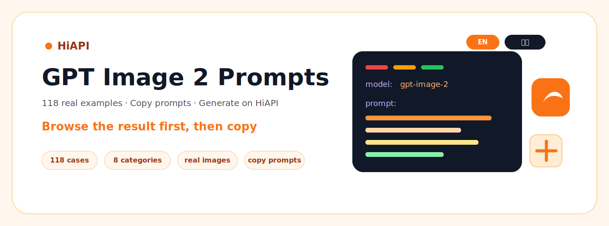
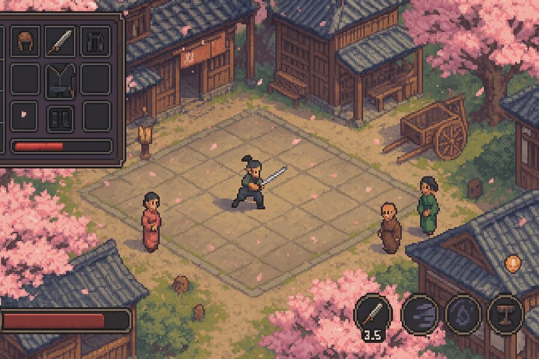
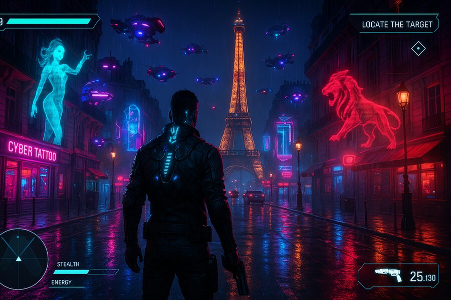
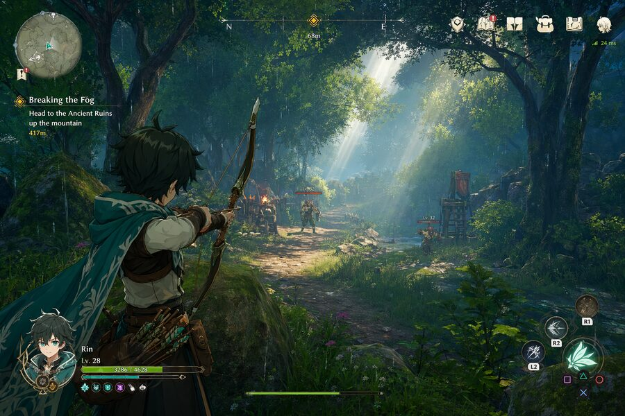
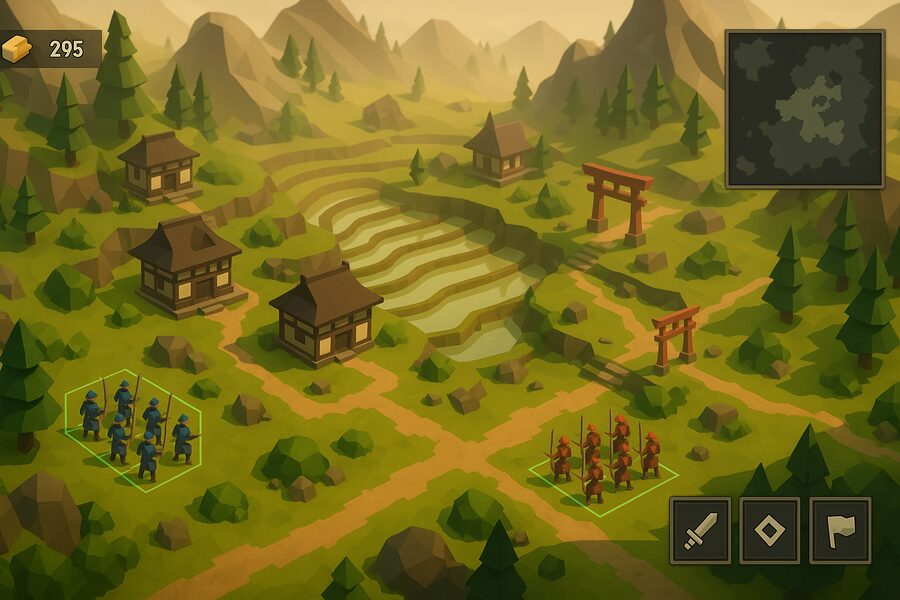
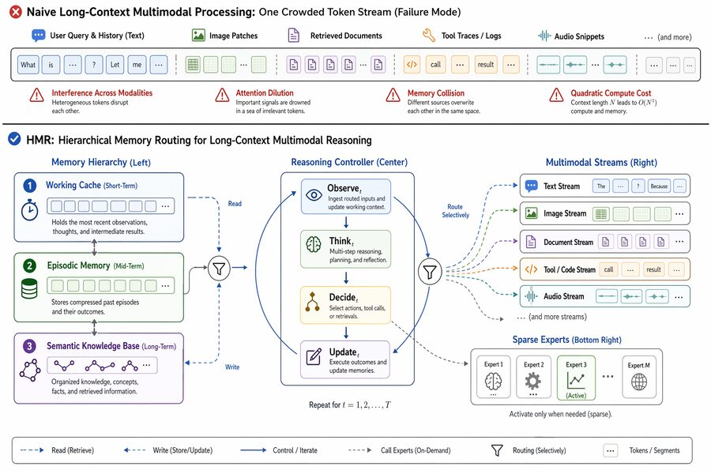
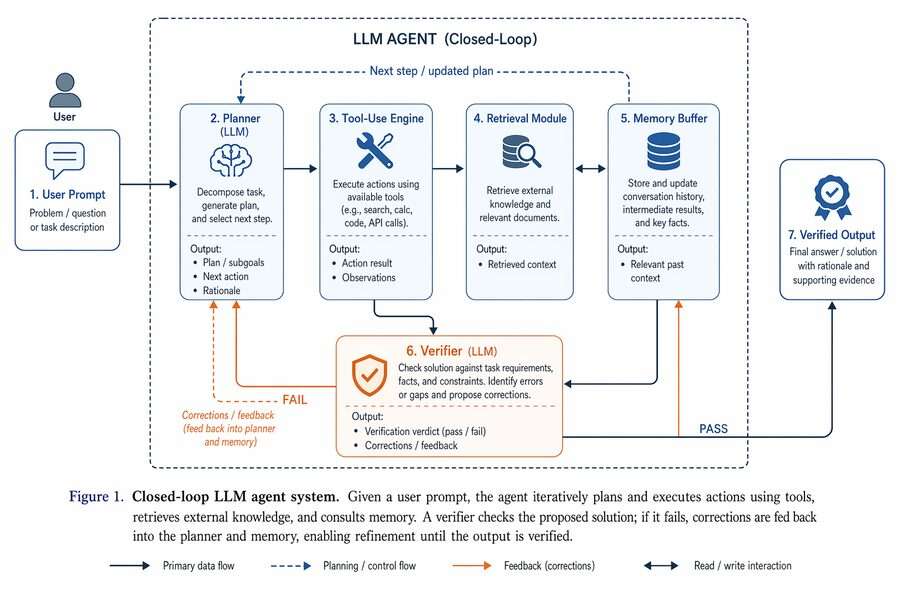

<div align="center">

<a href="https://www.hiapi.ai/en?utm_source=github&utm_medium=readme&utm_campaign=awesome-gpt-image-2-prompts"></a>

[](https://www.hiapi.ai/en?utm_source=github&utm_medium=readme&utm_campaign=awesome-gpt-image-2-prompts)
[](https://www.hiapi.ai/en/register?utm_source=github&utm_medium=readme&utm_campaign=awesome-gpt-image-2-prompts)
[](https://www.hiapi.ai/en/models/gpt-image-2?utm_source=github&utm_medium=readme&utm_campaign=awesome-gpt-image-2-prompts)
[](https://docs.hiapi.ai/?utm_source=github&utm_medium=readme&utm_campaign=awesome-gpt-image-2-prompts)


# Awesome GPT Image 2 Prompts

**A curated GPT Image 2 prompt gallery.**

[HiAPI](https://www.hiapi.ai/en?utm_source=github&utm_medium=readme&utm_campaign=awesome-gpt-image-2-prompts) · [GPT Image 2](https://www.hiapi.ai/en/models/gpt-image-2?utm_source=github&utm_medium=readme&utm_campaign=awesome-gpt-image-2-prompts) · [API Key](https://www.hiapi.ai/en/register?utm_source=github&utm_medium=readme&utm_campaign=awesome-gpt-image-2-prompts) · [Skill](https://github.com/HiAPIAI/hiapi-gpt-image-2-skill) · [简体中文](README.zh-CN.md)

</div>

> **HiAPI Matrix:** 🎨 **Image Prompts (you are here)** · 🎬 [Video Prompts](https://github.com/HiAPIAI/awesome-seedance-2-0-prompts) · 🛠️ [Agent Skills](https://github.com/HiAPIAI/hiapi-skills) · 🤖 [Remote MCP](https://docs.hiapi.ai/for-ai/) · 📖 [API Docs](https://docs.hiapi.ai)
>
> Have a prompt with a real output image? **[Submit it via issue template →](https://github.com/HiAPIAI/awesome-gpt-image-2-prompts/issues/new?template=submit-a-prompt.yml)** · [Contributing guide](./CONTRIBUTING.md)

---

## Creative Workshop | GPT Image 2 Example Gallery

This is not just a prompt list. It is a set of reusable visual examples: real output images, full prompts, aspect ratios, and HiAPI Draw prefill links in one place. Inspect the output first, then replace the subject, product, city, brand, or text with your own.

Explore 118 curated visual generation cases across portraits, commercial posters, character design, interface design, model tests, and reusable references. Each case includes a real output image, full prompt, creator or source attribution, and original link so you can study, adapt, and reuse practical AI visual creation patterns.

## Why Use This Gallery?

- Real generated results: inspect the output before copying the prompt.
- Full prompts are available in expandable sections for learning, editing, and reuse.
- Popular visual styles and common creative scenarios are organized for quick browsing.
- Each image link opens HiAPI Draw with the model, prompt, and aspect ratio prefilled.

## How To Use

1. Browse the Gallery and find a visual style you like.
2. Click a thumbnail to open the matching prompt on HiAPI automatically.
3. Click “Prompt” to read the full prompt inside this repository.
4. Replace the character, product, city, brand, or copy to create your own result.
5. Open the HiAPI Draw link, or copy the prompt into your own workflow.

<div align="center">

<b>Powered by <a href="https://www.hiapi.ai/en?utm_source=github&utm_medium=readme&utm_campaign=awesome-gpt-image-2-prompts">HiAPI</a> — One API, All AI Models</b><br>
<br><a href="https://www.hiapi.ai/en/models/gpt-image-2?utm_source=github&utm_medium=readme&utm_campaign=awesome-gpt-image-2-prompts">Try GPT-Image-2 for free →</a>

</div>

> <sub>Curated from public examples and community references. Creator and source links are preserved. See <a href="./NOTICE.md">NOTICE</a> for source details.</sub>

## What's New

- **2026-05-22** — One-command installer shipped for HiAPI skills: `npx -y github:HiAPIAI/hiapi-gpt-image-2-skill -y`. Supports local agent skill directories. · [→](https://github.com/HiAPIAI/hiapi-gpt-image-2-skill)
- **2026-05-21** — New repo `awesome-seedance-2-0-prompts` launched with 160+ Seedance 2.0 video recipes across 8 categories. · [→](https://github.com/HiAPIAI/awesome-seedance-2-0-prompts)
- **2026-05-13** — Added community reference prompt picks — fresh examples across portrait, poster, character, and UI categories.
- **2026-05-12** — Sources, NOTICE, and per-locale README copy cleaned up; case attribution discipline tightened. · [→](./NOTICE.md)
- **2026-05-07** — Repo positioned as API-ready creative recipes — every case links to HiAPI Draw with model and ratio prefilled.

## Browse By Type

[Portrait & Photography](./cases/portrait-photography.md) · [Poster & Illustration](./cases/poster-illustration.md) · [Character Design](./cases/character-design.md) · [UI & Social Mockups](./cases/ui-social.md) · [Model Tests & Community](./cases/comparison-community.md) · [Curated References](./cases/community-reference.md)

| Category | Count | Best For |
| --- | ---: | --- |
| [Portrait & Photography](./cases/portrait-photography.md) | 18 | Portraits, street shots, film looks, and mobile screenshot styles. |
| [Poster & Illustration](./cases/poster-illustration.md) | 40 | City posters, travel illustrations, typography, infographics, and commercial visuals. |
| [Character Design](./cases/character-design.md) | 7 | Character sheets, anime frames, key visuals, and character worldbuilding. |
| [UI & Social Mockups](./cases/ui-social.md) | 21 | App screens, social pages, livestream screenshots, info cards, and mobile UI. |
| [Model Tests & Community](./cases/comparison-community.md) | 15 | Counting, text rendering, game screenshots, complex scenes, and model tests. |
| [Curated References](./cases/community-reference.md) | 17 | Reusable references for game scenes, research figures, infographics, product visuals, and character concepts. |

<a id="gallery-portrait-photography"></a>

### [Portrait & Photography](./cases/portrait-photography.md) · 18 cases

Portraits, street shots, film looks, and mobile screenshot styles.

<table>
  <tr>
    <td align="center" width="33%" valign="top"><a href="https://www.hiapi.ai/draw?p=MzVtbSBmaWxtIHBob3RvZ3JhcGh5IHdpdGggaGFyc2ggY29udmVuaWVuY2Ugc3RvcmUgZmx1b3Jlc2NlbnQgbGlnaHRpbmcgbWl4ZWQgd2l0aCBjb2xvcmZ1bCBuZW9uIHNpZ25zIGZyb20gb3V0c2lkZSwgYXV0aGVudGljIGZpbG0gZ3JhaW4sIGhpZ2ggY29udHJhc3QsIHNsaWdodCBjb2xvciBjYXN0LCBjaW5lbWF0aWMgc3RyZWV0IGVkaXRvcmlhbCBzdHlsZSwgaW50aW1hdGUgbWVkaXVtIHNob3QsIGVhcmx5IDIwcyBzZXh5IENoaW5lc2UgZmVtYWxlIGlkb2wgd2l0aCB1bHRyYS1yZWFsaXN0aWMgZGVsaWNhdGUgcmVmaW5lZCBDaGluZXNlIGZlYXR1cmVzLCBzZWR1Y3RpdmUgYWxtb25kLXNoYXBlZCBmb3ggZXllcyB3aXRoIG5hdHVyYWwgZG91YmxlIGV5ZWxpZHMsIGhpZ2ggbm9zZSBicmlkZ2UsIHNtYWxsIHNoYXJwIFYtc2hhcGVkIGphd2xpbmUsIGZsYXdsZXNzIHBvcmNlbGFpbiBza2luIHdpdGggY29vbCBpdm9yeSB1bmRlcnRvbmUgYW5kIHZpc2libGUgc3BlY3VsYXIgaGlnaGxpZ2h0cyBmcm9tIGZsdW9yZXNjZW50IGxpZ2h0LCBzdWJ0bGUgc2tpbiB0ZXh0dXJlIGFuZCBtaWNybyBwb3JlcywgbmF0dXJhbCBkZXd5IG1ha2V1cCB3aXRoIHNvZnQgZmx1c2ggb24gY2hlZWtzLCBnbG9zc3kgbmF0dXJhbCBwaW5rIGxpcHMgc2xpZ2h0bHkgcGFydGVkLCBzdWJ0bGUgbmF0dXJhbCBmcmVja2xlcyBhY3Jvc3Mgbm9zZSBhbmQgY2hlZWtzLCBsb25nIGRhcmsgYnJvd24gaGFpciBpbiBhIG1lc3N5IGhpZ2ggcG9ueXRhaWwgd2l0aCBtYW55IGxvb3NlIHN0cmFuZHMgZmFsbGluZyBhcm91bmQgZmFjZSBhbmQgbmVjaywgd2VhcmluZyBhbiBvdmVyc2l6ZWQgd2hpdGUgYnV0dG9uLXVwIHNoaXJ0IGFzIHRoZSBvbmx5IHRvcCwgdW5idXR0b25lZCBhdCB0aGUgdG9wIHdpdGggZGVlcCBjbGVhdmFnZSBhbmQgbG9vc2VseSB0aWVkIGF0IHRoZSB3YWlzdCwgcGFpcmVkIHdpdGggYSB0aW55IGJsYWNrIHBsZWF0ZWQgbWluaSBza2lydCwgYmFyZWZvb3QgaW4gc2ltcGxlIHdoaXRlIHNsaWRlcywgc2VkdWN0aXZlIGNhc3VhbCBsZWFuaW5nIHBvc2UgYWdhaW5zdCB0aGUgZ2xhc3MgZG9vciBvZiBhIDI0LWhvdXIgY29udmVuaWVuY2Ugc3RvcmUgYXQgbGF0ZSBuaWdodCwgYm9keSBzbGlnaHRseSBhcmNoZWQsIG9uZSBsZWcgYmVudCB3aXRoIGZvb3QgcmVzdGluZyBhZ2FpbnN0IHRoZSBkb29yIGZyYW1lLCB0aGUgb3RoZXIgbGVnIHN0cmFpZ2h0LCBvbmUgaGFuZCBob2xkaW5nIGEgYm90dGxlIG9mIGljZWQgZHJpbmssIHRoZSBvdGhlciBoYW5kIGxpZ2h0bHkgcHVsbGluZyB0aGUgaGVtIG9mIGhlciBtaW5pIHNraXJ0LCBpbnRlbnNlbHkgc2VkdWN0aXZlIHBsYXlmdWwgeWV0IHNsaWdodGx5IHZ1bG5lcmFibGUgZ2F6ZSBzdHJhaWdodCBhdCB0aGUgdmlld2VyIHdpdGggc29mdCBkb2UgZXllcyBmdWxsIG9mIHF1aWV0IHRlbXB0YXRpb24gYW5kIHRlYXNpbmcgc21pbGUsIGJyaWdodCBjb2xkIGZsdW9yZXNjZW50IHN0b3JlIGxpZ2h0IGZyb20gaW5zaWRlIG1peGVkIHdpdGggcGluayBhbmQgYmx1ZSBuZW9uIGdsb3cgZnJvbSBvdXRzaWRlIHNpZ25zLCByZWFsaXN0aWMgcmVmbGVjdGlvbnMgb24gZ2xhc3MgZG9vciwgYmx1cnJlZCBjb252ZW5pZW5jZSBzdG9yZSBpbnRlcmlvciB3aXRoIHNoZWx2ZXMgYW5kIHNuYWNrcyBpbiBiYWNrZ3JvdW5kLCBhdXRoZW50aWMgMzVtbSBmaWxtIGNvbG9yIGdyYWRpbmcgd2l0aCBoYXJzaCBsaWdodGluZyBhbmQgbmVvbiBhY2NlbnRzLCBleHRyZW1lbHkgc2hhcnAgeWV0IHNvZnQgc2tpbiByZW5kZXJpbmcsIG5hdHVyYWwgaGFpciBzdHJhbmRzLCByZWFsaXN0aWMgZmFicmljIHdyaW5rbGVzIGFuZCBkcmFwZSBvbiB0aGUgb3ZlcnNpemVkIHNoaXJ0IGFuZCBtaW5pIHNraXJ0LCBubyBwbGFzdGljIHNraW4sIG5vIGRpZ2l0YWwgb3Zlci1zaGFycGVuaW5nLCBubyBhaXJicnVzaGluZywgbm8gYmxlbWlzaGVzLCBubyBtb2xlcywgbm8gb2lseSBza2luLCBubyB3YXRlcm1hcmssIG5vIHRleHQsIGF1dGhlbnRpYyBsYXRlLW5pZ2h0IGNvbnZlbmllbmNlIHN0b3JlIGF0bW9zcGhlcmU%3D&amp;m=gpt-image-2&amp;utm_source=awesome-gpt-image-2-prompts&amp;utm_medium=github_readme&amp;utm_campaign=en_gallery&amp;s=16%3A9"></a><br><sub><b>Case 001</b> · <a href="./cases/portrait-photography.md#portrait-case-1-convenience-store-neon-portrait-by-bubblebrain">Prompt</a></sub><br><sub><a href="https://x.com/BubbleBrain/status/2045167461147042202">Convenience Store Neon Portrait</a> · <a href="https://x.com/BubbleBrain">@BubbleBrain</a></sub></td>
    <td align="center" width="33%" valign="top"><a href="https://www.hiapi.ai/draw?p=R2VuZXJhdGUgYSBjaW5lbWF0aWMgbWluaW1hbCBwb3J0cmFpdCBvZiBhIHNvbGl0YXJ5IG1hbiBzdGFuZGluZyBpbiBhbiBpbnRlbnNlIG9yYW5nZSB0byByZWQgZ3JhZGllbnQgZW52aXJvbm1lbnQsIHN0cm9uZyBzaWxob3VldHRlIGxpZ2h0aW5nLCBkZWVwIHNoYWRvdyBjb250cmFzdCwgcmVmbGVjdGl2ZSBnbG9zc3kgZmxvb3IsIHN5bW1ldHJpY2FsIGNvbXBvc2l0aW9uLCBtaW5pbWFs&amp;m=gpt-image-2&amp;utm_source=awesome-gpt-image-2-prompts&amp;utm_medium=github_readme&amp;utm_campaign=en_gallery&amp;s=1%3A1"></a><br><sub><b>Case 002</b> · <a href="./cases/portrait-photography.md#portrait-case-2-cinematic-minimal-portrait-by-iammiharbi">Prompt</a></sub><br><sub><a href="https://x.com/iam_miharbi/status/2045151354679665101">Cinematic Minimal Portrait</a> · <a href="https://x.com/iam_miharbi">@iam_miharbi</a></sub></td>
    <td align="center" width="33%" valign="top"><a href="https://www.hiapi.ai/draw?p=MzVtbSBmaWxtIHBob3RvZ3JhcGh5LCB3YXJtIHZpbnRhZ2UgSmFwYW5lc2Ugb25zZW4gcnlva2FuIGFlc3RoZXRpYywgc29mdCBhbWJpZW50IHdvb2RlbiBsYW50ZXJuIGxpZ2h0aW5nIG1peGVkIHdpdGggZ2VudGxlIG5hdHVyYWwgd2luZG93IGxpZ2h0LCBzdWJ0bGUgZmlsbSBncmFpbiwgZ2VudGxlIGNvbG9yIHNoaWZ0LCBoaWdoIGF0bW9zcGhlcmUgZWRpdG9yaWFsIHN0eWxlLCBpbnRpbWF0ZSBtZWRpdW0gc2hvdCwgZWFybHkgMjBzIGJlYXV0aWZ1bCBDaGluZXNlIGZlbWFsZSBpZG9sIHdpdGggdWx0cmEtcmVhbGlzdGljIGRlbGljYXRlIHJlZmluZWQgQ2hpbmVzZSBmZWF0dXJlcywgc2VkdWN0aXZlIGFsbW9uZC1zaGFwZWQgZm94IGV5ZXMgd2l0aCBuYXR1cmFsIGRvdWJsZSBleWVsaWRzLCBoaWdoIG5vc2UgYnJpZGdlLCBzbWFsbCBzaGFycCBWLXNoYXBlZCBqYXdsaW5lLCBmbGF3bGVzcyBwb3JjZWxhaW4gc2tpbiB3aXRoIHdhcm0gaXZvcnkgdW5kZXJ0b25lLCB2aXNpYmxlIHN1YnRsZSBza2luIHRleHR1cmUgYW5kIG1pY3JvIHBvcmVzLCBzb2Z0IG5hdHVyYWwgbWFrZXVwIHdpdGggZGV3eSBnbG93LCBzdWJ0bGUgcm9zeSBmbHVzaCBvbiBjaGVla3MsIG5hdHVyYWwgc29mdCBwaW5rIGxpcHMgc2xpZ2h0bHkgcGFydGVkLCBsb25nIGRhcmsgYnJvd24gaGFpciB0aWVkIGluIGEgbG9vc2UgbG93IGJ1biB3aXRoIHNvbWUgbWVzc3kgc3RyYW5kcyBmYWxsaW5nIGFyb3VuZCBmYWNlIGFuZCBuZWNrLCB3ZWFyaW5nIGEgbG9vc2Ugd2hpdGUgeXVrYXRhICh0cmFkaXRpb25hbCBKYXBhbmVzZSBiYXRocm9iZSkgZGVsaWJlcmF0ZWx5IHNsaXBwZWQgb2ZmIG9uZSBzaG91bGRlciBhbmQgbG9vc2VseSB0aWVkIGF0IHRoZSB3YWlzdCwgdGhlIGZhYnJpYyBzbGlnaHRseSBvcGVuIHJldmVhbGluZyBzbW9vdGggc2tpbiBhbmQgc3VidGxlIGNsZWF2YWdlLCBiYXJlZm9vdCwgc2VkdWN0aXZlIHJlbGF4ZWQgc2l0dGluZyBwb3NlIG9uIHRoZSBlZGdlIG9mIGEgdHJhZGl0aW9uYWwgd29vZGVuIGVuZ2F3YSB2ZXJhbmRhIGF0IGEgdmludGFnZSBvbnNlbiByeW9rYW4sIGJvZHkgc2xpZ2h0bHkgdHVybmVkIHRvd2FyZCB0aGUgY2FtZXJhLCBvbmUgbGVnIGJlbnQgd2l0aCBmb290IHJlc3Rpbmcgb24gdGhlIHdvb2RlbiBmbG9vciwgdGhlIG90aGVyIGxlZyBnZW50bHkgZGFuZ2xpbmcsIG9uZSBoYW5kIGxpZ2h0bHkgaG9sZGluZyB0aGUgeXVrYXRhIGNvbGxhciwgdGhlIG90aGVyIGhhbmQgcmVzdGluZyBvbiB0aGUgd29vZGVuIGZsb29yIGJlaGluZCBoZXIgZm9yIHN1cHBvcnQsIHNvZnRseSBhcmNoZWQgYmFjayB0byBnZW50bHkgYWNjZW50dWF0ZSBjdXJ2ZXMsIGludGVuc2VseSBzZWR1Y3RpdmUgeWV0IGdlbnRsZSBhbmQgaW52aXRpbmcgZ2F6ZSBzdHJhaWdodCBhdCB0aGUgdmlld2VyIHdpdGggc29mdCBkb2UgZXllcyBmdWxsIG9mIHF1aWV0IHRlbXB0YXRpb24gYW5kIHdhcm10aCwgd2FybSB3b29kZW4gaW50ZXJpb3Igd2l0aCBwYXBlciBzbGlkaW5nIGRvb3JzIGFuZCBkaXN0YW50IHN0ZWFtaW5nIGhvdCBzcHJpbmcgaW4gc29mdCBmb2N1cywgZ2VudGxlIHJpbSBsaWdodGluZyBoaWdobGlnaHRpbmcgc2tpbiBhbmQgZmFicmljIHRleHR1cmUsIGF1dGhlbnRpYyB2aW50YWdlIGZpbG0gY29sb3IgZ3JhZGluZyB3aXRoIHdhcm0gdG9uZXMsIGV4dHJlbWVseSBzaGFycCB5ZXQgc29mdCBza2luIHJlbmRlcmluZywgbmF0dXJhbCBoYWlyIHN0cmFuZHMsIHJlYWxpc3RpYyBmYWJyaWMgd3JpbmtsZXMgYW5kIGRyYXBlIG9uIHRoZSB5dWthdGEsIG5vIHBsYXN0aWMgc2tpbiwgbm8gZGlnaXRhbCBvdmVyLXNoYXJwZW5pbmcsIG5vIGFpcmJydXNoaW5nLCBubyBibGVtaXNoZXMsIG5vIG1vbGVzLCBubyBvaWx5IHNraW4sIG5vIHdhdGVybWFyaywgbm8gdGV4dCwgYXV0aGVudGljIDM1bW0gZmlsbSBKYXBhbmVzZSBvbnNlbiByeW9rYW4gYXRtb3NwaGVyZQ%3D%3D&amp;m=gpt-image-2&amp;utm_source=awesome-gpt-image-2-prompts&amp;utm_medium=github_readme&amp;utm_campaign=en_gallery"></a><br><sub><b>Case 003</b> · <a href="./cases/portrait-photography.md#portrait-case-3-japanese-onsen-ryokan-portrait-by-bubblebrain">Prompt</a></sub><br><sub><a href="https://x.com/BubbleBrain/status/2045092449803284923">Japanese Onsen Ryokan Portrait</a> · <a href="https://x.com/BubbleBrain">@BubbleBrain</a></sub></td>
  </tr>
  <tr>
    <td align="center" width="33%" valign="top"><a href="https://www.hiapi.ai/draw?p=MzVtbSBjb2xvciBmaWxtIHBob3RvZ3JhcGh5IHdpdGggaGFyc2ggZGlyZWN0IG9uLWNhbWVyYSBmbGFzaCwgc3BlY3VsYXIgaGlnaGxpZ2h0cyBvbiBza2luIGFuZCBjbG90aGluZywgc3Ryb25nIGNhdGNobGlnaHRzIGluIGV5ZXMsIGhpZ2ggY29udHJhc3QgZmxhc2ggaWxsdW1pbmF0aW9uLCBhdXRoZW50aWMgZmlsbSBncmFpbiBhbmQgY29sb3Igc2hpZnQsIGhpZ2ggZmFzaGlvbiBmcmVzaCBpbm5vY2VudCBiYXNrZXRiYWxsIGNvdXJ0IGVkaXRvcmlhbCBzdHlsZSwgaW50aW1hdGUgZmlyc3QtcGVyc29uIGxvdy1hbmdsZSBQT1Ygc2hvdCBmcm9tIGJlbG93LCBlYXJseSAyMHMgc2V4eSBDaGluZXNlIGZlbWFsZSBpZG9sIHdpdGggdWx0cmEtcmVhbGlzdGljIGRlbGljYXRlIHJlZmluZWQgQ2hpbmVzZSBmZWF0dXJlcywgc2VkdWN0aXZlIGFsbW9uZC1zaGFwZWQgZm94IGV5ZXMgd2l0aCBuYXR1cmFsIGRvdWJsZSBleWVsaWRzLCBoaWdoIG5vc2UgYnJpZGdlLCBzbWFsbCBzaGFycCBWLXNoYXBlZCBqYXdsaW5lLCBmbGF3bGVzcyByZWFsaXN0aWMgcG9yY2VsYWluIHNraW4gd2l0aCBjb29sIGl2b3J5IHVuZGVydG9uZSBhbmQgdmlzaWJsZSBmbGFzaCBzcGVjdWxhciBoaWdobGlnaHRzLCBmaW5lIGRlbGljYXRlIHNraW4gdGV4dHVyZSB3aXRoIHN1YnRsZSBwb3JlcyBtaWNybyBkZXRhaWxzIGFuZCBuYXR1cmFsIGRld3kgZ2xvdyB1bmRlciBmbGFzaCwgZnJlc2ggbmF0dXJhbCBzcG9ydHkgbWFrZXVwIHdpdGggc29mdCBkZXd5IGdsb3csIHN1YnRsZSBuYXR1cmFsIGZsdXNoIG9uIGNoZWVrcywgbmF0dXJhbCBwaW5rIGxpcHMgc2xpZ2h0bHkgcGFydGVkLCBzdWJ0bGUgbmF0dXJhbCBmcmVja2xlcyBhY3Jvc3Mgbm9zZSBhbmQgY2hlZWtzLCBsb25nIGRhcmsgYnJvd24gaGFpciB0aWVkIGluIGEgaGlnaCBwbGF5ZnVsIHBvbnl0YWlsIHdpdGggc29tZSBsb29zZSBzdHJhbmRzIGZyYW1pbmcgdGhlIGZhY2UgYW5kIHJlYWxpc3RpYyBsb29zZSBzdHJhbmRzLCB3ZWFyaW5nIGEgbG9vc2Ugd2hpdGUgdGFuayB0b3AgYW5kIHdoaXRlIGhpZ2gtd2Fpc3RlZCBiYXNrZXRiYWxsIHNob3J0cywgd2hpdGUga25lZS1oaWdoIHNwb3J0cyBzb2Nrcywgc2VkdWN0aXZlIG5hdHVyYWwgbGVhbmluZyBwb3NlIGFnYWluc3QgdGhlIGJhc2tldGJhbGwgaG9vcCBwb2xlIG9uIHRoZSBvdXRkb29yIGNvdXJ0IGF0IGR1c2ssIGJvZHkgYW5nbGVkIHNpZGV3YXlzIHdpdGggbmF0dXJhbGx5IGFyY2hlZCBiYWNrIGFuZCBoaXBzIGdlbnRseSBwdXNoZWQgYmFjayB0byBhY2NlbnR1YXRlIHBlcmt5IHJvdW5kIGhpcHMgYW5kIHNleHkgYnV0dCBjdXJ2ZSwgb25lIGxlZyBuYXR1cmFsbHkgZXh0ZW5kZWQgZm9yd2FyZCB0b3dhcmQgdGhlIGNhbWVyYSBhbmQgdGhlIG90aGVyIGxlZyBzbGlnaHRseSBiZW50IHRvIGVtcGhhc2l6ZSBsb25nIHNleHkgbGVncywgYm90aCBoYW5kcyBsaWdodGx5IHJlc3Rpbmcgb24gdGhlIGJhc2tldGJhbGwgcG9sZSBhdCBzaG91bGRlciBoZWlnaHQsIGludGVuc2VseSBzZWR1Y3RpdmUgcGxheWZ1bCB5ZXQgcGl0aWFibGUgZG9lLWV5ZWQgZ2F6ZSBzdHJhaWdodCBhdCB0aGUgdmlld2VyIHdpdGggc29mdCB2dWxuZXJhYmxlIGxvbmdpbmcgZXllcyBhbmQgYSBnZW50bGUgdGVhc2luZyBzbWlsZSBmdWxsIG9mIHF1aWV0IHRlbXB0YXRpb24gYW5kIGRlc2lyZSwgaGFyc2ggZGlyZWN0IG9uLWNhbWVyYSBmbGFzaCBjcmVhdGluZyBzaGFycCBzcGVjdWxhciBoaWdobGlnaHRzIGFuZCBzdHJvbmcgY2F0Y2hsaWdodHMsIGJhY2tncm91bmQgd2l0aCBibHVycmVkIGJhc2tldGJhbGwgY291cnQgYW5kIGhvb3AgdW5kZXIgZHVzayBza3ksIGhpZ2ggY29udHJhc3QgZmlsbSBjb2xvciBncmFkaW5nIHdpdGggbmF0dXJhbCBmbGFzaCBsb29rLCBleHRyZW1lbHkgc2hhcnAgeWV0IHNvZnQgc2tpbiByZW5kZXJpbmcgd2l0aCBhdXRoZW50aWMgMzVtbSBkaXJlY3QgZmxhc2ggYWVzdGhldGljLCBuYXR1cmFsIGhhaXIgc3RyYW5kcywgcmVhbGlzdGljIGZhYnJpYyB0ZXh0dXJlIG9uIHRhbmsgdG9wIGFuZCBzaG9ydHMgd2l0aCBzb2NrcyBkZXRhaWwsIG5vIHBsYXN0aWMgc2tpbiwgbm8gZGlnaXRhbCBvdmVyLXNoYXJwZW5pbmcsIG5vIGFpcmJydXNoaW5nLCBubyBibGVtaXNoZXMsIG5vIG1vbGVzLCBubyBvaWx5IHNraW4sIG5vIHdhdGVybWFyaywgbm8gdGV4dCwgYXV0aGVudGljIDM1bW0gZGlyZWN0IGZsYXNoIGZpbG0gYmFza2V0YmFsbCBjb3VydCBsb29rIC0tYXIgOToxNg%3D%3D&amp;m=gpt-image-2&amp;utm_source=awesome-gpt-image-2-prompts&amp;utm_medium=github_readme&amp;utm_campaign=en_gallery&amp;s=9%3A16"></a><br><sub><b>Case 004</b> · <a href="./cases/portrait-photography.md#portrait-case-4-35mm-flash-editorial-portrait-by-bubblebrain">Prompt</a></sub><br><sub><a href="https://x.com/BubbleBrain/status/2045052982728016131">35mm Flash Editorial Portrait</a> · <a href="https://x.com/BubbleBrain">@BubbleBrain</a></sub></td>
    <td align="center" width="33%" valign="top"><a href="https://www.hiapi.ai/draw?p=QSBzdHVubmluZyAxOC15ZWFyLW9sZCBDaGluZXNlIGdpcmwgd2l0aCBhIHlvdXRoZnVsLCBwdXJlIGZhY2UgYW5kIHJlYWxpc3RpYyBza2luIHRleHR1cmUsIHNpdHRpbmcgb24gYSBjb3p5LCBzbGlnaHRseSBtZXNzeSBiZWQgaW4gaGVyIGJlZHJvb20uIFNoZSBpcyB0YWtpbmcgYSBtaXJyb3Igc2VsZmllIHdpdGggYSBzbWFydHBob25lLCBjYXB0dXJpbmcgYSBuYXR1cmFsIGFuZCBpbnRpbWF0ZSBtb21lbnQuIFdlYXJpbmcgY2FzdWFsIGdyYXkgbG91bmdld2VhciBhbmQgbmVhdCB3aGl0ZSBjcmV3IHNvY2tzLiBTb2Z0IG5hdHVyYWwgbGlnaHQgKGdvbGRlbiBob3VyKSBzdHJlYW1zIGluIGZyb20gYSBzaWRlIHdpbmRvdywgY3JlYXRpbmcgYSB3YXJtLCBtb29keSwgYW5kIGNpbmVtYXRpYyBhdG1vc3BoZXJlLiAzNW1tIGxlbnMsIHNoYXJwIGZvY3VzIG9uIHRoZSBzdWJqZWN0IGluIHRoZSBtaXJyb3IsIGRlcHRoIG9mIGZpZWxkIHdpdGggYSBiZWF1dGlmdWxseSBibHVycmVkIGJhY2tncm91bmQgKGJva2VoKS4gUGhvdG9yZWFsaXN0aWMsIDhLLCBoaWdoIHJlc29sdXRpb24sIHN0dWRpbyBxdWFsaXR5LCBtYXN0ZXJwaWVjZS4KTmVnYXRpdmUgUHJvbXB0czogbm8gZXh0cmEgbGltYnMsIG5vIGRlZm9ybWVkIGhhbmRzLCBubyBibHVyLCBubyBub2lzZSwgbm8gd2F0ZXJtYXJrLCBubyB0ZXh0LCBubyBjYXJ0b29uL2FuaW1lIHN0eWxlLiBBc3BlY3QgUmF0aW86IDM6NC4%3D&amp;m=gpt-image-2&amp;utm_source=awesome-gpt-image-2-prompts&amp;utm_medium=github_readme&amp;utm_campaign=en_gallery&amp;s=3%3A4"></a><br><sub><b>Case 005</b> · <a href="./cases/portrait-photography.md#portrait-case-5-mirror-selfie-bedroom-portrait-by-shinning1010">Prompt</a></sub><br><sub><a href="https://x.com/Shinning1010/status/2045002808903020962">Mirror Selfie Bedroom Portrait</a> · <a href="https://x.com/Shinning1010">@Shinning1010</a></sub></td>
    <td align="center" width="33%" valign="top"><a href="https://www.hiapi.ai/draw?p=QW5hbG9nIDM1bW0gZmlsbSBwaG90b2dyYXBoeSwgc29mdCBhaXJ5IEphcGFuZXNlLXN0eWxlIGFlc3RoZXRpYywgZ2VudGxlIGRpZmZ1c2VkIG5hdHVyYWwgd2luZG93IGxpZ2h0LCBzbGlnaHQgb3ZlcmV4cG9zdXJlLCBwYXN0ZWwgdG9uZXMsIGxvdyBjb250cmFzdCwgc29mdCBoaWdobGlnaHRzLCBtaW5pbWFsIGluZG9vciBzZXR0aW5nIG5lYXIgYSB3aW5kb3cgd2l0aCB3aGl0ZSBjdXJ0YWlucywgY2xlYW4gbGlnaHQtY29sb3JlZCB3YWxsLCBuYXR1cmFsIGNvbXBvc2l0aW9uLCBleWUtbGV2ZWwsIHNsaWdodGx5IGNsb3NlciBmdWxsLWJvZHkgZnJhbWluZyAobWlkLXRoaWdoIHRvIGhlYWQpLCB5b3VuZyBFYXN0IEFzaWFuIHdvbWFuLCBuYXR1cmFsIG1pbmltYWwgbWFrZXVwLCBzb2Z0IHJlYWxpc3RpYyBza2luIHRleHR1cmUsIGxvbmcgc2xpZ2h0bHkgbWVzc3kgZGFyayBoYWlyLCBvdmVyc2l6ZWQgd2hpdGUgYnV0dG9uLXVwIHNoaXJ0LCBsaWdodCBjYXN1YWwgc2hvcnRzLCBiYXJlZm9vdCwgc2ltcGxlIGFuZCByZWxheGVkIHN0eWxpbmcsIHN0YW5kaW5nIG5hdHVyYWxseSB3aXRoIHJlbGF4ZWQgcG9zdHVyZSwgYXJtcyBsb29zZWx5IGF0IHNpZGVzIG9yIHNsaWdodGx5IGJlaGluZCwgZmFjaW5nIGNhbWVyYSwgZ2VudGxlIHNvZnQgc21pbGUsIHN1YnRsZSBzdGlsbG5lc3MsIGZvY3VzIG9uIGxpZ2h0LCBhaXIsIGFuZCBxdWlldCBldmVyeWRheSBtb29kLCBzb2Z0IGZpbG0gZ3JhaW4sIGRyZWFteSBhbmQgdW5kZXJzdGF0ZWQgYXRtb3NwaGVyZSAtLWFyIDk6MTY%3D&amp;m=gpt-image-2&amp;utm_source=awesome-gpt-image-2-prompts&amp;utm_medium=github_readme&amp;utm_campaign=en_gallery&amp;s=9%3A16"></a><br><sub><b>Case 006</b> · <a href="./cases/portrait-photography.md#portrait-case-6-soft-airy-35mm-portrait-by-bubblebrain">Prompt</a></sub><br><sub><a href="https://x.com/BubbleBrain/status/2046115431144902732">Soft Airy 35mm Portrait</a> · <a href="https://x.com/BubbleBrain">@BubbleBrain</a></sub></td>
  </tr>
</table>

**[Browse all 18 cases →](./cases/portrait-photography.md)**

<a id="gallery-poster-illustration"></a>

### [Poster & Illustration](./cases/poster-illustration.md) · 40 cases

City posters, travel illustrations, typography, infographics, and commercial visuals.

<table>
  <tr>
    <td align="center" width="33%" valign="top"><a href="https://www.hiapi.ai/draw?p=QSBzdHJpa2luZyBTcHJpbmcgMjAyNiBjaXR5IHBvc3RlciBmb3IgQm9zdG9uIHdpdGggYW4gZWxlZ2FudCBjZWxlYnJhdG9yeSBtb29kIGFuZCBhIGJvbGQgY29udGVtcG9yYXJ5IGRlc2lnbi4gT24gYSBjbGVhbiBvZmYtd2hpdGUgdGV4dHVyZWQgYmFja2dyb3VuZCB3aXRoIGxhcmdlIGFyZWFzIG9mIG5lZ2F0aXZlIHNwYWNlLCBhIG1pbmlhdHVyZSBzaW5nbGUgc2N1bGxlciByb3dzIGFjcm9zcyB0aGUgbG93ZXIgcmlnaHQgY29ybmVyIG9mIHRoZSBpbWFnZSBvbiBhIG5hcnJvdyByaWJib24gb2YgcmVmbGVjdGl2ZSB3YXRlci4gVGhlIHdha2UgZnJvbSB0aGUgb2FyIHN3ZWVwcyB1cHdhcmQgaW4gYSBkeW5hbWljIGNhbGxpZ3JhcGhpYyBjdXJ2ZSwgZ3JhZHVhbGx5IHRyYW5zZm9ybWluZyBpbnRvIHRoZSBDaGFybGVzIFJpdmVyIGFuZCB0aGVuIGludG8gYSBkcmVhbWxpa2UgaGFuZC1wYWludGVkIHBhbm9yYW1hIG9mIEJvc3Rvbi4gSW5zaWRlIHRoaXMgZmxvd2luZyByaXZlci1zaGFwZWQgY29tcG9zaXRpb24gYXJlIGljb25pYyBCb3N0b24gZWxlbWVudHM6IHRoZSBCYWNrIEJheSBza3lsaW5lLCBCZWFjb24gSGlsbCBicm93bnN0b25lcywgQWNvcm4gU3RyZWV0LCBCb3N0b24gUHVibGljIEdhcmRlbiwgU3dhbiBCb2F0cywgWmFraW0gQnJpZGdlLCBGZW53YXktaW5zcGlyZWQgZGV0YWlscywgaGlzdG9yaWMgYnJpY2sgYXJjaGl0ZWN0dXJlLCBoYXJib3IgZmVycmllcywgYW5kIHRoZSBjaXR54oCZcyB3YXRlcmZyb250IGF0bW9zcGhlcmUuIFNvZnQgbW9ybmluZyBmb2csIGdvbGRlbiBzcHJpbmcgbGlnaHQsIHN1YnRsZSBmZXN0aXZlIGFjY2VudHMgaW4gY3JpbXNvbiBhbmQgZ29sZCwgcmljaCBkZXRhaWwsIGxheWVyZWQgZGVwdGgsIHNvcGhpc3RpY2F0ZWQgY2l0eS1wb3N0ZXIgYWVzdGhldGljcywgZnJlc2ggYW5kIHJlZmluZWQsIHZpc3VhbGx5IHBvd2VyZnVsIGJ1dCBub3Qgb3ZlcmNyb3dkZWQuIEVsZWdhbnQgdHlwb2dyYXBoeSBpbiB0aGUgbG93ZXIgbGVmdCByZWFkcyDigJxTUFJJTkcgMjAyNuKAnSB3aXRoIGEgdmVydGljYWwgc2xvZ2FuIOKAnEJPU1RPTiwgQSBDSVRZIE9GIFJJVkVSLCBNRU1PUlksIEFORCBJTlZFTlRJT07igJ0sIHRleHQgY2xlYXIgYW5kIGJlYXV0aWZ1bGx5IGNvbXBvc2VkLCBwcmVtaXVtIGdyYXBoaWMgZGVzaWduLCA5OjE2&amp;m=gpt-image-2&amp;utm_source=awesome-gpt-image-2-prompts&amp;utm_medium=github_readme&amp;utm_campaign=en_gallery&amp;s=9%3A16"></a><br><sub><b>Case 019</b> · <a href="./cases/poster-illustration.md#poster-case-1-boston-spring-2026-city-poster-by-bubblebrain">Prompt</a></sub><br><sub><a href="https://x.com/BubbleBrain/status/2045358053831172358">Boston Spring 2026 City Poster</a> · <a href="https://x.com/BubbleBrain">@BubbleBrain</a></sub></td>
    <td align="center" width="33%" valign="top"><a href="https://www.hiapi.ai/draw?p=TW9kZXJuIHBlbmNpbCBpbGx1c3RyYXRpb24gb2YgVmludGFnZSB0cmF2ZWwgcG9zdGVyIGlsbHVzdHJhdGlvbiBvZiB0aGUgQW1hbGZpIENvYXN0LCBJdGFseSwgcGFub3JhbWljIGNvYXN0YWwgY2xpZmYgcm9hZCBzY2VuZSwgY2xhc3NpYyAxOTYwcyB3aGl0ZSBjYXIgZHJpdmluZyBhbG9uZyBhIGN1cnZlZCBzZWFzaWRlIHJvYWQsIGRlZXAgYmx1ZSBNZWRpdGVycmFuZWFuIHNlYSB3aXRoIHNtYWxsIHNhaWxib2F0cywgY29sb3JmdWwgcGFzdGVsIGhpbGxzaWRlIHZpbGxhZ2UsIGJyaWdodCBibHVlIHNreSB3aXRoIHNvZnQgY2xvdWRzLCBsZW1vbiB0cmVlIGJyYW5jaGVzIHdpdGggdmlicmFudCB5ZWxsb3cgbGVtb25zIGZyYW1pbmcgdGhlIGZvcmVncm91bmQsIHdhcm0gc3VtbWVyIHN1bmxpZ2h0LCBib2xkIHZpYnJhbnQgY29sb3JzLCByZXRybyAxOTUwcyB0cmF2ZWwgcG9zdGVyIHN0eWxlLCBjaW5lbWF0aWMgY29tcG9zaXRpb24sIGhpZ2ggZGV0YWlsLCBzY3JlZW4gcHJpbnQgdGV4dHVyZSwgZ3JhcGhpYyBpbGx1c3RyYXRpb24uIEhhbmQtZHJhd24gc3R5bGUsIGlsbHVzdHJhdGlvbiB3aXRoIGxvb3NlIHN0cm9rZXMgYW5kIGRlZmluZWQgY29udG91cnMuIEhpZ2gtY29udHJhc3QgY29sb3IgcGFsZXR0ZSwgbWFpbnRhaW5pbmcgY2hyb21hdGljIGhhcm1vbnkgYmV0d2VlbiBiYWNrZ3JvdW5kIGFuZCBlbGVtZW50cy4gQ29udGVtcG9yYXJ5IGFuZCBkZWNvcmF0aXZlIGFlc3RoZXRpYy4%3D&amp;m=gpt-image-2&amp;utm_source=awesome-gpt-image-2-prompts&amp;utm_medium=github_readme&amp;utm_campaign=en_gallery&amp;s=9%3A16"></a><br><sub><b>Case 020</b> · <a href="./cases/poster-illustration.md#poster-case-2-vintage-amalfi-travel-poster-by-wolfriccardo">Prompt</a></sub><br><sub><a href="https://x.com/WolfRiccardo/status/2044562722491121718">Vintage Amalfi Travel Poster</a> · <a href="https://x.com/WolfRiccardo">@WolfRiccardo</a></sub></td>
    <td align="center" width="33%" valign="top"><a href="https://www.hiapi.ai/draw?p=5LiA5byg5omL57uY6aOO5qC855qE5Z%2BO5biC576O6aOf5Zyw5Zu%2B77yM5Lul5oiQ6YO95Li65Li76aKY44CC55S76Z2i5Lul6bif556w6KeG6KeS55qE5omL57uY566A5YyW5Z%2BO5biC5Zyw5Zu%2B5Li65bqV77yM5qCH5rOo5Li76KaB6YGT6Lev5ZKM5Zyw5qCH5L2G5LiN6L%2B95rGC57K%2B56Gu5q%2BU5L6L6ICM5piv6L%2B95rGC5Y%2Bv54ix55qE5omL57uY5oSf44CC5Zyw5Zu%2B5LiK5YiG5biD552AIDEyIOS4que%2Bjumjn%2BWcsOeCueeahOeyvuiHtOaJi%2Be7mOWwj%2BaPkueUu%2B%2B8muaYpeeGmei3r%2BeahOS4suS4summme%2B8iOS4gOaKiuerueetvuaPkuedgOWQhOenjemjn%2BadkOWGkuedgOeDreawlO%2B8ieOAgeWuveeqhOW3t%2BWtkOeahOS4ieWkp%2BeCru%2B8iOS4ieS4quezr%2Bexs%2BWbouWtkOmjnuWQkemTnOebmO%2B8ieOAgeW7uuiuvui3r%2BeahOibi%2BeDmOezle%2B8iOmHkem7hOmFpeiEhuato%2BWcqOe%2Fu%2Bmdou%2B8ieOAgeeOieael%2Bi3r%2BeahOeBq%2BmUhe%2B8iOS5neWuq%2BagvOmUhee%2Fu%2Ba7muWGkuazoe%2B8ieetie%2B8jOavj%2BS4quaPkueUu%2Be6puWNoOWcsOWbvueahCA1JSDpnaLnp6%2FvvIzml4HovrnnlKjmiYvlhpnkvZPmoIfms6jlupflkI3lkozkuIDlj6XmjqjojZDor60i5YeM5pmo5Lik54K56L%2BY5Zyo5o6S6Zif55qE6YKj5a62IuOAguWcsOWbvui%2Buee8mOeUqOaJi%2Be7mOiXpOiUk%2BWSjOi%2Bo%2BakkuijhemlsOW9ouaIkOi%2BueahhuOAguWPs%2BS4i%2BinkuacieS4gOS4quaJi%2Be7mOaMh%2BWNl%2BmSiOWSjOWbvuS%2Bi%2BivtOaYjuOAguW3puS4iuinkuagh%2BmimCLmiJDpg73Ct%2BWQg%2Bi0p%2BaatOi1sOWcsOWbviLkvb%2FnlKjog5blnIbnmoTmiYvnu5jnvo7mnK%2FlrZfphY3ovqPmpJLoo4XppbDjgILmlbTkvZPnlLvpo47kuLrmsLTlvakr5b2p6ZOF5re35ZCI55qE5omL57uY6LSo5oSf77yM6aKc6Imy5Lul5pqW6Imy57O777yI6L6j5qSS57qi44CB5aec6buE44CB57%2Bg57u%2F77yJ5Li65Li777yM5Zu%2B54mH5q%2BU5L6LIDE6MeOAgg%3D%3D&amp;m=gpt-image-2&amp;utm_source=awesome-gpt-image-2-prompts&amp;utm_medium=github_readme&amp;utm_campaign=en_gallery&amp;s=1%3A1"></a><br><sub><b>Case 021</b> · <a href="./cases/poster-illustration.md#poster-case-3-chengdu-food-map-illustration-by-panda20230902">Prompt</a></sub><br><sub><a href="https://x.com/Panda20230902/status/2045396918965285111">Chengdu Food Map Illustration</a> · <a href="https://x.com/Panda20230902">@Panda20230902</a></sub></td>
  </tr>
  <tr>
    <td align="center" width="33%" valign="top"><a href="https://www.hiapi.ai/draw?p=5p6B566A5paw5Lit5byP576O5a2m6aOO5qC877yM55S76Z2i5Lul5reh6ZuF55qE54Gw55m96Imy5Li65bqV77yM5ZGI546w5Ye65LiA56eN57q46Im65Ymq5b2x6Iis55qE56uL5L2T5oSf44CCCuS4gOadoVPlvaLonL%2FonJLnmoToo4Lnl5XnirbovrnnvJjlsIbnlLvpnaLliIblibLvvIzku7%2FkvZvmkpXlvIDkuobkuIDlsYLnurjpnaLvvIzpnLLlh7rlhoXpg6joibLlvanmlpHmlpPnmoTkuJzmlrnlsbHmsLTmma%2FosaHjgIIK6KOC5Y%2Bj5YaF77yM5LiA5p2h6Jy%2F6JyS55qE5rKz5rWB6Ieq5LiK6ICM5LiL6LSv56m%2F5pW05Liq5p6E5Zu%2B77yM5rKz5rC05Lul5rex5rWF5LiN5LiA55qE6JOd6Imy5riy5p%2BT77yM5bGC5qyh5YiG5piO77yM5Lu%2F5L2b5rWB5Yqo55qE5Lid5bim44CCCuays%2BWyuOS4pOS%2Bp%2BeCuee8gOedgOmdkue%2FoOeahOWxseS4mOS4juair%2BeUsO%2B8jOiJsuW9qeaflOWSjO%2B8jOe7v%2Be6ouS6pOe7h%2B%2B8jOWxleeOsOWHuueUsOWbreeahOWugemdmeS5i%2Be%2BjuOAggrmsr%2FmsrPogIzlu7rnmoTlj6Tpo47lu7rnrZHplJnokL3mnInoh7TvvIzpo57mqpDnv5jop5LvvIznmb3lopnpu5vnk6bvvIzlnKjlhYnlvbHnmoTmmKDooazkuIvmm7TmmL7lj6TmnLTlhbjpm4XjgIIK5bK46L655qCR5pyo6JGx6IyP77yM5p6d5Y%2B26L2755uI77yM5LiA6ImY5bCP6Ii56Z2Z5rOK5LqO5rC05Lit5aSu77yM5aKe5re75LqG5Yeg5YiG5oKg54S25oSP5aKD44CCCuaVtOS9k%2BaehOWbvuWRiFPlvaLmm7Lnur%2FvvIzlr4zmnInpn7XlvovmhJ%2FvvIzku7%2FkvZvoh6rnhLbkuI7kurrmlofnmoTlkozosJDlhbHnlJ%2FjgIIK55S75L2c6L6557yY6YeH55So5pKV57q45pWI5p6c77yM6JCl6YCg5Ye656uL5L2T5rWu6ZuV6Iis55qE6KeG6KeJ5L2T6aqM44CCCuS4i%2BaWuemimOWtl%2BKAnOS4nOaWuee%2BjuWtpuKAneS7pem7keiJsualt%2BS9k%2BS5puWGme%2B8jOaXpeacn%2BKAnDIwMjYvMDQvMTjigJ3kuI7nuqLoibLljbDnq6Dnm7jlkbzlupTvvIzlupXpg6jigJxDSElOQeKAneWtl%2Bagt%2BW6hOmHjemGkuebru%2B8jOe9suWQjeKAnEBMSVlVReKAneS9juiwg%2BaUtuWwvu%2B8jOaVtOS9k%2Bawm%2BWbtOmdmeiwp%2Ba3sei%2FnO%2B8jOWFhea7oeivl%2BaEj%2BS4juWTsuaAneOAgg%3D%3D&amp;m=gpt-image-2&amp;utm_source=awesome-gpt-image-2-prompts&amp;utm_medium=github_readme&amp;utm_campaign=en_gallery&amp;s=9%3A16"></a><br><sub><b>Case 022</b> · <a href="./cases/poster-illustration.md#poster-case-4-chinese-minimalist-s-shaped-poster-by-liyueai">Prompt</a></sub><br><sub><a href="https://x.com/liyue_ai/status/2045368305079447853">Chinese Minimalist S-Shaped Poster</a> · <a href="https://x.com/liyue_ai">@liyue_ai</a></sub></td>
    <td align="center" width="33%" valign="top"><a href="https://www.hiapi.ai/draw?p=5LiA5byg5YWF5ruh5paw5pil5Zac5bqG5rCb5Zu05L2G5LiN5aSx6auY6ZuF5qC86LCD55qEIDIwMjYg5Z%2BO5biC5a6j5Lyg5rW35oql44CCCuWPjOmHjeabneWFie%2B8jOaehOWbvuW7tue7reS6hlPlnovnmoTmtYHliqjmhJ%2FvvJsK5Zyo57qv55m955qE57q555CG6IOM5pmv5Y%2Bz5LiL6KeS77yM5LiA5Liq6Lqr56m%2F5Lit5Zu95Lyg57uf5pyN6aWw55qE5b6u57yp5Lq654mp5q2j5Zyo5oyl6Iie552A5LiA5p2h6ZW%2F6ZW%2F55qE57qi6Imy5Lid57u46Iie5bim77yM6L%2BZ5p2h57qi57u45Zyo56m65Lit6Iie5Yqo77yM5LiN5LuF5bGV546w5Ye65Lid57u455qE5p%2BU6aG66LSo5oSf77yM5pu05Zyo5ZCR5bem5LiK5pa56aOY5Yqo55qE6L%2BH56iL5Lit77yM5aWH5bm75Zyw5Y%2BY5b2i5oiQ5LqG5LiA5p2h5aOu5Li955qE5bGx6ISJ5rKz5rWB44CCCuWcqOi%2FmeadoeKAnOays%2Ba1geKAneS4re%2B8jOWPoOWKoOS6huS4gOS4quacieWxseaciea1t%2Bays%2BeahOW5v%2BW3nuWfjuW4guaJi%2Be7mOWbvu%2B8jOWbvea9ru%2B8jOaZr%2BiJsuWwveWcqOecvOW6le%2B8jOWjrumYlOmbhOS8n%2B%2B8jOS7pOS6uumch%2BaSvOOAggrlub%2Flt57nmoTlnLDmoIflu7rnrZEo5bm%2F5bee5aGU77yM54%2Bg5rGf5paw5Z%2BO5bu6562R576k77yM54%2Bg5rGfLCDlub%2Flt57ln47ph4zlj6Tlu7rnrZHvvIzmuLjova7vvIznmb3kupHlsbHvvInjgIIK5LqR6Zu%2B546v57uV77yM5LuZ5rCU57yl57yI77yM6Imy5b2p5Liw5a%2BM77yM57uT5p6E5aSN5p2C77yM57uG6IqC5Liw5a%2BM77yM5L2G5Zug5Li65aSn6Z2i56ev55qE55WZ55m977yM55S76Z2i5L6d54S25pi%2B5b6X5riF5paw6ISx5L%2BX77yM5bem5LiL6KeS5o6S54mI552A4oCcU1BSSU5HIDIwMjbigJ3lkoznq5bmjpLnmoTlrqPkvKDor63vvIzmlbTkvZPlr5PmhI%2FigJzljYPlubTllYbpg73vvIzprYXlipvlub%2Flt57igJ3jgIIK5paH5a2X5o6S54mI5LyY576O77yM5aSn5pa577yM5a2X6L%2B55riF5pmw5a6M5pW077yM5bC65a%2B4OToxNuOAgg%3D%3D&amp;m=gpt-image-2&amp;utm_source=awesome-gpt-image-2-prompts&amp;utm_medium=github_readme&amp;utm_campaign=en_gallery&amp;s=9%3A16"></a><br><sub><b>Case 023</b> · <a href="./cases/poster-illustration.md#poster-case-5-2026-spring-guangzhou-city-poster-by-liyueai">Prompt</a></sub><br><sub><a href="https://x.com/liyue_ai/status/2045332620352119274">2026 Spring Guangzhou City Poster</a> · <a href="https://x.com/liyue_ai">@liyue_ai</a></sub></td>
    <td align="center" width="33%" valign="top"><a href="https://www.hiapi.ai/draw?p=5Lul5raC6bim6YCf5YaZ6aOO6KGo546w44CQ5LiA5Liq5Y6J5a6z55qEQUkgYnVpbGRlcuOAke%2B8jOaVtOS9k%2BWRiOeOsOW%2Fq%2BmAn%2BWLvuWLkuOAgeiHqueUseWPmOW9ouOAgeWNs%2BWFtOaJi%2Be7mOS4juiNieeov%2BW8j%2BeahOinhuinieaViOaenOOAgue6v%2Badoemaj%2BaJi%2BOAgeWkuOW8oOOAgeWPr%2Beyl%2Be7huS4jeS4gO%2B8jOeVpeaYvuWHjOS5seS9huWFt%2BacieiKguWlj%2BWSjOihqOeOsOWKm%2B%2B8jOW8uuiwg%2BamguaLrOOAgeWkuOW8oOOAgei2o%2BWRs%2BWSjOmaj%2BaAp%2B%2B8jOiAjOS4jeaYr%2BS4peiwqOWGmeWunuaIlueyvue7huWIu%2BeUu%2BOAgiAg6aKc6Imy6YeH55So57KX57OZ44CB5bmy5Yi35oSf5piO5pi%2B55qE5Z2X6Z2i6KGo546w77yM5Y%2Bv5L%2Bd55WZ5LiN5Z2H5YyA55qE5raC5oq555eV6L%2B544CB5Yi355eV44CB6aOe55m95LiO6KaG55uW5oSf77yM6Imy5b2p5qC55o2u44CQ5Li76aKYL%2BS4u%2BS9k%2BOAkeiHquWKqOmAgumFje%2B8jOS9huaVtOS9k%2BS%2FneaMgea2gum4puW8j%2BOAgemAn%2BWGmeW8j%2BOAgeamguaLrOW8j%2BeahOihqOi%2BvuOAguS4jeimgemAj%2BaYjuawtOW9qeaZleafk%2BaViOaenO%2B8jOS4jeimgee7huiFu%2BawtOW9qei%2Fh%2Ba4oe%2B8jOS4jeimgee6uOe6ueeQhu%2B8jOS4jeimgeaflOWSjOmbvuWMlu%2B8jOS4jeimgeaipuW5u%2Bi0qOaEn%2BOAgiAg6IOM5pmv5Lul55WZ55m95Li65Li777yM5L%2Bd5oyB566A5rSB44CB6L275p2%2B44CB5pyq5a6M5oiQ5oSf5ZKM6K6%2B6K6h5oSf77yM5Y%2Bv5Yqg5YWl5bCR6YeP6L6F5Yqp5oCn56ym5Y%2B344CB566t5aS044CB6K6w5Y%2B344CB5ZyI55S744CB6YeN5aSN57q%2F44CB6ZqP5omL5YaZ55qE5paH5a2X5oiW5YW25LuW5raC6bim5YWD57Sg77yM5Lul5aKe5by66YCf5YaZ5pys5oiW6ZqP56yU5byP6KeG6KeJ6K%2Bt6KiA77yM5L2G5LiN5Y%2Bv6L%2BH5LqO5oul5oyk77yM5LiN5Y%2Bv56C05Z2P5Li75L2T5ZKM55WZ55m95rCU6LSo44CCICDnlLvpnaLlhoXlrrnkuI3pnIDopoHpooTlhYjlhpnmuIXmpZrvvIznlLHjgJDkuIDkuKrljonlrrPnmoRBSSBidWlsZGVy44CR6Ieq5Yqo5o6o5ryU5bm255Sf5oiQ5pyA6YCC5ZCI55qE5Li75L2T5b2i6LGh44CB5Yqo5L2c44CB55u45YWz5YWD57Sg44CB56ym5Y%2B35oiW566A5YyW5Zy65pmv77yM5pW05L2T5L%2Bd5oyB57uf5LiA55qE5raC6bim6YCf5YaZ6aOO5ZKM5aS45byg5qaC5ous55qE6KGo546w5pa55byP77yM6YG%2F5YWN5aSN5p2C5YaZ5a6e6IOM5pmv5ZKM6L%2BH5bqm6ZO66ZmI44CCIOeUu%2BmdouS4remcgOiHqueEtuWKoOWFpeS4k%2BWxnuetvuWQjeKAnEJsYW5QbGFu4oCd77yM5L2c5Li655S76Z2i55qE5LiA6YOo5YiG77yM5L2N572u5L2O6LCD5L2G5riF5pmw77yM5Y%2Bv5pS%2B5Zyo5bem5LiL6KeS44CB5Y%2Bz5LiL6KeS5oiW5qCH6aKY6ZmE6L%2BR77yM6aOO5qC86ZyA5LiO5pW05L2T54mI5byP57uf5LiA77yM5YOP5L2c5ZOB572y5ZCN5oiW6K6%2B6K6h6JC95qy%2B77yb562%2B5ZCN5a2X5L2T57K%2B6Ie044CB5YWL5Yi244CB6auY57qn77yM5LiN5Y%2Bv6L%2BH5aSn77yM5LiN5Y%2Bv56C05Z2P5Li75L2T5p6E5Zu%2B77yM5LiN5Y%2Bv5pi%2B5b6X56qB5YWA5oiW5buJ5Lu344CC&amp;m=gpt-image-2&amp;utm_source=awesome-gpt-image-2-prompts&amp;utm_medium=github_readme&amp;utm_campaign=en_gallery&amp;s=1%3A1"></a><br><sub><b>Case 024</b> · <a href="./cases/poster-illustration.md#poster-case-7-doodle-sketch-ai-builder-by-blanplan">Prompt</a></sub><br><sub><a href="https://x.com/blanplan/status/2045190582453350748">Doodle Sketch AI Builder</a> · <a href="https://x.com/blanplan">@blanplan</a></sub></td>
  </tr>
</table>

**[Browse all 40 cases →](./cases/poster-illustration.md)**

<a id="gallery-character-design"></a>

### [Character Design](./cases/character-design.md) · 7 cases

Character sheets, anime frames, key visuals, and character worldbuilding.

<table>
  <tr>
    <td align="center" width="33%" valign="top"><a href="https://www.hiapi.ai/draw?p=U2hvdyBtZSB0aGUgYXR0YWNoZWQgaW1hZ2UgYXMgYSBzbmFwc2hvdCBmcm9tIGFuIGFjdHVhbCBhbmltZQ%3D%3D&amp;m=gpt-image-2&amp;utm_source=awesome-gpt-image-2-prompts&amp;utm_medium=github_readme&amp;utm_campaign=en_gallery"></a><br><sub><b>Case 059</b> · <a href="./cases/character-design.md#character-design-cases-case-1-anime-snapshot-conversion-by-thereallo1026">Prompt</a></sub><br><sub><a href="https://x.com/Thereallo1026/status/2044241997163311569">Anime Snapshot Conversion</a> · <a href="https://x.com/Thereallo1026">@Thereallo1026</a></sub></td>
    <td align="center" width="33%" valign="top"><a href="https://www.hiapi.ai/draw?p=5Z%2B65LqO5q2k6KeS6Imy5ZKM6IOM5pmv77yM6K%2B35Yi25L2c5LiA5Lu957G75Ly85a6Y5pa56K6%2B5a6a6LWE5paZ55qE6KeS6Imy6LWE5paZ5Y2h44CCCuODu%2BWMheWQq%2BS4ieinhuWbvu%2B8muato%2BmdouOAgeS%2Bp%2BmdouWSjOiDjOmdogrjg7vmt7vliqDop5LoibLpnaLpg6jooajmg4XnmoTlj5jljJbjg7vliIbop6PlubblsZXnpLrmnI3oo4Xlkozoo4XlpIfnmoTor6bnu4bpg6jliIYK44O75re75Yqg6Imy5p2%2F44O75YyF5ZCr5LiW55WM6KeC6K6%2B5a6a55qE566A6KaB6K%2B05piOCuODu%2BaAu%2BS9k%2BS4iu%2B8jOS9v%2BeUqOaciee7hOe7h%2BeahOW4g%2BWxgO%2B8iOeZveiJsuiDjOaZr%2B%2B8jOaPkueUu%2BmjjuagvO%2B8iemrmOWIhui%2BqOeOh%2BOAgeS4k%2BS4muamguW%2FteiJuuacr%2BmjjuagvA%3D%3D&amp;m=gpt-image-2&amp;utm_source=awesome-gpt-image-2-prompts&amp;utm_medium=github_readme&amp;utm_campaign=en_gallery&amp;s=16%3A9"></a><br><sub><b>Case 060</b> · <a href="./cases/character-design.md#character-design-cases-case-2-persona5-character-reference-card-by-iamrednights">Prompt</a></sub><br><sub><a href="https://x.com/iamrednightS/status/2045075682837836265">Persona5 Character Reference Card</a> · <a href="https://x.com/iamrednightS">@iamrednightS</a></sub></td>
    <td align="center" width="33%" valign="top"><a href="https://www.hiapi.ai/draw?p=5pyA5paw44Oi44OH44Or44Gu55S75YOP55Sf5oiQ44OE44O844Or44KS5L2%2F55So44GX44Gm44CBCuOBk%2BOBruOBoeOBs%2BOCreODo%2BODqeOCpOODqeOCueODiOOBqOeri%2BOBoee1teOCkuS9v%2BOBo%2BOBpuacrOeJqeOBruOCteOCpOODiOODmuODvOOCuOOBruOCiOOBhuOBq%2BOCreODo%2BODqeOCr%2BOCv%2BODvOe0ueS7i%2BODmuODvOOCuOmiqOOCpOODqeOCueODiOOCkuS9nOOBo%2BOBpuOBj%2BOBoOOBleOBhOOAgiDvvIjntLnku4vjg5rjg7zjgrjjgajjgZfjgabkvb%2FjgaPjgabjgoLjgYrjgYvjgZfjgY%2FjgarjgYTjgoLjga7vvIkK44Ku44Oj44Or44Ky44O844Gu44Kt44Oj44Op44Kv44K%2F44O857S55LuL44Oa44O844K444KS44Kk44Oh44O844K444GX44Gf6auY5ZOB6LOq44Gq44KC44Gu44CCIOmhlOOBruW3ruWIhuOBquOBqeOCguS5l%2BOBo%2BOBpuOBhOOCi%2BOAgUNH44Kk44Op44K544OI44GM5a2Y5Zyo44GZ44KL44CC44Gh44Gz44Kt44Oj44Op44GM5a2Y5Zyo44GZ44KL44CCCgrjgIzjgZPjgZPjgavoh6rlt7HntLnku4vjgI0KCuWQjeWJjTrvvIjjgZPjgZPjgavlkI3liY3vvIkgCuOCpOODoeODvOOCuOOCq%2BODqeODvDrvvIjjgZPjgZPjgavoibLvvIkgCui6q%2BmVtzrvvIjjgZPjgZPjgavouqvplbfvvIljbSAK5L2T6YeNOu%2B8iOOBk%2BOBk%2BOBq%2BS9k%2BmHje%2B8iWtnCuOCreODo%2BODg%2BODgeOCs%2BODlOODvDrigJ3jgIzjgZPjgZPjgavjgrvjg6rjg5XjgI3igJ0%3D&amp;m=gpt-image-2&amp;utm_source=awesome-gpt-image-2-prompts&amp;utm_medium=github_readme&amp;utm_campaign=en_gallery&amp;s=16%3A9"></a><br><sub><b>Case 061</b> · <a href="./cases/character-design.md#character-design-cases-case-3-gal-game-character-introduction-page-by-09lyco">Prompt</a></sub><br><sub><a href="https://x.com/09lyco/status/2045281845391323175">Gal Game Character Introduction Page</a> · <a href="https://x.com/09lyco">@09lyco</a></sub></td>
  </tr>
  <tr>
    <td align="center" width="33%" valign="top"><a href="https://www.hiapi.ai/draw?p=44GT44Gu44Kt44Oj44Op44Kv44K%2F44O844Go6IOM5pmv44KS5YWD44Gr44CBIOWFrOW8j%2BioreWumuizh%2BaWmeOBruOCiOOBhuOBquOCreODo%2BODqeOCr%2BOCv%2BODvOOCt%2BODvOODiOOCkuS9nOaIkOOBl%2BOBpuOBj%2BOBoOOBleOBhOOAgiAK44O75q2j6Z2i44CB5YG06Z2i44CB6IOM6Z2i44GuM%2BmdouWbs%2BOCkuWQq%2BOCgeOCiyDjg7vjgq3jg6Pjg6njgq%2Fjgr%2Fjg7zjga7ooajmg4Xjg5Djg6rjgqjjg7zjgrfjg6fjg7PjgpLov73liqAgCuODu%2Biho%2BijheOChOijheWCmeOBruips%2Be0sOODkeODvOODhOOCkuWIhuino%2BOBl%2BOBpuihqOekuiDjg7vjgqvjg6njg7zjg5Hjg6zjg4Pjg4jjgpLov73liqAg44O75LiW55WM6Kaz44Gu57Ch5Y2Y44Gq6Kqs5piO44KS5YWl44KM44KLIArjg7vlhajkvZPjga%2FmlbTnkIbjgZXjgozjgZ%2Fjg6zjgqTjgqLjgqbjg4gK77yI55m96IOM5pmv44CB5Zuz6Kej6aKo77yJIArjg7vjgqLjgrnjg5rjgq%2Fjg4jmr5QxNu%2B8mjkKCumrmOino%2BWDj%2BW6puOAgeODl%2BODreOBruOCs%2BODs%2BOCu%2BODl%2BODiOOCouODvOODiOOCueOCv%2BOCpOODqw%3D%3D&amp;m=gpt-image-2&amp;utm_source=awesome-gpt-image-2-prompts&amp;utm_medium=github_readme&amp;utm_campaign=en_gallery&amp;s=16%3A9"></a><br><sub><b>Case 062</b> · <a href="./cases/character-design.md#character-design-cases-case-5-official-character-sheet-jp-by-toshinyaruoai">Prompt</a></sub><br><sub><a href="https://x.com/Toshi_nyaruo_AI/status/2045025277538107420">Official Character Sheet (JP)</a> · <a href="https://x.com/Toshi_nyaruo_AI">@Toshi_nyaruo_AI</a></sub></td>
    <td align="center" width="33%" valign="top"><a href="https://www.hiapi.ai/draw?p=QSBtZWNoYSBnaXJsIG1pZC10ZWVucywgcGFsZSBza2luIHNtdWRnZWQgd2l0aCBzb290IGFuZCBzYWx0IHNwcmF5LCBzaGFycCBhbWJlciBleWVzIHdpdGggZ2xvd2luZyBIVUQgcmV0aWNsZXMsIHdhaXN0LWxlbmd0aCBhc2gtd2hpdGUgaGFpciB0aWVkIGluIGEgaGlnaCBwb255dGFpbCB3aGlwcGluZyBpbiB0aGUgc2VhIHdpbmQsIG1hdHRlIGd1bm1ldGFsIGV4b3NrZWxldG9uIGFybW9yIHBsYXRpbmcgaGVyIHNob3VsZGVycywgZm9yZWFybXMgYW5kIHNoaW5zLCBleHBvc2VkIGh5ZHJhdWxpYyBwaXN0b25zIGF0IHRoZSBqb2ludHMsIGNoZXN0IHJpZyB3aXRoIGdsb3dpbmcgY3lhbiBjb29sYW50IGxpbmVzLCBvdmVyc2l6ZWQgb2lsLXN0YWluZWQgaGFuZ2FyIGphY2tldCBoYWxmIHNsaXBwaW5nIG9mZiBvbmUgc2hvdWxkZXIsIGEgbWFzc2l2ZSByYWlsIGNhbm5vbiByZXN0aW5nIG9uIGhlciByaWdodCBzaG91bGRlciwgZG9nIHRhZ3MgYW5kIGZyYXllZCByZWQgcmliYm9uIGF0IGhlciBjb2xsYXIgLCBzdGFuZGluZyBvZmYtY2VudGVyIHRvIHRoZSBsZWZ0IG9uIHRoZSBydXN0ZWQgZWRnZSBvZiBhIHRpbHRlZCBzdGVlbCBwbGF0Zm9ybSBqdXR0aW5nIG91dCBvdmVyIGRhcmsgd2F0ZXIsIHdlaWdodCBzaGlmdGVkIG9udG8gb25lIGxlZywgbGVmdCBoYW5kIGdyaXBwaW5nIHRoZSBjYW5ub24gc3RyYXAsIGhlYWQgdHVybmVkIHNsaWdodGx5IHRvd2FyZCBjYW1lcmEgd2l0aCBhIHF1aWV0IGRlZmlhbnQgc3RhcmUsIHN0ZWFtIHZlbnRpbmcgZnJvbSBoZXIgYmFjayB0aHJ1c3RlcnMsIGhlciBwb255dGFpbCBhbmQgamFja2V0IHN0cmVhbWluZyBzaWRld2F5cyBpbiB0aGUgc2FsdCB3aW5kICwgYSB2YXN0IGRlcmVsaWN0IHNlYS1jaXR5IGF0IGR1c2ssIGNvbG9zc2FsIG1lZ2FzdHJ1Y3R1cmVzIG9mIHVua25vd24gcHVycG9zZSByaXNpbmcgZnJvbSB0aGUgb2NlYW4gaW4gc3RhZ2dlcmVkIHNpbGhvdWV0dGVzLCBib25lLXdoaXRlIG1vbm9saXRoaWMgdG93ZXJzIGZ1c2VkIHdpdGggYmFybmFjbGVkIHN0ZWVsLCBjeWNsb3BlYW4gcmluZy1zaGFwZWQgY29uc3RydWN0cyBjYW50ZWQgYXQgYnJva2VuIGFuZ2xlcywgcnVzdGVkIHNrZWxldGFsIGdhbnRyaWVzIHRocmVhZGVkIHdpdGggZGVhZCBjYWJsZXMsIGRhcmsgc3dlbGxzIHJvbGxpbmcgYmV0d2VlbiB0aGUgcHlsb25zLCBzaGlwd3JlY2tzIGhhbGYtc3dhbGxvd2VkIGF0IHRoZWlyIGZlZXQsIHRoaWNrIHNlYSBmb2cgY2xpbmdpbmcgdG8gdGhlIGJhc2VzIHdoaWxlIHRoZSB1cHBlciBzdHJ1Y3R1cmVzIHBpZXJjZSBpbnRvIGEgYnJ1aXNlZCBza3ksIHNjYXR0ZXJlZCBmYWludCBsaWdodHMgYmxpbmtpbmcgaGlnaCBpbiB0aGUgdG93ZXJzIGxpa2UgZGlzdGFudCBleWVzICwgbW9vZHkgbG93LWtleSBsaWdodGluZywgY29sZCB0ZWFsIGFtYmllbnQgZnJvbSB0aGUgb3ZlcmNhc3Qgc2t5LCB3YXJtIGFtYmVyIHNvZGl1bSBnbG93IGxlYWtpbmcgZnJvbSBhIGRpc3RhbnQgc3RydWN0dXJlIGNhbWVyYS1yaWdodCwgaGFyZCBiYWNrbGlnaHQgZnJvbSBhIGxvdyBzdW4gYmVoaW5kIHRoZSB0b3dlcnMgY2FydmluZyBoZXIgc2lsaG91ZXR0ZSwgdm9sdW1ldHJpYyBnb2QgcmF5cyBjdXR0aW5nIHRocm91Z2ggc2VhIG1pc3QsIHdldCBzcGVjdWxhciBoaWdobGlnaHRzIG9uIGhlciBhcm1vciAsIDM1bW0gYW5hbW9ycGhpYyBsZW5zLCBzbGlnaHQgbG93IGFuZ2xlIGxvb2tpbmcgdXAgcGFzdCBoZXIgc2hvdWxkZXIgdG93YXJkIHRoZSBzdHJ1Y3R1cmVzLCBtZWRpdW0td2lkZSBzaG90LCBzaGFsbG93IGRlcHRoIG9mIGZpZWxkIHdpdGggZm9yZWdyb3VuZCBydXN0IGluIHNvZnQgZm9jdXMsIGhvcml6b250YWwgbGVucyBmbGFyZXMsIGZpbmUgYXRtb3NwaGVyaWMgaGF6ZSBjb21wcmVzc2luZyB0aGUgZGlzdGFudCBtZWdhc3RydWN0dXJlcyBpbnRvIGxheWVyZWQgc2lsaG91ZXR0ZXMgLCBjaW5lbWF0aWMgYW5pbWUga2V5IHZpc3VhbCwgcGFpbnRlcmx5IGRpZ2l0YWwgaWxsdXN0cmF0aW9uIHdpdGggY3Jpc3AgbGluZSBhcnQsIGRlc2F0dXJhdGVkIG9jZWFuaWMgcGFsZXR0ZSBvZiB0ZWFsLCBib25lLXdoaXRlIGFuZCBydXN0IHB1bmNoZWQgYnkgc21hbGwgd2FybSBhY2NlbnQgbGlnaHRzLCBmaWxtIGdyYWluLCBoaWdoLWNvbnRyYXN0IGVkaXRvcmlhbCBwb3N0ZXIgYWVzdGhldGljIC4gRm9ybWF0IDE2Ojku&amp;m=gpt-image-2&amp;utm_source=awesome-gpt-image-2-prompts&amp;utm_medium=github_readme&amp;utm_campaign=en_gallery&amp;s=9%3A16"></a><br><sub><b>Case 063</b> · <a href="./cases/character-design.md#character-design-cases-case-7-mecha-girl-sea-city-key-visual-by-oldpgmrswill">Prompt</a></sub><br><sub><a href="https://x.com/old_pgmrs_will/status/2046144801071079612">Mecha Girl Sea-City Key Visual</a> · <a href="https://x.com/old_pgmrs_will">@old_pgmrs_will</a></sub></td>
    <td align="center" width="33%" valign="top"><a href="https://www.hiapi.ai/draw?p=55Sf5oiQ5Zyj5paX5aOr5pif55%2BiMTLkuKrpu4Tph5HlnKPmlpflo6vnmoQxMuWuq%2BagvOWNoeeJjOWbvueJhyzmr4%2FlvKDljaHniYzkuIrlhpnkuIrlr7nlupTnmoTkuK3mloflkI0s5q%2BP6KGMNOS4qizlrr3pq5jmr5QxNjo544CC&amp;m=gpt-image-2&amp;utm_source=awesome-gpt-image-2-prompts&amp;utm_medium=github_readme&amp;utm_campaign=en_gallery&amp;s=16%3A9"></a><br><sub><b>Case 064</b> · <a href="./cases/character-design.md#character-design-cases-case-8-saint-seiya-gold-saints-card-grid-by-songguoxiansen">Prompt</a></sub><br><sub><a href="https://x.com/songguoxiansen/status/2046476566537080849">Saint Seiya Gold Saints Card Grid</a> · <a href="https://x.com/songguoxiansen">@songguoxiansen</a></sub></td>
  </tr>
</table>

**[Browse all 7 cases →](./cases/character-design.md)**

<a id="gallery-ui-social"></a>

### [UI & Social Mockups](./cases/ui-social.md) · 21 cases

App screens, social pages, livestream screenshots, info cards, and mobile UI.

<table>
  <tr>
    <td align="center" width="33%" valign="top"><a href="https://www.hiapi.ai/draw?p=55So6L%2BZ56eN6aOO5qC85biu5oiR55Sf5oiQ5LiA5aWXVUnorr7orqHns7vnu5%2FvvIzljIXlkKvnvZHpobXjgIHnp7vliqjnq6%2FjgIHljaHniYfjgIHmjqfku7bjgIHmjInpkq4g5Lul5Y%2BK5YW25a6D&amp;m=gpt-image-2&amp;utm_source=awesome-gpt-image-2-prompts&amp;utm_medium=github_readme&amp;utm_campaign=en_gallery&amp;s=9%3A16"></a><br><sub><b>Case 066</b> · <a href="./cases/ui-social.md#ui-case-1-one-prompt-ui-design-generation-by-austinit">Prompt</a></sub><br><sub><a href="https://x.com/austinit/status/2044968740782272596">One-Prompt UI Design Generation</a> · <a href="https://x.com/austinit">@austinit</a></sub></td>
    <td align="center" width="33%" valign="top"><a href="https://www.hiapi.ai/draw?p=QW1hdGV1ciBpUGhvbmUgcGhvdG8gYXQgQXBwbGUgUGFyayBkdXJpbmcgdGhlIGlQaG9uZSAyMCBrZXlub3RlLCBUaW0gQ29vayBwcmVzZW50aW5nIG9uIHN0YWdlLiBTaG90IGZyb20gdGhlIGNyb3dkIGF0IGEgZGlzdGFuY2U%3D&amp;m=gpt-image-2&amp;utm_source=awesome-gpt-image-2-prompts&amp;utm_medium=github_readme&amp;utm_campaign=en_gallery&amp;s=9%3A16"></a><br><sub><b>Case 067</b> · <a href="./cases/ui-social.md#ui-case-2-amateur-iphone-keynote-snapshot-by-patrickassale">Prompt</a></sub><br><sub><a href="https://x.com/patrickassale/status/2044687244368441742">Amateur iPhone Keynote Snapshot</a> · <a href="https://x.com/patrickassale">@patrickassale</a></sub></td>
    <td align="center" width="33%" valign="top"><a href="https://www.hiapi.ai/draw?p=QW1hdGV1ciBwaG90byBvZiBhbiBvcGVuIG5vdGVib29rIGx5aW5nIGZsYXQsIGZpbGxlZCB3aXRoIGhhbmR3cml0dGVuIG5vdGVzIGluIGJsYWNrIGJhbGxwb2ludCBwZW4uIFRoZSBoYW5kd3JpdGluZyBpcyBjYXN1YWwgYW5kIHNsaWdodGx5IG1lc3N5LCBsaWtlIHBlcnNvbm5hbCBub3RlcywgbmF0dXJhbCBpbXBlcmZlY3Rpb25zLCBjcm9zc2VkIG91dCB3b3JkcywgdW5kZXJsaW5lZCBoZWFkaW5ncy4gU2hvdCBmcm9tIHNsaWdodGx5IGFib3ZlLCBuYXR1cmFsIGRheWxpZ2h0IGZyb20gYSB3aW5kb3csIG5vIGZsYXNoLiBDYXN1YWwgZGVzayBzZXR0aW5nLCBzaG90IG9uIGlQaG9uZQ%3D%3D&amp;m=gpt-image-2&amp;utm_source=awesome-gpt-image-2-prompts&amp;utm_medium=github_readme&amp;utm_campaign=en_gallery&amp;s=9%3A16"></a><br><sub><b>Case 068</b> · <a href="./cases/ui-social.md#ui-case-3-handwritten-notebook-photo-by-patrickassale">Prompt</a></sub><br><sub><a href="https://x.com/patrickassale/status/2044569086013718958">Handwritten Notebook Photo</a> · <a href="https://x.com/patrickassale">@patrickassale</a></sub></td>
  </tr>
  <tr>
    <td align="center" width="33%" valign="top"><a href="https://www.hiapi.ai/draw?p=IuWui%2BacneS6uueahOaci%2BWPi%2BWciCIvIlNPTkcgRFlOQVNUWSBTT0NJQUwgTUVESUEgRkVFRCLvvIzlj6Tku4rnqb%2Fotorlub3pu5jono3lkIjnlYzpnaLorr7orqHpo47moLzvvIznlLvpnaLmqKHmi5%2FmiYvmnLrnpL7kuqTlqpLkvZPnlYzpnaLvvIzkvYblhoXlrrnlhajpg6jmmK%2FlrovmnJ3lnLrmma%2FlpLTlg4%2FmmK%2Flrovku6PmlofkurrnlLvlg4%2FvvIznlKjmiLflkI0i6IuP5Lic5Z2hU3VTaGlfT2ZmaWNpYWwi77yM5Y%2BR5biD5YaF5a65IuWImuWIsOm7hOW3nu%2B8jOiiq%2Bi0rOS6huS9huW%2Fg%2BaDhei%2FmOihjOOAguS7iuWkqeiHquW3seWBmuS6huS4nOWdoeiCie%2B8jOWRs%2BmBk%2Be7neS6hu%2B8jOmZhOiPnOiwse%2B8miLvvIzphY3lm77kuLrlt6XnrJTnlLvpo47moLznmoTkuJzlnaHogonnibnlhpnvvIzngrnotZ7liJfooagi6buE5bqt5Z2a44CB56em6KeC44CB5L2b5Y2w562JMTI25Lq6Iu%2B8jOivhOiuuuWMuiLnjovlronnn7PvvJrlkbXlkbUiIuWPuOmprOWFie%2B8mui%2FmOaYr%2BmCo%2BS4quWRs%2BmBkyLvvIznlYzpnaLlhYPntKDlpoLngrnotZ7lm77moIfnlKjlrovku6PoirHnurnmm7%2Fku6PvvIznirbmgIHmoI%2FmmL7npLoi5aSn5a6L56e75YqoIDVHIuWSjCLlhYPkuLDkuInlubQi77yM6YWN6Imy5Li65omL5py65rex6Imy5qih5byP5pCt6YWN5a6L5Luj6ZuF6Ie06Imy6LCD77yM5Y6G5Y%2By5LiO56S%2B5Lqk5aqS5L2T55qE6Laj5ZGz56Kw5pKe5p2w5L2c&amp;m=gpt-image-2&amp;utm_source=awesome-gpt-image-2-prompts&amp;utm_medium=github_readme&amp;utm_campaign=en_gallery&amp;s=9%3A16"></a><br><sub><b>Case 069</b> · <a href="./cases/ui-social.md#ui-case-4-song-dynasty-social-media-feed-by-panda20230902">Prompt</a></sub><br><sub><a href="https://x.com/Panda20230902/status/2045385588065313057">Song Dynasty Social Media Feed</a> · <a href="https://x.com/Panda20230902">@Panda20230902</a></sub></td>
    <td align="center" width="33%" valign="top"><a href="https://www.hiapi.ai/draw?p=MeOAgeeUn%2BaIkOinhumikeWPt%2BWGheWuueaIquWbvu%2B8jOS4u%2BmimO%2B8muS4reiAgeW5tOS4jeimgeebsuebruWCrOWpmu%2B8jGlQaG9uZeWwuuWvuAoy44CB55Sf5oiQ5oqW6Z%2Bz5YaF5a655oiq5Zu%2B77yM5Li76aKY77ya6Lef5LiKQUnmtarmva45LjnljIXmlZnkvJrvvIxpUGhvbmXlsLrlr7gKM%2BOAgeeUn%2BaIkOWwj%2Be6ouS5puWGheWuueaIquWbvu%2B8jOS4u%2BmimO%2B8mueyvuiHtOWls%2BWtqeiDjOWQjumDveaciee9kei0t%2B%2B8jGlQaG9uZeWwuuWvuAo044CB55Sf5oiQ5b%2Br5omL5YaF5a655oiq5Zu%2B77ya5Li76aKY77ya55u05pKt56a75ama6aKE5ZGK77yMaVBob25l5bC65a%2B4&amp;m=gpt-image-2&amp;utm_source=awesome-gpt-image-2-prompts&amp;utm_medium=github_readme&amp;utm_campaign=en_gallery&amp;s=9%3A16"></a><br><sub><b>Case 070</b> · <a href="./cases/ui-social.md#ui-case-5-multi-platform-content-screenshots-by-mrlarus">Prompt</a></sub><br><sub><a href="https://x.com/MrLarus/status/2045373105041007013">Multi-Platform Content Screenshots</a> · <a href="https://x.com/MrLarus">@MrLarus</a></sub></td>
    <td align="center" width="33%" valign="top"><a href="https://www.hiapi.ai/draw?p=7YOc7KGwIOydtOyEseqzhOydmCBYICDtjpjsnbTsp4Ao7JyE7ZmU64%2BEIO2ajOq1sOydhCDrsozsnbTquLAg7KeB7KCELSDstZzsmIEg7J6l6rWw6rO8IOyEnOuhnCDrlJTsiqTtlZjripQg64K07Jqp7J20IOuLtOq4tCDqsozsi5zquIDrk6Qp7J2EIOunjOuTpOyWtCDso7zshLjsmpQu&amp;m=gpt-image-2&amp;utm_source=awesome-gpt-image-2-prompts&amp;utm_medium=github_readme&amp;utm_campaign=en_gallery&amp;s=9%3A16"></a><br><sub><b>Case 071</b> · <a href="./cases/ui-social.md#ui-case-8-king-taejo-yi-seong-gyes-x-page-by-skaneotype">Prompt</a></sub><br><sub><a href="https://x.com/SKA_Neotype/status/2044637900978217334">King Taejo Yi Seong-gye's X Page</a> · <a href="https://x.com/SKA_Neotype">@SKA_Neotype</a></sub></td>
  </tr>
</table>

**[Browse all 21 cases →](./cases/ui-social.md)**

<a id="gallery-comparison-community"></a>

### [Model Tests & Community](./cases/comparison-community.md) · 15 cases

Counting, text rendering, game screenshots, complex scenes, and model tests.

<table>
  <tr>
    <td align="center" width="33%" valign="top"><a href="https://www.hiapi.ai/draw?p=QSB3b29kZW4gYm9va3NoZWxmIGNvbnNpc3Rpbmcgb2YgdGhyZWUgc2hlbHZlczogT24gdGhlIHRvcCBzaGVsZiwgdGhlcmUgc2hvdWxkIGJlIG9uZSBib29rLCBvbiB0aGUgc2Vjb25kIHNoZWxmLCB0aGVyZSBzaG91bGQgYmUgdGhyZWUgYm9va3MsIGFuZCBvbiB0aGUgYm90dG9tIHNoZWxmLCB0aGVyZSBzaG91bGQgYmUgc2V2ZW4gYm9va3Mu&amp;m=gpt-image-2&amp;utm_source=awesome-gpt-image-2-prompts&amp;utm_medium=github_readme&amp;utm_campaign=en_gallery&amp;s=1%3A1"></a><br><sub><b>Case 087</b> · <a href="./cases/comparison-community.md#comparison-case-5-wooden-bookshelf-prompt-test-by-chetaslua">Prompt</a></sub><br><sub><a href="https://x.com/chetaslua/status/2044331451077013749">Wooden Bookshelf Prompt Test</a> · <a href="https://x.com/chetaslua">@chetaslua</a></sub></td>
    <td align="center" width="33%" valign="top"><a href="https://www.hiapi.ai/draw?p=5Lul55y86YOo54m55YaZ5Zu%2B54mH5Li65Z%2B656GA77yM55Sf5oiQMzo055qE5Zub5bGP5p6E5Zu%2B6LaF5YaZ5a6e55y86YOo54m55YaZ77yM5Zub5bGP5oyJ5pil5aSP56eL5Yas5LiK5LiL5o6S5bqP44CCCgrnrKzkuIDlsY%2FvvJrnnLznnLjkuK3luKbnnYDnu73nsonmqLHoibLnmoTnvo7nnrPvvIznnavmr5vnvIDmu6Hov7fkvaDmmKXoirHvvIzohLjpoormlaPokL3mqLHnk6PkuI7pu4TolYrlsI%2FoirHvvIznsononbbokKbnu5XnnInnnLzvvIzmtYXph5Hlj5HkuJ3ovbvlnoLvvIzkuIvmlrnnsIfnsIfmqLHoirHmgJLmlL7vvIznlLvpnaLkuK3lpK4iU1BSSU5HIueZveiJsuiJuuacr%2BWtl%2BeCuee8gO%2B8jOmjjuagvOe7huiFu%2BWUr%2Be%2Bju%2B8jOWFieW9seaflOWSjO%2B8jOiJsuW9qeeyieWrqeayu%2BaEiO%2B8jOS4i%2BmdoueUqOS5puazleS9k%2BWGmeedgOaYpe%2B8mwoK56ys5LqM5bGP77ya55y855y45Lit5bim552A552A5riF6I236Imy55qE576O556z77yM552r5q%2Bb6aWw5Lul57KJ6I6y5LiO57u%2F6I2377yM6IS46aKK5oyC552A5pm26I655rC054%2Bg77yM57KJ55Oj44CB57u%2F6I2354K557yA5YW26Ze077yM6Jy76JyT6L2757uV77yM5rWF6YeR5Y%2BR5Lid6Iul6ZqQ6Iul546w77yM55S76Z2i5Lit5aSuIlN1bW1lciLnmb3oibLoibrmnK%2FlrZflh7jmmL7vvIzlhYnlvbHpgJrpgI%2FmtYHlhYnmhJ%2FvvIzoibLlvanmuIXpgI%2Flh4nniL3vvIzkuIvpnaLnlKjkuabms5XkvZPlhpnnnYDlpI%2FvvJsKCuesrOS4ieWxj%2B%2B8muecvOecuOS4reW4puedgOmHkem7hOe6ouebuOmXtOeahOe%2Bjuees%2B%2B8jOedq%2Bavm%2BmlsOS7peapmee6ouaeq%2BWPtu%2B8jOiEuOmiiuaVo%2BiQvemHkee6oueni%2BWPtu%2B8jOapmeidtue%2Fqei3ueecieecvOmXtO%2B8jOa1hemHkeWPkeS4nemakOe6puWPr%2Binge%2B8jOeUu%2BmdouS4reWkriJBVVRVTU4i55m96Imy6Im65pyv5a2X6YaS55uu77yM5YWJ5b2x5pqW6YeR5rWB5YWJ77yM6Imy5b2p5rWT6YOB5rip5pqW77yM5LiL6Z2i55So5Lmm5rOV56yU5YaZ552A56eL77ybCgrnrKzlm5vlsY%2FvvJrnnLznnLjkuK3luKbnnYDpm6roirHok53oibLnmoTnvo7nnrPvvIznnavmr5vopobmu6HlhrDmmbbpm6rniYfvvIzohLjpoormlaPokL3nmb3oibLpm6roirHkuI7nuqLoibLohYrmooXvvIzpk7bnmb3onbTonbbnv6not7nnnInnnLzvvIzmtYXph5Hlj5HkuJ3mnKbog6fkvLzpm6rvvIznlLvpnaLkuK3lpK4iV0lOVEVSIueZveiJsuiJuuacr%2BWtl%2BS6ruecvO%2B8jOWFieW9seWGt%2BWGveiTneeZvea1geWFie%2B8jOiJsuW9qea4hemAj%2Be6r%2BWHgO%2B8jOS4i%2BmdoueUqOS5puazleS9k%2BWGmeedgOWGrOOAggoK5pW05L2T5ZGI546w5qKm5bm755y855y45Zub5a2j5Lqk5pu%2F55qE5ZSv576O5qKm5bm75rK75oSI55S76Z2i77yM5b6u6LCD5ZCE5bGP55qE5YWJ5b2x5by65bqm77yM6K6p55S76Z2i5rCb5Zu05oSf5pu05rWT6YOB44CC&amp;m=gpt-image-2&amp;utm_source=awesome-gpt-image-2-prompts&amp;utm_medium=github_readme&amp;utm_campaign=en_gallery&amp;s=3%3A4"></a><br><sub><b>Case 088</b> · <a href="./cases/comparison-community.md#comparison-case-10-gpt-image-2-detail-showcase-by-liyueai">Prompt</a></sub><br><sub><a href="https://x.com/liyue_ai/status/2045000106919997637">GPT-Image-2 Detail Showcase</a> · <a href="https://x.com/liyue_ai">@liyue_ai</a></sub></td>
    <td align="center" width="33%" valign="top"><a href="https://www.hiapi.ai/draw?p=56eB44GM44GC44Gq44Gf44KS44Gp44KT44Gq44G144GG44Gr5omx44Gj44Gm44GN44Gf44GL44CBNCDjgrPjg57mvKvnlLvpoqjjgavmj4%2FjgYTjgabjgY%2FjgaDjgZXjgYTjgILjgb7jgZrjga8gODAwIOWtl%2BOBj%2BOCieOBhOOBruODl%2BODreODg%2BODiOOCkuODhuOCreOCueODiOOBp%2BWHuuOBl%2BOBpuOAgeengeOBjOOAjOaPj%2BOBhOOBpuOAjeOBqOiogOOBo%2BOBn%2BOCieODl%2BODreODg%2BODiOOBq%2Bayv%2BOBo%2BOBnyA0IOOCs%2BODnua8q%2BeUu%2BOCkuaPj%2BOBhOOBpuOBj%2BOBoOOBleOBhOOAgg%3D%3D&amp;m=gpt-image-2&amp;utm_source=awesome-gpt-image-2-prompts&amp;utm_medium=github_readme&amp;utm_campaign=en_gallery"></a><br><sub><b>Case 089</b> · <a href="./cases/comparison-community.md#comparison-case-16-ab-test-signed-output-by-saskr13">Prompt</a></sub><br><sub><a href="https://x.com/saskr_13/status/2044744396932079934">A/B Test Signed Output</a> · <a href="https://x.com/saskr_13">@saskr_13</a></sub></td>
  </tr>
  <tr>
    <td align="center" width="33%" valign="top"><a href="https://www.hiapi.ai/draw?p=6K%2B35qC55o2u44CQ5Li76aKY77yaeHh444CR6Ieq5Yqo55Sf5oiQ5LiA5byg6auY5a6h576O55qE4oCc6L2u5buT5a6H5a6ZIC8g5pS26JeP54mI5Y%2BZ5LqL5rW35oql4oCd6aOO5qC85L2c5ZOB44CC5LiN6KaB5bCG55S76Z2i5bGA6ZmQ5LqO5Zu65a6a5Zmo54mp5oiW5bi46KeB5a655Zmo77yM5LiN6KaB5LyY5YWI6buY6K6k55O25a2Q44CB5rKZ5ryP44CB546755KD572p44CB5oCA6KGo5LmL57G755qE5bi46KeE6L295L2T77yM6ICM5piv55SxIEFJIOagueaNruS4u%2BmimOiHquihjOWIpOaWreW5tumAieaLqeS4gOS4quacgOWlkeWQiOOAgeacgOacieixoeW%2BgeaEj%2BS5ieOAgei9ruW7k%2BacgOW8uuOAgeacgOmAguWQiOaJv%2Bi9veWujOaVtOWPmeS6i%2BS4lueVjOeahOS4u%2Bi9ruW7k%2Bi9veS9k%2BOAgui%2FmeS4quS4u%2Bi9ruW7k%2BWPr%2BS7peaYr%2BWZqOeJqeOAgeW7uuetkeOAgemXqOOAgeWhlOOAgeaLsemXqOOAgeepuemhtuOAgealvOair%2BS6leOAgemVv%2BW7iuOAgembleWDj%2BOAgeS%2Bp%2BiEuOOAgeecvOedm%2BOAgeaJi%2BaOjOOAgeWktOmqqOOAgee%2Bvee%2FvOOAgemdouWFt%2BOAgemVnOmdouOAgeeOi%2BW6p%2BOAgeWchueOr%2BOAgeijgue8neOAgeWFieW5leOAgemYtOW9seOAgeWHoOS9lee7k%2BaehOOAgeepuumXtOWIh%2BmdouOAgeiInuWPsOahhuaZr%2BOAgeaKveixoeespuWPt%2BaIluWFtuS7luabtOacieWIm%2BaEj%2BS4juS4u%2BmimOS7o%2BihqOaAp%2BeahOinhuiniei9ruW7k%2B%2B8jOimgeaxguWQiOeQhuW4g%2BWxgOOAguS8mOWFiOmAieaLqeacgOiDveaUvuWkp%2BS4u%2BmimOawlOi0qOOAgeacgOiDveW9ouaIkOW8uueDiOinhuinieiusOW%2FhueCueOAgeacgOiDveS9k%2BeOsOWPsuivl%2BaEn%2BOAgeelnuenmOaEn%2BOAgeivl%2BaEj%2BaEn%2BaIluiuvuiuoeaEn%2BeahOi9ruW7k%2B%2B8jOiAjOS4jeaYr%2BacgOWuieWFqOOAgeacgOaZrumAmuOAgeacgOW4uOingeeahOWuueWZqOOAggoK55S76Z2i55qE5qC45b%2BD5LiN5piv566A5Y2V5oqK5LiW55WM6KOF6L%2Bb5p%2BQ5Liq54mp5L2T6YeM77yM6ICM5piv6K6p5a6M5pW055qE5Li76aKY5LiW55WM6Ieq54S255Sf6ZW%2F5Zyo6L%2BZ5Liq5Li76L2u5buT5LmL5Lit44CB5LmL5YaF44CB5LmL5LiK44CB5LmL6L6555WM6YeM5oiW5LiO5YW257uT5p6E6J6N5Li65LiA5L2T77yM5b2i5oiQ5LiA56eN4oCc5Li76aKY5a6H5a6Z5L6d6ZmE5LqO5LiA5Liq6LGh5b6B5oCn6L2u5buT5bGV5byA4oCd55qE6auY57qn5Y%2BZ5LqL5pWI5p6c44CC5Li76L2u5buT5b%2BF6aG75riF5pmw44CB5LyY6ZuF44CB5pyJ6L6o6K%2BG5bqm77yM5bm25Zyo5pW05L2T5p6E5Zu%2B5Lit5Y2g5o2u5qC45b%2BD5Zyw5L2N44CC6L2u5buT5YaF6YOo5oiW6L6555WM5Lit6ZyA6KaB6Ieq5Yqo55Sf5oiQ5LiO5Li76aKY5by657uR5a6a55qE5a6M5pW05Y%2BZ5LqL5LiW55WM77yM5YaF5a655bqU5b2T5Liw5a%2BM44CB6aWx5ruh44CB5bGC5qyh5riF5pmw77yM5YyF5ous5pyA6IO95Luj6KGo5Li76aKY55qE5qCH5b%2BX5oCn5Zy65pmv44CB5qC45b%2BD5bu6562R5oiW56m66Ze057uT5p6E44CB6LGh5b6B56ym5Y%2B35LiO6ZqQ5Za75YWD57Sg44CB6KeS6Imy5YWz57O75oiW5paH5piO55eV6L%2B544CB6L%2Bc5pmv5Lit5pmv6L%2BR5pmv55qE56m66Ze06YCS6L%2Bb44CB5YW35pyJ5ZG96L%2BQ5oSf5ZKM5oOF57uq5byg5Yqb55qE5rCb5Zu05bGC5qyh77yM5Lul5Y%2BK6Zeo44CB5Y%2Bw6Zi244CB5qGl5qKB44CB5rC06Z2i44CB54Of6Zu%2B44CB6Lev5b6E44CB5YWJ5rqQ44CB6YGX6L%2B544CB5py65qKw57uT5p6E44CB6Ieq54S25pmv6KeC44CB5oq96LGh5b2i5oCB44CB55Sf54mp5oiW6YGT5YW3562J5Y%2BZ5LqL57uG6IqC44CC5omA5pyJ5YWD57Sg5b%2BF6aG757uf5LiA44CB6Ieq54S244CB5pyJ5Li75qyh44CB5pyJ5bGC57qn5Zyw6J6N5ZCI77yM5YOP5LiA5Liq5a6M5pW05LiW55WM55yf5a6e5a2V6IKy5Zyo6L%2BZ5Liq6L2u5buT57uT5p6E5LmL5Lit77yM6ICM5LiN5piv566A5Y2V5ou86LS044CB6KOB5YiH5aGr5YWF44CB57Sg5p2Q5aCG5Y%2Bg5oiW5qih5p2%2F5YyW6IOM5pmv44CCCgrmlbTkvZPmnoTlm77pnIDopoHlhbfmnInlvLrng4jnmoTmlLbol4%2FniYjmtbfmiqXmsJTotKjkuI7pq5jnuqforr7orqHmhJ%2FvvIzlpKfnu5PmnoTnqLPlrprvvIzkuLvova7lu5PlvLrng4jmmI7noa7vvIzlhoXpg6jkuJbnlYzlhbfmnInnurXmt7HjgIHnp6nluo%2FlkozlkbzlkLjmhJ%2FvvIznu4boioLkuLDlr4zkvYbkuI3mi6XmjKTvvIzlhoXlrrnkuLDmu6HkvYbkuI3mnYLkubHvvIzlj6%2Fku6XpgILluqbliqDlhaXlsI%2Fmr5TkvovkurrnianliarlvbHjgIHov5zlpITlu7rnrZHjgIHlhYnmn7HjgIHpl6jmtJ7jgIHmoaXjgIHpmLbmoq%2FjgIHlm57lu4rjgIHlgJLlvbHjgIHlpKnlhYnmiJbov5zmma%2Fnu5PmnoTmnaXlop7lvLrlsLrluqbmhJ%2FjgIHmlYXkuovmhJ%2FkuI7lj7Lor5fmhJ%2FjgILmlbTkvZPnlLvpnaLopoHlronpnZnjgIHlro%2FlpKfjgIHlh53nu4PjgIHlr4zmnInkvZnlkbPvvIzkuI3opoHlubPlnYfpk7rmu6HvvIzkuI3opoHlu4nku7fng63pl7nvvIzkuI3opoHml6Dph43ngrnloIbnoIzjgIIKCumjjuagvOiejeWQiOaUtuiXj%2BeJiOeUteW9sea1t%2BaKpeaehOWbvuOAgemrmOe6p%2BWPmeS6i%2BWei%2BinhuinieiuvuiuoeOAgeaipuW5u%2BawtOW9qei0qOaEn%2BS4jue6uOW8oOWNsOWIt%2BWTgeawlOi0qO%2B8jOW8uuiwg%2Be6uOW8oOmil%2BeykuaEn%2BOAgei%2Buee8mOmjnueZveOAgeawtOW9qeWIt%2BeXleOAgei9u%2BW%2BruaZleafk%2BOAgeepuuawlOmAj%2BinhuOAgeaflOWSjOmbvuWMluOAgeWxgOmDqOS9k%2Benr%2BWFieOAgeWFiembvuepv%2BmAj%2BOAgeWkp%2Bmdouenr%2BeVmeeZveS4juWFi%2BWItueJiOW8j%2B%2B8jOiuqeeUu%2Bmdoueci%2Bi1t%2BadpeWDj%2BiuvuiuoeW4iOWujOaIkOeahOmrmOerr%2BaUtuiXj%2BeJiOinhuinieS9nOWTge%2B8jOiAjOS4jeaYr%2BaZrumAmiBBSSDot5Hlm77jgILmlbTkvZPmsJTotKjopoHpq5jnuqfjgIHor5fmhI%2FjgIHlro%2FlpKfjgIHnpZ7lnKPjgIHmgIDml6fjgIHlronpnZnjgIHlhbfmnInkvKDor7TmhJ%2Flkozlj5nkuovmhJ%2FjgIIKCuiJsuW9qeeUsSBBSSDmoLnmja7kuLvpopjoh6rliqjliKTmlq3lubbljLnphY3mnIDlkIjpgILnmoTpq5jnuqfphY3oibLmlrnmoYjvvIzkvYblv4Xpobvkv53mjIHnu5%2FkuIDjgIHlhYvliLbjgIHogJDnnIvjgIHkvY7ppbHlkozjgIHpq5jnuqfvvIzkuI3opoHmnYLkubHpq5jppbHlkozvvIzkuI3opoHlu4nku7fpnJPombnmhJ%2FvvIzkuI3opoHloZHmlpnmlbDnoIHmhJ%2FjgILphY3oibLlj6%2Fku6Xlm7Tnu5Xpu5Hph5HngbDjgIHlhrfok53ngbDjgIHpm77nmb3ngbDjgIHopJDnuqLnsbPnmb3jgIHmmpfpk5zjgIHml6fnurjoibLjgIHmt7Hmtbfok53jgIHmmq7oibLntKvjgIHpk7bngbDnrYnkvZPns7voh6rnlLHlj5jljJbvvIzkvYblv4Xpobvlp4vnu4jmnI3liqHkuLvpopjvvIzlubbkv53mjIHmtbfmiqXnuqflrqHnvo7kuI7mlbTkvZPlkozosJDjgIIKCuacgOe7iOimgeaxgu%2B8muesrOS4gOecvOacieW8uueDiOeahOS4u%2BmimOivhuWIq%2BW6puWSjOi9ruW7k%2BiusOW%2FhueCue%2B8jOesrOS6jOecvOacieWujOaVtOS4sOWvjOeahOWPmeS6i%2BS4lueVjO%2B8jOesrOS4ieecvOS7jeaciee7huiKguWSjOS9meWRs%2BOAgui9ruW7k%2BmAieaLqeW%2Fhemhu%2BWFt%2BacieWIm%2BaEj%2BWSjOS4u%2BmimOWMuemFjeW6pu%2B8jOWwvemHj%2BmBv%2BWFjemHjeWkjeOAgeS%2FneWuiOOAgeW4uOingeeahOWuueWZqOWll%2Bi3r%2B%2B8jOS8mOWFiOmAieaLqeabtOacieixoeW%2BgeaAp%2BOAgeabtOacieepuumXtOaEn%2BOAgeabtOacieiuvuiuoea9nOWKm%2BeahOi9ruW7k%2BW9ouW8j%2BOAguS4jeimgeaZrumAmuiDjOaZr%2BaLvOaOpe%2B8jOS4jeimgeeUn%2BehrOijgeWIh%2B%2B8jOS4jeimgeaooeadv%2BWMluWlh%2BW5u%2Be0oOadkO%2B8jOS4jeimgea4uOaIj%2BWuo%2BS8oOWbvuaEn%2B%2B8jOS4jeimgei%2Fh%2BW6puWNoemAmuWMlu%2B8jOS4jeimgei%2Fh%2BW6puWGmeWunuWvvOiHtOWkseWOu%2BiJuuacr%2BaEn%2B%2B8jOS4jeimgeW9ouW8j%2BWkp%2BS6juWGheWuueOAguWmguaenOWQiOmAgu%2B8jOWPr%2BS7peiHqueEtuWKoOWFpeS9juiwg%2BWFi%2BWItueahOagh%2BmimOOAgee8luWPt%2BOAgeetvuWQjeaIluiQveasvu%2B8jOiuqeWug%2BabtOWDj%2BaUtuiXj%2BeJiOa1t%2BaKpeiuvuiuoeeahOS4gOmDqOWIhu%2B8jOS9huS4jeimgeWWp%2BWuvuWkuuS4u%2BOAgg%3D%3D&amp;m=gpt-image-2&amp;utm_source=awesome-gpt-image-2-prompts&amp;utm_medium=github_readme&amp;utm_campaign=en_gallery&amp;s=9%3A16"></a><br><sub><b>Case 090</b> · <a href="./cases/comparison-community.md#comparison-case-23-silhouette-universe-narrative-poster-by-mrlarus">Prompt</a></sub><br><sub><a href="https://x.com/MrLarus/status/2045418028733538620">Silhouette Universe Narrative Poster</a> · <a href="https://x.com/MrLarus">@MrLarus</a></sub></td>
    <td align="center" width="33%" valign="top"><a href="https://www.hiapi.ai/draw?p=5Lit5byP5oCq5byC77yM6buR5pqX56We56eY6aOO5qC86J6N5ZCI5Lit5byP576O5a2m77yM5a6M576O57uG6IqC77yM5aSa6YeN566h57q%2F5riy5p%2BT77yM5a6M576O5bu65qih44CC6KW%2F5ri46K6w6IOM5pmv77yM54uu6am85bKt77yM5Y2D5aaW5LiH5oCq77yM5Z2Q5Zyo5bem6L655beo5aSn546L5bqn5LiK55qE5aSn6LGh546L6YeN55Sy5aaW57K%2B77yM5Z2Q5Zyo5Lit6Ze05beo5aSn546L5bqn5LiK55qE54uu546L6YeN55Sy5aaW57K%2B77yM5Z2Q5Zyo5Y%2Bz6L655beo5aSn546L5bqn5LiK5aSn6bmP6bif546L6YeN55Sy5aaW57K%2B44CC5ri65bCP55qE6IOM5a%2B56ZWc5aS05a2Z5oKf56m66IKp5oqX6YeR566N5qOS5q2l6KGM5YmN6L%2Bb77yM5a2Z5oKf56m66Lqr56m%2F6ZOg55Sy77yM6L%2BR5Zyw5Luw5ouN6ZWc5aS077yM6ZW%2F54Sm6ZWc5aS077yM5by654OI6Zi05b2x44CC5p6B6Ie057uG6IqC5Yi755S777yM5aSa5qyh5L%2Bu5pS577yM5q2j56Gu6YCP6KeG5ZKM5Li75L2T57q%2F5p2h77yM57K%2B6Ie057uG6IqC&amp;m=gpt-image-2&amp;utm_source=awesome-gpt-image-2-prompts&amp;utm_medium=github_readme&amp;utm_campaign=en_gallery&amp;s=16%3A9"></a><br><sub><b>Case 091</b> · <a href="./cases/comparison-community.md#comparison-case-29-lion-camel-ridge-dark-myth-scene-by-manish1027512">Prompt</a></sub><br><sub><a href="https://x.com/MANISH1027512/status/2045743158860878312">Lion Camel Ridge Dark Myth Scene</a> · <a href="https://x.com/MANISH1027512">@MANISH1027512</a></sub></td>
    <td align="center" width="33%" valign="top"><a href="https://www.hiapi.ai/draw?p=Y291bnRlciBzdHJpa2UgaW4gZ2FtZSBzY3JlZW5zaG90LCBtaXhlZCB3aXRoIFRlcnJhcmlh&amp;m=gpt-image-2&amp;utm_source=awesome-gpt-image-2-prompts&amp;utm_medium=github_readme&amp;utm_campaign=en_gallery&amp;s=16%3A9"></a><br><sub><b>Case 092</b> · <a href="./cases/comparison-community.md#comparison-case-30-counter-strike-x-terraria-screenshot-mashup-by-yssrski">Prompt</a></sub><br><sub><a href="https://x.com/yssrski/status/2046410519595348397">Counter-Strike x Terraria Screenshot Mashup</a> · <a href="https://x.com/yssrski">@yssrski</a></sub></td>
  </tr>
</table>

**[Browse all 15 cases →](./cases/comparison-community.md)**

<a id="gallery-community-reference"></a>

### [Curated References](./cases/community-reference.md) · 17 cases

Reusable references for game scenes, research figures, infographics, product visuals, and character concepts.

<table>
  <tr>
    <td align="center" width="33%" valign="top"><a href="https://www.hiapi.ai/draw?p=Q3JlYXRlIGFuIGlzb21ldHJpYyBwaXhlbC1hcnQgUlBHIHNjcmVlbnNob3Qgb2YgYSB0cmFkaXRpb25hbCBKYXBhbmVzZSB2aWxsYWdlIGR1cmluZyBjaGVycnkgYmxvc3NvbSBzZWFzb24uIFNha3VyYSBwZXRhbHMgZHJpZnQgdGhyb3VnaCB0aGUgYWlyLCBhIHNhbXVyYWkgcGxheWVyIGNoYXJhY3RlciBwcmFjdGljZXMgc3dvcmQgbW92ZXMgaW4gdGhlIHNxdWFyZSwgdmlsbGFnZXJzIHdhdGNoIG5lYXJieSwgYW5kIHRoZSBpbnRlcmZhY2UgaW5jbHVkZXMgYW4gaW52ZW50b3J5IHBhbmVsLCBzdGFtaW5hIGdhdWdlLCBza2lsbCBjb29sZG93biB0aW1lcnMsIGFuZCBzdWJ0bGUgcXVlc3QgVUkuIENvenkgcmV0cm8gY29uc29sZSBmZWVsaW5nLCBzb2Z0IGFtYmllbnQgcGFzdGVsIGxpZ2h0aW5nLCBjcmlzcCBwaXhlbCBkZXRhaWxzLCAxNjo5IGdhbWVwbGF5IGNvbXBvc2l0aW9uLg%3D%3D&amp;m=gpt-image-2&amp;utm_source=awesome-gpt-image-2-prompts&amp;utm_medium=github_readme&amp;utm_campaign=en_gallery&amp;s=16%3A9"></a><br><sub><b>Case 102</b> · <a href="./cases/community-reference.md#community-reddit-10">Prompt</a></sub><br><sub><a href="https://www.reddit.com/r/midjourney/comments/1kozn4u/retro_video_games_in_japan_prompts_included/">Retro Japanese town pixel RPG</a> · <a href="https://www.reddit.com/r/midjourney">@reddit-community</a></sub></td>
    <td align="center" width="33%" valign="top"><a href="https://www.hiapi.ai/draw?p=Q3JlYXRlIGEgdGhpcmQtcGVyc29uIGN5YmVycHVuayBhY3Rpb24gZ2FtZSBzY3JlZW5zaG90IHNldCBpbiBhIG5lb24tc29ha2VkIEV1cm9wZWFuIGNhcGl0YWwgYXQgbmlnaHQuIFRoZSBwcm90YWdvbmlzdCBoYXMgZ2xvd2luZyBjeWJlcm5ldGljIGltcGxhbnRzIGFuZCBzdGFuZHMgb24gcmFpbi1zbGljayBzdHJlZXRzIG5lYXIgYSBmYW1vdXMgbGFuZG1hcmsgd2hpbGUgaG9sb2dyYW1zLCBkcm9uZXMsIGFuZCBmbHlpbmcgdHJhZmZpYyBjcm93ZCB0aGUgc2t5bGluZS4gQWRkIGEgcG9saXNoZWQgZ2FtZSBIVUQgd2l0aCBoZWFsdGggYmFyLCBhbW1vIGNvdW50LCByYWRhciwgc3RlYWx0aC9lbmVyZ3kgbWV0ZXJzLCBhbmQgbWlzc2lvbiBvdmVybGF5cy4gVml2aWQgY3lhbi1tYWdlbnRhIHBhbGV0dGUsIHdldCByZWZsZWN0aW9ucywgY2luZW1hdGljIGludGVuc2l0eSwgMTY6OS4%3D&amp;m=gpt-image-2&amp;utm_source=awesome-gpt-image-2-prompts&amp;utm_medium=github_readme&amp;utm_campaign=en_gallery&amp;s=16%3A9"></a><br><sub><b>Case 103</b> · <a href="./cases/community-reference.md#community-reddit-12">Prompt</a></sub><br><sub><a href="https://www.reddit.com/r/midjourney/comments/1kzzy77/cyberpunk_video_games_in_european_cities_prompts/">Cyberpunk Europe action HUD</a> · <a href="https://www.reddit.com/r/midjourney">@reddit-community</a></sub></td>
    <td align="center" width="33%" valign="top"><a href="https://www.hiapi.ai/draw?p=Q3JlYXRlIGEgdGhpcmQtcGVyc29uIG92ZXItdGhlLXNob3VsZGVyIHNjcmVlbnNob3QgZnJvbSBhIG5vc3RhbGdpYyBhbmltZS1zdHlsZSBvcGVuLXdvcmxkIGFkdmVudHVyZSBnYW1lLiBUaGUgcHJvdGFnb25pc3Qgc3RhbmRzIGluIGEgbHVzaCBmb3Jlc3Qgd2l0aCBkZXRhaWxlZCBmb2xpYWdlIGFuZCB2aWJyYW50IHNoYWRpbmcsIGRyYXdpbmcgYSBib3cgdG93YXJkIGRpc3RhbnQgZW5lbWllcy4gQWRkIGEgY2xlYW4gb24tc2NyZWVuIEhVRDogcXVlc3QgbG9nLCBjb21wYXNzIGF0IHRoZSB0b3AsIGNoYXJhY3RlciBwb3J0cmFpdCBhbmQgc3RhdHVzIGVmZmVjdHMgYXQgYm90dG9tIGxlZnQsIHN1YnRsZSByYWluIGRyb3BsZXRzIG9uIHNjcmVlbiwgYW5kIHN1biByYXlzIGZpbHRlcmluZyB0aHJvdWdoIHRyZWVzLiBLZWVwIHRoZSBjb21wb3NpdGlvbiBkeW5hbWljLCB0aGUgZm9yZXN0IGltbWVyc2l2ZSwgYW5kIHRoZSBVSSBiZWxpZXZhYmxlIGxpa2UgYSBwcmVtaXVtIGFjdGlvbi1SUEcgc2NyZWVuc2hvdC4%3D&amp;m=gpt-image-2&amp;utm_source=awesome-gpt-image-2-prompts&amp;utm_medium=github_readme&amp;utm_campaign=en_gallery&amp;s=16%3A9"></a><br><sub><b>Case 104</b> · <a href="./cases/community-reference.md#community-reddit-06">Prompt</a></sub><br><sub><a href="https://www.reddit.com/r/midjourney/comments/1lh2l98/anime_style_video_games_prompts_included/">Anime open-world adventure HUD</a> · <a href="https://www.reddit.com/r/midjourney">@reddit-community</a></sub></td>
  </tr>
  <tr>
    <td align="center" width="33%" valign="top"><a href="https://www.hiapi.ai/draw?p=Q3JlYXRlIGFuIGlzb21ldHJpYyBsb3ctcG9seSBzdHJhdGVneSBnYW1lIHNjcmVlbnNob3Qgb2YgYSBtb3VudGFpbm91cyBKYXBhbmVzZSB2aWxsYWdlIHdpdGggcmljZSB0ZXJyYWNlcywgdG9yaWkgZ2F0ZXMsIHNhbXVyYWkgYW5kIGFyY2hlciB1bml0cyBpbiBmb3JtYXRpb24sIGFuZCBhIHRhY3RpY2FsIFJUUyBpbnRlcmZhY2UuIEluY2x1ZGUgdW5pdCBzZWxlY3Rpb24gYm94ZXMsIHJlc291cmNlIGNvdW50ZXJzIGZvciByaWNlIGFuZCB3b29kLCBmb2ctb2Ytd2FyIG1pbmltYXAsIGNvbW1hbmQgb3ZlcmxheXMsIGFuZCB3YXJtIGRheWxpZ2h0IHdpdGggc29mdCBzaGFkb3dzLiBTdHlsaXplZCBidXQgcmVhZGFibGUsIG1vZGVybiBpbmRpZSBzdHJhdGVneSBnYW1lIGtleSBhcnQsIDE2Ojku&amp;m=gpt-image-2&amp;utm_source=awesome-gpt-image-2-prompts&amp;utm_medium=github_readme&amp;utm_campaign=en_gallery&amp;s=16%3A9"></a><br><sub><b>Case 105</b> · <a href="./cases/community-reference.md#community-reddit-11">Prompt</a></sub><br><sub><a href="https://www.reddit.com/r/midjourney/comments/1l2d5dr/lowpoly_strategy_video_games_in_japan_prompts/">Low-poly samurai strategy village</a> · <a href="https://www.reddit.com/r/midjourney">@reddit-community</a></sub></td>
    <td align="center" width="33%" valign="top"><a href="https://www.hiapi.ai/draw?p=Q3JlYXRlIGEgcG9saXNoZWQgSUNMUi1zdHlsZSBGaWd1cmUgMSBmb3IgYW4gaW1hZ2luYXJ5IG1ldGhvZCBjYWxsZWQgIkhpZXJhcmNoaWNhbCBNZW1vcnkgUm91dGluZyBmb3IgTG9uZy1Db250ZXh0IE11bHRpbW9kYWwgUmVhc29uaW5nIChITVIpIi4gVGhlIHRvcCBiYW5kIHNob3dzIHRoZSBmYWlsdXJlIG1vZGUgb2YgbmFpdmUgbG9uZy1jb250ZXh0IG11bHRpbW9kYWwgcHJvY2Vzc2luZzogb25lIG92ZXJjcm93ZGVkIGhvcml6b250YWwgdG9rZW4gc3RyZWFtIG1peGluZyB0ZXh0LCBpbWFnZSBwYXRjaGVzLCByZXRyaWV2ZWQgZG9jdW1lbnRzLCB0b29sIHRyYWNlcywgYW5kIGF1ZGlvIHNuaXBwZXRzLCB3aXRoIHJlZC1vcmFuZ2Ugd2FybmluZyBhY2NlbnRzIGZvciBpbnRlcmZlcmVuY2UsIGF0dGVudGlvbiBkaWx1dGlvbiwgbWVtb3J5IGNvbGxpc2lvbiwgYW5kIHF1YWRyYXRpYyBjb21wdXRlIGNvc3QuIEEgY2xlYW4gaG9yaXpvbnRhbCBkaXZpZGVyIHNlcGFyYXRlcyB0aGUgbWFpbiBsb3dlciBwYW5lbCwgd2hpY2ggcHJlc2VudHMgdGhlIEhNUiBmcmFtZXdvcmsgYXMgYSBzcGFjaW91cyBtb2R1bGFyIGxvb3AuIENlbnRlcjogYSBSZWFzb25pbmcgQ29udHJvbGxlciB3aXRoIHN0YWdlcyBPYnNlcnZlX3QgdG8gVXBkYXRlX3QuIExlZnQ6IGEgdGhyZWUtbGV2ZWwgTWVtb3J5IEhpZXJhcmNoeSB3aXRoIHdvcmtpbmcgY2FjaGUsIGVwaXNvZGljIG1lbW9yeSwgYW5kIHNlbWFudGljIGtub3dsZWRnZSBiYXNlLiBSaWdodDogTXVsdGltb2RhbCBTdHJlYW1zIGVudGVyaW5nIHNlbGVjdGl2ZWx5IHRocm91Z2ggcm91dGluZyBwYXRocy4gQm90dG9tIHJpZ2h0OiBzcGFyc2UgZXhwZXJ0cyBhY3RpdmF0ZWQgb25seSB3aGVuIG5lZWRlZC4gV2hpdGUgYmFja2dyb3VuZCwgdmVjdG9yLWNsZWFuIHN0eWxpbmcsIG5ldXRyYWwgZ3JheSBwbHVzIGNvb2wgYWNjZW50cywgbWluaW1hbCBidXQgbGVnaWJsZSBsYWJlbHMsIGNvbmZlcmVuY2UtcGFwZXIgY2xhcml0eSwgbm8gcG9zdGVyIGFlc3RoZXRpY3Mu&amp;m=gpt-image-2&amp;utm_source=awesome-gpt-image-2-prompts&amp;utm_medium=github_readme&amp;utm_campaign=en_gallery&amp;s=16%3A9"></a><br><sub><b>Case 106</b> · <a href="./cases/community-reference.md#community-xhs-03">Prompt</a></sub><br><sub><a href="https://www.xiaohongshu.com/explore/69d396140000000023012282">ICLR-style method figure</a> · <a href="https://www.xiaohongshu.com/">@xiaohongshu-community</a></sub></td>
    <td align="center" width="33%" valign="top"><a href="https://www.hiapi.ai/draw?p=RHJhdyBhIHJlc2VhcmNoLXBhcGVyIGlsbHVzdHJhdGlvbiBzaG93aW5nIGEgY2xvc2VkLWxvb3AgTExNIGFnZW50IHN5c3RlbS4gVGhlIGxlZnQgc2lkZSBiZWdpbnMgd2l0aCBhIHVzZXIgcHJvbXB0LCB0aGVuIGZsb3dzIGludG8gYSBwbGFubmVyLCB0b29sLXVzZSBlbmdpbmUsIHJldHJpZXZhbCBtb2R1bGUsIG1lbW9yeSBidWZmZXIsIGFuZCBhIGZpbmFsIHZlcmlmaWVyIHRoYXQgZmVlZHMgY29ycmVjdGlvbnMgYmFjayBpbnRvIHRoZSBzeXN0ZW0uIFVzZSBhIHJlc3RyYWluZWQgYWNhZGVtaWMgcGFsZXR0ZSBvZiBibHVlLCBzbGF0ZSwgYW5kIG9yYW5nZSBhY2NlbnRzLiBTdHlsZSBpdCBsaWtlIGEgY2xlYW4gcGFwZXIgaWxsdXN0cmF0aW9uOiB2ZWN0b3ItbGlrZSBibG9ja3MsIHByZWNpc2UgYXJyb3dzLCBzcGFyc2UgbGFiZWxzLCBiYWxhbmNlZCB3aGl0ZXNwYWNlLCBhbmQgYSBjbGVhciBGaWd1cmUgMSBuYXJyYXRpdmUgZnJvbSBwcm9ibGVtIGlucHV0IHRvIHZlcmlmaWVkIG91dHB1dC4%3D&amp;m=gpt-image-2&amp;utm_source=awesome-gpt-image-2-prompts&amp;utm_medium=github_readme&amp;utm_campaign=en_gallery&amp;s=16%3A9"></a><br><sub><b>Case 107</b> · <a href="./cases/community-reference.md#community-xhs-05">Prompt</a></sub><br><sub><a href="https://www.xiaohongshu.com/explore/67e414010000000007037315">Minimal research illustration prompt</a> · <a href="https://www.xiaohongshu.com/">@xiaohongshu-community</a></sub></td>
  </tr>
</table>

**[Browse all 17 cases →](./cases/community-reference.md)**

## Use as API

Once you find an output you like, any of the four paths below will run the same prompt for you. All use the same HIAPI_API_KEY.

### 1. Direct API call (OpenAI-compatible)

**curl**

```bash
curl -X POST "https://api.hiapi.ai/v1/chat/completions" \
  -H "Authorization: Bearer $HIAPI_API_KEY" \
  -H "Content-Type: application/json" \
  -d '{
    "model": "gpt-image-2",
    "stream": false,
    "messages": [
      { "role": "user", "content": "Paste a prompt copied from any case here" }
    ],
    "extra_body": { "google": { "image_config": { "aspect_ratio": "16:9" } } }
  }'
```

**Python (openai SDK)**

```python
import os
from openai import OpenAI

client = OpenAI(
    api_key=os.environ["HIAPI_API_KEY"],
    base_url="https://api.hiapi.ai/v1",
)

response = client.chat.completions.create(
    model="gpt-image-2",
    messages=[
        {"role": "user", "content": "Paste a prompt copied from any case here"}
    ],
    extra_body={"google": {"image_config": {"aspect_ratio": "16:9"}}},
)

print(response.choices[0].message.content)
```

**Node (openai SDK)**

```js
import OpenAI from "openai";

const client = new OpenAI({
  apiKey: process.env.HIAPI_API_KEY,
  baseURL: "https://api.hiapi.ai/v1",
});

const response = await client.chat.completions.create({
  model: "gpt-image-2",
  messages: [
    { role: "user", content: "Paste a prompt copied from any case here" },
  ],
  // @ts-expect-error — extra_body passes provider-specific options through
  extra_body: { google: { image_config: { aspect_ratio: "16:9" } } },
});

console.log(response.choices[0].message.content);
```

The generated image is returned as a Markdown data URI in `choices[0].message.content`.

Reference: [API Docs](https://docs.hiapi.ai/?utm_source=github&utm_medium=readme&utm_campaign=awesome-gpt-image-2-prompts) · [Pricing](https://www.hiapi.ai/en/pricing?utm_source=github&utm_medium=readme&utm_campaign=awesome-gpt-image-2-prompts) · [Dashboard](https://www.hiapi.ai/en/dashboard?utm_source=github&utm_medium=readme&utm_campaign=awesome-gpt-image-2-prompts)

### 2. Remote MCP (drop into any chat agent)

Paste this into any client that supports remote MCP URLs.

```json
{
  "mcpServers": {
    "hiapi": {
      "url": "https://mcp.hiapi.ai/mcp",
      "headers": { "Authorization": "Bearer YOUR_HIAPI_API_KEY" }
    }
  }
}
```

### 3. Agent Skill (one-command install)

```bash
npx -y github:HiAPIAI/hiapi-gpt-image-2-skill -y
```

Installer auto-detects common local agent skill directories; flags: `--codex`, `--target=/path`, or `AGENT_SKILLS_DIR`.

### 4. HiAPI Draw web (no code)

Every image in this repo links to HiAPI Draw with the model, prompt, and aspect ratio prefilled — just click and generate. → **[Generate on HiAPI →](https://www.hiapi.ai/en/models/gpt-image-2?utm_source=github&utm_medium=readme&utm_campaign=awesome-gpt-image-2-prompts)**

## License

Repository code, scripts, JSON field structure (key names and file format), and README layout are MIT licensed. Prompt content inside the JSON, example images, creator attribution, third-party brand names, and platform names are not covered by the MIT license; copyright belongs to the original rightsholders unless separately licensed. Do not treat this repository as a relicensing of prompt text, example images, or third-party material. For public display, copying, adaptation, or commercial use, follow the requirements of the original creators, publishing platforms, and relevant rightsholders.

---

<div align="center">

**Found a prompt you like? Go generate.**

GPT Image 2, Flux, and more — one API key for all major image models, pay as you go.

**[Generate on HiAPI →](https://www.hiapi.ai/en/models/gpt-image-2?utm_source=github&utm_medium=readme&utm_campaign=awesome-gpt-image-2-prompts)**

[Browse image models](https://www.hiapi.ai/en?utm_source=github&utm_medium=readme&utm_campaign=awesome-gpt-image-2-prompts) · [API Docs](https://docs.hiapi.ai/?utm_source=github&utm_medium=readme&utm_campaign=awesome-gpt-image-2-prompts) · [Install Skill](https://github.com/HiAPIAI/hiapi-gpt-image-2-skill)

</div>

## Acknowledgements

Thanks to all creators who shared these cases publicly.
