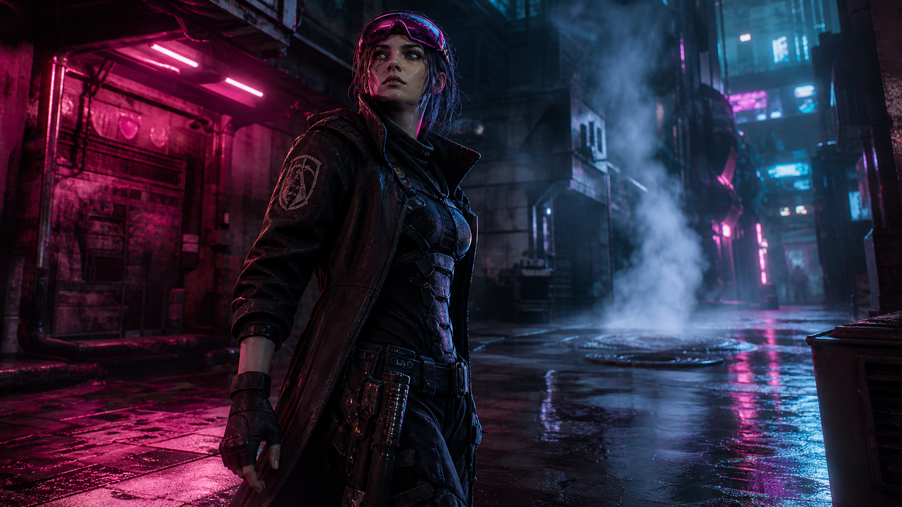
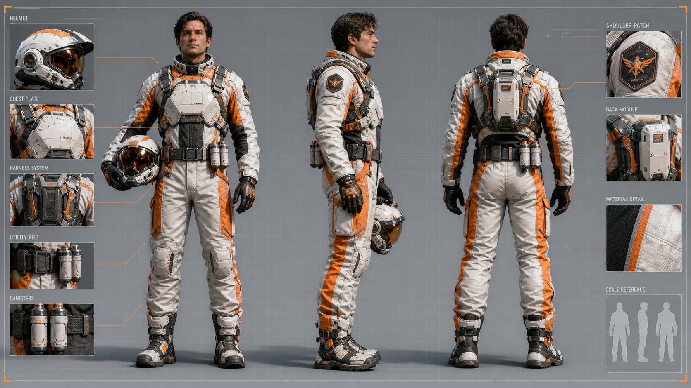
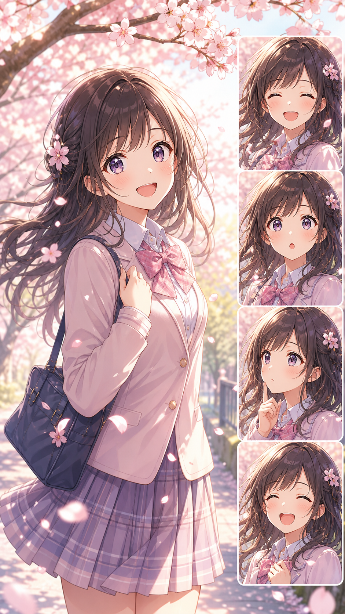
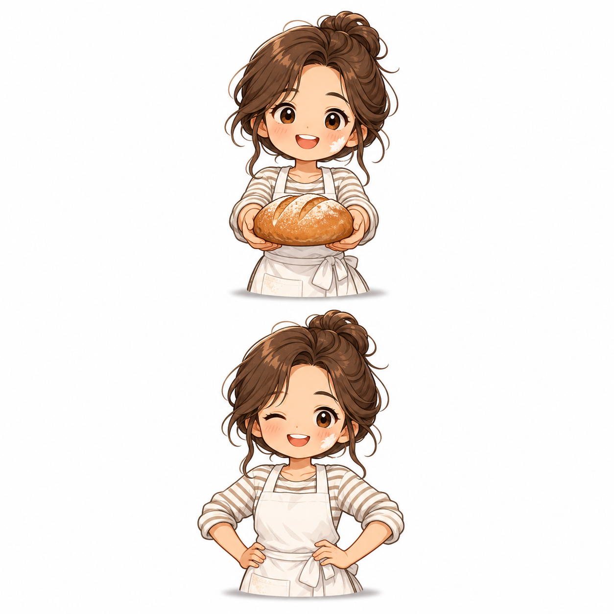
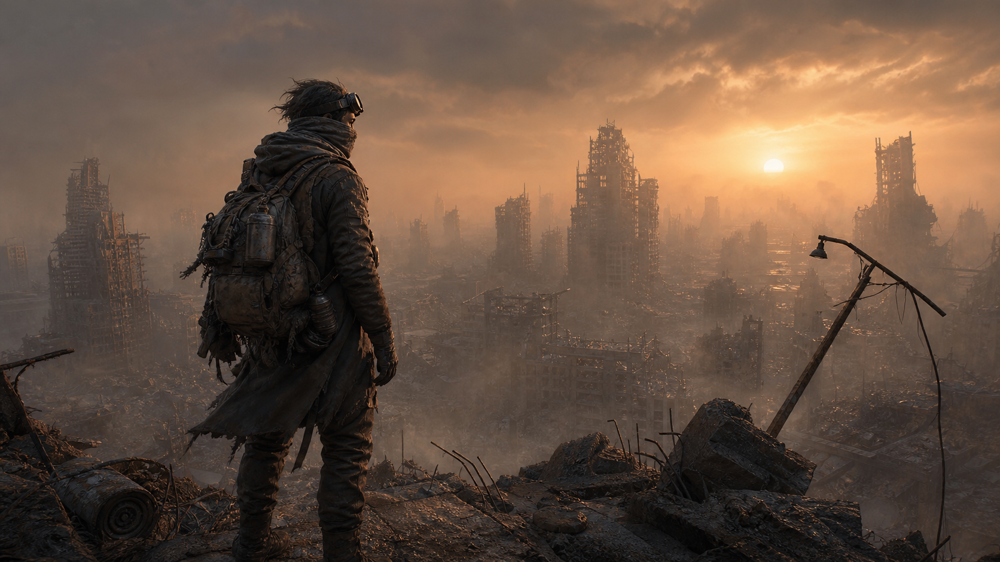
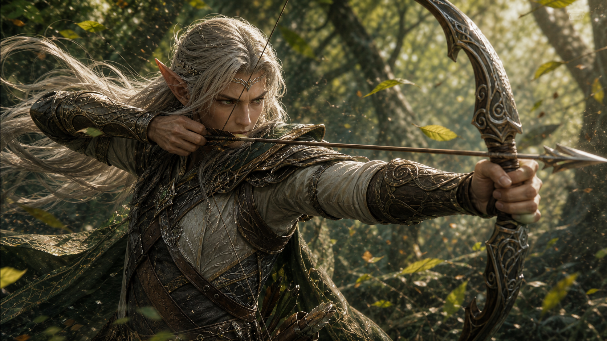
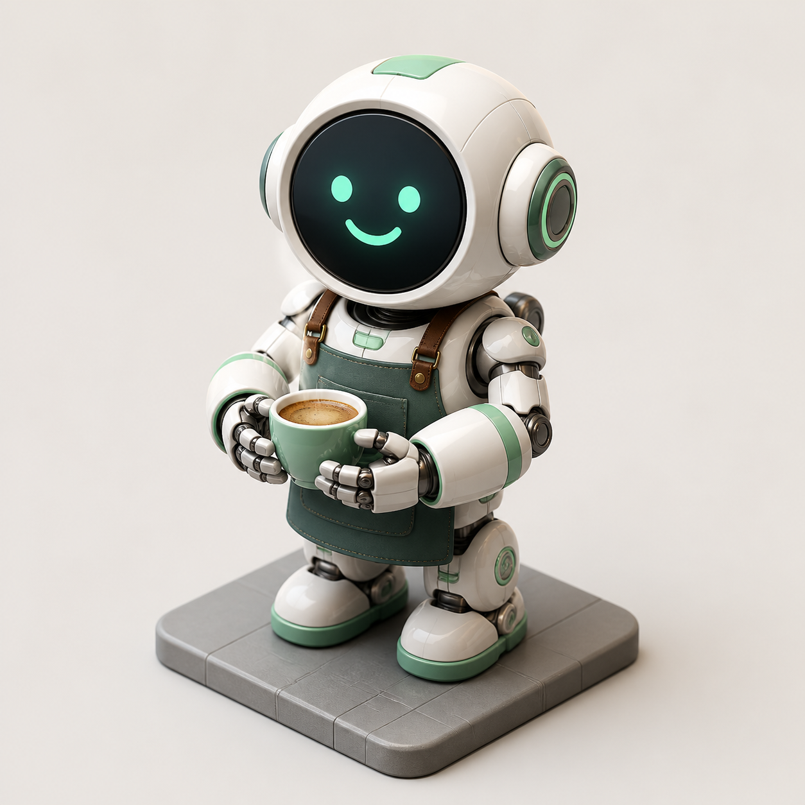
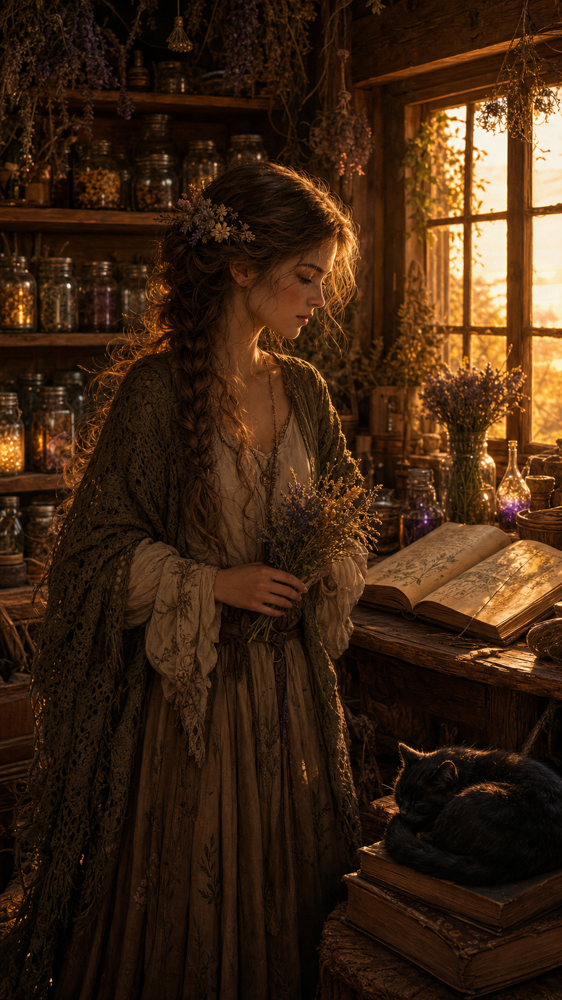

# 角色设计

[← 返回主目录](../README.zh-CN.md) · [English](character-design.md) · [在 HiAPI 生成](https://www.hiapi.ai/zh/models/gpt-image-2?utm_source=github&utm_medium=readme&utm_campaign=awesome-gpt-image-2-prompts) · [API Key](https://www.hiapi.ai/zh/register?utm_source=github&utm_medium=readme&utm_campaign=awesome-gpt-image-2-prompts)

角色设定卡、动画截图、主视觉和角色世界观。

> 案例库 · 17 个案例

---

<table>
  <tr>
    <td align="center" width="33%" valign="top"><a href="https://www.hiapi.ai/draw?p=U2hvdyBtZSB0aGUgYXR0YWNoZWQgaW1hZ2UgYXMgYSBzbmFwc2hvdCBmcm9tIGFuIGFjdHVhbCBhbmltZQ%3D%3D&amp;m=gpt-image-2&amp;utm_source=awesome-gpt-image-2-prompts&amp;utm_medium=github_readme&amp;utm_campaign=zh_gallery"></a><br><sub><b>Case 059</b> · <a href="#character-design-cases-case-1-anime-snapshot-conversion-by-thereallo1026">提示词</a></sub><br><sub><a href="https://x.com/Thereallo1026/status/2044241997163311569">动漫快照转换</a> · <a href="https://x.com/Thereallo1026">@Thereallo1026</a></sub></td>
    <td align="center" width="33%" valign="top"><a href="https://www.hiapi.ai/draw?p=5Z%2B65LqO5q2k6KeS6Imy5ZKM6IOM5pmv77yM6K%2B35Yi25L2c5LiA5Lu957G75Ly85a6Y5pa56K6%2B5a6a6LWE5paZ55qE6KeS6Imy6LWE5paZ5Y2h44CCCuODu%2BWMheWQq%2BS4ieinhuWbvu%2B8muato%2BmdouOAgeS%2Bp%2BmdouWSjOiDjOmdogrjg7vmt7vliqDop5LoibLpnaLpg6jooajmg4XnmoTlj5jljJbjg7vliIbop6PlubblsZXnpLrmnI3oo4Xlkozoo4XlpIfnmoTor6bnu4bpg6jliIYK44O75re75Yqg6Imy5p2%2F44O75YyF5ZCr5LiW55WM6KeC6K6%2B5a6a55qE566A6KaB6K%2B05piOCuODu%2BaAu%2BS9k%2BS4iu%2B8jOS9v%2BeUqOaciee7hOe7h%2BeahOW4g%2BWxgO%2B8iOeZveiJsuiDjOaZr%2B%2B8jOaPkueUu%2BmjjuagvO%2B8iemrmOWIhui%2BqOeOh%2BOAgeS4k%2BS4muamguW%2FteiJuuacr%2BmjjuagvA%3D%3D&amp;m=gpt-image-2&amp;utm_source=awesome-gpt-image-2-prompts&amp;utm_medium=github_readme&amp;utm_campaign=zh_gallery&amp;s=16%3A9"></a><br><sub><b>Case 060</b> · <a href="#character-design-cases-case-2-persona5-character-reference-card-by-iamrednights">提示词</a></sub><br><sub><a href="https://x.com/iamrednightS/status/2045075682837836265">Persona5 角色设定卡</a> · <a href="https://x.com/iamrednightS">@iamrednightS</a></sub></td>
    <td align="center" width="33%" valign="top"><a href="https://www.hiapi.ai/draw?p=5pyA5paw44Oi44OH44Or44Gu55S75YOP55Sf5oiQ44OE44O844Or44KS5L2%2F55So44GX44Gm44CBCuOBk%2BOBruOBoeOBs%2BOCreODo%2BODqeOCpOODqeOCueODiOOBqOeri%2BOBoee1teOCkuS9v%2BOBo%2BOBpuacrOeJqeOBruOCteOCpOODiOODmuODvOOCuOOBruOCiOOBhuOBq%2BOCreODo%2BODqeOCr%2BOCv%2BODvOe0ueS7i%2BODmuODvOOCuOmiqOOCpOODqeOCueODiOOCkuS9nOOBo%2BOBpuOBj%2BOBoOOBleOBhOOAgiDvvIjntLnku4vjg5rjg7zjgrjjgajjgZfjgabkvb%2FjgaPjgabjgoLjgYrjgYvjgZfjgY%2FjgarjgYTjgoLjga7vvIkK44Ku44Oj44Or44Ky44O844Gu44Kt44Oj44Op44Kv44K%2F44O857S55LuL44Oa44O844K444KS44Kk44Oh44O844K444GX44Gf6auY5ZOB6LOq44Gq44KC44Gu44CCIOmhlOOBruW3ruWIhuOBquOBqeOCguS5l%2BOBo%2BOBpuOBhOOCi%2BOAgUNH44Kk44Op44K544OI44GM5a2Y5Zyo44GZ44KL44CC44Gh44Gz44Kt44Oj44Op44GM5a2Y5Zyo44GZ44KL44CCCgrjgIzjgZPjgZPjgavoh6rlt7HntLnku4vjgI0KCuWQjeWJjTrvvIjjgZPjgZPjgavlkI3liY3vvIkgCuOCpOODoeODvOOCuOOCq%2BODqeODvDrvvIjjgZPjgZPjgavoibLvvIkgCui6q%2BmVtzrvvIjjgZPjgZPjgavouqvplbfvvIljbSAK5L2T6YeNOu%2B8iOOBk%2BOBk%2BOBq%2BS9k%2BmHje%2B8iWtnCuOCreODo%2BODg%2BODgeOCs%2BODlOODvDrigJ3jgIzjgZPjgZPjgavjgrvjg6rjg5XjgI3igJ0%3D&amp;m=gpt-image-2&amp;utm_source=awesome-gpt-image-2-prompts&amp;utm_medium=github_readme&amp;utm_campaign=zh_gallery&amp;s=16%3A9"></a><br><sub><b>Case 061</b> · <a href="#character-design-cases-case-3-gal-game-character-introduction-page-by-09lyco">提示词</a></sub><br><sub><a href="https://x.com/09lyco/status/2045281845391323175">Galgame 角色介绍页</a> · <a href="https://x.com/09lyco">@09lyco</a></sub></td>
  </tr>
  <tr>
    <td align="center" width="33%" valign="top"><a href="https://www.hiapi.ai/draw?p=44GT44Gu44Kt44Oj44Op44Kv44K%2F44O844Go6IOM5pmv44KS5YWD44Gr44CBIOWFrOW8j%2BioreWumuizh%2BaWmeOBruOCiOOBhuOBquOCreODo%2BODqeOCr%2BOCv%2BODvOOCt%2BODvOODiOOCkuS9nOaIkOOBl%2BOBpuOBj%2BOBoOOBleOBhOOAgiAK44O75q2j6Z2i44CB5YG06Z2i44CB6IOM6Z2i44GuM%2BmdouWbs%2BOCkuWQq%2BOCgeOCiyDjg7vjgq3jg6Pjg6njgq%2Fjgr%2Fjg7zjga7ooajmg4Xjg5Djg6rjgqjjg7zjgrfjg6fjg7PjgpLov73liqAgCuODu%2Biho%2BijheOChOijheWCmeOBruips%2Be0sOODkeODvOODhOOCkuWIhuino%2BOBl%2BOBpuihqOekuiDjg7vjgqvjg6njg7zjg5Hjg6zjg4Pjg4jjgpLov73liqAg44O75LiW55WM6Kaz44Gu57Ch5Y2Y44Gq6Kqs5piO44KS5YWl44KM44KLIArjg7vlhajkvZPjga%2FmlbTnkIbjgZXjgozjgZ%2Fjg6zjgqTjgqLjgqbjg4gK77yI55m96IOM5pmv44CB5Zuz6Kej6aKo77yJIArjg7vjgqLjgrnjg5rjgq%2Fjg4jmr5QxNu%2B8mjkKCumrmOino%2BWDj%2BW6puOAgeODl%2BODreOBruOCs%2BODs%2BOCu%2BODl%2BODiOOCouODvOODiOOCueOCv%2BOCpOODqw%3D%3D&amp;m=gpt-image-2&amp;utm_source=awesome-gpt-image-2-prompts&amp;utm_medium=github_readme&amp;utm_campaign=zh_gallery&amp;s=16%3A9"></a><br><sub><b>Case 062</b> · <a href="#character-design-cases-case-5-official-character-sheet-jp-by-toshinyaruoai">提示词</a></sub><br><sub><a href="https://x.com/Toshi_nyaruo_AI/status/2045025277538107420">官方角色设定表（日文）</a> · <a href="https://x.com/Toshi_nyaruo_AI">@Toshi_nyaruo_AI</a></sub></td>
    <td align="center" width="33%" valign="top"><a href="https://www.hiapi.ai/draw?p=QSBtZWNoYSBnaXJsIG1pZC10ZWVucywgcGFsZSBza2luIHNtdWRnZWQgd2l0aCBzb290IGFuZCBzYWx0IHNwcmF5LCBzaGFycCBhbWJlciBleWVzIHdpdGggZ2xvd2luZyBIVUQgcmV0aWNsZXMsIHdhaXN0LWxlbmd0aCBhc2gtd2hpdGUgaGFpciB0aWVkIGluIGEgaGlnaCBwb255dGFpbCB3aGlwcGluZyBpbiB0aGUgc2VhIHdpbmQsIG1hdHRlIGd1bm1ldGFsIGV4b3NrZWxldG9uIGFybW9yIHBsYXRpbmcgaGVyIHNob3VsZGVycywgZm9yZWFybXMgYW5kIHNoaW5zLCBleHBvc2VkIGh5ZHJhdWxpYyBwaXN0b25zIGF0IHRoZSBqb2ludHMsIGNoZXN0IHJpZyB3aXRoIGdsb3dpbmcgY3lhbiBjb29sYW50IGxpbmVzLCBvdmVyc2l6ZWQgb2lsLXN0YWluZWQgaGFuZ2FyIGphY2tldCBoYWxmIHNsaXBwaW5nIG9mZiBvbmUgc2hvdWxkZXIsIGEgbWFzc2l2ZSByYWlsIGNhbm5vbiByZXN0aW5nIG9uIGhlciByaWdodCBzaG91bGRlciwgZG9nIHRhZ3MgYW5kIGZyYXllZCByZWQgcmliYm9uIGF0IGhlciBjb2xsYXIgLCBzdGFuZGluZyBvZmYtY2VudGVyIHRvIHRoZSBsZWZ0IG9uIHRoZSBydXN0ZWQgZWRnZSBvZiBhIHRpbHRlZCBzdGVlbCBwbGF0Zm9ybSBqdXR0aW5nIG91dCBvdmVyIGRhcmsgd2F0ZXIsIHdlaWdodCBzaGlmdGVkIG9udG8gb25lIGxlZywgbGVmdCBoYW5kIGdyaXBwaW5nIHRoZSBjYW5ub24gc3RyYXAsIGhlYWQgdHVybmVkIHNsaWdodGx5IHRvd2FyZCBjYW1lcmEgd2l0aCBhIHF1aWV0IGRlZmlhbnQgc3RhcmUsIHN0ZWFtIHZlbnRpbmcgZnJvbSBoZXIgYmFjayB0aHJ1c3RlcnMsIGhlciBwb255dGFpbCBhbmQgamFja2V0IHN0cmVhbWluZyBzaWRld2F5cyBpbiB0aGUgc2FsdCB3aW5kICwgYSB2YXN0IGRlcmVsaWN0IHNlYS1jaXR5IGF0IGR1c2ssIGNvbG9zc2FsIG1lZ2FzdHJ1Y3R1cmVzIG9mIHVua25vd24gcHVycG9zZSByaXNpbmcgZnJvbSB0aGUgb2NlYW4gaW4gc3RhZ2dlcmVkIHNpbGhvdWV0dGVzLCBib25lLXdoaXRlIG1vbm9saXRoaWMgdG93ZXJzIGZ1c2VkIHdpdGggYmFybmFjbGVkIHN0ZWVsLCBjeWNsb3BlYW4gcmluZy1zaGFwZWQgY29uc3RydWN0cyBjYW50ZWQgYXQgYnJva2VuIGFuZ2xlcywgcnVzdGVkIHNrZWxldGFsIGdhbnRyaWVzIHRocmVhZGVkIHdpdGggZGVhZCBjYWJsZXMsIGRhcmsgc3dlbGxzIHJvbGxpbmcgYmV0d2VlbiB0aGUgcHlsb25zLCBzaGlwd3JlY2tzIGhhbGYtc3dhbGxvd2VkIGF0IHRoZWlyIGZlZXQsIHRoaWNrIHNlYSBmb2cgY2xpbmdpbmcgdG8gdGhlIGJhc2VzIHdoaWxlIHRoZSB1cHBlciBzdHJ1Y3R1cmVzIHBpZXJjZSBpbnRvIGEgYnJ1aXNlZCBza3ksIHNjYXR0ZXJlZCBmYWludCBsaWdodHMgYmxpbmtpbmcgaGlnaCBpbiB0aGUgdG93ZXJzIGxpa2UgZGlzdGFudCBleWVzICwgbW9vZHkgbG93LWtleSBsaWdodGluZywgY29sZCB0ZWFsIGFtYmllbnQgZnJvbSB0aGUgb3ZlcmNhc3Qgc2t5LCB3YXJtIGFtYmVyIHNvZGl1bSBnbG93IGxlYWtpbmcgZnJvbSBhIGRpc3RhbnQgc3RydWN0dXJlIGNhbWVyYS1yaWdodCwgaGFyZCBiYWNrbGlnaHQgZnJvbSBhIGxvdyBzdW4gYmVoaW5kIHRoZSB0b3dlcnMgY2FydmluZyBoZXIgc2lsaG91ZXR0ZSwgdm9sdW1ldHJpYyBnb2QgcmF5cyBjdXR0aW5nIHRocm91Z2ggc2VhIG1pc3QsIHdldCBzcGVjdWxhciBoaWdobGlnaHRzIG9uIGhlciBhcm1vciAsIDM1bW0gYW5hbW9ycGhpYyBsZW5zLCBzbGlnaHQgbG93IGFuZ2xlIGxvb2tpbmcgdXAgcGFzdCBoZXIgc2hvdWxkZXIgdG93YXJkIHRoZSBzdHJ1Y3R1cmVzLCBtZWRpdW0td2lkZSBzaG90LCBzaGFsbG93IGRlcHRoIG9mIGZpZWxkIHdpdGggZm9yZWdyb3VuZCBydXN0IGluIHNvZnQgZm9jdXMsIGhvcml6b250YWwgbGVucyBmbGFyZXMsIGZpbmUgYXRtb3NwaGVyaWMgaGF6ZSBjb21wcmVzc2luZyB0aGUgZGlzdGFudCBtZWdhc3RydWN0dXJlcyBpbnRvIGxheWVyZWQgc2lsaG91ZXR0ZXMgLCBjaW5lbWF0aWMgYW5pbWUga2V5IHZpc3VhbCwgcGFpbnRlcmx5IGRpZ2l0YWwgaWxsdXN0cmF0aW9uIHdpdGggY3Jpc3AgbGluZSBhcnQsIGRlc2F0dXJhdGVkIG9jZWFuaWMgcGFsZXR0ZSBvZiB0ZWFsLCBib25lLXdoaXRlIGFuZCBydXN0IHB1bmNoZWQgYnkgc21hbGwgd2FybSBhY2NlbnQgbGlnaHRzLCBmaWxtIGdyYWluLCBoaWdoLWNvbnRyYXN0IGVkaXRvcmlhbCBwb3N0ZXIgYWVzdGhldGljIC4gRm9ybWF0IDE2Ojku&amp;m=gpt-image-2&amp;utm_source=awesome-gpt-image-2-prompts&amp;utm_medium=github_readme&amp;utm_campaign=zh_gallery&amp;s=9%3A16"></a><br><sub><b>Case 063</b> · <a href="#character-design-cases-case-7-mecha-girl-sea-city-key-visual-by-oldpgmrswill">提示词</a></sub><br><sub><a href="https://x.com/old_pgmrs_will/status/2046144801071079612">机甲少女海上城市主视觉</a> · <a href="https://x.com/old_pgmrs_will">@old_pgmrs_will</a></sub></td>
    <td align="center" width="33%" valign="top"><a href="https://www.hiapi.ai/draw?p=55Sf5oiQ5Zyj5paX5aOr5pif55%2BiMTLkuKrpu4Tph5HlnKPmlpflo6vnmoQxMuWuq%2BagvOWNoeeJjOWbvueJhyzmr4%2FlvKDljaHniYzkuIrlhpnkuIrlr7nlupTnmoTkuK3mloflkI0s5q%2BP6KGMNOS4qizlrr3pq5jmr5QxNjo544CC&amp;m=gpt-image-2&amp;utm_source=awesome-gpt-image-2-prompts&amp;utm_medium=github_readme&amp;utm_campaign=zh_gallery&amp;s=16%3A9"></a><br><sub><b>Case 064</b> · <a href="#character-design-cases-case-8-saint-seiya-gold-saints-card-grid-by-songguoxiansen">提示词</a></sub><br><sub><a href="https://x.com/songguoxiansen/status/2046476566537080849">圣斗士黄金圣斗士卡牌格</a> · <a href="https://x.com/songguoxiansen">@songguoxiansen</a></sub></td>
  </tr>
  <tr>
    <td align="center" width="33%" valign="top"><a href="https://www.hiapi.ai/draw?p=IyDmt7fmsozjgajjgZfjgZ%2Fjg6Hjg6Lmm7jjgY3jg7voqJjlj7fjga7pm4blkIjkvZPjgYvjgonjgq3jg6Pjg6njgq%2Fjgr%2Fjg7zjga7poZTjgpLmta7jgYvjgbPkuIrjgYzjgonjgZvjgovjgqLjg7zjg4gKCi0tLSDjgrnjgr%2FjgqTjg6sKLSDnmb3jgYTntJnjga7kuIrjgavpu5LjgqTjg7Pjgq%2Fjgafmj4%2FjgYvjgozjgZ%2FlpKfph4%2Fjga7miYvmm7jjgY3jg6Hjg6LjgIHmlbDlvI%2FjgIHoqJjlj7fjgIHjg6njg7Pjg4Djg6Djgarnt5rjgIIKLSDntJnjgYTjgaPjgbHjgYTjgavmlaPjgonjgbDjgovmm7jjgY3mrrTjgorpoqjjga7jgqvjgqrjgrnjgIIKLSDmiYDjgIXjgavotaTjgqTjg7Pjgq%2Fjga7lvLfoqr8o44Op44Kk44Oz44CB5aGX44KK5r2w44GX44CB44Oe44O844Kr44O86aKo44Gu5aGKKeOAggotIOOCouODiuODreOCsOOBruODjuODvOODiOiQveabuOOBjeOBruOCiOOBhuOBquizquaEn%2BOAggoKLS0tIOani%2BWbswotIOODqeODs%2BODgOODoOOBquODoeODouOChOiomOWPt%2BOBjOWFqOS9k%2BOCkuimhuOBhOWwveOBj%2BOBmeOAggotIOm7kuOCpOODs%2BOCr%2BOBrue3muOChOaWh%2BWtl%2BOBruWvhuW6puOBjOOAjOOCreODo%2BODqeOCr%2BOCv%2BODvOOBrumhlOOAjeOBruS9jee9ruOBq%2BmbhuS4reOBmeOCi%2BOAggotIOe1kOaenOOBqOOBl%2BOBpuOAgea3t%2BayjOOBruS4reOBi%2BOCieOAjOS4juOBiOOCieOCjOOBn%2BOCreODo%2BODqeOCr%2BOCv%2BODvOOBrumhlOOBruOCt%2BODq%2BOCqOODg%2BODiOODu%2BihqOaDheOAjeOBjOOBhuOBo%2BOBmeOCiea1ruOBi%2BOBs%2BS4iuOBjOOCi%2BOAggotIOmhlOOBr%2BWGmeWun%2BeahOOBp%2BOBr%2BOBquOBj%2BOAgeOCq%2BOCquOCueOBruaWreeJh%2BOBjOmbhuOBvuOBo%2BOBpuW9ouOCkuaIkOOBmeOAggoKLS0tIOiJsuW9qQotIOODouODjuOCr%2BODrSjpu5Ljg7vnmb0p44KS5Li75L2T44Gr5qeL5oiQ44CCCi0g6LWk44Kk44Oz44Kv44KS44Ki44Kv44K744Oz44OI44Go44GX44Gm5pWj55m655qE44Gr6YWN572u44CCCi0g5b2p5bqm44Gv5oqR44GI44KB44CB44Ki44OK44Ot44Kw44Gu57SZ44Go44Kk44Oz44Kv5oSf44KS6YeN6KaW44CCCgotLS0g6KGo54%2B%2B6KaB57SgCi0g6Kqt44KB44KL44KI44GG44Gn6Kqt44KB44Gq44GE5paH5a2X5YiX44CB5pel5pys6Kqe44KE6Iux5pWw5a2X44GM5re35Zyo44CCCi0g5pWw5byP6KiY5Y%2B344CB55%2Bi5Y2w44CB54K544CB5pac57ea44CB44Kv44Ot44K544CB44OJ44Oq44OD44OXKOOCpOODs%2BOCr%2BOBrumjm%2BOBs%2BaVo%2BOCiinjgIIKLSDjgq3jg6Pjg6njgq%2Fjgr%2Fjg7zjga7poZTjga7nm67jgoTpq6rjga7ovKrpg63jga%2FjgIHjg6Hjg6LjgoToqJjlj7fjga7phY3nva7jga7jgIzkvZnnmb3jgI3jgoTjgIzmv4Pmt6HjgI3jgafmta7jgYvjgbPkuIrjgYzjgovjgIIKCi0tLSDnpoHmraLkuovpoIUKLSDpoZTjgpLnm7TmjqXnmoTjgavmj4%2FjgY3ovrzjgoDlhpnlrp%2Fjg53jg7zjg4jjg6zjg7zjg4jjgIIKLSDjg4fjgrjjgr%2Fjg6vlh6bnkIbnmoTjgafmlbTnhLbjgajjgZfjgZ%2Flub7kvZXlrabmqKHmp5jjgIIKLSDjgqvjg6njg5Xjg6vjgarlvanoibLjgoTpgY7po73lkozooajnj77jgIIKLSDjg63jgrTjgIHpgI%2FjgYvjgZfjgIHkurrlt6XnmoTjgapDR%2BaEn%2BOAggoKLS0tIERlZmluaXRpb24gb2YgRG9uZSAoRG9EKQotIOWFqOS9k%2BOBr%2BOAjOa3t%2BayjOOBqOOBl%2BOBn%2BODoeODouODu%2BiomOWPt%2BOBrumbhuWQiOS9k%2BOAjeOBqOOBl%2BOBpuaIkOeri%2BOBl%2BOBpuOBhOOCi%2BOAgiAgCi0g5LiO44GI44KJ44KM44Gf44Kt44Oj44Op44Kv44K%2F44O844Gu6aGU44GM44CB5re35rKM44Gu5r%2BD5reh44O76YWN572u44GL44KJ6Ieq54S244Gr5rWu44GL44Gz5LiK44GM44KL44CCICAKLSDoibLjga%2Fjg6Ljg47jgq%2Fjg60r6LWk44Ki44Kv44K744Oz44OI44Gu44G%2F44CCICAKLSDntJnjgajjgqTjg7Pjgq%2Fjga7miYvmj4%2FjgY3nmoTos6rmhJ%2FjgpLkv53mjIHjgZfjgabjgYTjgovjgII%3D&amp;m=gpt-image-2&amp;utm_source=awesome-gpt-image-2-prompts&amp;utm_medium=github_readme&amp;utm_campaign=zh_gallery"></a><br><sub><b>Case 065</b> · <a href="#character-design-cases-case-9-chaos-notes-hidden-face-character-art-by-loglogrog">提示词</a></sub><br><sub><a href="https://x.com/loglogrog/status/2046448773162033240">混沌笔记隐藏人脸角色图</a> · <a href="https://x.com/loglogrog">@loglogrog</a></sub></td>
    <td align="center" width="33%" valign="top"><a href="https://www.hiapi.ai/draw?p=VGhyZWUtcXVhcnRlciBjaGFyYWN0ZXIga2V5IHZpc3VhbCBvZiBhIHlvdW5nIGN5YmVycHVuayBib3VudHkgaHVudGVyIHN0YW5kaW5nIGluIGEgcmFpbi1zbGlja2VkIG5lb24gYWxsZXkgYXQgbmlnaHQuIEJsYWNrIHRhY3RpY2FsIGxvbmdjb2F0IG92ZXIgYSBkYXJrIGFybW9yZWQgdmVzdCwgZmluZ2VybGVzcyBnbG92ZXMsIGhvbHN0ZXJlZCBmdXR1cmlzdGljIHNpZGVhcm0gYXQgdGhlIGhpcCwgZ2xvd2luZyB2aXNvciBtYXNrIHB1c2hlZCB1cCBvbnRvIHRoZSBmb3JlaGVhZC4gQ2luZW1hdGljIGxvdy1hbmdsZSBzaG90IHdpdGggc3Ryb25nIG1hZ2VudGEgYW5kIGN5YW4gcmltIGxpZ2h0aW5nIGZyb20gb2Zmc2NyZWVuIG5lb24gc2lnbnMgcmVmbGVjdGluZyBvbiB3ZXQgcGF2ZW1lbnQuIFN0ZWFtIHJpc2luZyBmcm9tIGEgbWFuaG9sZSBiZWhpbmQuIEZhaW50IGZhY3Rpb24gc2lnaWwgcGF0Y2ggb24gdGhlIHNob3VsZGVyLiAxNjo5IGhvcml6b250YWwgY29tcG9zaXRpb24sIHNoYXJwIGZvY3VzIG9uIHRoZSBjaGFyYWN0ZXIsIGF0bW9zcGhlcmljIGhhemUuIE5vIHRleHQgb3ZlcmxheSwgbm8gcmVhbCBicmFuZCBsb2dvcywgbm8gd2F0ZXJtYXJrLiBDaW5lbWF0aWMgY2hhcmFjdGVyIGtleSB2aXN1YWwgcXVhbGl0eSwgcGhvdG9yZWFsaXN0aWMgZmFicmljIGFuZCBtZXRhbCB0ZXh0dXJlcy4%3D&amp;m=gpt-image-2&amp;utm_source=awesome-gpt-image-2-prompts&amp;utm_medium=github_readme&amp;utm_campaign=zh_gallery&amp;s=16%3A9"></a><br><sub><b>Case 154</b> · <a href="#character-design-case-10-cyberpunk-bounty-hunter-three-quarter-view">提示词</a></sub><br><sub><a href="https://github.com/HiAPIAI/awesome-gpt-image-2-prompts">赛博朋克赏金猎人三分之四视角</a> · <a href="https://x.com/hiapi_ai">@hiapi_ai</a></sub></td>
    <td align="center" width="33%" valign="top"><a href="https://www.hiapi.ai/draw?p=SGFsZi1ib2R5IHZlcnRpY2FsIGNoYXJhY3RlciBwb3J0cmFpdCBvZiBhIHlvdW5nIGRydWlkIGluIGEgbWlzdHkgb2xkLWdyb3d0aCBmb3Jlc3QgYXQgZ29sZGVuIGhvdXIuIExheWVyZWQgbGVhdGhlciBhbmQgd292ZW4gbGVhZiBhcm1vciB3aXRoIHN1YnRsZSBtb3NzIGVtYnJvaWRlcnksIGEgc21hbGwgYW50bGVyIGNyb3duIG5lc3RsZWQgaW4gbG9uZyBicmFpZGVkIGRhcmsgaGFpciwgb25lIGhhbmQgaG9sZGluZyBhIGZhaW50bHkgZ2xvd2luZyB3b29kZW4gc3RhZmYgZW50d2luZWQgd2l0aCBpdnkuIFdhcm0gc3VuIHJheXMgZmlsdGVyaW5nIHRocm91Z2ggZmVybnMgYmVoaW5kLCBzb2Z0IGdyZWVuIGFuZCBhbWJlciBwYWxldHRlLiBDYWxtIGZvY3VzZWQgZXhwcmVzc2lvbiBsb29raW5nIG9mZi1mcmFtZS4gVmVydGljYWwgOToxNiBjb21wb3NpdGlvbiwgaGVhZCBhbmQgY2hlc3QgZnJhbWluZy4gTm8gdGV4dCwgbm8gY2xhbiBzeW1ib2xzLCBubyB3YXRlcm1hcmsuIFBhaW50ZXJseSBmYW50YXN5IGlsbHVzdHJhdGlvbiB3aXRoIHBob3RvcmVhbGlzdGljIGRldGFpbHMsIG1hZ2F6aW5lIGNvdmVyIHF1YWxpdHku&amp;m=gpt-image-2&amp;utm_source=awesome-gpt-image-2-prompts&amp;utm_medium=github_readme&amp;utm_campaign=zh_gallery&amp;s=9%3A16"></a><br><sub><b>Case 155</b> · <a href="#character-design-case-11-fantasy-druid-half-body-portrait">提示词</a></sub><br><sub><a href="https://github.com/HiAPIAI/awesome-gpt-image-2-prompts">奇幻德鲁伊半身肖像</a> · <a href="https://x.com/hiapi_ai">@hiapi_ai</a></sub></td>
  </tr>
  <tr>
    <td align="center" width="33%" valign="top"><a href="https://www.hiapi.ai/draw?p=RnVsbC1ib2R5IGNoYXJhY3RlciByZWZlcmVuY2Ugc2hlZXQgc2hvd2luZyB0aGUgc2FtZSBzY2ktZmkgbWVjaCBwaWxvdCBpbiB0aHJlZSB2aWV3cyDigJQgZnJvbnQsIHNpZGUsIGFuZCBiYWNrIOKAlCBsaW5lZCB1cCBob3Jpem9udGFsbHkgb24gYSBjbGVhbiBjb29sIGdyZXkgdGVjaG5pY2FsLWdyaWQgYmFja2dyb3VuZC4gV2hpdGUgYW5kIG9yYW5nZSBmbGlnaHQgc3VpdCB3aXRoIHJlaW5mb3JjZWQgY2hlc3QgcGxhdGUsIGhlbG1ldCBoZWxkIHVuZGVyIG9uZSBhcm0sIHV0aWxpdHkgYmVsdCB3aXRoIHR3byBjYW5pc3RlcnMuIFN1YnRsZSBkcm9wIHNoYWRvdyBvbiB0aGUgZ3JpZCwgdGhpbiBvcmFuZ2UgYW5ub3RhdGlvbiBsaW5lcyBjb25uZWN0aW5nIGtleSBnZWFyIHBpZWNlcy4gMTY6OSBob3Jpem9udGFsIGNvbXBvc2l0aW9uLCBzaGFycCBuZXV0cmFsIHN0dWRpbyBsaWdodGluZyBmcm9tIGFib3ZlLiBObyByZWFsIGJyYW5kIHRleHQsIG5vIHdhdGVybWFyay4gVGVjaG5pY2FsIGNoYXJhY3RlciBkZXNpZ24gc2hlZXQgYWVzdGhldGljLCBwaG90b3JlYWxpc3RpYyBzdWl0IG1hdGVyaWFscy4%3D&amp;m=gpt-image-2&amp;utm_source=awesome-gpt-image-2-prompts&amp;utm_medium=github_readme&amp;utm_campaign=zh_gallery&amp;s=16%3A9"></a><br><sub><b>Case 156</b> · <a href="#character-design-case-12-sci-fi-mech-pilot-full-body-sheet">提示词</a></sub><br><sub><a href="https://github.com/HiAPIAI/awesome-gpt-image-2-prompts">科幻机甲驾驶员三视图</a> · <a href="https://x.com/hiapi_ai">@hiapi_ai</a></sub></td>
    <td align="center" width="33%" valign="top"><a href="https://www.hiapi.ai/draw?p=VmVydGljYWwgYW5pbWUtc3R5bGUgY29uY2VwdCBmcmFtZSBvZiBhIGNoZWVyZnVsIEphcGFuZXNlIGhpZ2ggc2Nob29sIGlkb2wgaW4gYSBzb2Z0IHBhc3RlbCB1bmlmb3JtLCBzdGFuZGluZyB1bmRlciBjaGVycnkgYmxvc3NvbSBwZXRhbHMgZHJpZnRpbmcgaW4gdGhlIGJyZWV6ZS4gTWlkIHNob3QsIHdhcm0gYWZ0ZXJub29uIHN1bmxpZ2h0LCBzbGlnaHQgbGVucyBib2tlaC4gT24gdGhlIHJpZ2h0IHNpZGUgb2YgdGhlIGZyYW1lIGEgc21hbGwgZXhwcmVzc2lvbiBzdHJpcCBzaG93aW5nIGZvdXIgbWluaSBwb3J0cmFpdHMgb2YgdGhlIHNhbWUgY2hhcmFjdGVyOiBzbWlsZSwgc3VycHJpc2VkLCB0aG91Z2h0ZnVsLCBsYXVnaGluZy4gU2FrdXJhIHRyZWUgYnJhbmNoIGFyY2hlcyBvdmVyIHRoZSB0b3Agb2YgdGhlIGZyYW1lLiBWZXJ0aWNhbCA5OjE2IGNvbXBvc2l0aW9uLiBObyB0ZXh0IG9uIHRoZSB1bmlmb3JtLCBubyBzY2hvb2wgY3Jlc3QsIG5vIHdhdGVybWFyay4gUHJlbWl1bSBhbmltZSBwcm9kdWN0aW9uLWdyYWRlIGlsbHVzdHJhdGlvbiBxdWFsaXR5LCBjbGVhbiBsaW5lIGFydCB3aXRoIHBhaW50ZXJseSBiYWNrZ3JvdW5kLg%3D%3D&amp;m=gpt-image-2&amp;utm_source=awesome-gpt-image-2-prompts&amp;utm_medium=github_readme&amp;utm_campaign=zh_gallery&amp;s=9%3A16"></a><br><sub><b>Case 157</b> · <a href="#character-design-case-13-anime-school-idol-concept-frame">提示词</a></sub><br><sub><a href="https://github.com/HiAPIAI/awesome-gpt-image-2-prompts">动漫校园偶像设定画面</a> · <a href="https://x.com/hiapi_ai">@hiapi_ai</a></sub></td>
    <td align="center" width="33%" valign="top"><a href="https://www.hiapi.ai/draw?p=Q2hpYmktc3R5bGUgc3F1YXJlIGNoYXJhY3RlciBzdGlja2VyIGRlc2lnbiBvZiBhIGNoZWVyZnVsIFlPVU5HIFdPTUFOIGJha2VyeSBvd25lcjogcm91bmQgZnJpZW5kbHkgZmFjZSwgc29mdCBmZW1pbmluZSBmZWF0dXJlcywgbG9uZyBoYWlyIGxvb3NlbHkgdGllZCB1cCB3aXRoIGEgZmV3IHN0cmFuZHMgZXNjYXBpbmcsIHNtYWxsIGZsb3VyIHNtdWRnZSBvbiBvbmUgY2hlZWssIG92ZXJzaXplZCB3aGl0ZSBhcHJvbiBvdmVyIGEgc3RyaXBlZCBzaGlydCwgaG9sZGluZyBhIGZyZXNobHkgYmFrZWQgbG9hZiBvZiBicmVhZCB3aXRoIGJvdGggaGFuZHMuIFR3byBwb3NlIHZhcmlhdGlvbnMgb2YgdGhlIFNBTUUgZmVtYWxlIGNoYXJhY3RlciBzdGFja2VkIHZlcnRpY2FsbHkgaW5zaWRlIHRoZSAxOjEgZnJhbWU6IHRvcCBwb3NlIHNtaWxpbmcgYW5kIG9mZmVyaW5nIGJyZWFkLCBib3R0b20gcG9zZSBoYW5kcyBvbiBoaXBzIHdpbmtpbmcuIENsZWFuIHdoaXRlIGJhY2tncm91bmQgd2l0aCBzdWJ0bGUgZHJvcCBzaGFkb3cgdW5kZXIgZWFjaCBwb3NlLiBObyB0ZXh0LCBubyBzaG9wIG5hbWUsIG5vIHdhdGVybWFyay4gQ2xlYW4gbGluZSBhcnQsIHdhcm0gcGFzdGVsIHBhbGV0dGUsIHN0aWNrZXItcGFjayByZWFkeSBkZXNpZ24uIEFzcGVjdCByYXRpbyBNVVNUIGJlIGV4YWN0bHkgMToxIChzcXVhcmUpLg%3D%3D&amp;m=gpt-image-2&amp;utm_source=awesome-gpt-image-2-prompts&amp;utm_medium=github_readme&amp;utm_campaign=zh_gallery&amp;s=1%3A1"></a><br><sub><b>Case 158</b> · <a href="#character-design-case-14-cozy-bakery-owner-character-sticker">提示词</a></sub><br><sub><a href="https://github.com/HiAPIAI/awesome-gpt-image-2-prompts">面包店主理人贴纸</a> · <a href="https://x.com/hiapi_ai">@hiapi_ai</a></sub></td>
  </tr>
  <tr>
    <td align="center" width="33%" valign="top"><a href="https://www.hiapi.ai/draw?p=Q2luZW1hdGljIGVudmlyb25tZW50IGhlcm8gc2hvdCBvZiBhIGxvbmUgcG9zdC1hcG9jYWx5cHRpYyBzY2F2ZW5nZXIgc3RhbmRpbmcgaW4gdGhlIGZvcmVncm91bmQgc2lsaG91ZXR0ZSBhZ2FpbnN0IGEgdmFzdCBydWluZWQgY2l0eXNjYXBlIGF0IGR1c3Qgc3Rvcm0gaG91ci4gSGVhdnkgbGF5ZXJlZCBjbG90aGluZyB3aXRoIGdvZ2dsZXMgYXJvdW5kIHRoZSBuZWNrLCBhIHdyYXBwZWQgc2NhcmYgY292ZXJpbmcgdGhlIGxvd2VyIGZhY2UsIGEgd29ybiBjYW52YXMgYmFja3BhY2sgd2l0aCBhdHRhY2hlZCBzY3JhcCBtZXRhbCBjYW5pc3RlcnMuIENydW1ibGVkIHNreXNjcmFwZXIgZGVicmlzIGFuZCBhIHRpbHRlZCBicm9rZW4gc3RyZWV0bGlnaHQgaW4gdGhlIGZvcmVncm91bmQsIGhhenkgb3JhbmdlIHN1biBzdHJ1Z2dsaW5nIHRocm91Z2ggc3VzcGVuZGVkIGR1c3QuIDE2OjkgaG9yaXpvbnRhbCBjb21wb3NpdGlvbiwgZGVlcCBkZXNhdHVyYXRlZCBwYWxldHRlIHdpdGggYSBzaW5nbGUgd2FybSBsaWdodCBzb3VyY2UuIE5vIHRleHQsIG5vIGZhY3Rpb24gbG9nbywgbm8gd2F0ZXJtYXJrLiBIb2xseXdvb2QgY29uY2VwdCBhcnQgcXVhbGl0eSwgcGhvdG9yZWFsaXN0aWMgZHVzdCBhbmQgZmFicmljLg%3D%3D&amp;m=gpt-image-2&amp;utm_source=awesome-gpt-image-2-prompts&amp;utm_medium=github_readme&amp;utm_campaign=zh_gallery&amp;s=16%3A9"></a><br><sub><b>Case 159</b> · <a href="#character-design-case-15-post-apocalyptic-scavenger-environment-hero">提示词</a></sub><br><sub><a href="https://github.com/HiAPIAI/awesome-gpt-image-2-prompts">废土拾荒者环境主视觉</a> · <a href="https://x.com/hiapi_ai">@hiapi_ai</a></sub></td>
    <td align="center" width="33%" valign="top"><a href="https://www.hiapi.ai/draw?p=VmVydGljYWwgaGFsZi1ib2R5IGNpbmVtYXRpYyBub2lyIHBvcnRyYWl0IG9mIGEgaGFyZC1ib2lsZWQgZGV0ZWN0aXZlIGluc2lkZSBhIGRhcmsgMTk0MHMgb2ZmaWNlIGF0IG5pZ2h0LiBTaW5nbGUgdmVuZXRpYW4gYmxpbmQgc2hhZG93IHBhdHRlcm4gY2FzdCBhY3Jvc3MgdGhlIGZhY2UgYW5kIHRoZSBkYXJrIHRyZW5jaGNvYXQsIGxvdy1rZXkga2V5IGxpZ2h0IGZyb20gdGhlIGxlZnQsIGRlZXAgc2hhZG93cyBvbiB0aGUgcmlnaHQuIEZlZG9yYSB0aWx0ZWQgc2xpZ2h0bHkgZm9yd2FyZCwgbGl0IGNpZ2FyZXR0ZSBoZWxkIGNhc3VhbGx5IHdpdGggYSB0aGluIHNtb2tlIGN1cmwgcmlzaW5nLiBDb21wb3NlZCBtaWQgZXhwcmVzc2lvbiwgZXllcyBjYXRjaGluZyB0aGUgbGlnaHQuIFZlcnRpY2FsIDk6MTYgY29tcG9zaXRpb24sIGhlYWQgYW5kIGNoZXN0IGZyYW1pbmcuIE5vIHRleHQgb24gdGhlIHdhbGwsIG5vIGJhZGdlIHZpc2libGUsIG5vIHdhdGVybWFyay4gQ2xhc3NpYyBmaWxtIG5vaXIgY2luZW1hdG9ncmFwaHkgcXVhbGl0eSwgcGhvdG9yZWFsaXN0aWMgc2tpbiBhbmQgZmFicmljIHRleHR1cmVzLCBzdWJ0bGUgMzVtbSBncmFpbi4%3D&amp;m=gpt-image-2&amp;utm_source=awesome-gpt-image-2-prompts&amp;utm_medium=github_readme&amp;utm_campaign=zh_gallery&amp;s=9%3A16"></a><br><sub><b>Case 160</b> · <a href="#character-design-case-16-detective-noir-half-body-cinematic">提示词</a></sub><br><sub><a href="https://github.com/HiAPIAI/awesome-gpt-image-2-prompts">黑色电影侦探半身</a> · <a href="https://x.com/hiapi_ai">@hiapi_ai</a></sub></td>
    <td align="center" width="33%" valign="top"><a href="https://www.hiapi.ai/draw?p=SG9yaXpvbnRhbCBkeW5hbWljIGFjdGlvbiBrZXkgdmlzdWFsIG9mIGEgaGlnaC1mYW50YXN5IGVsZiBhcmNoZXIgbWlkLXNob3QsIGJvZHkgdHdpc3RlZCBpbiBhIHBvd2VyZnVsIGRyYXdpbmcgcG9zZSB3aXRoIHRoZSBib3dzdHJpbmcgZnVsbHkgcHVsbGVkIGJhY2suIExvbmcgc2lsdmVyIGhhaXIgZmxvd2luZyB3aXRoIG1vdGlvbiwgb3JuYXRlIGxpZ2h0IGxlYXRoZXIgYXJtb3Igd2l0aCBlbmdyYXZlZCBzaWx2ZXIgZmlsaWdyZWUsIGVhcnMgcG9pbnRlZCwgZm9jdXNlZCBncmVlbiBleWVzIGxvY2tlZCBvbiBhbiB1bnNlZW4gdGFyZ2V0LiBTdWJ0bGUgbW90aW9uIGJsdXIgaW4gdGhlIGJhY2tncm91bmQgb2YgYSBzdW4tZGFwcGxlZCBhbmNpZW50IGZvcmVzdCwgZHJpZnRpbmcgbGVhdmVzIGFyb3VuZCB0aGUgZmlndXJlLiAxNjo5IGhvcml6b250YWwgY29tcG9zaXRpb24uIE5vIHRleHQsIG5vIGNsYW4gc2lnaWwsIG5vIHdhdGVybWFyay4gSGlnaC1mYW50YXN5IGNvbmNlcHQgYXJ0IHF1YWxpdHksIHBhaW50ZXJseSB3aXRoIHBob3RvcmVhbGlzdGljIHRleHR1cmVzLg%3D%3D&amp;m=gpt-image-2&amp;utm_source=awesome-gpt-image-2-prompts&amp;utm_medium=github_readme&amp;utm_campaign=zh_gallery&amp;s=16%3A9"></a><br><sub><b>Case 161</b> · <a href="#character-design-case-17-high-fantasy-elf-archer-action-pose">提示词</a></sub><br><sub><a href="https://github.com/HiAPIAI/awesome-gpt-image-2-prompts">高奇幻精灵弓手动作姿态</a> · <a href="https://x.com/hiapi_ai">@hiapi_ai</a></sub></td>
  </tr>
  <tr>
    <td align="center" width="33%" valign="top"><a href="https://www.hiapi.ai/draw?p=U3F1YXJlIDE6MSBpc29tZXRyaWMgbWFzY290IGRlc2lnbiBvZiBhIGZyaWVuZGx5IGh1bWFub2lkIGNvZmZlZSBiYXJpc3RhIHJvYm90LiBDbGVhbiByb3VuZGVkIHdoaXRlIHBhbmVscyB3aXRoIG1pbnQgZ3JlZW4gYWNjZW50IHN0cmlwZXMsIHNpbmdsZSBsYXJnZSByb3VuZCBzY3JlZW4gZmFjZSBkaXNwbGF5aW5nIGEgc2ltcGxlIHNtaWxlIG1hZGUgb2YgdHdvIGRvdHMgYW5kIGFuIHVwdHVybmVkIGFyYywgdGhyZWUtZmluZ2VyZWQgYXJ0aWN1bGF0ZWQgaGFuZHMgaG9sZGluZyBhIHNtYWxsIGNlcmFtaWMgY3VwIG9mIGVzcHJlc3NvLiBTdWJ0bGUgc3RlYW0gZnJvbSB0aGUgY3VwLiBTdGFuZHMgb24gYSBzbWFsbCBzb2Z0IGdyZXkgaXNvbWV0cmljIGJhc2UgdGlsZS4gQnJpZ2h0IHNvZnQgc3R1ZGlvIGxpZ2h0aW5nIGZyb20gYWJvdmUtZnJvbnQsIHNxdWFyZSAxOjEgYnJhbmQtcmVhZHkgY29tcG9zaXRpb24uIE5vIHJlYWwgYnJhbmQgbmFtZSBvbiB0aGUgcm9ib3QsIG5vIGxvZ28sIG5vIHdhdGVybWFyay4gUHJlbWl1bSBtYXNjb3QgaWxsdXN0cmF0aW9uIHF1YWxpdHksIHBob3RvcmVhbGlzdGljIHBsYXN0aWMgYW5kIG1ldGFsIG1hdGVyaWFscy4%3D&amp;m=gpt-image-2&amp;utm_source=awesome-gpt-image-2-prompts&amp;utm_medium=github_readme&amp;utm_campaign=zh_gallery&amp;s=1%3A1"></a><br><sub><b>Case 162</b> · <a href="#character-design-case-18-friendly-robot-coffee-barista-mascot">提示词</a></sub><br><sub><a href="https://github.com/HiAPIAI/awesome-gpt-image-2-prompts">友好机器人咖啡师吉祥物</a> · <a href="https://x.com/hiapi_ai">@hiapi_ai</a></sub></td>
    <td align="center" width="33%" valign="top"><a href="https://www.hiapi.ai/draw?p=VmVydGljYWwgc2NlbmUgaWxsdXN0cmF0aW9uIG9mIGEgeW91bmcgY290dGFnZWNvcmUgd2l0Y2ggc3RhbmRpbmcgaW5zaWRlIGhlciB3YXJtIHdvb2RlbiBhcG90aGVjYXJ5IGludGVyaW9yIGF0IHN1bnNldC4gTG9uZyBmbG93aW5nIGVhcnRoLXRvbmUgZHJlc3Mgd2l0aCBhIGtuaXR0ZWQgc2hhd2wsIGhhaXIgbG9vc2VseSBicmFpZGVkIHdpdGggYSBzbWFsbCBkcmllZCBmbG93ZXIgdHVja2VkIGJlaGluZCBvbmUgZWFyLiBBcm91bmQgaGVyOiBzb2Z0bHkgZ2xvd2luZyBnbGFzcyBqYXJzIGZpbGxlZCB3aXRoIGRyaWVkIGhlcmJzIGFuZCBzaGltbWVyaW5nIHBvdGlvbnMgb24gc2hlbHZlcywgYW4gb3BlbiBzcGVsbCBib29rIG9uIGEgd29vZGVuIHRhYmxlIHRvIGhlciByaWdodCwgYSBzbGVlcGluZyBibGFjayBjYXQgY3VybGVkIG9uIGEgc3RhY2sgb2YgYm9va3MuIFdhcm0gYW1iZXIgbGlnaHQgZnJvbSBhIHdpbmRvdyBjYXN0cyBsb25nIGJlYW1zIGFjcm9zcyB0aGUgcm9vbS4gVmVydGljYWwgOToxNiBjb21wb3NpdGlvbi4gTm8gbGVnaWJsZSB0ZXh0IG9uIHRoZSBib29rLCBubyBzaG9wIHNpZ25hZ2UsIG5vIHdhdGVybWFyay4gUGFpbnRlcmx5IGZhbnRhc3kgaWxsdXN0cmF0aW9uIHF1YWxpdHkgd2l0aCBwaG90b3JlYWxpc3RpYyB0ZXh0dXJlcy4%3D&amp;m=gpt-image-2&amp;utm_source=awesome-gpt-image-2-prompts&amp;utm_medium=github_readme&amp;utm_campaign=zh_gallery&amp;s=9%3A16"></a><br><sub><b>Case 163</b> · <a href="#character-design-case-19-cottagecore-witch-apothecary-scene">提示词</a></sub><br><sub><a href="https://github.com/HiAPIAI/awesome-gpt-image-2-prompts">田园风女巫药房场景</a> · <a href="https://x.com/hiapi_ai">@hiapi_ai</a></sub></td>
  </tr>
</table>

---

# 完整 Prompt

每个案例都配有真实效果图、来源和作者。点击图片可在 HiAPI 预填生成；也可以复制 Prompt，把主题、人物、产品、城市或文案换成自己的内容。

<a id="character-design-cases-case-1-anime-snapshot-conversion-by-thereallo1026"></a>

### Case 059: [动漫快照转换](https://x.com/Thereallo1026/status/2044241997163311569)

作者: [@Thereallo1026](https://x.com/Thereallo1026) · 比例: `auto` · 语言: `English`

<p align="center"><a href="https://www.hiapi.ai/draw?p=U2hvdyBtZSB0aGUgYXR0YWNoZWQgaW1hZ2UgYXMgYSBzbmFwc2hvdCBmcm9tIGFuIGFjdHVhbCBhbmltZQ%3D%3D&amp;m=gpt-image-2&amp;utm_source=awesome-gpt-image-2-prompts&amp;utm_medium=github_readme&amp;utm_campaign=zh_gallery"></a></p>

<details>
<summary><b>展开并复制 Prompt</b></summary>

```text
Show me the attached image as a snapshot from an actual anime
```

</details>

<a id="character-design-cases-case-2-persona5-character-reference-card-by-iamrednights"></a>

### Case 060: [Persona5 角色设定卡](https://x.com/iamrednightS/status/2045075682837836265)

作者: [@iamrednightS](https://x.com/iamrednightS) · 比例: `16:9` · 语言: `中文`

<p align="center"><a href="https://www.hiapi.ai/draw?p=5Z%2B65LqO5q2k6KeS6Imy5ZKM6IOM5pmv77yM6K%2B35Yi25L2c5LiA5Lu957G75Ly85a6Y5pa56K6%2B5a6a6LWE5paZ55qE6KeS6Imy6LWE5paZ5Y2h44CCCuODu%2BWMheWQq%2BS4ieinhuWbvu%2B8muato%2BmdouOAgeS%2Bp%2BmdouWSjOiDjOmdogrjg7vmt7vliqDop5LoibLpnaLpg6jooajmg4XnmoTlj5jljJbjg7vliIbop6PlubblsZXnpLrmnI3oo4Xlkozoo4XlpIfnmoTor6bnu4bpg6jliIYK44O75re75Yqg6Imy5p2%2F44O75YyF5ZCr5LiW55WM6KeC6K6%2B5a6a55qE566A6KaB6K%2B05piOCuODu%2BaAu%2BS9k%2BS4iu%2B8jOS9v%2BeUqOaciee7hOe7h%2BeahOW4g%2BWxgO%2B8iOeZveiJsuiDjOaZr%2B%2B8jOaPkueUu%2BmjjuagvO%2B8iemrmOWIhui%2BqOeOh%2BOAgeS4k%2BS4muamguW%2FteiJuuacr%2BmjjuagvA%3D%3D&amp;m=gpt-image-2&amp;utm_source=awesome-gpt-image-2-prompts&amp;utm_medium=github_readme&amp;utm_campaign=zh_gallery&amp;s=16%3A9"></a></p>

<details>
<summary><b>展开并复制 Prompt</b></summary>

```text
基于此角色和背景，请制作一份类似官方设定资料的角色资料卡。
・包含三视图：正面、侧面和背面
・添加角色面部表情的变化・分解并展示服装和装备的详细部分
・添加色板・包含世界观设定的简要说明
・总体上，使用有组织的布局（白色背景，插画风格）高分辨率、专业概念艺术风格
```

</details>

<a id="character-design-cases-case-3-gal-game-character-introduction-page-by-09lyco"></a>

### Case 061: [Galgame 角色介绍页](https://x.com/09lyco/status/2045281845391323175)

作者: [@09lyco](https://x.com/09lyco) · 比例: `16:9` · 语言: `中文`

<p align="center"><a href="https://www.hiapi.ai/draw?p=5pyA5paw44Oi44OH44Or44Gu55S75YOP55Sf5oiQ44OE44O844Or44KS5L2%2F55So44GX44Gm44CBCuOBk%2BOBruOBoeOBs%2BOCreODo%2BODqeOCpOODqeOCueODiOOBqOeri%2BOBoee1teOCkuS9v%2BOBo%2BOBpuacrOeJqeOBruOCteOCpOODiOODmuODvOOCuOOBruOCiOOBhuOBq%2BOCreODo%2BODqeOCr%2BOCv%2BODvOe0ueS7i%2BODmuODvOOCuOmiqOOCpOODqeOCueODiOOCkuS9nOOBo%2BOBpuOBj%2BOBoOOBleOBhOOAgiDvvIjntLnku4vjg5rjg7zjgrjjgajjgZfjgabkvb%2FjgaPjgabjgoLjgYrjgYvjgZfjgY%2FjgarjgYTjgoLjga7vvIkK44Ku44Oj44Or44Ky44O844Gu44Kt44Oj44Op44Kv44K%2F44O857S55LuL44Oa44O844K444KS44Kk44Oh44O844K444GX44Gf6auY5ZOB6LOq44Gq44KC44Gu44CCIOmhlOOBruW3ruWIhuOBquOBqeOCguS5l%2BOBo%2BOBpuOBhOOCi%2BOAgUNH44Kk44Op44K544OI44GM5a2Y5Zyo44GZ44KL44CC44Gh44Gz44Kt44Oj44Op44GM5a2Y5Zyo44GZ44KL44CCCgrjgIzjgZPjgZPjgavoh6rlt7HntLnku4vjgI0KCuWQjeWJjTrvvIjjgZPjgZPjgavlkI3liY3vvIkgCuOCpOODoeODvOOCuOOCq%2BODqeODvDrvvIjjgZPjgZPjgavoibLvvIkgCui6q%2BmVtzrvvIjjgZPjgZPjgavouqvplbfvvIljbSAK5L2T6YeNOu%2B8iOOBk%2BOBk%2BOBq%2BS9k%2BmHje%2B8iWtnCuOCreODo%2BODg%2BODgeOCs%2BODlOODvDrigJ3jgIzjgZPjgZPjgavjgrvjg6rjg5XjgI3igJ0%3D&amp;m=gpt-image-2&amp;utm_source=awesome-gpt-image-2-prompts&amp;utm_medium=github_readme&amp;utm_campaign=zh_gallery&amp;s=16%3A9"></a></p>

<details>
<summary><b>展开并复制 Prompt</b></summary>

```text
最新モデルの画像生成ツールを使用して、
このちびキャライラストと立ち絵を使って本物のサイトページのようにキャラクター紹介ページ風イラストを作ってください。 （紹介ページとして使ってもおかしくないもの）
ギャルゲーのキャラクター紹介ページをイメージした高品質なもの。 顔の差分なども乗っている、CGイラストが存在する。ちびキャラが存在する。

「ここに自己紹介」

名前:（ここに名前） 
イメージカラー:（ここに色） 
身長:（ここに身長）cm 
体重:（ここに体重）kg
キャッチコピー:”「ここにセリフ」”
```

</details>

<a id="character-design-cases-case-5-official-character-sheet-jp-by-toshinyaruoai"></a>

### Case 062: [官方角色设定表（日文）](https://x.com/Toshi_nyaruo_AI/status/2045025277538107420)

作者: [@Toshi_nyaruo_AI](https://x.com/Toshi_nyaruo_AI) · 比例: `16:9` · 语言: `中文`

<p align="center"><a href="https://www.hiapi.ai/draw?p=44GT44Gu44Kt44Oj44Op44Kv44K%2F44O844Go6IOM5pmv44KS5YWD44Gr44CBIOWFrOW8j%2BioreWumuizh%2BaWmeOBruOCiOOBhuOBquOCreODo%2BODqeOCr%2BOCv%2BODvOOCt%2BODvOODiOOCkuS9nOaIkOOBl%2BOBpuOBj%2BOBoOOBleOBhOOAgiAK44O75q2j6Z2i44CB5YG06Z2i44CB6IOM6Z2i44GuM%2BmdouWbs%2BOCkuWQq%2BOCgeOCiyDjg7vjgq3jg6Pjg6njgq%2Fjgr%2Fjg7zjga7ooajmg4Xjg5Djg6rjgqjjg7zjgrfjg6fjg7PjgpLov73liqAgCuODu%2Biho%2BijheOChOijheWCmeOBruips%2Be0sOODkeODvOODhOOCkuWIhuino%2BOBl%2BOBpuihqOekuiDjg7vjgqvjg6njg7zjg5Hjg6zjg4Pjg4jjgpLov73liqAg44O75LiW55WM6Kaz44Gu57Ch5Y2Y44Gq6Kqs5piO44KS5YWl44KM44KLIArjg7vlhajkvZPjga%2FmlbTnkIbjgZXjgozjgZ%2Fjg6zjgqTjgqLjgqbjg4gK77yI55m96IOM5pmv44CB5Zuz6Kej6aKo77yJIArjg7vjgqLjgrnjg5rjgq%2Fjg4jmr5QxNu%2B8mjkKCumrmOino%2BWDj%2BW6puOAgeODl%2BODreOBruOCs%2BODs%2BOCu%2BODl%2BODiOOCouODvOODiOOCueOCv%2BOCpOODqw%3D%3D&amp;m=gpt-image-2&amp;utm_source=awesome-gpt-image-2-prompts&amp;utm_medium=github_readme&amp;utm_campaign=zh_gallery&amp;s=16%3A9"></a></p>

<details>
<summary><b>展开并复制 Prompt</b></summary>

```text
このキャラクターと背景を元に、 公式設定資料のようなキャラクターシートを作成してください。 
・正面、側面、背面の3面図を含める ・キャラクターの表情バリエーションを追加 
・衣装や装備の詳細パーツを分解して表示 ・カラーパレットを追加 ・世界観の簡単な説明を入れる 
・全体は整理されたレイアウト
（白背景、図解風） 
・アスペクト比16：9

高解像度、プロのコンセプトアートスタイル
```

</details>

<a id="character-design-cases-case-7-mecha-girl-sea-city-key-visual-by-oldpgmrswill"></a>

### Case 063: [机甲少女海上城市主视觉](https://x.com/old_pgmrs_will/status/2046144801071079612)

作者: [@old_pgmrs_will](https://x.com/old_pgmrs_will) · 比例: `9:16` · 语言: `English`

<p align="center"><a href="https://www.hiapi.ai/draw?p=QSBtZWNoYSBnaXJsIG1pZC10ZWVucywgcGFsZSBza2luIHNtdWRnZWQgd2l0aCBzb290IGFuZCBzYWx0IHNwcmF5LCBzaGFycCBhbWJlciBleWVzIHdpdGggZ2xvd2luZyBIVUQgcmV0aWNsZXMsIHdhaXN0LWxlbmd0aCBhc2gtd2hpdGUgaGFpciB0aWVkIGluIGEgaGlnaCBwb255dGFpbCB3aGlwcGluZyBpbiB0aGUgc2VhIHdpbmQsIG1hdHRlIGd1bm1ldGFsIGV4b3NrZWxldG9uIGFybW9yIHBsYXRpbmcgaGVyIHNob3VsZGVycywgZm9yZWFybXMgYW5kIHNoaW5zLCBleHBvc2VkIGh5ZHJhdWxpYyBwaXN0b25zIGF0IHRoZSBqb2ludHMsIGNoZXN0IHJpZyB3aXRoIGdsb3dpbmcgY3lhbiBjb29sYW50IGxpbmVzLCBvdmVyc2l6ZWQgb2lsLXN0YWluZWQgaGFuZ2FyIGphY2tldCBoYWxmIHNsaXBwaW5nIG9mZiBvbmUgc2hvdWxkZXIsIGEgbWFzc2l2ZSByYWlsIGNhbm5vbiByZXN0aW5nIG9uIGhlciByaWdodCBzaG91bGRlciwgZG9nIHRhZ3MgYW5kIGZyYXllZCByZWQgcmliYm9uIGF0IGhlciBjb2xsYXIgLCBzdGFuZGluZyBvZmYtY2VudGVyIHRvIHRoZSBsZWZ0IG9uIHRoZSBydXN0ZWQgZWRnZSBvZiBhIHRpbHRlZCBzdGVlbCBwbGF0Zm9ybSBqdXR0aW5nIG91dCBvdmVyIGRhcmsgd2F0ZXIsIHdlaWdodCBzaGlmdGVkIG9udG8gb25lIGxlZywgbGVmdCBoYW5kIGdyaXBwaW5nIHRoZSBjYW5ub24gc3RyYXAsIGhlYWQgdHVybmVkIHNsaWdodGx5IHRvd2FyZCBjYW1lcmEgd2l0aCBhIHF1aWV0IGRlZmlhbnQgc3RhcmUsIHN0ZWFtIHZlbnRpbmcgZnJvbSBoZXIgYmFjayB0aHJ1c3RlcnMsIGhlciBwb255dGFpbCBhbmQgamFja2V0IHN0cmVhbWluZyBzaWRld2F5cyBpbiB0aGUgc2FsdCB3aW5kICwgYSB2YXN0IGRlcmVsaWN0IHNlYS1jaXR5IGF0IGR1c2ssIGNvbG9zc2FsIG1lZ2FzdHJ1Y3R1cmVzIG9mIHVua25vd24gcHVycG9zZSByaXNpbmcgZnJvbSB0aGUgb2NlYW4gaW4gc3RhZ2dlcmVkIHNpbGhvdWV0dGVzLCBib25lLXdoaXRlIG1vbm9saXRoaWMgdG93ZXJzIGZ1c2VkIHdpdGggYmFybmFjbGVkIHN0ZWVsLCBjeWNsb3BlYW4gcmluZy1zaGFwZWQgY29uc3RydWN0cyBjYW50ZWQgYXQgYnJva2VuIGFuZ2xlcywgcnVzdGVkIHNrZWxldGFsIGdhbnRyaWVzIHRocmVhZGVkIHdpdGggZGVhZCBjYWJsZXMsIGRhcmsgc3dlbGxzIHJvbGxpbmcgYmV0d2VlbiB0aGUgcHlsb25zLCBzaGlwd3JlY2tzIGhhbGYtc3dhbGxvd2VkIGF0IHRoZWlyIGZlZXQsIHRoaWNrIHNlYSBmb2cgY2xpbmdpbmcgdG8gdGhlIGJhc2VzIHdoaWxlIHRoZSB1cHBlciBzdHJ1Y3R1cmVzIHBpZXJjZSBpbnRvIGEgYnJ1aXNlZCBza3ksIHNjYXR0ZXJlZCBmYWludCBsaWdodHMgYmxpbmtpbmcgaGlnaCBpbiB0aGUgdG93ZXJzIGxpa2UgZGlzdGFudCBleWVzICwgbW9vZHkgbG93LWtleSBsaWdodGluZywgY29sZCB0ZWFsIGFtYmllbnQgZnJvbSB0aGUgb3ZlcmNhc3Qgc2t5LCB3YXJtIGFtYmVyIHNvZGl1bSBnbG93IGxlYWtpbmcgZnJvbSBhIGRpc3RhbnQgc3RydWN0dXJlIGNhbWVyYS1yaWdodCwgaGFyZCBiYWNrbGlnaHQgZnJvbSBhIGxvdyBzdW4gYmVoaW5kIHRoZSB0b3dlcnMgY2FydmluZyBoZXIgc2lsaG91ZXR0ZSwgdm9sdW1ldHJpYyBnb2QgcmF5cyBjdXR0aW5nIHRocm91Z2ggc2VhIG1pc3QsIHdldCBzcGVjdWxhciBoaWdobGlnaHRzIG9uIGhlciBhcm1vciAsIDM1bW0gYW5hbW9ycGhpYyBsZW5zLCBzbGlnaHQgbG93IGFuZ2xlIGxvb2tpbmcgdXAgcGFzdCBoZXIgc2hvdWxkZXIgdG93YXJkIHRoZSBzdHJ1Y3R1cmVzLCBtZWRpdW0td2lkZSBzaG90LCBzaGFsbG93IGRlcHRoIG9mIGZpZWxkIHdpdGggZm9yZWdyb3VuZCBydXN0IGluIHNvZnQgZm9jdXMsIGhvcml6b250YWwgbGVucyBmbGFyZXMsIGZpbmUgYXRtb3NwaGVyaWMgaGF6ZSBjb21wcmVzc2luZyB0aGUgZGlzdGFudCBtZWdhc3RydWN0dXJlcyBpbnRvIGxheWVyZWQgc2lsaG91ZXR0ZXMgLCBjaW5lbWF0aWMgYW5pbWUga2V5IHZpc3VhbCwgcGFpbnRlcmx5IGRpZ2l0YWwgaWxsdXN0cmF0aW9uIHdpdGggY3Jpc3AgbGluZSBhcnQsIGRlc2F0dXJhdGVkIG9jZWFuaWMgcGFsZXR0ZSBvZiB0ZWFsLCBib25lLXdoaXRlIGFuZCBydXN0IHB1bmNoZWQgYnkgc21hbGwgd2FybSBhY2NlbnQgbGlnaHRzLCBmaWxtIGdyYWluLCBoaWdoLWNvbnRyYXN0IGVkaXRvcmlhbCBwb3N0ZXIgYWVzdGhldGljIC4gRm9ybWF0IDE2Ojku&amp;m=gpt-image-2&amp;utm_source=awesome-gpt-image-2-prompts&amp;utm_medium=github_readme&amp;utm_campaign=zh_gallery&amp;s=9%3A16"></a></p>

<details>
<summary><b>展开并复制 Prompt</b></summary>

```text
A mecha girl mid-teens, pale skin smudged with soot and salt spray, sharp amber eyes with glowing HUD reticles, waist-length ash-white hair tied in a high ponytail whipping in the sea wind, matte gunmetal exoskeleton armor plating her shoulders, forearms and shins, exposed hydraulic pistons at the joints, chest rig with glowing cyan coolant lines, oversized oil-stained hangar jacket half slipping off one shoulder, a massive rail cannon resting on her right shoulder, dog tags and frayed red ribbon at her collar , standing off-center to the left on the rusted edge of a tilted steel platform jutting out over dark water, weight shifted onto one leg, left hand gripping the cannon strap, head turned slightly toward camera with a quiet defiant stare, steam venting from her back thrusters, her ponytail and jacket streaming sideways in the salt wind , a vast derelict sea-city at dusk, colossal megastructures of unknown purpose rising from the ocean in staggered silhouettes, bone-white monolithic towers fused with barnacled steel, cyclopean ring-shaped constructs canted at broken angles, rusted skeletal gantries threaded with dead cables, dark swells rolling between the pylons, shipwrecks half-swallowed at their feet, thick sea fog clinging to the bases while the upper structures pierce into a bruised sky, scattered faint lights blinking high in the towers like distant eyes , moody low-key lighting, cold teal ambient from the overcast sky, warm amber sodium glow leaking from a distant structure camera-right, hard backlight from a low sun behind the towers carving her silhouette, volumetric god rays cutting through sea mist, wet specular highlights on her armor , 35mm anamorphic lens, slight low angle looking up past her shoulder toward the structures, medium-wide shot, shallow depth of field with foreground rust in soft focus, horizontal lens flares, fine atmospheric haze compressing the distant megastructures into layered silhouettes , cinematic anime key visual, painterly digital illustration with crisp line art, desaturated oceanic palette of teal, bone-white and rust punched by small warm accent lights, film grain, high-contrast editorial poster aesthetic . Format 16:9.
```

</details>

<a id="character-design-cases-case-8-saint-seiya-gold-saints-card-grid-by-songguoxiansen"></a>

### Case 064: [圣斗士黄金圣斗士卡牌格](https://x.com/songguoxiansen/status/2046476566537080849)

作者: [@songguoxiansen](https://x.com/songguoxiansen) · 比例: `16:9` · 语言: `中文`

<p align="center"><a href="https://www.hiapi.ai/draw?p=55Sf5oiQ5Zyj5paX5aOr5pif55%2BiMTLkuKrpu4Tph5HlnKPmlpflo6vnmoQxMuWuq%2BagvOWNoeeJjOWbvueJhyzmr4%2FlvKDljaHniYzkuIrlhpnkuIrlr7nlupTnmoTkuK3mloflkI0s5q%2BP6KGMNOS4qizlrr3pq5jmr5QxNjo544CC&amp;m=gpt-image-2&amp;utm_source=awesome-gpt-image-2-prompts&amp;utm_medium=github_readme&amp;utm_campaign=zh_gallery&amp;s=16%3A9"></a></p>

<details>
<summary><b>展开并复制 Prompt</b></summary>

```text
生成圣斗士星矢12个黄金圣斗士的12宫格卡牌图片,每张卡牌上写上对应的中文名,每行4个,宽高比16:9。
```

</details>

<a id="character-design-cases-case-9-chaos-notes-hidden-face-character-art-by-loglogrog"></a>

### Case 065: [混沌笔记隐藏人脸角色图](https://x.com/loglogrog/status/2046448773162033240)

作者: [@loglogrog](https://x.com/loglogrog) · 比例: `auto` · 语言: `中文`

<p align="center"><a href="https://www.hiapi.ai/draw?p=IyDmt7fmsozjgajjgZfjgZ%2Fjg6Hjg6Lmm7jjgY3jg7voqJjlj7fjga7pm4blkIjkvZPjgYvjgonjgq3jg6Pjg6njgq%2Fjgr%2Fjg7zjga7poZTjgpLmta7jgYvjgbPkuIrjgYzjgonjgZvjgovjgqLjg7zjg4gKCi0tLSDjgrnjgr%2FjgqTjg6sKLSDnmb3jgYTntJnjga7kuIrjgavpu5LjgqTjg7Pjgq%2Fjgafmj4%2FjgYvjgozjgZ%2FlpKfph4%2Fjga7miYvmm7jjgY3jg6Hjg6LjgIHmlbDlvI%2FjgIHoqJjlj7fjgIHjg6njg7Pjg4Djg6Djgarnt5rjgIIKLSDntJnjgYTjgaPjgbHjgYTjgavmlaPjgonjgbDjgovmm7jjgY3mrrTjgorpoqjjga7jgqvjgqrjgrnjgIIKLSDmiYDjgIXjgavotaTjgqTjg7Pjgq%2Fjga7lvLfoqr8o44Op44Kk44Oz44CB5aGX44KK5r2w44GX44CB44Oe44O844Kr44O86aKo44Gu5aGKKeOAggotIOOCouODiuODreOCsOOBruODjuODvOODiOiQveabuOOBjeOBruOCiOOBhuOBquizquaEn%2BOAggoKLS0tIOani%2BWbswotIOODqeODs%2BODgOODoOOBquODoeODouOChOiomOWPt%2BOBjOWFqOS9k%2BOCkuimhuOBhOWwveOBj%2BOBmeOAggotIOm7kuOCpOODs%2BOCr%2BOBrue3muOChOaWh%2BWtl%2BOBruWvhuW6puOBjOOAjOOCreODo%2BODqeOCr%2BOCv%2BODvOOBrumhlOOAjeOBruS9jee9ruOBq%2BmbhuS4reOBmeOCi%2BOAggotIOe1kOaenOOBqOOBl%2BOBpuOAgea3t%2BayjOOBruS4reOBi%2BOCieOAjOS4juOBiOOCieOCjOOBn%2BOCreODo%2BODqeOCr%2BOCv%2BODvOOBrumhlOOBruOCt%2BODq%2BOCqOODg%2BODiOODu%2BihqOaDheOAjeOBjOOBhuOBo%2BOBmeOCiea1ruOBi%2BOBs%2BS4iuOBjOOCi%2BOAggotIOmhlOOBr%2BWGmeWun%2BeahOOBp%2BOBr%2BOBquOBj%2BOAgeOCq%2BOCquOCueOBruaWreeJh%2BOBjOmbhuOBvuOBo%2BOBpuW9ouOCkuaIkOOBmeOAggoKLS0tIOiJsuW9qQotIOODouODjuOCr%2BODrSjpu5Ljg7vnmb0p44KS5Li75L2T44Gr5qeL5oiQ44CCCi0g6LWk44Kk44Oz44Kv44KS44Ki44Kv44K744Oz44OI44Go44GX44Gm5pWj55m655qE44Gr6YWN572u44CCCi0g5b2p5bqm44Gv5oqR44GI44KB44CB44Ki44OK44Ot44Kw44Gu57SZ44Go44Kk44Oz44Kv5oSf44KS6YeN6KaW44CCCgotLS0g6KGo54%2B%2B6KaB57SgCi0g6Kqt44KB44KL44KI44GG44Gn6Kqt44KB44Gq44GE5paH5a2X5YiX44CB5pel5pys6Kqe44KE6Iux5pWw5a2X44GM5re35Zyo44CCCi0g5pWw5byP6KiY5Y%2B344CB55%2Bi5Y2w44CB54K544CB5pac57ea44CB44Kv44Ot44K544CB44OJ44Oq44OD44OXKOOCpOODs%2BOCr%2BOBrumjm%2BOBs%2BaVo%2BOCiinjgIIKLSDjgq3jg6Pjg6njgq%2Fjgr%2Fjg7zjga7poZTjga7nm67jgoTpq6rjga7ovKrpg63jga%2FjgIHjg6Hjg6LjgoToqJjlj7fjga7phY3nva7jga7jgIzkvZnnmb3jgI3jgoTjgIzmv4Pmt6HjgI3jgafmta7jgYvjgbPkuIrjgYzjgovjgIIKCi0tLSDnpoHmraLkuovpoIUKLSDpoZTjgpLnm7TmjqXnmoTjgavmj4%2FjgY3ovrzjgoDlhpnlrp%2Fjg53jg7zjg4jjg6zjg7zjg4jjgIIKLSDjg4fjgrjjgr%2Fjg6vlh6bnkIbnmoTjgafmlbTnhLbjgajjgZfjgZ%2Flub7kvZXlrabmqKHmp5jjgIIKLSDjgqvjg6njg5Xjg6vjgarlvanoibLjgoTpgY7po73lkozooajnj77jgIIKLSDjg63jgrTjgIHpgI%2FjgYvjgZfjgIHkurrlt6XnmoTjgapDR%2BaEn%2BOAggoKLS0tIERlZmluaXRpb24gb2YgRG9uZSAoRG9EKQotIOWFqOS9k%2BOBr%2BOAjOa3t%2BayjOOBqOOBl%2BOBn%2BODoeODouODu%2BiomOWPt%2BOBrumbhuWQiOS9k%2BOAjeOBqOOBl%2BOBpuaIkOeri%2BOBl%2BOBpuOBhOOCi%2BOAgiAgCi0g5LiO44GI44KJ44KM44Gf44Kt44Oj44Op44Kv44K%2F44O844Gu6aGU44GM44CB5re35rKM44Gu5r%2BD5reh44O76YWN572u44GL44KJ6Ieq54S244Gr5rWu44GL44Gz5LiK44GM44KL44CCICAKLSDoibLjga%2Fjg6Ljg47jgq%2Fjg60r6LWk44Ki44Kv44K744Oz44OI44Gu44G%2F44CCICAKLSDntJnjgajjgqTjg7Pjgq%2Fjga7miYvmj4%2FjgY3nmoTos6rmhJ%2FjgpLkv53mjIHjgZfjgabjgYTjgovjgII%3D&amp;m=gpt-image-2&amp;utm_source=awesome-gpt-image-2-prompts&amp;utm_medium=github_readme&amp;utm_campaign=zh_gallery"></a></p>

<details>
<summary><b>展开并复制 Prompt</b></summary>

```text
# 混沌としたメモ書き・記号の集合体からキャラクターの顔を浮かび上がらせるアート

--- スタイル
- 白い紙の上に黒インクで描かれた大量の手書きメモ、数式、記号、ランダムな線。
- 紙いっぱいに散らばる書き殴り風のカオス。
- 所々に赤インクの強調(ライン、塗り潰し、マーカー風の塊)。
- アナログのノート落書きのような質感。

--- 構図
- ランダムなメモや記号が全体を覆い尽くす。
- 黒インクの線や文字の密度が「キャラクターの顔」の位置に集中する。
- 結果として、混沌の中から「与えられたキャラクターの顔のシルエット・表情」がうっすら浮かび上がる。
- 顔は写実的ではなく、カオスの断片が集まって形を成す。

--- 色彩
- モノクロ(黒・白)を主体に構成。
- 赤インクをアクセントとして散発的に配置。
- 彩度は抑えめ、アナログの紙とインク感を重視。

--- 表現要素
- 読めるようで読めない文字列、日本語や英数字が混在。
- 数式記号、矢印、点、斜線、クロス、ドリップ(インクの飛び散り)。
- キャラクターの顔の目や髪の輪郭は、メモや記号の配置の「余白」や「濃淡」で浮かび上がる。

--- 禁止事項
- 顔を直接的に描き込む写実ポートレート。
- デジタル処理的で整然とした幾何学模様。
- カラフルな彩色や過飽和表現。
- ロゴ、透かし、人工的なCG感。

--- Definition of Done (DoD)
- 全体は「混沌としたメモ・記号の集合体」として成立している。  
- 与えられたキャラクターの顔が、混沌の濃淡・配置から自然に浮かび上がる。  
- 色はモノクロ+赤アクセントのみ。  
- 紙とインクの手描き的質感を保持している。
```

</details>

<a id="character-design-case-10-cyberpunk-bounty-hunter-three-quarter-view"></a>

### Case 154: [赛博朋克赏金猎人三分之四视角](https://github.com/HiAPIAI/awesome-gpt-image-2-prompts)

作者: [@hiapi_ai](https://x.com/hiapi_ai) · 比例: `16:9` · 语言: `English`

<p align="center"><a href="https://www.hiapi.ai/draw?p=VGhyZWUtcXVhcnRlciBjaGFyYWN0ZXIga2V5IHZpc3VhbCBvZiBhIHlvdW5nIGN5YmVycHVuayBib3VudHkgaHVudGVyIHN0YW5kaW5nIGluIGEgcmFpbi1zbGlja2VkIG5lb24gYWxsZXkgYXQgbmlnaHQuIEJsYWNrIHRhY3RpY2FsIGxvbmdjb2F0IG92ZXIgYSBkYXJrIGFybW9yZWQgdmVzdCwgZmluZ2VybGVzcyBnbG92ZXMsIGhvbHN0ZXJlZCBmdXR1cmlzdGljIHNpZGVhcm0gYXQgdGhlIGhpcCwgZ2xvd2luZyB2aXNvciBtYXNrIHB1c2hlZCB1cCBvbnRvIHRoZSBmb3JlaGVhZC4gQ2luZW1hdGljIGxvdy1hbmdsZSBzaG90IHdpdGggc3Ryb25nIG1hZ2VudGEgYW5kIGN5YW4gcmltIGxpZ2h0aW5nIGZyb20gb2Zmc2NyZWVuIG5lb24gc2lnbnMgcmVmbGVjdGluZyBvbiB3ZXQgcGF2ZW1lbnQuIFN0ZWFtIHJpc2luZyBmcm9tIGEgbWFuaG9sZSBiZWhpbmQuIEZhaW50IGZhY3Rpb24gc2lnaWwgcGF0Y2ggb24gdGhlIHNob3VsZGVyLiAxNjo5IGhvcml6b250YWwgY29tcG9zaXRpb24sIHNoYXJwIGZvY3VzIG9uIHRoZSBjaGFyYWN0ZXIsIGF0bW9zcGhlcmljIGhhemUuIE5vIHRleHQgb3ZlcmxheSwgbm8gcmVhbCBicmFuZCBsb2dvcywgbm8gd2F0ZXJtYXJrLiBDaW5lbWF0aWMgY2hhcmFjdGVyIGtleSB2aXN1YWwgcXVhbGl0eSwgcGhvdG9yZWFsaXN0aWMgZmFicmljIGFuZCBtZXRhbCB0ZXh0dXJlcy4%3D&amp;m=gpt-image-2&amp;utm_source=awesome-gpt-image-2-prompts&amp;utm_medium=github_readme&amp;utm_campaign=zh_gallery&amp;s=16%3A9"></a></p>

<details>
<summary><b>展开并复制 Prompt</b></summary>

```text
Three-quarter character key visual of a young cyberpunk bounty hunter standing in a rain-slicked neon alley at night. Black tactical longcoat over a dark armored vest, fingerless gloves, holstered futuristic sidearm at the hip, glowing visor mask pushed up onto the forehead. Cinematic low-angle shot with strong magenta and cyan rim lighting from offscreen neon signs reflecting on wet pavement. Steam rising from a manhole behind. Faint faction sigil patch on the shoulder. 16:9 horizontal composition, sharp focus on the character, atmospheric haze. No text overlay, no real brand logos, no watermark. Cinematic character key visual quality, photorealistic fabric and metal textures.
```

</details>

<a id="character-design-case-11-fantasy-druid-half-body-portrait"></a>

### Case 155: [奇幻德鲁伊半身肖像](https://github.com/HiAPIAI/awesome-gpt-image-2-prompts)

作者: [@hiapi_ai](https://x.com/hiapi_ai) · 比例: `9:16` · 语言: `English`

<p align="center"><a href="https://www.hiapi.ai/draw?p=SGFsZi1ib2R5IHZlcnRpY2FsIGNoYXJhY3RlciBwb3J0cmFpdCBvZiBhIHlvdW5nIGRydWlkIGluIGEgbWlzdHkgb2xkLWdyb3d0aCBmb3Jlc3QgYXQgZ29sZGVuIGhvdXIuIExheWVyZWQgbGVhdGhlciBhbmQgd292ZW4gbGVhZiBhcm1vciB3aXRoIHN1YnRsZSBtb3NzIGVtYnJvaWRlcnksIGEgc21hbGwgYW50bGVyIGNyb3duIG5lc3RsZWQgaW4gbG9uZyBicmFpZGVkIGRhcmsgaGFpciwgb25lIGhhbmQgaG9sZGluZyBhIGZhaW50bHkgZ2xvd2luZyB3b29kZW4gc3RhZmYgZW50d2luZWQgd2l0aCBpdnkuIFdhcm0gc3VuIHJheXMgZmlsdGVyaW5nIHRocm91Z2ggZmVybnMgYmVoaW5kLCBzb2Z0IGdyZWVuIGFuZCBhbWJlciBwYWxldHRlLiBDYWxtIGZvY3VzZWQgZXhwcmVzc2lvbiBsb29raW5nIG9mZi1mcmFtZS4gVmVydGljYWwgOToxNiBjb21wb3NpdGlvbiwgaGVhZCBhbmQgY2hlc3QgZnJhbWluZy4gTm8gdGV4dCwgbm8gY2xhbiBzeW1ib2xzLCBubyB3YXRlcm1hcmsuIFBhaW50ZXJseSBmYW50YXN5IGlsbHVzdHJhdGlvbiB3aXRoIHBob3RvcmVhbGlzdGljIGRldGFpbHMsIG1hZ2F6aW5lIGNvdmVyIHF1YWxpdHku&amp;m=gpt-image-2&amp;utm_source=awesome-gpt-image-2-prompts&amp;utm_medium=github_readme&amp;utm_campaign=zh_gallery&amp;s=9%3A16"></a></p>

<details>
<summary><b>展开并复制 Prompt</b></summary>

```text
Half-body vertical character portrait of a young druid in a misty old-growth forest at golden hour. Layered leather and woven leaf armor with subtle moss embroidery, a small antler crown nestled in long braided dark hair, one hand holding a faintly glowing wooden staff entwined with ivy. Warm sun rays filtering through ferns behind, soft green and amber palette. Calm focused expression looking off-frame. Vertical 9:16 composition, head and chest framing. No text, no clan symbols, no watermark. Painterly fantasy illustration with photorealistic details, magazine cover quality.
```

</details>

<a id="character-design-case-12-sci-fi-mech-pilot-full-body-sheet"></a>

### Case 156: [科幻机甲驾驶员三视图](https://github.com/HiAPIAI/awesome-gpt-image-2-prompts)

作者: [@hiapi_ai](https://x.com/hiapi_ai) · 比例: `16:9` · 语言: `English`

<p align="center"><a href="https://www.hiapi.ai/draw?p=RnVsbC1ib2R5IGNoYXJhY3RlciByZWZlcmVuY2Ugc2hlZXQgc2hvd2luZyB0aGUgc2FtZSBzY2ktZmkgbWVjaCBwaWxvdCBpbiB0aHJlZSB2aWV3cyDigJQgZnJvbnQsIHNpZGUsIGFuZCBiYWNrIOKAlCBsaW5lZCB1cCBob3Jpem9udGFsbHkgb24gYSBjbGVhbiBjb29sIGdyZXkgdGVjaG5pY2FsLWdyaWQgYmFja2dyb3VuZC4gV2hpdGUgYW5kIG9yYW5nZSBmbGlnaHQgc3VpdCB3aXRoIHJlaW5mb3JjZWQgY2hlc3QgcGxhdGUsIGhlbG1ldCBoZWxkIHVuZGVyIG9uZSBhcm0sIHV0aWxpdHkgYmVsdCB3aXRoIHR3byBjYW5pc3RlcnMuIFN1YnRsZSBkcm9wIHNoYWRvdyBvbiB0aGUgZ3JpZCwgdGhpbiBvcmFuZ2UgYW5ub3RhdGlvbiBsaW5lcyBjb25uZWN0aW5nIGtleSBnZWFyIHBpZWNlcy4gMTY6OSBob3Jpem9udGFsIGNvbXBvc2l0aW9uLCBzaGFycCBuZXV0cmFsIHN0dWRpbyBsaWdodGluZyBmcm9tIGFib3ZlLiBObyByZWFsIGJyYW5kIHRleHQsIG5vIHdhdGVybWFyay4gVGVjaG5pY2FsIGNoYXJhY3RlciBkZXNpZ24gc2hlZXQgYWVzdGhldGljLCBwaG90b3JlYWxpc3RpYyBzdWl0IG1hdGVyaWFscy4%3D&amp;m=gpt-image-2&amp;utm_source=awesome-gpt-image-2-prompts&amp;utm_medium=github_readme&amp;utm_campaign=zh_gallery&amp;s=16%3A9"></a></p>

<details>
<summary><b>展开并复制 Prompt</b></summary>

```text
Full-body character reference sheet showing the same sci-fi mech pilot in three views — front, side, and back — lined up horizontally on a clean cool grey technical-grid background. White and orange flight suit with reinforced chest plate, helmet held under one arm, utility belt with two canisters. Subtle drop shadow on the grid, thin orange annotation lines connecting key gear pieces. 16:9 horizontal composition, sharp neutral studio lighting from above. No real brand text, no watermark. Technical character design sheet aesthetic, photorealistic suit materials.
```

</details>

<a id="character-design-case-13-anime-school-idol-concept-frame"></a>

### Case 157: [动漫校园偶像设定画面](https://github.com/HiAPIAI/awesome-gpt-image-2-prompts)

作者: [@hiapi_ai](https://x.com/hiapi_ai) · 比例: `9:16` · 语言: `English`

<p align="center"><a href="https://www.hiapi.ai/draw?p=VmVydGljYWwgYW5pbWUtc3R5bGUgY29uY2VwdCBmcmFtZSBvZiBhIGNoZWVyZnVsIEphcGFuZXNlIGhpZ2ggc2Nob29sIGlkb2wgaW4gYSBzb2Z0IHBhc3RlbCB1bmlmb3JtLCBzdGFuZGluZyB1bmRlciBjaGVycnkgYmxvc3NvbSBwZXRhbHMgZHJpZnRpbmcgaW4gdGhlIGJyZWV6ZS4gTWlkIHNob3QsIHdhcm0gYWZ0ZXJub29uIHN1bmxpZ2h0LCBzbGlnaHQgbGVucyBib2tlaC4gT24gdGhlIHJpZ2h0IHNpZGUgb2YgdGhlIGZyYW1lIGEgc21hbGwgZXhwcmVzc2lvbiBzdHJpcCBzaG93aW5nIGZvdXIgbWluaSBwb3J0cmFpdHMgb2YgdGhlIHNhbWUgY2hhcmFjdGVyOiBzbWlsZSwgc3VycHJpc2VkLCB0aG91Z2h0ZnVsLCBsYXVnaGluZy4gU2FrdXJhIHRyZWUgYnJhbmNoIGFyY2hlcyBvdmVyIHRoZSB0b3Agb2YgdGhlIGZyYW1lLiBWZXJ0aWNhbCA5OjE2IGNvbXBvc2l0aW9uLiBObyB0ZXh0IG9uIHRoZSB1bmlmb3JtLCBubyBzY2hvb2wgY3Jlc3QsIG5vIHdhdGVybWFyay4gUHJlbWl1bSBhbmltZSBwcm9kdWN0aW9uLWdyYWRlIGlsbHVzdHJhdGlvbiBxdWFsaXR5LCBjbGVhbiBsaW5lIGFydCB3aXRoIHBhaW50ZXJseSBiYWNrZ3JvdW5kLg%3D%3D&amp;m=gpt-image-2&amp;utm_source=awesome-gpt-image-2-prompts&amp;utm_medium=github_readme&amp;utm_campaign=zh_gallery&amp;s=9%3A16"></a></p>

<details>
<summary><b>展开并复制 Prompt</b></summary>

```text
Vertical anime-style concept frame of a cheerful Japanese high school idol in a soft pastel uniform, standing under cherry blossom petals drifting in the breeze. Mid shot, warm afternoon sunlight, slight lens bokeh. On the right side of the frame a small expression strip showing four mini portraits of the same character: smile, surprised, thoughtful, laughing. Sakura tree branch arches over the top of the frame. Vertical 9:16 composition. No text on the uniform, no school crest, no watermark. Premium anime production-grade illustration quality, clean line art with painterly background.
```

</details>

<a id="character-design-case-14-cozy-bakery-owner-character-sticker"></a>

### Case 158: [面包店主理人贴纸](https://github.com/HiAPIAI/awesome-gpt-image-2-prompts)

作者: [@hiapi_ai](https://x.com/hiapi_ai) · 比例: `1:1` · 语言: `English`

<p align="center"><a href="https://www.hiapi.ai/draw?p=Q2hpYmktc3R5bGUgc3F1YXJlIGNoYXJhY3RlciBzdGlja2VyIGRlc2lnbiBvZiBhIGNoZWVyZnVsIFlPVU5HIFdPTUFOIGJha2VyeSBvd25lcjogcm91bmQgZnJpZW5kbHkgZmFjZSwgc29mdCBmZW1pbmluZSBmZWF0dXJlcywgbG9uZyBoYWlyIGxvb3NlbHkgdGllZCB1cCB3aXRoIGEgZmV3IHN0cmFuZHMgZXNjYXBpbmcsIHNtYWxsIGZsb3VyIHNtdWRnZSBvbiBvbmUgY2hlZWssIG92ZXJzaXplZCB3aGl0ZSBhcHJvbiBvdmVyIGEgc3RyaXBlZCBzaGlydCwgaG9sZGluZyBhIGZyZXNobHkgYmFrZWQgbG9hZiBvZiBicmVhZCB3aXRoIGJvdGggaGFuZHMuIFR3byBwb3NlIHZhcmlhdGlvbnMgb2YgdGhlIFNBTUUgZmVtYWxlIGNoYXJhY3RlciBzdGFja2VkIHZlcnRpY2FsbHkgaW5zaWRlIHRoZSAxOjEgZnJhbWU6IHRvcCBwb3NlIHNtaWxpbmcgYW5kIG9mZmVyaW5nIGJyZWFkLCBib3R0b20gcG9zZSBoYW5kcyBvbiBoaXBzIHdpbmtpbmcuIENsZWFuIHdoaXRlIGJhY2tncm91bmQgd2l0aCBzdWJ0bGUgZHJvcCBzaGFkb3cgdW5kZXIgZWFjaCBwb3NlLiBObyB0ZXh0LCBubyBzaG9wIG5hbWUsIG5vIHdhdGVybWFyay4gQ2xlYW4gbGluZSBhcnQsIHdhcm0gcGFzdGVsIHBhbGV0dGUsIHN0aWNrZXItcGFjayByZWFkeSBkZXNpZ24uIEFzcGVjdCByYXRpbyBNVVNUIGJlIGV4YWN0bHkgMToxIChzcXVhcmUpLg%3D%3D&amp;m=gpt-image-2&amp;utm_source=awesome-gpt-image-2-prompts&amp;utm_medium=github_readme&amp;utm_campaign=zh_gallery&amp;s=1%3A1"></a></p>

<details>
<summary><b>展开并复制 Prompt</b></summary>

```text
Chibi-style square character sticker design of a cheerful YOUNG WOMAN bakery owner: round friendly face, soft feminine features, long hair loosely tied up with a few strands escaping, small flour smudge on one cheek, oversized white apron over a striped shirt, holding a freshly baked loaf of bread with both hands. Two pose variations of the SAME female character stacked vertically inside the 1:1 frame: top pose smiling and offering bread, bottom pose hands on hips winking. Clean white background with subtle drop shadow under each pose. No text, no shop name, no watermark. Clean line art, warm pastel palette, sticker-pack ready design. Aspect ratio MUST be exactly 1:1 (square).
```

</details>

<a id="character-design-case-15-post-apocalyptic-scavenger-environment-hero"></a>

### Case 159: [废土拾荒者环境主视觉](https://github.com/HiAPIAI/awesome-gpt-image-2-prompts)

作者: [@hiapi_ai](https://x.com/hiapi_ai) · 比例: `16:9` · 语言: `English`

<p align="center"><a href="https://www.hiapi.ai/draw?p=Q2luZW1hdGljIGVudmlyb25tZW50IGhlcm8gc2hvdCBvZiBhIGxvbmUgcG9zdC1hcG9jYWx5cHRpYyBzY2F2ZW5nZXIgc3RhbmRpbmcgaW4gdGhlIGZvcmVncm91bmQgc2lsaG91ZXR0ZSBhZ2FpbnN0IGEgdmFzdCBydWluZWQgY2l0eXNjYXBlIGF0IGR1c3Qgc3Rvcm0gaG91ci4gSGVhdnkgbGF5ZXJlZCBjbG90aGluZyB3aXRoIGdvZ2dsZXMgYXJvdW5kIHRoZSBuZWNrLCBhIHdyYXBwZWQgc2NhcmYgY292ZXJpbmcgdGhlIGxvd2VyIGZhY2UsIGEgd29ybiBjYW52YXMgYmFja3BhY2sgd2l0aCBhdHRhY2hlZCBzY3JhcCBtZXRhbCBjYW5pc3RlcnMuIENydW1ibGVkIHNreXNjcmFwZXIgZGVicmlzIGFuZCBhIHRpbHRlZCBicm9rZW4gc3RyZWV0bGlnaHQgaW4gdGhlIGZvcmVncm91bmQsIGhhenkgb3JhbmdlIHN1biBzdHJ1Z2dsaW5nIHRocm91Z2ggc3VzcGVuZGVkIGR1c3QuIDE2OjkgaG9yaXpvbnRhbCBjb21wb3NpdGlvbiwgZGVlcCBkZXNhdHVyYXRlZCBwYWxldHRlIHdpdGggYSBzaW5nbGUgd2FybSBsaWdodCBzb3VyY2UuIE5vIHRleHQsIG5vIGZhY3Rpb24gbG9nbywgbm8gd2F0ZXJtYXJrLiBIb2xseXdvb2QgY29uY2VwdCBhcnQgcXVhbGl0eSwgcGhvdG9yZWFsaXN0aWMgZHVzdCBhbmQgZmFicmljLg%3D%3D&amp;m=gpt-image-2&amp;utm_source=awesome-gpt-image-2-prompts&amp;utm_medium=github_readme&amp;utm_campaign=zh_gallery&amp;s=16%3A9"></a></p>

<details>
<summary><b>展开并复制 Prompt</b></summary>

```text
Cinematic environment hero shot of a lone post-apocalyptic scavenger standing in the foreground silhouette against a vast ruined cityscape at dust storm hour. Heavy layered clothing with goggles around the neck, a wrapped scarf covering the lower face, a worn canvas backpack with attached scrap metal canisters. Crumbled skyscraper debris and a tilted broken streetlight in the foreground, hazy orange sun struggling through suspended dust. 16:9 horizontal composition, deep desaturated palette with a single warm light source. No text, no faction logo, no watermark. Hollywood concept art quality, photorealistic dust and fabric.
```

</details>

<a id="character-design-case-16-detective-noir-half-body-cinematic"></a>

### Case 160: [黑色电影侦探半身](https://github.com/HiAPIAI/awesome-gpt-image-2-prompts)

作者: [@hiapi_ai](https://x.com/hiapi_ai) · 比例: `9:16` · 语言: `English`

<p align="center"><a href="https://www.hiapi.ai/draw?p=VmVydGljYWwgaGFsZi1ib2R5IGNpbmVtYXRpYyBub2lyIHBvcnRyYWl0IG9mIGEgaGFyZC1ib2lsZWQgZGV0ZWN0aXZlIGluc2lkZSBhIGRhcmsgMTk0MHMgb2ZmaWNlIGF0IG5pZ2h0LiBTaW5nbGUgdmVuZXRpYW4gYmxpbmQgc2hhZG93IHBhdHRlcm4gY2FzdCBhY3Jvc3MgdGhlIGZhY2UgYW5kIHRoZSBkYXJrIHRyZW5jaGNvYXQsIGxvdy1rZXkga2V5IGxpZ2h0IGZyb20gdGhlIGxlZnQsIGRlZXAgc2hhZG93cyBvbiB0aGUgcmlnaHQuIEZlZG9yYSB0aWx0ZWQgc2xpZ2h0bHkgZm9yd2FyZCwgbGl0IGNpZ2FyZXR0ZSBoZWxkIGNhc3VhbGx5IHdpdGggYSB0aGluIHNtb2tlIGN1cmwgcmlzaW5nLiBDb21wb3NlZCBtaWQgZXhwcmVzc2lvbiwgZXllcyBjYXRjaGluZyB0aGUgbGlnaHQuIFZlcnRpY2FsIDk6MTYgY29tcG9zaXRpb24sIGhlYWQgYW5kIGNoZXN0IGZyYW1pbmcuIE5vIHRleHQgb24gdGhlIHdhbGwsIG5vIGJhZGdlIHZpc2libGUsIG5vIHdhdGVybWFyay4gQ2xhc3NpYyBmaWxtIG5vaXIgY2luZW1hdG9ncmFwaHkgcXVhbGl0eSwgcGhvdG9yZWFsaXN0aWMgc2tpbiBhbmQgZmFicmljIHRleHR1cmVzLCBzdWJ0bGUgMzVtbSBncmFpbi4%3D&amp;m=gpt-image-2&amp;utm_source=awesome-gpt-image-2-prompts&amp;utm_medium=github_readme&amp;utm_campaign=zh_gallery&amp;s=9%3A16"></a></p>

<details>
<summary><b>展开并复制 Prompt</b></summary>

```text
Vertical half-body cinematic noir portrait of a hard-boiled detective inside a dark 1940s office at night. Single venetian blind shadow pattern cast across the face and the dark trenchcoat, low-key key light from the left, deep shadows on the right. Fedora tilted slightly forward, lit cigarette held casually with a thin smoke curl rising. Composed mid expression, eyes catching the light. Vertical 9:16 composition, head and chest framing. No text on the wall, no badge visible, no watermark. Classic film noir cinematography quality, photorealistic skin and fabric textures, subtle 35mm grain.
```

</details>

<a id="character-design-case-17-high-fantasy-elf-archer-action-pose"></a>

### Case 161: [高奇幻精灵弓手动作姿态](https://github.com/HiAPIAI/awesome-gpt-image-2-prompts)

作者: [@hiapi_ai](https://x.com/hiapi_ai) · 比例: `16:9` · 语言: `English`

<p align="center"><a href="https://www.hiapi.ai/draw?p=SG9yaXpvbnRhbCBkeW5hbWljIGFjdGlvbiBrZXkgdmlzdWFsIG9mIGEgaGlnaC1mYW50YXN5IGVsZiBhcmNoZXIgbWlkLXNob3QsIGJvZHkgdHdpc3RlZCBpbiBhIHBvd2VyZnVsIGRyYXdpbmcgcG9zZSB3aXRoIHRoZSBib3dzdHJpbmcgZnVsbHkgcHVsbGVkIGJhY2suIExvbmcgc2lsdmVyIGhhaXIgZmxvd2luZyB3aXRoIG1vdGlvbiwgb3JuYXRlIGxpZ2h0IGxlYXRoZXIgYXJtb3Igd2l0aCBlbmdyYXZlZCBzaWx2ZXIgZmlsaWdyZWUsIGVhcnMgcG9pbnRlZCwgZm9jdXNlZCBncmVlbiBleWVzIGxvY2tlZCBvbiBhbiB1bnNlZW4gdGFyZ2V0LiBTdWJ0bGUgbW90aW9uIGJsdXIgaW4gdGhlIGJhY2tncm91bmQgb2YgYSBzdW4tZGFwcGxlZCBhbmNpZW50IGZvcmVzdCwgZHJpZnRpbmcgbGVhdmVzIGFyb3VuZCB0aGUgZmlndXJlLiAxNjo5IGhvcml6b250YWwgY29tcG9zaXRpb24uIE5vIHRleHQsIG5vIGNsYW4gc2lnaWwsIG5vIHdhdGVybWFyay4gSGlnaC1mYW50YXN5IGNvbmNlcHQgYXJ0IHF1YWxpdHksIHBhaW50ZXJseSB3aXRoIHBob3RvcmVhbGlzdGljIHRleHR1cmVzLg%3D%3D&amp;m=gpt-image-2&amp;utm_source=awesome-gpt-image-2-prompts&amp;utm_medium=github_readme&amp;utm_campaign=zh_gallery&amp;s=16%3A9"></a></p>

<details>
<summary><b>展开并复制 Prompt</b></summary>

```text
Horizontal dynamic action key visual of a high-fantasy elf archer mid-shot, body twisted in a powerful drawing pose with the bowstring fully pulled back. Long silver hair flowing with motion, ornate light leather armor with engraved silver filigree, ears pointed, focused green eyes locked on an unseen target. Subtle motion blur in the background of a sun-dappled ancient forest, drifting leaves around the figure. 16:9 horizontal composition. No text, no clan sigil, no watermark. High-fantasy concept art quality, painterly with photorealistic textures.
```

</details>

<a id="character-design-case-18-friendly-robot-coffee-barista-mascot"></a>

### Case 162: [友好机器人咖啡师吉祥物](https://github.com/HiAPIAI/awesome-gpt-image-2-prompts)

作者: [@hiapi_ai](https://x.com/hiapi_ai) · 比例: `1:1` · 语言: `English`

<p align="center"><a href="https://www.hiapi.ai/draw?p=U3F1YXJlIDE6MSBpc29tZXRyaWMgbWFzY290IGRlc2lnbiBvZiBhIGZyaWVuZGx5IGh1bWFub2lkIGNvZmZlZSBiYXJpc3RhIHJvYm90LiBDbGVhbiByb3VuZGVkIHdoaXRlIHBhbmVscyB3aXRoIG1pbnQgZ3JlZW4gYWNjZW50IHN0cmlwZXMsIHNpbmdsZSBsYXJnZSByb3VuZCBzY3JlZW4gZmFjZSBkaXNwbGF5aW5nIGEgc2ltcGxlIHNtaWxlIG1hZGUgb2YgdHdvIGRvdHMgYW5kIGFuIHVwdHVybmVkIGFyYywgdGhyZWUtZmluZ2VyZWQgYXJ0aWN1bGF0ZWQgaGFuZHMgaG9sZGluZyBhIHNtYWxsIGNlcmFtaWMgY3VwIG9mIGVzcHJlc3NvLiBTdWJ0bGUgc3RlYW0gZnJvbSB0aGUgY3VwLiBTdGFuZHMgb24gYSBzbWFsbCBzb2Z0IGdyZXkgaXNvbWV0cmljIGJhc2UgdGlsZS4gQnJpZ2h0IHNvZnQgc3R1ZGlvIGxpZ2h0aW5nIGZyb20gYWJvdmUtZnJvbnQsIHNxdWFyZSAxOjEgYnJhbmQtcmVhZHkgY29tcG9zaXRpb24uIE5vIHJlYWwgYnJhbmQgbmFtZSBvbiB0aGUgcm9ib3QsIG5vIGxvZ28sIG5vIHdhdGVybWFyay4gUHJlbWl1bSBtYXNjb3QgaWxsdXN0cmF0aW9uIHF1YWxpdHksIHBob3RvcmVhbGlzdGljIHBsYXN0aWMgYW5kIG1ldGFsIG1hdGVyaWFscy4%3D&amp;m=gpt-image-2&amp;utm_source=awesome-gpt-image-2-prompts&amp;utm_medium=github_readme&amp;utm_campaign=zh_gallery&amp;s=1%3A1"></a></p>

<details>
<summary><b>展开并复制 Prompt</b></summary>

```text
Square 1:1 isometric mascot design of a friendly humanoid coffee barista robot. Clean rounded white panels with mint green accent stripes, single large round screen face displaying a simple smile made of two dots and an upturned arc, three-fingered articulated hands holding a small ceramic cup of espresso. Subtle steam from the cup. Stands on a small soft grey isometric base tile. Bright soft studio lighting from above-front, square 1:1 brand-ready composition. No real brand name on the robot, no logo, no watermark. Premium mascot illustration quality, photorealistic plastic and metal materials.
```

</details>

<a id="character-design-case-19-cottagecore-witch-apothecary-scene"></a>

### Case 163: [田园风女巫药房场景](https://github.com/HiAPIAI/awesome-gpt-image-2-prompts)

作者: [@hiapi_ai](https://x.com/hiapi_ai) · 比例: `9:16` · 语言: `English`

<p align="center"><a href="https://www.hiapi.ai/draw?p=VmVydGljYWwgc2NlbmUgaWxsdXN0cmF0aW9uIG9mIGEgeW91bmcgY290dGFnZWNvcmUgd2l0Y2ggc3RhbmRpbmcgaW5zaWRlIGhlciB3YXJtIHdvb2RlbiBhcG90aGVjYXJ5IGludGVyaW9yIGF0IHN1bnNldC4gTG9uZyBmbG93aW5nIGVhcnRoLXRvbmUgZHJlc3Mgd2l0aCBhIGtuaXR0ZWQgc2hhd2wsIGhhaXIgbG9vc2VseSBicmFpZGVkIHdpdGggYSBzbWFsbCBkcmllZCBmbG93ZXIgdHVja2VkIGJlaGluZCBvbmUgZWFyLiBBcm91bmQgaGVyOiBzb2Z0bHkgZ2xvd2luZyBnbGFzcyBqYXJzIGZpbGxlZCB3aXRoIGRyaWVkIGhlcmJzIGFuZCBzaGltbWVyaW5nIHBvdGlvbnMgb24gc2hlbHZlcywgYW4gb3BlbiBzcGVsbCBib29rIG9uIGEgd29vZGVuIHRhYmxlIHRvIGhlciByaWdodCwgYSBzbGVlcGluZyBibGFjayBjYXQgY3VybGVkIG9uIGEgc3RhY2sgb2YgYm9va3MuIFdhcm0gYW1iZXIgbGlnaHQgZnJvbSBhIHdpbmRvdyBjYXN0cyBsb25nIGJlYW1zIGFjcm9zcyB0aGUgcm9vbS4gVmVydGljYWwgOToxNiBjb21wb3NpdGlvbi4gTm8gbGVnaWJsZSB0ZXh0IG9uIHRoZSBib29rLCBubyBzaG9wIHNpZ25hZ2UsIG5vIHdhdGVybWFyay4gUGFpbnRlcmx5IGZhbnRhc3kgaWxsdXN0cmF0aW9uIHF1YWxpdHkgd2l0aCBwaG90b3JlYWxpc3RpYyB0ZXh0dXJlcy4%3D&amp;m=gpt-image-2&amp;utm_source=awesome-gpt-image-2-prompts&amp;utm_medium=github_readme&amp;utm_campaign=zh_gallery&amp;s=9%3A16"></a></p>

<details>
<summary><b>展开并复制 Prompt</b></summary>

```text
Vertical scene illustration of a young cottagecore witch standing inside her warm wooden apothecary interior at sunset. Long flowing earth-tone dress with a knitted shawl, hair loosely braided with a small dried flower tucked behind one ear. Around her: softly glowing glass jars filled with dried herbs and shimmering potions on shelves, an open spell book on a wooden table to her right, a sleeping black cat curled on a stack of books. Warm amber light from a window casts long beams across the room. Vertical 9:16 composition. No legible text on the book, no shop signage, no watermark. Painterly fantasy illustration quality with photorealistic textures.
```

</details>

---

## 继续浏览其他分类

- [人像与摄影](./portrait-photography.zh-CN.md) · 26 个案例
- [海报与插画](./poster-illustration.zh-CN.md) · 48 个案例
- [UI 与社交截图](./ui-social.zh-CN.md) · 31 个案例
- [模型测试与社区案例](./comparison-community.zh-CN.md) · 15 个案例
- [精选参考案例](./community-reference.zh-CN.md) · 17 个案例
- [电商与产品](./e-commerce.zh-CN.md) · 20 个案例
- [广告与营销素材](./ad-creative.zh-CN.md) · 15 个案例

---

<div align="center">

**找到满意的效果了？去生成吧。**

GPT Image 2、Flux 等主流图像模型，一个 API Key 统一接入，按量计费无需订阅。

**[在 HiAPI 生成图像 →](https://www.hiapi.ai/zh/models/gpt-image-2?utm_source=github&utm_medium=readme&utm_campaign=awesome-gpt-image-2-prompts)**

[浏览图像模型](https://www.hiapi.ai/zh?utm_source=github&utm_medium=readme&utm_campaign=awesome-gpt-image-2-prompts) · [API 文档](https://docs.hiapi.ai/?utm_source=github&utm_medium=readme&utm_campaign=awesome-gpt-image-2-prompts) · [安装 Skill](https://github.com/HiAPIAI/hiapi-gpt-image-2-skill)

</div>
