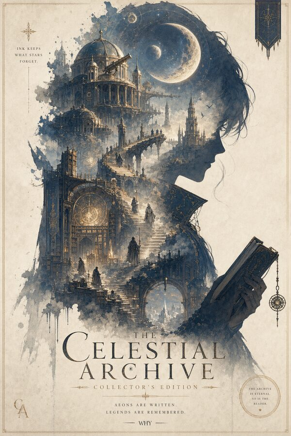
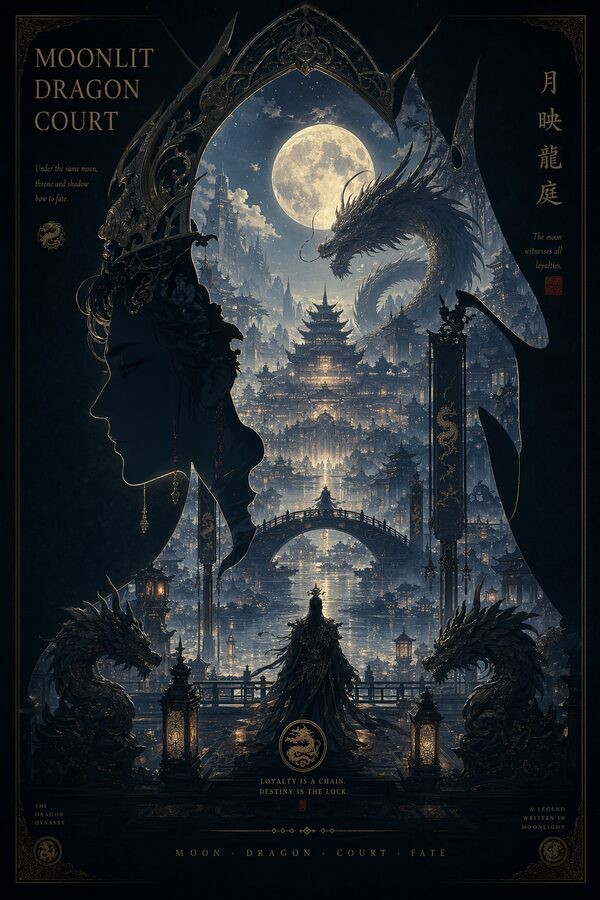
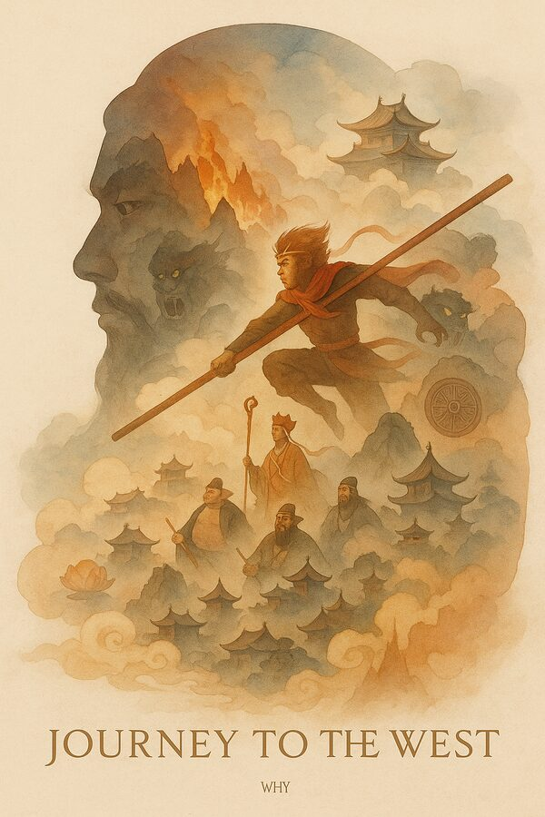
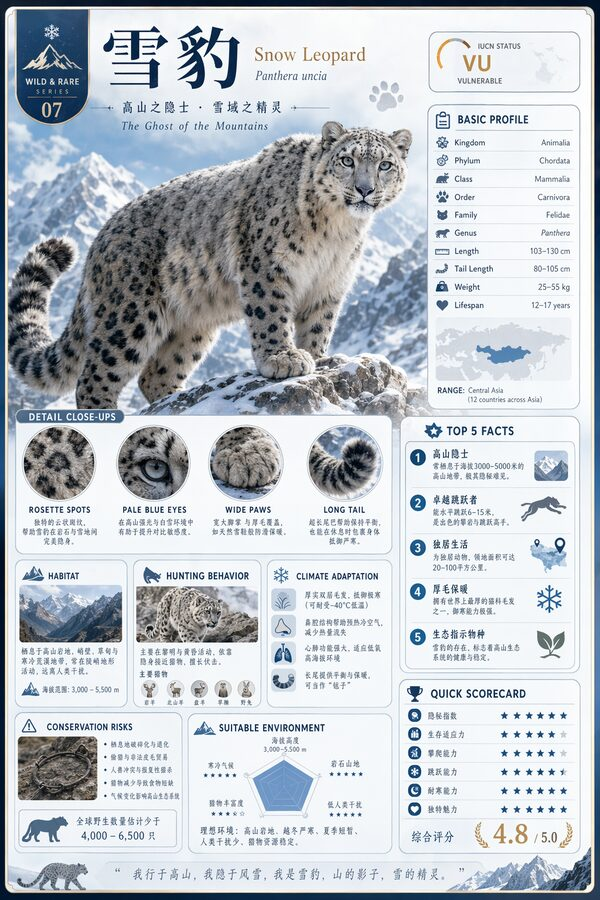
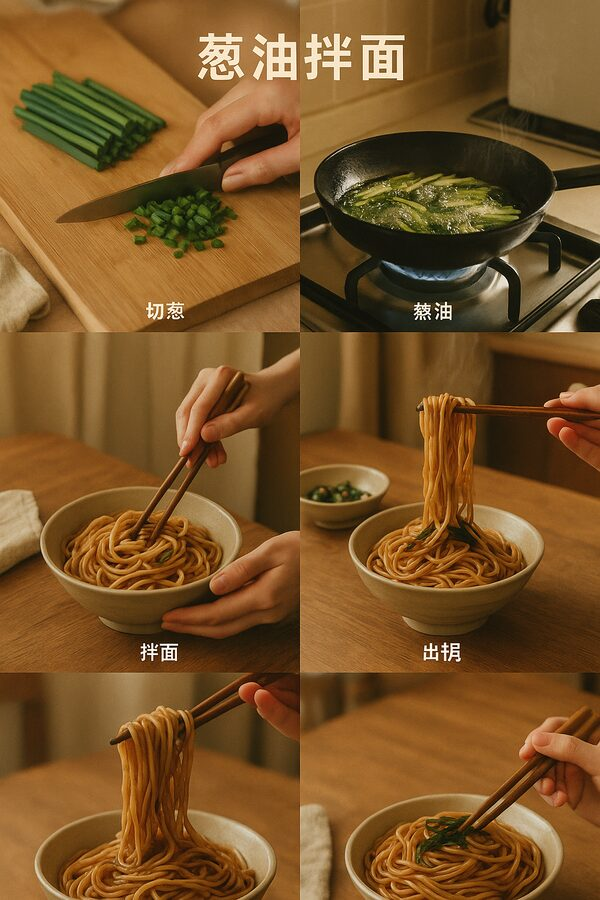
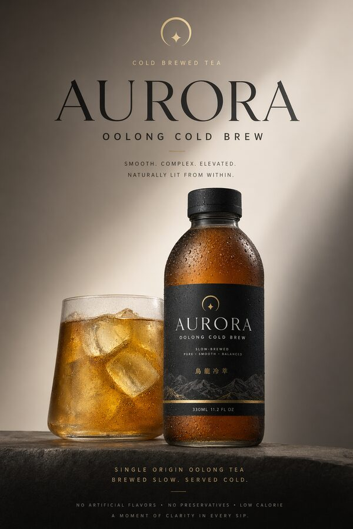
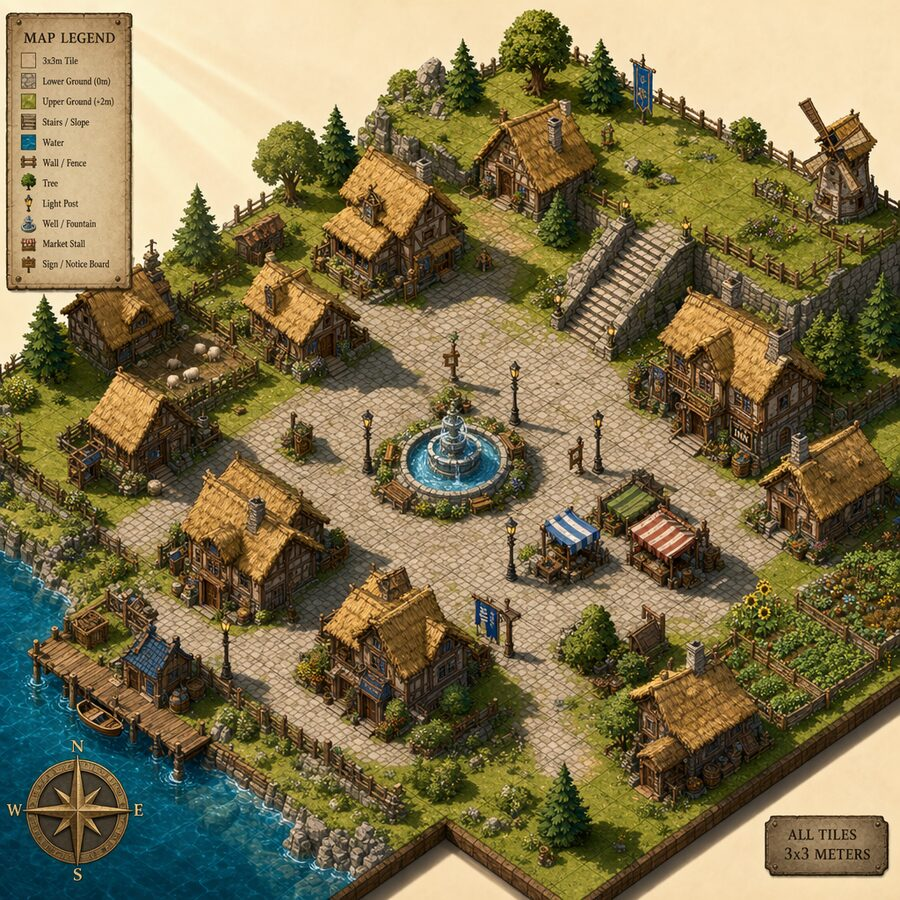
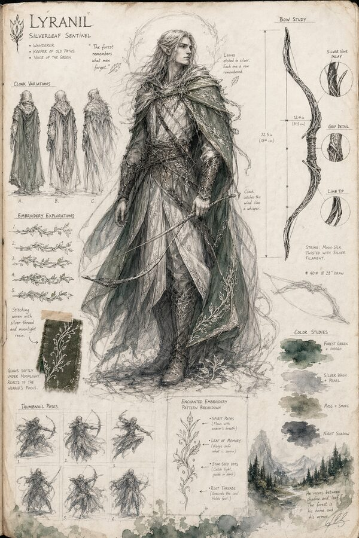
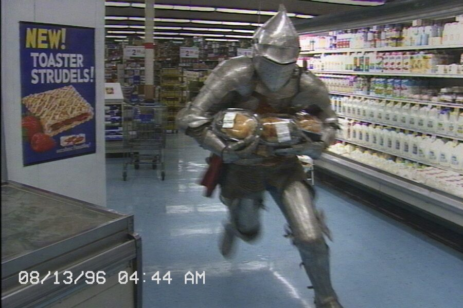

# 精选参考案例

[← 返回主目录](../README.zh-CN.md) · [English](community-reference.md) · [在 HiAPI 生成](https://www.hiapi.ai/zh/models/gpt-image-2?utm_source=github&utm_medium=readme&utm_campaign=awesome-gpt-image-2-prompts) · [API Key](https://www.hiapi.ai/zh/register?utm_source=github&utm_medium=readme&utm_campaign=awesome-gpt-image-2-prompts)

游戏画面、科研配图、信息图、产品视觉和角色设定等高复用参考。

> 案例库 · 17 个案例

---

<table>
  <tr>
    <td align="center" width="33%" valign="top"><a href="https://www.hiapi.ai/draw?p=Q3JlYXRlIGFuIGlzb21ldHJpYyBwaXhlbC1hcnQgUlBHIHNjcmVlbnNob3Qgb2YgYSB0cmFkaXRpb25hbCBKYXBhbmVzZSB2aWxsYWdlIGR1cmluZyBjaGVycnkgYmxvc3NvbSBzZWFzb24uIFNha3VyYSBwZXRhbHMgZHJpZnQgdGhyb3VnaCB0aGUgYWlyLCBhIHNhbXVyYWkgcGxheWVyIGNoYXJhY3RlciBwcmFjdGljZXMgc3dvcmQgbW92ZXMgaW4gdGhlIHNxdWFyZSwgdmlsbGFnZXJzIHdhdGNoIG5lYXJieSwgYW5kIHRoZSBpbnRlcmZhY2UgaW5jbHVkZXMgYW4gaW52ZW50b3J5IHBhbmVsLCBzdGFtaW5hIGdhdWdlLCBza2lsbCBjb29sZG93biB0aW1lcnMsIGFuZCBzdWJ0bGUgcXVlc3QgVUkuIENvenkgcmV0cm8gY29uc29sZSBmZWVsaW5nLCBzb2Z0IGFtYmllbnQgcGFzdGVsIGxpZ2h0aW5nLCBjcmlzcCBwaXhlbCBkZXRhaWxzLCAxNjo5IGdhbWVwbGF5IGNvbXBvc2l0aW9uLg%3D%3D&amp;m=gpt-image-2&amp;utm_source=awesome-gpt-image-2-prompts&amp;utm_medium=github_readme&amp;utm_campaign=zh_gallery&amp;s=16%3A9"></a><br><sub><b>Case 102</b> · <a href="#community-reddit-10">提示词</a></sub><br><sub><a href="https://www.reddit.com/r/midjourney/comments/1kozn4u/retro_video_games_in_japan_prompts_included/">复古日式小镇像素 RPG</a> · <a href="https://www.reddit.com/r/midjourney">@reddit-community</a></sub></td>
    <td align="center" width="33%" valign="top"><a href="https://www.hiapi.ai/draw?p=Q3JlYXRlIGEgdGhpcmQtcGVyc29uIGN5YmVycHVuayBhY3Rpb24gZ2FtZSBzY3JlZW5zaG90IHNldCBpbiBhIG5lb24tc29ha2VkIEV1cm9wZWFuIGNhcGl0YWwgYXQgbmlnaHQuIFRoZSBwcm90YWdvbmlzdCBoYXMgZ2xvd2luZyBjeWJlcm5ldGljIGltcGxhbnRzIGFuZCBzdGFuZHMgb24gcmFpbi1zbGljayBzdHJlZXRzIG5lYXIgYSBmYW1vdXMgbGFuZG1hcmsgd2hpbGUgaG9sb2dyYW1zLCBkcm9uZXMsIGFuZCBmbHlpbmcgdHJhZmZpYyBjcm93ZCB0aGUgc2t5bGluZS4gQWRkIGEgcG9saXNoZWQgZ2FtZSBIVUQgd2l0aCBoZWFsdGggYmFyLCBhbW1vIGNvdW50LCByYWRhciwgc3RlYWx0aC9lbmVyZ3kgbWV0ZXJzLCBhbmQgbWlzc2lvbiBvdmVybGF5cy4gVml2aWQgY3lhbi1tYWdlbnRhIHBhbGV0dGUsIHdldCByZWZsZWN0aW9ucywgY2luZW1hdGljIGludGVuc2l0eSwgMTY6OS4%3D&amp;m=gpt-image-2&amp;utm_source=awesome-gpt-image-2-prompts&amp;utm_medium=github_readme&amp;utm_campaign=zh_gallery&amp;s=16%3A9"></a><br><sub><b>Case 103</b> · <a href="#community-reddit-12">提示词</a></sub><br><sub><a href="https://www.reddit.com/r/midjourney/comments/1kzzy77/cyberpunk_video_games_in_european_cities_prompts/">赛博朋克欧洲动作 HUD</a> · <a href="https://www.reddit.com/r/midjourney">@reddit-community</a></sub></td>
    <td align="center" width="33%" valign="top"><a href="https://www.hiapi.ai/draw?p=Q3JlYXRlIGEgdGhpcmQtcGVyc29uIG92ZXItdGhlLXNob3VsZGVyIHNjcmVlbnNob3QgZnJvbSBhIG5vc3RhbGdpYyBhbmltZS1zdHlsZSBvcGVuLXdvcmxkIGFkdmVudHVyZSBnYW1lLiBUaGUgcHJvdGFnb25pc3Qgc3RhbmRzIGluIGEgbHVzaCBmb3Jlc3Qgd2l0aCBkZXRhaWxlZCBmb2xpYWdlIGFuZCB2aWJyYW50IHNoYWRpbmcsIGRyYXdpbmcgYSBib3cgdG93YXJkIGRpc3RhbnQgZW5lbWllcy4gQWRkIGEgY2xlYW4gb24tc2NyZWVuIEhVRDogcXVlc3QgbG9nLCBjb21wYXNzIGF0IHRoZSB0b3AsIGNoYXJhY3RlciBwb3J0cmFpdCBhbmQgc3RhdHVzIGVmZmVjdHMgYXQgYm90dG9tIGxlZnQsIHN1YnRsZSByYWluIGRyb3BsZXRzIG9uIHNjcmVlbiwgYW5kIHN1biByYXlzIGZpbHRlcmluZyB0aHJvdWdoIHRyZWVzLiBLZWVwIHRoZSBjb21wb3NpdGlvbiBkeW5hbWljLCB0aGUgZm9yZXN0IGltbWVyc2l2ZSwgYW5kIHRoZSBVSSBiZWxpZXZhYmxlIGxpa2UgYSBwcmVtaXVtIGFjdGlvbi1SUEcgc2NyZWVuc2hvdC4%3D&amp;m=gpt-image-2&amp;utm_source=awesome-gpt-image-2-prompts&amp;utm_medium=github_readme&amp;utm_campaign=zh_gallery&amp;s=16%3A9"></a><br><sub><b>Case 104</b> · <a href="#community-reddit-06">提示词</a></sub><br><sub><a href="https://www.reddit.com/r/midjourney/comments/1lh2l98/anime_style_video_games_prompts_included/">动漫开放世界冒险 HUD</a> · <a href="https://www.reddit.com/r/midjourney">@reddit-community</a></sub></td>
  </tr>
  <tr>
    <td align="center" width="33%" valign="top"><a href="https://www.hiapi.ai/draw?p=Q3JlYXRlIGFuIGlzb21ldHJpYyBsb3ctcG9seSBzdHJhdGVneSBnYW1lIHNjcmVlbnNob3Qgb2YgYSBtb3VudGFpbm91cyBKYXBhbmVzZSB2aWxsYWdlIHdpdGggcmljZSB0ZXJyYWNlcywgdG9yaWkgZ2F0ZXMsIHNhbXVyYWkgYW5kIGFyY2hlciB1bml0cyBpbiBmb3JtYXRpb24sIGFuZCBhIHRhY3RpY2FsIFJUUyBpbnRlcmZhY2UuIEluY2x1ZGUgdW5pdCBzZWxlY3Rpb24gYm94ZXMsIHJlc291cmNlIGNvdW50ZXJzIGZvciByaWNlIGFuZCB3b29kLCBmb2ctb2Ytd2FyIG1pbmltYXAsIGNvbW1hbmQgb3ZlcmxheXMsIGFuZCB3YXJtIGRheWxpZ2h0IHdpdGggc29mdCBzaGFkb3dzLiBTdHlsaXplZCBidXQgcmVhZGFibGUsIG1vZGVybiBpbmRpZSBzdHJhdGVneSBnYW1lIGtleSBhcnQsIDE2Ojku&amp;m=gpt-image-2&amp;utm_source=awesome-gpt-image-2-prompts&amp;utm_medium=github_readme&amp;utm_campaign=zh_gallery&amp;s=16%3A9"></a><br><sub><b>Case 105</b> · <a href="#community-reddit-11">提示词</a></sub><br><sub><a href="https://www.reddit.com/r/midjourney/comments/1l2d5dr/lowpoly_strategy_video_games_in_japan_prompts/">低多边形武士策略村庄</a> · <a href="https://www.reddit.com/r/midjourney">@reddit-community</a></sub></td>
    <td align="center" width="33%" valign="top"><a href="https://www.hiapi.ai/draw?p=Q3JlYXRlIGEgcG9saXNoZWQgSUNMUi1zdHlsZSBGaWd1cmUgMSBmb3IgYW4gaW1hZ2luYXJ5IG1ldGhvZCBjYWxsZWQgIkhpZXJhcmNoaWNhbCBNZW1vcnkgUm91dGluZyBmb3IgTG9uZy1Db250ZXh0IE11bHRpbW9kYWwgUmVhc29uaW5nIChITVIpIi4gVGhlIHRvcCBiYW5kIHNob3dzIHRoZSBmYWlsdXJlIG1vZGUgb2YgbmFpdmUgbG9uZy1jb250ZXh0IG11bHRpbW9kYWwgcHJvY2Vzc2luZzogb25lIG92ZXJjcm93ZGVkIGhvcml6b250YWwgdG9rZW4gc3RyZWFtIG1peGluZyB0ZXh0LCBpbWFnZSBwYXRjaGVzLCByZXRyaWV2ZWQgZG9jdW1lbnRzLCB0b29sIHRyYWNlcywgYW5kIGF1ZGlvIHNuaXBwZXRzLCB3aXRoIHJlZC1vcmFuZ2Ugd2FybmluZyBhY2NlbnRzIGZvciBpbnRlcmZlcmVuY2UsIGF0dGVudGlvbiBkaWx1dGlvbiwgbWVtb3J5IGNvbGxpc2lvbiwgYW5kIHF1YWRyYXRpYyBjb21wdXRlIGNvc3QuIEEgY2xlYW4gaG9yaXpvbnRhbCBkaXZpZGVyIHNlcGFyYXRlcyB0aGUgbWFpbiBsb3dlciBwYW5lbCwgd2hpY2ggcHJlc2VudHMgdGhlIEhNUiBmcmFtZXdvcmsgYXMgYSBzcGFjaW91cyBtb2R1bGFyIGxvb3AuIENlbnRlcjogYSBSZWFzb25pbmcgQ29udHJvbGxlciB3aXRoIHN0YWdlcyBPYnNlcnZlX3QgdG8gVXBkYXRlX3QuIExlZnQ6IGEgdGhyZWUtbGV2ZWwgTWVtb3J5IEhpZXJhcmNoeSB3aXRoIHdvcmtpbmcgY2FjaGUsIGVwaXNvZGljIG1lbW9yeSwgYW5kIHNlbWFudGljIGtub3dsZWRnZSBiYXNlLiBSaWdodDogTXVsdGltb2RhbCBTdHJlYW1zIGVudGVyaW5nIHNlbGVjdGl2ZWx5IHRocm91Z2ggcm91dGluZyBwYXRocy4gQm90dG9tIHJpZ2h0OiBzcGFyc2UgZXhwZXJ0cyBhY3RpdmF0ZWQgb25seSB3aGVuIG5lZWRlZC4gV2hpdGUgYmFja2dyb3VuZCwgdmVjdG9yLWNsZWFuIHN0eWxpbmcsIG5ldXRyYWwgZ3JheSBwbHVzIGNvb2wgYWNjZW50cywgbWluaW1hbCBidXQgbGVnaWJsZSBsYWJlbHMsIGNvbmZlcmVuY2UtcGFwZXIgY2xhcml0eSwgbm8gcG9zdGVyIGFlc3RoZXRpY3Mu&amp;m=gpt-image-2&amp;utm_source=awesome-gpt-image-2-prompts&amp;utm_medium=github_readme&amp;utm_campaign=zh_gallery&amp;s=16%3A9"></a><br><sub><b>Case 106</b> · <a href="#community-xhs-03">提示词</a></sub><br><sub><a href="https://www.xiaohongshu.com/explore/69d396140000000023012282">ICLR 风格方法图</a> · <a href="https://www.xiaohongshu.com/">@xiaohongshu-community</a></sub></td>
    <td align="center" width="33%" valign="top"><a href="https://www.hiapi.ai/draw?p=RHJhdyBhIHJlc2VhcmNoLXBhcGVyIGlsbHVzdHJhdGlvbiBzaG93aW5nIGEgY2xvc2VkLWxvb3AgTExNIGFnZW50IHN5c3RlbS4gVGhlIGxlZnQgc2lkZSBiZWdpbnMgd2l0aCBhIHVzZXIgcHJvbXB0LCB0aGVuIGZsb3dzIGludG8gYSBwbGFubmVyLCB0b29sLXVzZSBlbmdpbmUsIHJldHJpZXZhbCBtb2R1bGUsIG1lbW9yeSBidWZmZXIsIGFuZCBhIGZpbmFsIHZlcmlmaWVyIHRoYXQgZmVlZHMgY29ycmVjdGlvbnMgYmFjayBpbnRvIHRoZSBzeXN0ZW0uIFVzZSBhIHJlc3RyYWluZWQgYWNhZGVtaWMgcGFsZXR0ZSBvZiBibHVlLCBzbGF0ZSwgYW5kIG9yYW5nZSBhY2NlbnRzLiBTdHlsZSBpdCBsaWtlIGEgY2xlYW4gcGFwZXIgaWxsdXN0cmF0aW9uOiB2ZWN0b3ItbGlrZSBibG9ja3MsIHByZWNpc2UgYXJyb3dzLCBzcGFyc2UgbGFiZWxzLCBiYWxhbmNlZCB3aGl0ZXNwYWNlLCBhbmQgYSBjbGVhciBGaWd1cmUgMSBuYXJyYXRpdmUgZnJvbSBwcm9ibGVtIGlucHV0IHRvIHZlcmlmaWVkIG91dHB1dC4%3D&amp;m=gpt-image-2&amp;utm_source=awesome-gpt-image-2-prompts&amp;utm_medium=github_readme&amp;utm_campaign=zh_gallery&amp;s=16%3A9"></a><br><sub><b>Case 107</b> · <a href="#community-xhs-05">提示词</a></sub><br><sub><a href="https://www.xiaohongshu.com/explore/67e414010000000007037315">极简科研配图流程</a> · <a href="https://www.xiaohongshu.com/">@xiaohongshu-community</a></sub></td>
  </tr>
  <tr>
    <td align="center" width="33%" valign="top"><a href="https://www.hiapi.ai/draw?p=RGVzaWduIGEgY29sbGVjdG9yJ3MtZWRpdGlvbiBlcGljIHBvc3RlciBmb3IgYW4gb3JpZ2luYWwgZmFudGFzeSB0aGVtZSBjYWxsZWQgIlRoZSBDZWxlc3RpYWwgQXJjaGl2ZSIuIFRoZSBvdXRlciBzaWxob3VldHRlIGlzIGEgZ3JhY2VmdWwgc2lkZSBwcm9maWxlIG9mIGEgbG9uZSBhcmNoaXZpc3QsIGFuZCBpbnNpZGUgdGhhdCBzaWxob3VldHRlIGEgY29tcGxldGUgd29ybGQgbmF0dXJhbGx5IGdyb3dzOiBvYnNlcnZhdG9yaWVzLCBmbG9hdGluZyBzdGFpcndheXMsIGJyaWRnZXMsIGFuY2llbnQgbGlicmFyaWVzLCBtb29ucywgdG93ZXJzLCByZWxpY3MsIGFuZCBkaXN0YW50IHBpbGdyaW1zLiBNYWtlIGl0IGZlZWwgbGlrZSBhIG5hcnJhdGl2ZSBzaWxob3VldHRlIGNvbXBvc2l0aW9uIHJhdGhlciB0aGFuIGEgY29sbGFnZS4gU3R5bGU6IGNpbmVtYXRpYyBwb3N0ZXIgZnVzZWQgd2l0aCBkcmVhbXkgd2F0ZXJjb2xvciBpbGx1c3RyYXRpb24sIHF1aWV0IGFuZCBtYWplc3RpYywgc2FjcmVkIGFuZCBub3N0YWxnaWMsIHdpdGggcGFwZXIgZ3JhaW4sIHNvZnQgbWlzdCwgYnJ1c2gtZWRnZSB0ZXh0dXJlLCBlbGVnYW50IG5lZ2F0aXZlIHNwYWNlLCBhbmQgYSBkaXNjcmVldCBzaWduYXR1cmUgIldIWSIgaW50ZWdyYXRlZCBuYXR1cmFsbHkgYXMgcGFydCBvZiB0aGUgbGF5b3V0Lg%3D%3D&amp;m=gpt-image-2&amp;utm_source=awesome-gpt-image-2-prompts&amp;utm_medium=github_readme&amp;utm_campaign=zh_gallery&amp;s=9%3A16"></a><br><sub><b>Case 108</b> · <a href="#community-xhs-01">提示词</a></sub><br><sub><a href="https://www.xiaohongshu.com/explore/69e324cd0000000021039ca9">史诗剪影世界观海报</a> · <a href="https://www.xiaohongshu.com/">@xiaohongshu-community</a></sub></td>
    <td align="center" width="33%" valign="top"><a href="https://www.hiapi.ai/draw?p=Q3JlYXRlIGEgaGlnaC1hZXN0aGV0aWMgY29sbGVjdG9yIHBvc3RlciBpbiBhICJzaWxob3VldHRlIHVuaXZlcnNlIC8gZHVhbC1leHBvc3VyZSBuYXJyYXRpdmUiIHN0eWxlIGZvciBhbiBvcmlnaW5hbCB0aGVtZSBjYWxsZWQgIk1vb25saXQgRHJhZ29uIENvdXJ0Ii4gQ2hvb3NlIHRoZSBtb3N0IHN5bWJvbGljIG91dGVyIGNvbnRvdXIgeW91cnNlbGYg4oCUIG5vdCBhIGJvdHRsZSBvciBob3VyZ2xhc3MsIGJ1dCBhIG1vcmUgcmVzb25hbnQgZm9ybSBsaWtlIGEgbWFzaywgYXJjaHdheSwgd2luZywgdGhyb25lLCBmYWNlIHByb2ZpbGUsIG9yIGx1bWlub3VzIGdhdGUuIEluc2lkZSBhbmQgYXJvdW5kIHRoYXQgY29udG91ciwgbGV0IGEgY29tcGxldGUgdGhlbWUgd29ybGQgbmF0dXJhbGx5IHVuZm9sZDogcGFsYWNlcywgYnJpZGdlcywgbW9vbmxpdCB3YXRlciwgZHJhZ29uIG1vdGlmcywgcmVsaWNzLCBiYW5uZXJzLCBkaXN0YW50IGZpZ3VyZXMsIGFuZCBsYXllcmVkIGF0bW9zcGhlcmljIGRlcHRoLiBUaGUgaW1hZ2UgbXVzdCBmZWVsIGxpa2UgYSBwcmVtaXVtIG5vdmVsL2FuaW1lIHBvc3RlcjogZWxlZ2FudCwgbXl0aGljLCBwb2V0aWMsIG5vdCBjbHV0dGVyZWQsIG5vdCBjb2xsYWdlLWxpa2UsIHdpdGggc3Ryb25nIHZpc3VhbCBtZW1vcnkgYW5kIHJlc3RyYWluZWQgbHV4dXJpb3VzIGRlc2lnbi4%3D&amp;m=gpt-image-2&amp;utm_source=awesome-gpt-image-2-prompts&amp;utm_medium=github_readme&amp;utm_campaign=zh_gallery&amp;s=9%3A16"></a><br><sub><b>Case 109</b> · <a href="#community-xhs-06">提示词</a></sub><br><sub><a href="https://www.xiaohongshu.com/explore/69e7a01700000000230153f3">双重曝光叙事海报</a> · <a href="https://www.xiaohongshu.com/">@xiaohongshu-community</a></sub></td>
    <td align="center" width="33%" valign="top"><a href="https://www.hiapi.ai/draw?p=Q3JlYXRlIGEgY29sbGVjdG9yLWVkaXRpb24gZXBpYyBuYXJyYXRpdmUgcG9zdGVyIGZvciDjgIropb%2FmuLjorrDjgIsuIFVzZSBhIGdpYW50IGVsZWdhbnQgc2lkZS1wcm9maWxlIHNpbGhvdWV0dGUgYXMgdGhlIG91dGVyIGNvbnRvdXIsIGFuZCBsZXQgdGhlIGludGVyaW9yIGdyb3cgaW50byBhIGNvbXBsZXRlIEpvdXJuZXkgdG8gdGhlIFdlc3Qgd29ybGQ6IE1vbmtleSBLaW5nLCBtb25rLCBwaWcgYW5kIHNhbmQgbW9uaywgZmxhbWluZyBtb3VudGFpbiwgaGVhdmVubHkgcGFsYWNlLCBkZW1vbnMsIG1hZ2ljIHN0YWZmLCBjbG91ZHMsIHRlbXBsZXMsIG1vdW50YWlucywgcmVsaWNzLCBhbmQgc3ltYm9saWMgbW90aWZzLiBOb3QgYSBjb2xsYWdlIGJ1dCBhIHJlZmluZWQgc2lsaG91ZXR0ZS1maWxsZWQgbmFycmF0aXZlIGNvbXBvc2l0aW9uLCBibGVuZGluZyBjaW5lbWF0aWMgcG9zdGVyIGRlc2lnbiB3aXRoIGRyZWFteSB3YXRlcmNvbG9yIGlsbHVzdHJhdGlvbiwgc29mdCBhdG1vc3BoZXJpYyBwZXJzcGVjdGl2ZSwgcGFwZXIgZ3JhaW4sIHJlc3RyYWluZWQgbGF5b3V0LCBsYXJnZSBicmVhdGhpbmcgc3BhY2UsIHBvZXRpYyBhbmQgbGVnZW5kYXJ5IG1vb2QuIEFkZCBhIHN1YnRsZSByZWZpbmVkIHNpZ25hdHVyZSBtYXJrIOKAnFdIWeKAnSBpbnRlZ3JhdGVkIGludG8gdGhlIHBvc3RlciBkZXNpZ24u&amp;m=gpt-image-2&amp;utm_source=awesome-gpt-image-2-prompts&amp;utm_medium=github_readme&amp;utm_campaign=zh_gallery&amp;s=9%3A16"></a><br><sub><b>Case 110</b> · <a href="#community-xhs-10">提示词</a></sub><br><sub><a href="https://www.xiaohongshu.com/explore/69e78cd4000000002103bdd3">西游记剪影史诗海报</a> · <a href="https://www.xiaohongshu.com/">@xiaohongshu-community</a></sub></td>
  </tr>
  <tr>
    <td align="center" width="33%" valign="top"><a href="https://www.hiapi.ai/draw?p=R2VuZXJhdGUgYSBwb2xpc2hlZCBvbmUtcGFnZSBDaGluZXNlIHRyYXZlbCBndWlkZSBwb3N0ZXIgZm9yIGEgZmFzdCB3ZWVrZW5kIHRyaXAgZnJvbSBOYW5qaW5nIHRvIFNlb3VsIGluIE1heS4gVXNlIExBUkdFIGhpZ2hseSBsZWdpYmxlIENoaW5lc2UgdGV4dCwgc2hvcnQgcGhyYXNlcyBvbmx5LCBhbmQgbm8gcGFyYWdyYXBoIGJsb2Nrcy4gRm9jdXMgb24gc2hvcHBpbmcsIHNraW5jYXJlLCBhbmQgYSBzdHlsaXNoIFNlb25nc3UtZG9uZyByb3V0ZS4gTGF5b3V0OiBiaWcgdGl0bGUsIDQgbW9kdWxlcyBvbmx5ICjooYznqIsgLyDljLrln5%2FmjqjojZAgLyDotK3nianmuIXljZUgLyDnvo7lpobmiqTogqQpLCBlYWNoIHdpdGggMiB0byA0IHNob3J0IGJ1bGxldCBwb2ludHMsIHBsdXMgYSBzbWFsbCBjdXRlIHJvdXRlIG1hcCB3aXRoIGljb25zLiBDbGVhbiBlZGl0b3JpYWwgaW5mb2dyYXBoaWMgc3R5bGUsIHNvZnQgcGFzdGVsIGNvbG9ycywgbmVhdCBzcGFjaW5nLCBoaWdoIHJlYWRhYmlsaXR5LCBtb2Rlcm4gWGlhb2hvbmdzaHUgdHJhdmVsIGNhcmQgYWVzdGhldGljLiBBdm9pZCB0aW55IHRleHQsIGF2b2lkIGRlbnNlIGV4cGxhbmF0aW9ucywgYXZvaWQgZ2FyYmxlZCBjaGFyYWN0ZXJzLg%3D%3D&amp;m=gpt-image-2&amp;utm_source=awesome-gpt-image-2-prompts&amp;utm_medium=github_readme&amp;utm_campaign=zh_gallery&amp;s=9%3A16"></a><br><sub><b>Case 111</b> · <a href="#community-xhs-09">提示词</a></sub><br><sub><a href="https://www.xiaohongshu.com/explore/69e8cd0d0000000023007215">首尔周末旅行攻略图</a> · <a href="https://www.xiaohongshu.com/">@xiaohongshu-community</a></sub></td>
    <td align="center" width="33%" valign="top"><a href="https://www.hiapi.ai/draw?p=R2VuZXJhdGUgYSBoaWdoLXF1YWxpdHkgdmVydGljYWwgc2NpZW5jZSBlbmN5Y2xvcGVkaWEgY2FyZCBhYm91dCAi6Zuq6LG5IFNub3cgTGVvcGFyZCIuIEl0IHNob3VsZCBmZWVsIGxpa2UgYSBjb2xsZWN0aWJsZSBtb2R1bGFyIGtub3dsZWRnZSBpbmZvZ3JhcGhpYyByYXRoZXIgdGhhbiBhIG5vcm1hbCBwb3N0ZXIuIEluY2x1ZGUgb25lIGJlYXV0aWZ1bCBoZXJvIGlsbHVzdHJhdGlvbiwgc2V2ZXJhbCB6b29tZWQtaW4gZGV0YWlsIGNhbGxvdXRzLCByb3VuZGVkIGluZm9ybWF0aW9uIG1vZHVsZXMsIGNsZWFyIHRpdGxlIGhpZXJhcmNoeSwgY29tcGFjdCBlbmN5Y2xvcGVkaWEgY29udGVudCwgcmF0aW5nIGNhcmRzLCBhbmQgYSBUb3AgNSBmYWN0cyBtb2R1bGUuIFN1Z2dlc3RlZCBzZWN0aW9uczogYmFzaWMgcHJvZmlsZSwgaGFiaXRhdCwgYXBwZWFyYW5jZSwgaHVudGluZyBiZWhhdmlvciwgY29uc2VydmF0aW9uIHJpc2tzLCBjbGltYXRlIGFkYXB0YXRpb24sIHN1aXRhYmxlIGVudmlyb25tZW50LCBhbmQgcXVpY2sgc2NvcmVjYXJkLiBWaXN1YWwgc3R5bGU6IGNsZWFuIGxpZ2h0IGJhY2tncm91bmQsIHNvZnQgcGFsZXR0ZSwgc3VidGxlIHNoYWRvd3MsIHJlZmluZWQgaWNvbnMsIHJvdW5kZWQgaW5mbyBib3hlcywgZGVuc2UgYnV0IHJlYWRhYmxlIGluZm9ybWF0aW9uLCBwb2xpc2hlZCBlZGl0b3JpYWwgbGF5b3V0LCBoaWdoIGNvbGxlY3Rpb24gdmFsdWUu&amp;m=gpt-image-2&amp;utm_source=awesome-gpt-image-2-prompts&amp;utm_medium=github_readme&amp;utm_campaign=zh_gallery&amp;s=9%3A16"></a><br><sub><b>Case 112</b> · <a href="#community-xhs-02">提示词</a></sub><br><sub><a href="https://www.xiaohongshu.com/explore/69e832170000000023012116">模块化百科科普信息卡</a> · <a href="https://www.xiaohongshu.com/">@xiaohongshu-community</a></sub></td>
    <td align="center" width="33%" valign="top"><a href="https://www.hiapi.ai/draw?p=Q3JlYXRlIGEgWGlhb2hvbmdzaHUtc3R5bGUgdmlyYWwgY29va2luZyB0dXRvcmlhbCBpbWFnZSBpbiBhIDM6NCB2ZXJ0aWNhbCBsYXlvdXQgZm9yIGhvbWVtYWRlIHNjYWxsaW9uIG9pbCBub29kbGVzLiBDb3p5IGhvbWUtY29va2luZyB2aWJlLCB3YXJtIGludml0aW5nIGxpZmVzdHlsZSBhZXN0aGV0aWMsIDQgdG8gNiBzdGVwIGdyaWQgbGF5b3V0LCBjbGVhbiBzcGFjaW5nLCByZWFsaXN0aWMgZm9vZCBwaG90b2dyYXBoeSwgc29mdCBuYXR1cmFsIGxpZ2h0aW5nLCBzbGlnaHQgZmlsbSB0b25lLCB3YXJtIGNvbG9yIGdyYWRpbmcsIHZpc2libGUgb2lsIHNoZWVuLCBzdGVhbSwgc2F1Y2UgdGV4dHVyZSwgYW5kIGhhbmRzIGludGVyYWN0aW5nIHdpdGggdGhlIGZvb2QuIEFkZCBzbWFsbCBDaGluZXNlIGFubm90YXRpb25zIHN1Y2ggYXMg5YiH6JGxLCDnhqzmsrksIOaLjOmdoiwg5Ye66ZSFLiBBdm9pZCBvdmVyY3Jvd2Rpbmcgb3IgZXhjZXNzaXZlIHRleHQu&amp;m=gpt-image-2&amp;utm_source=awesome-gpt-image-2-prompts&amp;utm_medium=github_readme&amp;utm_campaign=zh_gallery&amp;s=9%3A16"></a><br><sub><b>Case 113</b> · <a href="#community-xhs-08">提示词</a></sub><br><sub><a href="https://www.xiaohongshu.com/explore/69e8eeed0000000021004a54">小红书家常菜教程卡</a> · <a href="https://www.xiaohongshu.com/">@xiaohongshu-community</a></sub></td>
  </tr>
  <tr>
    <td align="center" width="33%" valign="top"><a href="https://www.hiapi.ai/draw?p=RGVzaWduIGEgaGlnaC1lbmQgY29tbWVyY2lhbCBwb3N0ZXIgZm9yIGEgcHJvZHVjdCBjYWxsZWQgIkF1cm9yYSBPb2xvbmcgQ29sZCBCcmV3Ii4gTWluaW1hbGlzdCBzdHlsZSwgY2xlYW4gZnJhbWUsIGNlbnRlcmVkIGhlcm8gYm90dGxlIGFuZCB0ZWEgZ2xhc3MsIHNvZnQgc3R1ZGlvIGxpZ2h0aW5nLCByZWFsaXN0aWMgbWF0ZXJpYWwgdGV4dHVyZXMsIGVsZWdhbnQgY29uZGVuc2F0aW9uIGRldGFpbHMsIGdlbmVyb3VzIG5lZ2F0aXZlIHNwYWNlLCBwcmVtaXVtIGJyYW5kIHZpc3VhbCBsYW5ndWFnZSwgY2luZW1hdGljIGxpZ2h0IGFuZCBzaGFkb3csIHJlZmluZWQgcGFja2FnaW5nIHR5cG9ncmFwaHksIGFuZCB1bHRyYS1kZXRhaWxlZCBmaW5pc2guIE1ha2UgaXQgZmVlbCBsaWtlIGEgbHV4dXJ5IGJldmVyYWdlIGNhbXBhaWduIHRoYXQgY291bGQgcnVuIGluIGEgc3Vid2F5IGxpZ2h0Ym94IG9yIGZhc2hpb24gbWFnYXppbmUu&amp;m=gpt-image-2&amp;utm_source=awesome-gpt-image-2-prompts&amp;utm_medium=github_readme&amp;utm_campaign=zh_gallery&amp;s=9%3A16"></a><br><sub><b>Case 114</b> · <a href="#community-xhs-07">提示词</a></sub><br><sub><a href="https://www.xiaohongshu.com/explore/69e7878300000000230050bb">通用高端商业海报模板</a> · <a href="https://www.xiaohongshu.com/">@xiaohongshu-community</a></sub></td>
    <td align="center" width="33%" valign="top"><a href="https://www.hiapi.ai/draw?p=Q3JlYXRlIGEgdmlicmFudCBpc29tZXRyaWMgZmFudGFzeSB2aWxsYWdlIG1hcCB3aXRoIGEgY2xlYW4gZ3JpZC1iYXNlZCBsYXlvdXQgdXNpbmcgM3gzIG1ldGVyIHRpbGVzLiBJbmNsdWRlIHdvb2RlbiBob3VzZXMgd2l0aCB0aGF0Y2hlZCByb29mcywgY29iYmxlc3RvbmUgcGF0aHMsIGFuZCBhIGNlbnRyYWwgc3RvbmUgZm91bnRhaW4uIE9uZSBjb3JuZXIgb2YgdGhlIG1hcCByaXNlcyBpbnRvIGEgc21hbGwgZ3Jhc3N5IGhpbGwgYWJvdXQgMiBtZXRlcnMgaGlnaCB3aXRoIHN0YWlycyBjb25uZWN0aW5nIHRvIHRoZSBsb3dlciBncm91bmQuIEtlZXAgdGhlIGlzb21ldHJpYyBhbmdsZSBwcmVjaXNlIGFuZCBnYW1lLXJlYWR5LiBXYXJtIHN1bmxpZ2h0IHNlbmRzIGNsZWFyIHJheXMgYW5kIGxvbmcgc2hhZG93cyBhY3Jvc3MgdGhlIHJvb2Z0b3BzLiBNYWtlIHRoZSBzY2VuZSByZWFkYWJsZSBsaWtlIGEgaGFuZGNyYWZ0ZWQgc3RyYXRlZ3ktZ2FtZSBtYXAsIHdpdGggY3Jpc3AgdGlsZSBsb2dpYywgY2hhcm1pbmcgZW52aXJvbm1lbnRhbCBkZXRhaWwsIGFuZCByaWNoIGJ1dCBjb250cm9sbGVkIGNvbG9yLg%3D%3D&amp;m=gpt-image-2&amp;utm_source=awesome-gpt-image-2-prompts&amp;utm_medium=github_readme&amp;utm_campaign=zh_gallery&amp;s=1%3A1"></a><br><sub><b>Case 115</b> · <a href="#community-reddit-03">提示词</a></sub><br><sub><a href="https://www.reddit.com/r/midjourney/comments/1hkqr4x/isometric_maps_prompts_included/">等距幻想村庄地图</a> · <a href="https://www.reddit.com/r/midjourney">@reddit-community</a></sub></td>
    <td align="center" width="33%" valign="top"><a href="https://www.hiapi.ai/draw?p=Q3JlYXRlIGEgbm9zdGFsZ2ljIHBpeGVsLWFydCBicmVha2Zhc3Qgc3RpbGwgbGlmZS4gU2hvdyBhIHRhbGwgc3RhY2sgb2YgZmx1ZmZ5IGdvbGRlbiBwYW5jYWtlcyBkcml6emxlZCB3aXRoIGdsb3NzeSBtYXBsZSBzeXJ1cCwgdG9wcGVkIHdpdGggc3RyYXdiZXJyaWVzIGFuZCBibHVlYmVycmllcywgd2l0aCBwaXhlbGF0ZWQgc3RlYW0gcmlzaW5nIGludG8gdGhlIGFpci4gVGhlIHBsYXRlIHNpdHMgb24gYSBwYXN0ZWwgdGFibGVjbG90aCBhbmQgYSBob3QgY3VwIG9mIGNvZmZlZSByZXN0cyBpbiB0aGUgYmFja2dyb3VuZC4gVXNlIHJpY2ggYnJlYWtmYXN0IGNvbG9ycywgY2FyZWZ1bCBsaWdodGluZywgYW5kIGRlbGljaW91cyB0ZXh0dXJlIGRldGFpbCB3aGlsZSBzdGF5aW5nIHRydWUgdG8gY2xlYW4sIHJlYWRhYmxlIHBpeGVsIGFydC4%3D&amp;m=gpt-image-2&amp;utm_source=awesome-gpt-image-2-prompts&amp;utm_medium=github_readme&amp;utm_campaign=zh_gallery&amp;s=1%3A1"></a><br><sub><b>Case 116</b> · <a href="#community-reddit-05">提示词</a></sub><br><sub><a href="https://www.reddit.com/r/midjourney/comments/1jmodcx/animated_pixel_art_food_prompts_included/">像素早餐静物</a> · <a href="https://www.reddit.com/r/midjourney">@reddit-community</a></sub></td>
  </tr>
  <tr>
    <td align="center" width="33%" valign="top"><a href="https://www.hiapi.ai/draw?p=Q3JlYXRlIGEgZmFudGFzeSBjb25jZXB0IGFydCBza2V0Y2hib29rIHBhZ2UgY2VudGVyZWQgb24gYSBteXN0aWNhbCBlbHZlbiBhcmNoZXIgd2l0aCBmbG93aW5nIHJvYmVzLiBSZW5kZXIgdGhlIG1haW4gZmlndXJlIGluIGxvb3NlIGdyYXBoaXRlIHN0cm9rZXMgd2l0aCBwcmVjaXNlIGluayBkZXRhaWxpbmcuIFN1cnJvdW5kIHRoZSBoZXJvIHNrZXRjaCB3aXRoIHNpZGUgdmlld3MgZXhwbG9yaW5nIGNsb2FrIHZhcmlhdGlvbnMsIGEgaGFsZi1maW5pc2hlZCBib3cgc3R1ZHkgd2l0aCBtZWFzdXJlbWVudHMsIHRodW1ibmFpbCBhY3Rpb24gcG9zZXMsIGhhbmR3cml0dGVuIGFubm90YXRpb25zIGFib3V0IGVuY2hhbnRlZCBlbWJyb2lkZXJ5IHBhdHRlcm5zLCBhbmQgZmFpbnQgd2F0ZXJjb2xvciB0ZXN0cyBibGVlZGluZyBpbnRvIHRoZSBtYXJnaW5zIGluIGZvcmVzdC1ncmVlbiBhbmQgc2lsdmVyLiBUaGUgcGFnZSBzaG91bGQgZmVlbCBsaWtlIGEgcmVhbCBhcnQgZGlyZWN0b3IncyBkZXZlbG9wbWVudCBzaGVldDogZXhwbG9yYXRvcnksIGJlYXV0aWZ1bCwgcmVhZGFibGUsIGFuZCByaWNobHkgdGFjdGlsZS4%3D&amp;m=gpt-image-2&amp;utm_source=awesome-gpt-image-2-prompts&amp;utm_medium=github_readme&amp;utm_campaign=zh_gallery&amp;s=9%3A16"></a><br><sub><b>Case 117</b> · <a href="#community-reddit-08">提示词</a></sub><br><sub><a href="https://www.reddit.com/r/midjourney/comments/1jrcpan/fantasy_concept_arts_with_v7_prompts_included/">精灵弓手概念设定页</a> · <a href="https://www.reddit.com/r/midjourney">@reddit-community</a></sub></td>
    <td align="center" width="33%" valign="top"><a href="https://www.hiapi.ai/draw?p=Q3JlYXRlIGEgY2hhb3RpYyBzZWN1cml0eS1jYW1lcmEgc3RpbGwgZnJvbSBhIDE5OTBzIGdyb2Nlcnkgc3RvcmUuIEEgbWFuIGluIGZ1bGwgbWVkaWV2YWwgYXJtb3IgaXMgZnJvemVuIG1pZC1zcHJpbnQgc3RlYWxpbmcgc2V2ZXJhbCByb3Rpc3NlcmllIGNoaWNrZW5zIHBhc3QgdGhlIGRhaXJ5IHNlY3Rpb24uIE92ZXJoZWFkIGZsdW9yZXNjZW50IGxpZ2h0cyByZWZsZWN0IG9mZiB0aGUgYXJtb3IuIFRoZSBmbG9vciBpcyBiYWJ5LWJsdWUgdGlsZS4gQWRkIGEgdGltZXN0YW1wIHJlYWRpbmcgIjA4LzEzLzk2IDA0OjQ0IEFNIiBhbmQgYSB3YWxsIHBvc3RlciBzYXlpbmcgIk5FVyEgVE9BU1RFUiBTVFJVREVMUyEiLiBNYWtlIGl0IGxvdy1maWRlbGl0eSwgYWJzdXJkLCBzbGlnaHRseSBpbnRlbnNlLCB3aXRoIG1vdGlvbiBibHVyLCBWSFMgY29sb3IgYmxlZWQsIHN1cnZlaWxsYW5jZSBub2lzZSwgYW5kIGF1dGhlbnRpYyBhbmFsb2ctc3RvcmUgbGlnaHRpbmcu&amp;m=gpt-image-2&amp;utm_source=awesome-gpt-image-2-prompts&amp;utm_medium=github_readme&amp;utm_campaign=zh_gallery&amp;s=16%3A9"></a><br><sub><b>Case 118</b> · <a href="#community-reddit-09">提示词</a></sub><br><sub><a href="https://www.reddit.com/r/ChatGPT/comments/1jk0p3v/tried_to_push_the_new_image_model_with_an/">VHS 杂货店混乱监控画面</a> · <a href="https://www.reddit.com/r/midjourney">@reddit-community</a></sub></td>
  </tr>
</table>

---

# 完整 Prompt

每个案例都配有真实效果图、来源和作者。点击图片可在 HiAPI 预填生成；也可以复制 Prompt，把主题、人物、产品、城市或文案换成自己的内容。

<a id="community-reddit-10"></a>

### Case 102: [复古日式小镇像素 RPG](https://www.reddit.com/r/midjourney/comments/1kozn4u/retro_video_games_in_japan_prompts_included/)

作者: [@reddit-community](https://www.reddit.com/r/midjourney) · 比例: `16:9` · 语言: `English`

<p align="center"><a href="https://www.hiapi.ai/draw?p=Q3JlYXRlIGFuIGlzb21ldHJpYyBwaXhlbC1hcnQgUlBHIHNjcmVlbnNob3Qgb2YgYSB0cmFkaXRpb25hbCBKYXBhbmVzZSB2aWxsYWdlIGR1cmluZyBjaGVycnkgYmxvc3NvbSBzZWFzb24uIFNha3VyYSBwZXRhbHMgZHJpZnQgdGhyb3VnaCB0aGUgYWlyLCBhIHNhbXVyYWkgcGxheWVyIGNoYXJhY3RlciBwcmFjdGljZXMgc3dvcmQgbW92ZXMgaW4gdGhlIHNxdWFyZSwgdmlsbGFnZXJzIHdhdGNoIG5lYXJieSwgYW5kIHRoZSBpbnRlcmZhY2UgaW5jbHVkZXMgYW4gaW52ZW50b3J5IHBhbmVsLCBzdGFtaW5hIGdhdWdlLCBza2lsbCBjb29sZG93biB0aW1lcnMsIGFuZCBzdWJ0bGUgcXVlc3QgVUkuIENvenkgcmV0cm8gY29uc29sZSBmZWVsaW5nLCBzb2Z0IGFtYmllbnQgcGFzdGVsIGxpZ2h0aW5nLCBjcmlzcCBwaXhlbCBkZXRhaWxzLCAxNjo5IGdhbWVwbGF5IGNvbXBvc2l0aW9uLg%3D%3D&amp;m=gpt-image-2&amp;utm_source=awesome-gpt-image-2-prompts&amp;utm_medium=github_readme&amp;utm_campaign=zh_gallery&amp;s=16%3A9"></a></p>

<details>
<summary><b>展开并复制 Prompt</b></summary>

```text
Create an isometric pixel-art RPG screenshot of a traditional Japanese village during cherry blossom season. Sakura petals drift through the air, a samurai player character practices sword moves in the square, villagers watch nearby, and the interface includes an inventory panel, stamina gauge, skill cooldown timers, and subtle quest UI. Cozy retro console feeling, soft ambient pastel lighting, crisp pixel details, 16:9 gameplay composition.
```

</details>

<a id="community-reddit-12"></a>

### Case 103: [赛博朋克欧洲动作 HUD](https://www.reddit.com/r/midjourney/comments/1kzzy77/cyberpunk_video_games_in_european_cities_prompts/)

作者: [@reddit-community](https://www.reddit.com/r/midjourney) · 比例: `16:9` · 语言: `English`

<p align="center"><a href="https://www.hiapi.ai/draw?p=Q3JlYXRlIGEgdGhpcmQtcGVyc29uIGN5YmVycHVuayBhY3Rpb24gZ2FtZSBzY3JlZW5zaG90IHNldCBpbiBhIG5lb24tc29ha2VkIEV1cm9wZWFuIGNhcGl0YWwgYXQgbmlnaHQuIFRoZSBwcm90YWdvbmlzdCBoYXMgZ2xvd2luZyBjeWJlcm5ldGljIGltcGxhbnRzIGFuZCBzdGFuZHMgb24gcmFpbi1zbGljayBzdHJlZXRzIG5lYXIgYSBmYW1vdXMgbGFuZG1hcmsgd2hpbGUgaG9sb2dyYW1zLCBkcm9uZXMsIGFuZCBmbHlpbmcgdHJhZmZpYyBjcm93ZCB0aGUgc2t5bGluZS4gQWRkIGEgcG9saXNoZWQgZ2FtZSBIVUQgd2l0aCBoZWFsdGggYmFyLCBhbW1vIGNvdW50LCByYWRhciwgc3RlYWx0aC9lbmVyZ3kgbWV0ZXJzLCBhbmQgbWlzc2lvbiBvdmVybGF5cy4gVml2aWQgY3lhbi1tYWdlbnRhIHBhbGV0dGUsIHdldCByZWZsZWN0aW9ucywgY2luZW1hdGljIGludGVuc2l0eSwgMTY6OS4%3D&amp;m=gpt-image-2&amp;utm_source=awesome-gpt-image-2-prompts&amp;utm_medium=github_readme&amp;utm_campaign=zh_gallery&amp;s=16%3A9"></a></p>

<details>
<summary><b>展开并复制 Prompt</b></summary>

```text
Create a third-person cyberpunk action game screenshot set in a neon-soaked European capital at night. The protagonist has glowing cybernetic implants and stands on rain-slick streets near a famous landmark while holograms, drones, and flying traffic crowd the skyline. Add a polished game HUD with health bar, ammo count, radar, stealth/energy meters, and mission overlays. Vivid cyan-magenta palette, wet reflections, cinematic intensity, 16:9.
```

</details>

<a id="community-reddit-06"></a>

### Case 104: [动漫开放世界冒险 HUD](https://www.reddit.com/r/midjourney/comments/1lh2l98/anime_style_video_games_prompts_included/)

作者: [@reddit-community](https://www.reddit.com/r/midjourney) · 比例: `16:9` · 语言: `English`

<p align="center"><a href="https://www.hiapi.ai/draw?p=Q3JlYXRlIGEgdGhpcmQtcGVyc29uIG92ZXItdGhlLXNob3VsZGVyIHNjcmVlbnNob3QgZnJvbSBhIG5vc3RhbGdpYyBhbmltZS1zdHlsZSBvcGVuLXdvcmxkIGFkdmVudHVyZSBnYW1lLiBUaGUgcHJvdGFnb25pc3Qgc3RhbmRzIGluIGEgbHVzaCBmb3Jlc3Qgd2l0aCBkZXRhaWxlZCBmb2xpYWdlIGFuZCB2aWJyYW50IHNoYWRpbmcsIGRyYXdpbmcgYSBib3cgdG93YXJkIGRpc3RhbnQgZW5lbWllcy4gQWRkIGEgY2xlYW4gb24tc2NyZWVuIEhVRDogcXVlc3QgbG9nLCBjb21wYXNzIGF0IHRoZSB0b3AsIGNoYXJhY3RlciBwb3J0cmFpdCBhbmQgc3RhdHVzIGVmZmVjdHMgYXQgYm90dG9tIGxlZnQsIHN1YnRsZSByYWluIGRyb3BsZXRzIG9uIHNjcmVlbiwgYW5kIHN1biByYXlzIGZpbHRlcmluZyB0aHJvdWdoIHRyZWVzLiBLZWVwIHRoZSBjb21wb3NpdGlvbiBkeW5hbWljLCB0aGUgZm9yZXN0IGltbWVyc2l2ZSwgYW5kIHRoZSBVSSBiZWxpZXZhYmxlIGxpa2UgYSBwcmVtaXVtIGFjdGlvbi1SUEcgc2NyZWVuc2hvdC4%3D&amp;m=gpt-image-2&amp;utm_source=awesome-gpt-image-2-prompts&amp;utm_medium=github_readme&amp;utm_campaign=zh_gallery&amp;s=16%3A9"></a></p>

<details>
<summary><b>展开并复制 Prompt</b></summary>

```text
Create a third-person over-the-shoulder screenshot from a nostalgic anime-style open-world adventure game. The protagonist stands in a lush forest with detailed foliage and vibrant shading, drawing a bow toward distant enemies. Add a clean on-screen HUD: quest log, compass at the top, character portrait and status effects at bottom left, subtle rain droplets on screen, and sun rays filtering through trees. Keep the composition dynamic, the forest immersive, and the UI believable like a premium action-RPG screenshot.
```

</details>

<a id="community-reddit-11"></a>

### Case 105: [低多边形武士策略村庄](https://www.reddit.com/r/midjourney/comments/1l2d5dr/lowpoly_strategy_video_games_in_japan_prompts/)

作者: [@reddit-community](https://www.reddit.com/r/midjourney) · 比例: `16:9` · 语言: `English`

<p align="center"><a href="https://www.hiapi.ai/draw?p=Q3JlYXRlIGFuIGlzb21ldHJpYyBsb3ctcG9seSBzdHJhdGVneSBnYW1lIHNjcmVlbnNob3Qgb2YgYSBtb3VudGFpbm91cyBKYXBhbmVzZSB2aWxsYWdlIHdpdGggcmljZSB0ZXJyYWNlcywgdG9yaWkgZ2F0ZXMsIHNhbXVyYWkgYW5kIGFyY2hlciB1bml0cyBpbiBmb3JtYXRpb24sIGFuZCBhIHRhY3RpY2FsIFJUUyBpbnRlcmZhY2UuIEluY2x1ZGUgdW5pdCBzZWxlY3Rpb24gYm94ZXMsIHJlc291cmNlIGNvdW50ZXJzIGZvciByaWNlIGFuZCB3b29kLCBmb2ctb2Ytd2FyIG1pbmltYXAsIGNvbW1hbmQgb3ZlcmxheXMsIGFuZCB3YXJtIGRheWxpZ2h0IHdpdGggc29mdCBzaGFkb3dzLiBTdHlsaXplZCBidXQgcmVhZGFibGUsIG1vZGVybiBpbmRpZSBzdHJhdGVneSBnYW1lIGtleSBhcnQsIDE2Ojku&amp;m=gpt-image-2&amp;utm_source=awesome-gpt-image-2-prompts&amp;utm_medium=github_readme&amp;utm_campaign=zh_gallery&amp;s=16%3A9"></a></p>

<details>
<summary><b>展开并复制 Prompt</b></summary>

```text
Create an isometric low-poly strategy game screenshot of a mountainous Japanese village with rice terraces, torii gates, samurai and archer units in formation, and a tactical RTS interface. Include unit selection boxes, resource counters for rice and wood, fog-of-war minimap, command overlays, and warm daylight with soft shadows. Stylized but readable, modern indie strategy game key art, 16:9.
```

</details>

<a id="community-xhs-03"></a>

### Case 106: [ICLR 风格方法图](https://www.xiaohongshu.com/explore/69d396140000000023012282)

作者: [@xiaohongshu-community](https://www.xiaohongshu.com/) · 比例: `16:9` · 语言: `English`

<p align="center"><a href="https://www.hiapi.ai/draw?p=Q3JlYXRlIGEgcG9saXNoZWQgSUNMUi1zdHlsZSBGaWd1cmUgMSBmb3IgYW4gaW1hZ2luYXJ5IG1ldGhvZCBjYWxsZWQgIkhpZXJhcmNoaWNhbCBNZW1vcnkgUm91dGluZyBmb3IgTG9uZy1Db250ZXh0IE11bHRpbW9kYWwgUmVhc29uaW5nIChITVIpIi4gVGhlIHRvcCBiYW5kIHNob3dzIHRoZSBmYWlsdXJlIG1vZGUgb2YgbmFpdmUgbG9uZy1jb250ZXh0IG11bHRpbW9kYWwgcHJvY2Vzc2luZzogb25lIG92ZXJjcm93ZGVkIGhvcml6b250YWwgdG9rZW4gc3RyZWFtIG1peGluZyB0ZXh0LCBpbWFnZSBwYXRjaGVzLCByZXRyaWV2ZWQgZG9jdW1lbnRzLCB0b29sIHRyYWNlcywgYW5kIGF1ZGlvIHNuaXBwZXRzLCB3aXRoIHJlZC1vcmFuZ2Ugd2FybmluZyBhY2NlbnRzIGZvciBpbnRlcmZlcmVuY2UsIGF0dGVudGlvbiBkaWx1dGlvbiwgbWVtb3J5IGNvbGxpc2lvbiwgYW5kIHF1YWRyYXRpYyBjb21wdXRlIGNvc3QuIEEgY2xlYW4gaG9yaXpvbnRhbCBkaXZpZGVyIHNlcGFyYXRlcyB0aGUgbWFpbiBsb3dlciBwYW5lbCwgd2hpY2ggcHJlc2VudHMgdGhlIEhNUiBmcmFtZXdvcmsgYXMgYSBzcGFjaW91cyBtb2R1bGFyIGxvb3AuIENlbnRlcjogYSBSZWFzb25pbmcgQ29udHJvbGxlciB3aXRoIHN0YWdlcyBPYnNlcnZlX3QgdG8gVXBkYXRlX3QuIExlZnQ6IGEgdGhyZWUtbGV2ZWwgTWVtb3J5IEhpZXJhcmNoeSB3aXRoIHdvcmtpbmcgY2FjaGUsIGVwaXNvZGljIG1lbW9yeSwgYW5kIHNlbWFudGljIGtub3dsZWRnZSBiYXNlLiBSaWdodDogTXVsdGltb2RhbCBTdHJlYW1zIGVudGVyaW5nIHNlbGVjdGl2ZWx5IHRocm91Z2ggcm91dGluZyBwYXRocy4gQm90dG9tIHJpZ2h0OiBzcGFyc2UgZXhwZXJ0cyBhY3RpdmF0ZWQgb25seSB3aGVuIG5lZWRlZC4gV2hpdGUgYmFja2dyb3VuZCwgdmVjdG9yLWNsZWFuIHN0eWxpbmcsIG5ldXRyYWwgZ3JheSBwbHVzIGNvb2wgYWNjZW50cywgbWluaW1hbCBidXQgbGVnaWJsZSBsYWJlbHMsIGNvbmZlcmVuY2UtcGFwZXIgY2xhcml0eSwgbm8gcG9zdGVyIGFlc3RoZXRpY3Mu&amp;m=gpt-image-2&amp;utm_source=awesome-gpt-image-2-prompts&amp;utm_medium=github_readme&amp;utm_campaign=zh_gallery&amp;s=16%3A9"></a></p>

<details>
<summary><b>展开并复制 Prompt</b></summary>

```text
Create a polished ICLR-style Figure 1 for an imaginary method called "Hierarchical Memory Routing for Long-Context Multimodal Reasoning (HMR)". The top band shows the failure mode of naive long-context multimodal processing: one overcrowded horizontal token stream mixing text, image patches, retrieved documents, tool traces, and audio snippets, with red-orange warning accents for interference, attention dilution, memory collision, and quadratic compute cost. A clean horizontal divider separates the main lower panel, which presents the HMR framework as a spacious modular loop. Center: a Reasoning Controller with stages Observe_t to Update_t. Left: a three-level Memory Hierarchy with working cache, episodic memory, and semantic knowledge base. Right: Multimodal Streams entering selectively through routing paths. Bottom right: sparse experts activated only when needed. White background, vector-clean styling, neutral gray plus cool accents, minimal but legible labels, conference-paper clarity, no poster aesthetics.
```

</details>

<a id="community-xhs-05"></a>

### Case 107: [极简科研配图流程](https://www.xiaohongshu.com/explore/67e414010000000007037315)

作者: [@xiaohongshu-community](https://www.xiaohongshu.com/) · 比例: `16:9` · 语言: `English`

<p align="center"><a href="https://www.hiapi.ai/draw?p=RHJhdyBhIHJlc2VhcmNoLXBhcGVyIGlsbHVzdHJhdGlvbiBzaG93aW5nIGEgY2xvc2VkLWxvb3AgTExNIGFnZW50IHN5c3RlbS4gVGhlIGxlZnQgc2lkZSBiZWdpbnMgd2l0aCBhIHVzZXIgcHJvbXB0LCB0aGVuIGZsb3dzIGludG8gYSBwbGFubmVyLCB0b29sLXVzZSBlbmdpbmUsIHJldHJpZXZhbCBtb2R1bGUsIG1lbW9yeSBidWZmZXIsIGFuZCBhIGZpbmFsIHZlcmlmaWVyIHRoYXQgZmVlZHMgY29ycmVjdGlvbnMgYmFjayBpbnRvIHRoZSBzeXN0ZW0uIFVzZSBhIHJlc3RyYWluZWQgYWNhZGVtaWMgcGFsZXR0ZSBvZiBibHVlLCBzbGF0ZSwgYW5kIG9yYW5nZSBhY2NlbnRzLiBTdHlsZSBpdCBsaWtlIGEgY2xlYW4gcGFwZXIgaWxsdXN0cmF0aW9uOiB2ZWN0b3ItbGlrZSBibG9ja3MsIHByZWNpc2UgYXJyb3dzLCBzcGFyc2UgbGFiZWxzLCBiYWxhbmNlZCB3aGl0ZXNwYWNlLCBhbmQgYSBjbGVhciBGaWd1cmUgMSBuYXJyYXRpdmUgZnJvbSBwcm9ibGVtIGlucHV0IHRvIHZlcmlmaWVkIG91dHB1dC4%3D&amp;m=gpt-image-2&amp;utm_source=awesome-gpt-image-2-prompts&amp;utm_medium=github_readme&amp;utm_campaign=zh_gallery&amp;s=16%3A9"></a></p>

<details>
<summary><b>展开并复制 Prompt</b></summary>

```text
Draw a research-paper illustration showing a closed-loop LLM agent system. The left side begins with a user prompt, then flows into a planner, tool-use engine, retrieval module, memory buffer, and a final verifier that feeds corrections back into the system. Use a restrained academic palette of blue, slate, and orange accents. Style it like a clean paper illustration: vector-like blocks, precise arrows, sparse labels, balanced whitespace, and a clear Figure 1 narrative from problem input to verified output.
```

</details>

<a id="community-xhs-01"></a>

### Case 108: [史诗剪影世界观海报](https://www.xiaohongshu.com/explore/69e324cd0000000021039ca9)

作者: [@xiaohongshu-community](https://www.xiaohongshu.com/) · 比例: `9:16` · 语言: `English`

<p align="center"><a href="https://www.hiapi.ai/draw?p=RGVzaWduIGEgY29sbGVjdG9yJ3MtZWRpdGlvbiBlcGljIHBvc3RlciBmb3IgYW4gb3JpZ2luYWwgZmFudGFzeSB0aGVtZSBjYWxsZWQgIlRoZSBDZWxlc3RpYWwgQXJjaGl2ZSIuIFRoZSBvdXRlciBzaWxob3VldHRlIGlzIGEgZ3JhY2VmdWwgc2lkZSBwcm9maWxlIG9mIGEgbG9uZSBhcmNoaXZpc3QsIGFuZCBpbnNpZGUgdGhhdCBzaWxob3VldHRlIGEgY29tcGxldGUgd29ybGQgbmF0dXJhbGx5IGdyb3dzOiBvYnNlcnZhdG9yaWVzLCBmbG9hdGluZyBzdGFpcndheXMsIGJyaWRnZXMsIGFuY2llbnQgbGlicmFyaWVzLCBtb29ucywgdG93ZXJzLCByZWxpY3MsIGFuZCBkaXN0YW50IHBpbGdyaW1zLiBNYWtlIGl0IGZlZWwgbGlrZSBhIG5hcnJhdGl2ZSBzaWxob3VldHRlIGNvbXBvc2l0aW9uIHJhdGhlciB0aGFuIGEgY29sbGFnZS4gU3R5bGU6IGNpbmVtYXRpYyBwb3N0ZXIgZnVzZWQgd2l0aCBkcmVhbXkgd2F0ZXJjb2xvciBpbGx1c3RyYXRpb24sIHF1aWV0IGFuZCBtYWplc3RpYywgc2FjcmVkIGFuZCBub3N0YWxnaWMsIHdpdGggcGFwZXIgZ3JhaW4sIHNvZnQgbWlzdCwgYnJ1c2gtZWRnZSB0ZXh0dXJlLCBlbGVnYW50IG5lZ2F0aXZlIHNwYWNlLCBhbmQgYSBkaXNjcmVldCBzaWduYXR1cmUgIldIWSIgaW50ZWdyYXRlZCBuYXR1cmFsbHkgYXMgcGFydCBvZiB0aGUgbGF5b3V0Lg%3D%3D&amp;m=gpt-image-2&amp;utm_source=awesome-gpt-image-2-prompts&amp;utm_medium=github_readme&amp;utm_campaign=zh_gallery&amp;s=9%3A16"></a></p>

<details>
<summary><b>展开并复制 Prompt</b></summary>

```text
Design a collector's-edition epic poster for an original fantasy theme called "The Celestial Archive". The outer silhouette is a graceful side profile of a lone archivist, and inside that silhouette a complete world naturally grows: observatories, floating stairways, bridges, ancient libraries, moons, towers, relics, and distant pilgrims. Make it feel like a narrative silhouette composition rather than a collage. Style: cinematic poster fused with dreamy watercolor illustration, quiet and majestic, sacred and nostalgic, with paper grain, soft mist, brush-edge texture, elegant negative space, and a discreet signature "WHY" integrated naturally as part of the layout.
```

</details>

<a id="community-xhs-06"></a>

### Case 109: [双重曝光叙事海报](https://www.xiaohongshu.com/explore/69e7a01700000000230153f3)

作者: [@xiaohongshu-community](https://www.xiaohongshu.com/) · 比例: `9:16` · 语言: `English`

<p align="center"><a href="https://www.hiapi.ai/draw?p=Q3JlYXRlIGEgaGlnaC1hZXN0aGV0aWMgY29sbGVjdG9yIHBvc3RlciBpbiBhICJzaWxob3VldHRlIHVuaXZlcnNlIC8gZHVhbC1leHBvc3VyZSBuYXJyYXRpdmUiIHN0eWxlIGZvciBhbiBvcmlnaW5hbCB0aGVtZSBjYWxsZWQgIk1vb25saXQgRHJhZ29uIENvdXJ0Ii4gQ2hvb3NlIHRoZSBtb3N0IHN5bWJvbGljIG91dGVyIGNvbnRvdXIgeW91cnNlbGYg4oCUIG5vdCBhIGJvdHRsZSBvciBob3VyZ2xhc3MsIGJ1dCBhIG1vcmUgcmVzb25hbnQgZm9ybSBsaWtlIGEgbWFzaywgYXJjaHdheSwgd2luZywgdGhyb25lLCBmYWNlIHByb2ZpbGUsIG9yIGx1bWlub3VzIGdhdGUuIEluc2lkZSBhbmQgYXJvdW5kIHRoYXQgY29udG91ciwgbGV0IGEgY29tcGxldGUgdGhlbWUgd29ybGQgbmF0dXJhbGx5IHVuZm9sZDogcGFsYWNlcywgYnJpZGdlcywgbW9vbmxpdCB3YXRlciwgZHJhZ29uIG1vdGlmcywgcmVsaWNzLCBiYW5uZXJzLCBkaXN0YW50IGZpZ3VyZXMsIGFuZCBsYXllcmVkIGF0bW9zcGhlcmljIGRlcHRoLiBUaGUgaW1hZ2UgbXVzdCBmZWVsIGxpa2UgYSBwcmVtaXVtIG5vdmVsL2FuaW1lIHBvc3RlcjogZWxlZ2FudCwgbXl0aGljLCBwb2V0aWMsIG5vdCBjbHV0dGVyZWQsIG5vdCBjb2xsYWdlLWxpa2UsIHdpdGggc3Ryb25nIHZpc3VhbCBtZW1vcnkgYW5kIHJlc3RyYWluZWQgbHV4dXJpb3VzIGRlc2lnbi4%3D&amp;m=gpt-image-2&amp;utm_source=awesome-gpt-image-2-prompts&amp;utm_medium=github_readme&amp;utm_campaign=zh_gallery&amp;s=9%3A16"></a></p>

<details>
<summary><b>展开并复制 Prompt</b></summary>

```text
Create a high-aesthetic collector poster in a "silhouette universe / dual-exposure narrative" style for an original theme called "Moonlit Dragon Court". Choose the most symbolic outer contour yourself — not a bottle or hourglass, but a more resonant form like a mask, archway, wing, throne, face profile, or luminous gate. Inside and around that contour, let a complete theme world naturally unfold: palaces, bridges, moonlit water, dragon motifs, relics, banners, distant figures, and layered atmospheric depth. The image must feel like a premium novel/anime poster: elegant, mythic, poetic, not cluttered, not collage-like, with strong visual memory and restrained luxurious design.
```

</details>

<a id="community-xhs-10"></a>

### Case 110: [西游记剪影史诗海报](https://www.xiaohongshu.com/explore/69e78cd4000000002103bdd3)

作者: [@xiaohongshu-community](https://www.xiaohongshu.com/) · 比例: `9:16` · 语言: `中文`

<p align="center"><a href="https://www.hiapi.ai/draw?p=Q3JlYXRlIGEgY29sbGVjdG9yLWVkaXRpb24gZXBpYyBuYXJyYXRpdmUgcG9zdGVyIGZvciDjgIropb%2FmuLjorrDjgIsuIFVzZSBhIGdpYW50IGVsZWdhbnQgc2lkZS1wcm9maWxlIHNpbGhvdWV0dGUgYXMgdGhlIG91dGVyIGNvbnRvdXIsIGFuZCBsZXQgdGhlIGludGVyaW9yIGdyb3cgaW50byBhIGNvbXBsZXRlIEpvdXJuZXkgdG8gdGhlIFdlc3Qgd29ybGQ6IE1vbmtleSBLaW5nLCBtb25rLCBwaWcgYW5kIHNhbmQgbW9uaywgZmxhbWluZyBtb3VudGFpbiwgaGVhdmVubHkgcGFsYWNlLCBkZW1vbnMsIG1hZ2ljIHN0YWZmLCBjbG91ZHMsIHRlbXBsZXMsIG1vdW50YWlucywgcmVsaWNzLCBhbmQgc3ltYm9saWMgbW90aWZzLiBOb3QgYSBjb2xsYWdlIGJ1dCBhIHJlZmluZWQgc2lsaG91ZXR0ZS1maWxsZWQgbmFycmF0aXZlIGNvbXBvc2l0aW9uLCBibGVuZGluZyBjaW5lbWF0aWMgcG9zdGVyIGRlc2lnbiB3aXRoIGRyZWFteSB3YXRlcmNvbG9yIGlsbHVzdHJhdGlvbiwgc29mdCBhdG1vc3BoZXJpYyBwZXJzcGVjdGl2ZSwgcGFwZXIgZ3JhaW4sIHJlc3RyYWluZWQgbGF5b3V0LCBsYXJnZSBicmVhdGhpbmcgc3BhY2UsIHBvZXRpYyBhbmQgbGVnZW5kYXJ5IG1vb2QuIEFkZCBhIHN1YnRsZSByZWZpbmVkIHNpZ25hdHVyZSBtYXJrIOKAnFdIWeKAnSBpbnRlZ3JhdGVkIGludG8gdGhlIHBvc3RlciBkZXNpZ24u&amp;m=gpt-image-2&amp;utm_source=awesome-gpt-image-2-prompts&amp;utm_medium=github_readme&amp;utm_campaign=zh_gallery&amp;s=9%3A16"></a></p>

<details>
<summary><b>展开并复制 Prompt</b></summary>

```text
Create a collector-edition epic narrative poster for 《西游记》. Use a giant elegant side-profile silhouette as the outer contour, and let the interior grow into a complete Journey to the West world: Monkey King, monk, pig and sand monk, flaming mountain, heavenly palace, demons, magic staff, clouds, temples, mountains, relics, and symbolic motifs. Not a collage but a refined silhouette-filled narrative composition, blending cinematic poster design with dreamy watercolor illustration, soft atmospheric perspective, paper grain, restrained layout, large breathing space, poetic and legendary mood. Add a subtle refined signature mark “WHY” integrated into the poster design.
```

</details>

<a id="community-xhs-09"></a>

### Case 111: [首尔周末旅行攻略图](https://www.xiaohongshu.com/explore/69e8cd0d0000000023007215)

作者: [@xiaohongshu-community](https://www.xiaohongshu.com/) · 比例: `9:16` · 语言: `中文`

<p align="center"><a href="https://www.hiapi.ai/draw?p=R2VuZXJhdGUgYSBwb2xpc2hlZCBvbmUtcGFnZSBDaGluZXNlIHRyYXZlbCBndWlkZSBwb3N0ZXIgZm9yIGEgZmFzdCB3ZWVrZW5kIHRyaXAgZnJvbSBOYW5qaW5nIHRvIFNlb3VsIGluIE1heS4gVXNlIExBUkdFIGhpZ2hseSBsZWdpYmxlIENoaW5lc2UgdGV4dCwgc2hvcnQgcGhyYXNlcyBvbmx5LCBhbmQgbm8gcGFyYWdyYXBoIGJsb2Nrcy4gRm9jdXMgb24gc2hvcHBpbmcsIHNraW5jYXJlLCBhbmQgYSBzdHlsaXNoIFNlb25nc3UtZG9uZyByb3V0ZS4gTGF5b3V0OiBiaWcgdGl0bGUsIDQgbW9kdWxlcyBvbmx5ICjooYznqIsgLyDljLrln5%2FmjqjojZAgLyDotK3nianmuIXljZUgLyDnvo7lpobmiqTogqQpLCBlYWNoIHdpdGggMiB0byA0IHNob3J0IGJ1bGxldCBwb2ludHMsIHBsdXMgYSBzbWFsbCBjdXRlIHJvdXRlIG1hcCB3aXRoIGljb25zLiBDbGVhbiBlZGl0b3JpYWwgaW5mb2dyYXBoaWMgc3R5bGUsIHNvZnQgcGFzdGVsIGNvbG9ycywgbmVhdCBzcGFjaW5nLCBoaWdoIHJlYWRhYmlsaXR5LCBtb2Rlcm4gWGlhb2hvbmdzaHUgdHJhdmVsIGNhcmQgYWVzdGhldGljLiBBdm9pZCB0aW55IHRleHQsIGF2b2lkIGRlbnNlIGV4cGxhbmF0aW9ucywgYXZvaWQgZ2FyYmxlZCBjaGFyYWN0ZXJzLg%3D%3D&amp;m=gpt-image-2&amp;utm_source=awesome-gpt-image-2-prompts&amp;utm_medium=github_readme&amp;utm_campaign=zh_gallery&amp;s=9%3A16"></a></p>

<details>
<summary><b>展开并复制 Prompt</b></summary>

```text
Generate a polished one-page Chinese travel guide poster for a fast weekend trip from Nanjing to Seoul in May. Use LARGE highly legible Chinese text, short phrases only, and no paragraph blocks. Focus on shopping, skincare, and a stylish Seongsu-dong route. Layout: big title, 4 modules only (行程 / 区域推荐 / 购物清单 / 美妆护肤), each with 2 to 4 short bullet points, plus a small cute route map with icons. Clean editorial infographic style, soft pastel colors, neat spacing, high readability, modern Xiaohongshu travel card aesthetic. Avoid tiny text, avoid dense explanations, avoid garbled characters.
```

</details>

<a id="community-xhs-02"></a>

### Case 112: [模块化百科科普信息卡](https://www.xiaohongshu.com/explore/69e832170000000023012116)

作者: [@xiaohongshu-community](https://www.xiaohongshu.com/) · 比例: `9:16` · 语言: `中文`

<p align="center"><a href="https://www.hiapi.ai/draw?p=R2VuZXJhdGUgYSBoaWdoLXF1YWxpdHkgdmVydGljYWwgc2NpZW5jZSBlbmN5Y2xvcGVkaWEgY2FyZCBhYm91dCAi6Zuq6LG5IFNub3cgTGVvcGFyZCIuIEl0IHNob3VsZCBmZWVsIGxpa2UgYSBjb2xsZWN0aWJsZSBtb2R1bGFyIGtub3dsZWRnZSBpbmZvZ3JhcGhpYyByYXRoZXIgdGhhbiBhIG5vcm1hbCBwb3N0ZXIuIEluY2x1ZGUgb25lIGJlYXV0aWZ1bCBoZXJvIGlsbHVzdHJhdGlvbiwgc2V2ZXJhbCB6b29tZWQtaW4gZGV0YWlsIGNhbGxvdXRzLCByb3VuZGVkIGluZm9ybWF0aW9uIG1vZHVsZXMsIGNsZWFyIHRpdGxlIGhpZXJhcmNoeSwgY29tcGFjdCBlbmN5Y2xvcGVkaWEgY29udGVudCwgcmF0aW5nIGNhcmRzLCBhbmQgYSBUb3AgNSBmYWN0cyBtb2R1bGUuIFN1Z2dlc3RlZCBzZWN0aW9uczogYmFzaWMgcHJvZmlsZSwgaGFiaXRhdCwgYXBwZWFyYW5jZSwgaHVudGluZyBiZWhhdmlvciwgY29uc2VydmF0aW9uIHJpc2tzLCBjbGltYXRlIGFkYXB0YXRpb24sIHN1aXRhYmxlIGVudmlyb25tZW50LCBhbmQgcXVpY2sgc2NvcmVjYXJkLiBWaXN1YWwgc3R5bGU6IGNsZWFuIGxpZ2h0IGJhY2tncm91bmQsIHNvZnQgcGFsZXR0ZSwgc3VidGxlIHNoYWRvd3MsIHJlZmluZWQgaWNvbnMsIHJvdW5kZWQgaW5mbyBib3hlcywgZGVuc2UgYnV0IHJlYWRhYmxlIGluZm9ybWF0aW9uLCBwb2xpc2hlZCBlZGl0b3JpYWwgbGF5b3V0LCBoaWdoIGNvbGxlY3Rpb24gdmFsdWUu&amp;m=gpt-image-2&amp;utm_source=awesome-gpt-image-2-prompts&amp;utm_medium=github_readme&amp;utm_campaign=zh_gallery&amp;s=9%3A16"></a></p>

<details>
<summary><b>展开并复制 Prompt</b></summary>

```text
Generate a high-quality vertical science encyclopedia card about "雪豹 Snow Leopard". It should feel like a collectible modular knowledge infographic rather than a normal poster. Include one beautiful hero illustration, several zoomed-in detail callouts, rounded information modules, clear title hierarchy, compact encyclopedia content, rating cards, and a Top 5 facts module. Suggested sections: basic profile, habitat, appearance, hunting behavior, conservation risks, climate adaptation, suitable environment, and quick scorecard. Visual style: clean light background, soft palette, subtle shadows, refined icons, rounded info boxes, dense but readable information, polished editorial layout, high collection value.
```

</details>

<a id="community-xhs-08"></a>

### Case 113: [小红书家常菜教程卡](https://www.xiaohongshu.com/explore/69e8eeed0000000021004a54)

作者: [@xiaohongshu-community](https://www.xiaohongshu.com/) · 比例: `9:16` · 语言: `中文`

<p align="center"><a href="https://www.hiapi.ai/draw?p=Q3JlYXRlIGEgWGlhb2hvbmdzaHUtc3R5bGUgdmlyYWwgY29va2luZyB0dXRvcmlhbCBpbWFnZSBpbiBhIDM6NCB2ZXJ0aWNhbCBsYXlvdXQgZm9yIGhvbWVtYWRlIHNjYWxsaW9uIG9pbCBub29kbGVzLiBDb3p5IGhvbWUtY29va2luZyB2aWJlLCB3YXJtIGludml0aW5nIGxpZmVzdHlsZSBhZXN0aGV0aWMsIDQgdG8gNiBzdGVwIGdyaWQgbGF5b3V0LCBjbGVhbiBzcGFjaW5nLCByZWFsaXN0aWMgZm9vZCBwaG90b2dyYXBoeSwgc29mdCBuYXR1cmFsIGxpZ2h0aW5nLCBzbGlnaHQgZmlsbSB0b25lLCB3YXJtIGNvbG9yIGdyYWRpbmcsIHZpc2libGUgb2lsIHNoZWVuLCBzdGVhbSwgc2F1Y2UgdGV4dHVyZSwgYW5kIGhhbmRzIGludGVyYWN0aW5nIHdpdGggdGhlIGZvb2QuIEFkZCBzbWFsbCBDaGluZXNlIGFubm90YXRpb25zIHN1Y2ggYXMg5YiH6JGxLCDnhqzmsrksIOaLjOmdoiwg5Ye66ZSFLiBBdm9pZCBvdmVyY3Jvd2Rpbmcgb3IgZXhjZXNzaXZlIHRleHQu&amp;m=gpt-image-2&amp;utm_source=awesome-gpt-image-2-prompts&amp;utm_medium=github_readme&amp;utm_campaign=zh_gallery&amp;s=9%3A16"></a></p>

<details>
<summary><b>展开并复制 Prompt</b></summary>

```text
Create a Xiaohongshu-style viral cooking tutorial image in a 3:4 vertical layout for homemade scallion oil noodles. Cozy home-cooking vibe, warm inviting lifestyle aesthetic, 4 to 6 step grid layout, clean spacing, realistic food photography, soft natural lighting, slight film tone, warm color grading, visible oil sheen, steam, sauce texture, and hands interacting with the food. Add small Chinese annotations such as 切葱, 熬油, 拌面, 出锅. Avoid overcrowding or excessive text.
```

</details>

<a id="community-xhs-07"></a>

### Case 114: [通用高端商业海报模板](https://www.xiaohongshu.com/explore/69e7878300000000230050bb)

作者: [@xiaohongshu-community](https://www.xiaohongshu.com/) · 比例: `9:16` · 语言: `English`

<p align="center"><a href="https://www.hiapi.ai/draw?p=RGVzaWduIGEgaGlnaC1lbmQgY29tbWVyY2lhbCBwb3N0ZXIgZm9yIGEgcHJvZHVjdCBjYWxsZWQgIkF1cm9yYSBPb2xvbmcgQ29sZCBCcmV3Ii4gTWluaW1hbGlzdCBzdHlsZSwgY2xlYW4gZnJhbWUsIGNlbnRlcmVkIGhlcm8gYm90dGxlIGFuZCB0ZWEgZ2xhc3MsIHNvZnQgc3R1ZGlvIGxpZ2h0aW5nLCByZWFsaXN0aWMgbWF0ZXJpYWwgdGV4dHVyZXMsIGVsZWdhbnQgY29uZGVuc2F0aW9uIGRldGFpbHMsIGdlbmVyb3VzIG5lZ2F0aXZlIHNwYWNlLCBwcmVtaXVtIGJyYW5kIHZpc3VhbCBsYW5ndWFnZSwgY2luZW1hdGljIGxpZ2h0IGFuZCBzaGFkb3csIHJlZmluZWQgcGFja2FnaW5nIHR5cG9ncmFwaHksIGFuZCB1bHRyYS1kZXRhaWxlZCBmaW5pc2guIE1ha2UgaXQgZmVlbCBsaWtlIGEgbHV4dXJ5IGJldmVyYWdlIGNhbXBhaWduIHRoYXQgY291bGQgcnVuIGluIGEgc3Vid2F5IGxpZ2h0Ym94IG9yIGZhc2hpb24gbWFnYXppbmUu&amp;m=gpt-image-2&amp;utm_source=awesome-gpt-image-2-prompts&amp;utm_medium=github_readme&amp;utm_campaign=zh_gallery&amp;s=9%3A16"></a></p>

<details>
<summary><b>展开并复制 Prompt</b></summary>

```text
Design a high-end commercial poster for a product called "Aurora Oolong Cold Brew". Minimalist style, clean frame, centered hero bottle and tea glass, soft studio lighting, realistic material textures, elegant condensation details, generous negative space, premium brand visual language, cinematic light and shadow, refined packaging typography, and ultra-detailed finish. Make it feel like a luxury beverage campaign that could run in a subway lightbox or fashion magazine.
```

</details>

<a id="community-reddit-03"></a>

### Case 115: [等距幻想村庄地图](https://www.reddit.com/r/midjourney/comments/1hkqr4x/isometric_maps_prompts_included/)

作者: [@reddit-community](https://www.reddit.com/r/midjourney) · 比例: `1:1` · 语言: `English`

<p align="center"><a href="https://www.hiapi.ai/draw?p=Q3JlYXRlIGEgdmlicmFudCBpc29tZXRyaWMgZmFudGFzeSB2aWxsYWdlIG1hcCB3aXRoIGEgY2xlYW4gZ3JpZC1iYXNlZCBsYXlvdXQgdXNpbmcgM3gzIG1ldGVyIHRpbGVzLiBJbmNsdWRlIHdvb2RlbiBob3VzZXMgd2l0aCB0aGF0Y2hlZCByb29mcywgY29iYmxlc3RvbmUgcGF0aHMsIGFuZCBhIGNlbnRyYWwgc3RvbmUgZm91bnRhaW4uIE9uZSBjb3JuZXIgb2YgdGhlIG1hcCByaXNlcyBpbnRvIGEgc21hbGwgZ3Jhc3N5IGhpbGwgYWJvdXQgMiBtZXRlcnMgaGlnaCB3aXRoIHN0YWlycyBjb25uZWN0aW5nIHRvIHRoZSBsb3dlciBncm91bmQuIEtlZXAgdGhlIGlzb21ldHJpYyBhbmdsZSBwcmVjaXNlIGFuZCBnYW1lLXJlYWR5LiBXYXJtIHN1bmxpZ2h0IHNlbmRzIGNsZWFyIHJheXMgYW5kIGxvbmcgc2hhZG93cyBhY3Jvc3MgdGhlIHJvb2Z0b3BzLiBNYWtlIHRoZSBzY2VuZSByZWFkYWJsZSBsaWtlIGEgaGFuZGNyYWZ0ZWQgc3RyYXRlZ3ktZ2FtZSBtYXAsIHdpdGggY3Jpc3AgdGlsZSBsb2dpYywgY2hhcm1pbmcgZW52aXJvbm1lbnRhbCBkZXRhaWwsIGFuZCByaWNoIGJ1dCBjb250cm9sbGVkIGNvbG9yLg%3D%3D&amp;m=gpt-image-2&amp;utm_source=awesome-gpt-image-2-prompts&amp;utm_medium=github_readme&amp;utm_campaign=zh_gallery&amp;s=1%3A1"></a></p>

<details>
<summary><b>展开并复制 Prompt</b></summary>

```text
Create a vibrant isometric fantasy village map with a clean grid-based layout using 3x3 meter tiles. Include wooden houses with thatched roofs, cobblestone paths, and a central stone fountain. One corner of the map rises into a small grassy hill about 2 meters high with stairs connecting to the lower ground. Keep the isometric angle precise and game-ready. Warm sunlight sends clear rays and long shadows across the rooftops. Make the scene readable like a handcrafted strategy-game map, with crisp tile logic, charming environmental detail, and rich but controlled color.
```

</details>

<a id="community-reddit-05"></a>

### Case 116: [像素早餐静物](https://www.reddit.com/r/midjourney/comments/1jmodcx/animated_pixel_art_food_prompts_included/)

作者: [@reddit-community](https://www.reddit.com/r/midjourney) · 比例: `1:1` · 语言: `English`

<p align="center"><a href="https://www.hiapi.ai/draw?p=Q3JlYXRlIGEgbm9zdGFsZ2ljIHBpeGVsLWFydCBicmVha2Zhc3Qgc3RpbGwgbGlmZS4gU2hvdyBhIHRhbGwgc3RhY2sgb2YgZmx1ZmZ5IGdvbGRlbiBwYW5jYWtlcyBkcml6emxlZCB3aXRoIGdsb3NzeSBtYXBsZSBzeXJ1cCwgdG9wcGVkIHdpdGggc3RyYXdiZXJyaWVzIGFuZCBibHVlYmVycmllcywgd2l0aCBwaXhlbGF0ZWQgc3RlYW0gcmlzaW5nIGludG8gdGhlIGFpci4gVGhlIHBsYXRlIHNpdHMgb24gYSBwYXN0ZWwgdGFibGVjbG90aCBhbmQgYSBob3QgY3VwIG9mIGNvZmZlZSByZXN0cyBpbiB0aGUgYmFja2dyb3VuZC4gVXNlIHJpY2ggYnJlYWtmYXN0IGNvbG9ycywgY2FyZWZ1bCBsaWdodGluZywgYW5kIGRlbGljaW91cyB0ZXh0dXJlIGRldGFpbCB3aGlsZSBzdGF5aW5nIHRydWUgdG8gY2xlYW4sIHJlYWRhYmxlIHBpeGVsIGFydC4%3D&amp;m=gpt-image-2&amp;utm_source=awesome-gpt-image-2-prompts&amp;utm_medium=github_readme&amp;utm_campaign=zh_gallery&amp;s=1%3A1"></a></p>

<details>
<summary><b>展开并复制 Prompt</b></summary>

```text
Create a nostalgic pixel-art breakfast still life. Show a tall stack of fluffy golden pancakes drizzled with glossy maple syrup, topped with strawberries and blueberries, with pixelated steam rising into the air. The plate sits on a pastel tablecloth and a hot cup of coffee rests in the background. Use rich breakfast colors, careful lighting, and delicious texture detail while staying true to clean, readable pixel art.
```

</details>

<a id="community-reddit-08"></a>

### Case 117: [精灵弓手概念设定页](https://www.reddit.com/r/midjourney/comments/1jrcpan/fantasy_concept_arts_with_v7_prompts_included/)

作者: [@reddit-community](https://www.reddit.com/r/midjourney) · 比例: `9:16` · 语言: `English`

<p align="center"><a href="https://www.hiapi.ai/draw?p=Q3JlYXRlIGEgZmFudGFzeSBjb25jZXB0IGFydCBza2V0Y2hib29rIHBhZ2UgY2VudGVyZWQgb24gYSBteXN0aWNhbCBlbHZlbiBhcmNoZXIgd2l0aCBmbG93aW5nIHJvYmVzLiBSZW5kZXIgdGhlIG1haW4gZmlndXJlIGluIGxvb3NlIGdyYXBoaXRlIHN0cm9rZXMgd2l0aCBwcmVjaXNlIGluayBkZXRhaWxpbmcuIFN1cnJvdW5kIHRoZSBoZXJvIHNrZXRjaCB3aXRoIHNpZGUgdmlld3MgZXhwbG9yaW5nIGNsb2FrIHZhcmlhdGlvbnMsIGEgaGFsZi1maW5pc2hlZCBib3cgc3R1ZHkgd2l0aCBtZWFzdXJlbWVudHMsIHRodW1ibmFpbCBhY3Rpb24gcG9zZXMsIGhhbmR3cml0dGVuIGFubm90YXRpb25zIGFib3V0IGVuY2hhbnRlZCBlbWJyb2lkZXJ5IHBhdHRlcm5zLCBhbmQgZmFpbnQgd2F0ZXJjb2xvciB0ZXN0cyBibGVlZGluZyBpbnRvIHRoZSBtYXJnaW5zIGluIGZvcmVzdC1ncmVlbiBhbmQgc2lsdmVyLiBUaGUgcGFnZSBzaG91bGQgZmVlbCBsaWtlIGEgcmVhbCBhcnQgZGlyZWN0b3IncyBkZXZlbG9wbWVudCBzaGVldDogZXhwbG9yYXRvcnksIGJlYXV0aWZ1bCwgcmVhZGFibGUsIGFuZCByaWNobHkgdGFjdGlsZS4%3D&amp;m=gpt-image-2&amp;utm_source=awesome-gpt-image-2-prompts&amp;utm_medium=github_readme&amp;utm_campaign=zh_gallery&amp;s=9%3A16"></a></p>

<details>
<summary><b>展开并复制 Prompt</b></summary>

```text
Create a fantasy concept art sketchbook page centered on a mystical elven archer with flowing robes. Render the main figure in loose graphite strokes with precise ink detailing. Surround the hero sketch with side views exploring cloak variations, a half-finished bow study with measurements, thumbnail action poses, handwritten annotations about enchanted embroidery patterns, and faint watercolor tests bleeding into the margins in forest-green and silver. The page should feel like a real art director's development sheet: exploratory, beautiful, readable, and richly tactile.
```

</details>

<a id="community-reddit-09"></a>

### Case 118: [VHS 杂货店混乱监控画面](https://www.reddit.com/r/ChatGPT/comments/1jk0p3v/tried_to_push_the_new_image_model_with_an/)

作者: [@reddit-community](https://www.reddit.com/r/midjourney) · 比例: `16:9` · 语言: `English`

<p align="center"><a href="https://www.hiapi.ai/draw?p=Q3JlYXRlIGEgY2hhb3RpYyBzZWN1cml0eS1jYW1lcmEgc3RpbGwgZnJvbSBhIDE5OTBzIGdyb2Nlcnkgc3RvcmUuIEEgbWFuIGluIGZ1bGwgbWVkaWV2YWwgYXJtb3IgaXMgZnJvemVuIG1pZC1zcHJpbnQgc3RlYWxpbmcgc2V2ZXJhbCByb3Rpc3NlcmllIGNoaWNrZW5zIHBhc3QgdGhlIGRhaXJ5IHNlY3Rpb24uIE92ZXJoZWFkIGZsdW9yZXNjZW50IGxpZ2h0cyByZWZsZWN0IG9mZiB0aGUgYXJtb3IuIFRoZSBmbG9vciBpcyBiYWJ5LWJsdWUgdGlsZS4gQWRkIGEgdGltZXN0YW1wIHJlYWRpbmcgIjA4LzEzLzk2IDA0OjQ0IEFNIiBhbmQgYSB3YWxsIHBvc3RlciBzYXlpbmcgIk5FVyEgVE9BU1RFUiBTVFJVREVMUyEiLiBNYWtlIGl0IGxvdy1maWRlbGl0eSwgYWJzdXJkLCBzbGlnaHRseSBpbnRlbnNlLCB3aXRoIG1vdGlvbiBibHVyLCBWSFMgY29sb3IgYmxlZWQsIHN1cnZlaWxsYW5jZSBub2lzZSwgYW5kIGF1dGhlbnRpYyBhbmFsb2ctc3RvcmUgbGlnaHRpbmcu&amp;m=gpt-image-2&amp;utm_source=awesome-gpt-image-2-prompts&amp;utm_medium=github_readme&amp;utm_campaign=zh_gallery&amp;s=16%3A9"></a></p>

<details>
<summary><b>展开并复制 Prompt</b></summary>

```text
Create a chaotic security-camera still from a 1990s grocery store. A man in full medieval armor is frozen mid-sprint stealing several rotisserie chickens past the dairy section. Overhead fluorescent lights reflect off the armor. The floor is baby-blue tile. Add a timestamp reading "08/13/96 04:44 AM" and a wall poster saying "NEW! TOASTER STRUDELS!". Make it low-fidelity, absurd, slightly intense, with motion blur, VHS color bleed, surveillance noise, and authentic analog-store lighting.
```

</details>

---

## 继续浏览其他分类

- [人像与摄影](./portrait-photography.zh-CN.md) · 26 个案例
- [海报与插画](./poster-illustration.zh-CN.md) · 48 个案例
- [角色设计](./character-design.zh-CN.md) · 17 个案例
- [UI 与社交截图](./ui-social.zh-CN.md) · 31 个案例
- [模型测试与社区案例](./comparison-community.zh-CN.md) · 15 个案例
- [电商与产品](./e-commerce.zh-CN.md) · 20 个案例
- [广告与营销素材](./ad-creative.zh-CN.md) · 15 个案例

---

<div align="center">

**找到满意的效果了？去生成吧。**

GPT Image 2、Flux 等主流图像模型，一个 API Key 统一接入，按量计费无需订阅。

**[在 HiAPI 生成图像 →](https://www.hiapi.ai/zh/models/gpt-image-2?utm_source=github&utm_medium=readme&utm_campaign=awesome-gpt-image-2-prompts)**

[浏览图像模型](https://www.hiapi.ai/zh?utm_source=github&utm_medium=readme&utm_campaign=awesome-gpt-image-2-prompts) · [API 文档](https://docs.hiapi.ai/?utm_source=github&utm_medium=readme&utm_campaign=awesome-gpt-image-2-prompts) · [安装 Skill](https://github.com/HiAPIAI/hiapi-gpt-image-2-skill)

</div>
