# 电商与产品

[← 返回主目录](../README.zh-CN.md) · [English](e-commerce.md) · [在 HiAPI 生成](https://www.hiapi.ai/zh/models/gpt-image-2?utm_source=github&utm_medium=readme&utm_campaign=awesome-gpt-image-2-prompts) · [API Key](https://www.hiapi.ai/zh/register?utm_source=github&utm_medium=readme&utm_campaign=awesome-gpt-image-2-prompts)

产品摄影、模特试穿、详情页主图、节日礼盒、品牌套图——直接服务于商品转化的视觉。

> 案例库 · 20 个案例

---

<table>
  <tr>
    <td align="center" width="33%" valign="top"><a href="https://www.hiapi.ai/draw?p=TWluaW1hbGlzdCBjb21tZXJjaWFsIHN0aWxsIGxpZmUgb2YgYSBzaW5nbGUgY3JlYW0tY29sb3JlZCBza2luY2FyZSBwdW1wIGJvdHRsZSBzdGFuZGluZyBvbiBhIHBvbGlzaGVkIHRyYXZlcnRpbmUgc3RvbmUgc3VyZmFjZS4gU29mdCB3YXJtIHdpbmRvdyBsaWdodCBmcm9tIHRoZSB1cHBlciBsZWZ0IGNhc3RzIGEgY2xlYW4gZWxvbmdhdGVkIHNoYWRvdyB0byB0aGUgcmlnaHQuIEJlaWdlLCBpdm9yeSBhbmQgcHV0dHkgcGFsZXR0ZSB3aXRoIHN1YnRsZSB2ZWluIHRleHR1cmUgaW4gdGhlIHN0b25lLiBTaGFycCBmb2N1cyBvbiB0aGUgYm90dGxlIGxhYmVsIGFyZWEsIHNoYWxsb3cgZGVwdGggb2YgZmllbGQsIG5vIHRleHQgb24gdGhlIGxhYmVsLCBubyBsb2dvLCBubyB3YXRlcm1hcmsuIEVkaXRvcmlhbCBlLWNvbW1lcmNlIGhlcm8gc2hvdCwgc3F1YXJlIDE6MSBjb21wb3NpdGlvbiwgcHJvZmVzc2lvbmFsIHByb2R1Y3QgcGhvdG9ncmFwaHksIHVsdHJhIGRldGFpbGVkIGdsYXNzIGFuZCBjZXJhbWljIHRleHR1cmVzLg%3D%3D&amp;m=gpt-image-2&amp;utm_source=awesome-gpt-image-2-prompts&amp;utm_medium=github_readme&amp;utm_campaign=zh_gallery&amp;s=1%3A1">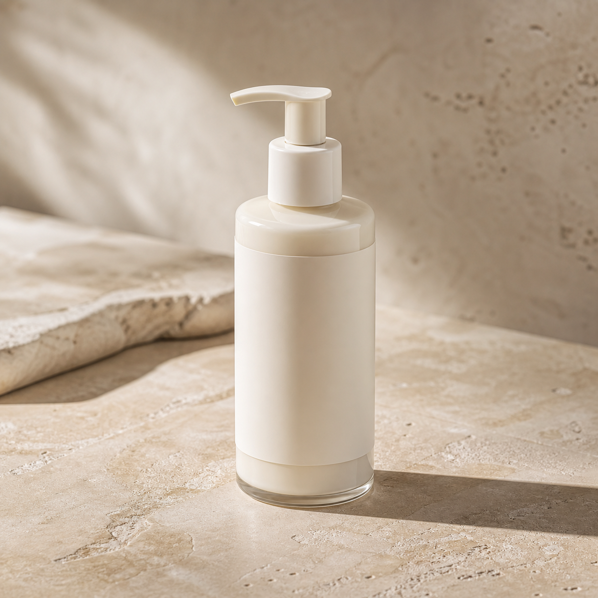</a><br><sub><b>Case 119</b> · <a href="#e-commerce-case-1-cream-skincare-bottle-on-travertine">提示词</a></sub><br><sub><a href="https://github.com/HiAPIAI/awesome-gpt-image-2-prompts">护肤瓶米色石材静物</a> · <a href="https://x.com/hiapi_ai">@hiapi_ai</a></sub></td>
    <td align="center" width="33%" valign="top"><a href="https://www.hiapi.ai/draw?p=QSBzaW5nbGUgY2xlYW4gd2hpdGUtYW5kLW1pbnQgYXRobGV0aWMgc25lYWtlciBmbG9hdGluZyBzbGlnaHRseSBhYm92ZSBhIHNvZnQgcGluay10by1sYXZlbmRlciBwYXN0ZWwgZ3JhZGllbnQgYmFja2dyb3VuZCwgY2FzdGluZyBhIHNtYWxsIHNvZnQgc2hhZG93IGRpcmVjdGx5IGJlbmVhdGggaXQuIFN0dWRpbyBzcGxpdCBsaWdodGluZyB3aXRoIGEgc3VidGxlIHJpbSBoaWdobGlnaHQgb24gdGhlIHVwcGVyIGVkZ2Ugb2YgdGhlIHNob2UuIFNxdWFyZSAxOjEgZS1jb21tZXJjZSBoZXJvIGNvbXBvc2l0aW9uLCBubyBsYWNlcyBmbHlpbmcsIG5vIGxvZ29zLCBubyB0ZXh0IG92ZXJsYXlzLCBubyB3YXRlcm1hcmsuIENyaXNwIHByb2R1Y3QgcGhvdG9ncmFwaHksIHBob3RvcmVhbGlzdGljIGZhYnJpYyBhbmQgcnViYmVyIHRleHR1cmVzLCBtYWdhemluZSBjb3ZlciBxdWFsaXR5Lg%3D%3D&amp;m=gpt-image-2&amp;utm_source=awesome-gpt-image-2-prompts&amp;utm_medium=github_readme&amp;utm_campaign=zh_gallery&amp;s=1%3A1">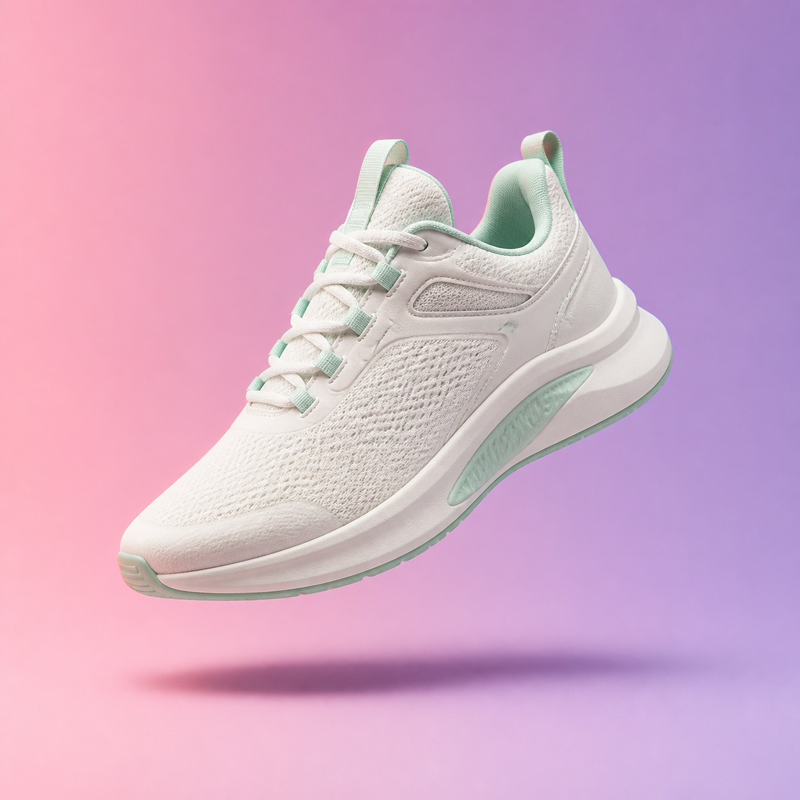</a><br><sub><b>Case 120</b> · <a href="#e-commerce-case-2-floating-sneaker-on-pastel-gradient">提示词</a></sub><br><sub><a href="https://github.com/HiAPIAI/awesome-gpt-image-2-prompts">粉彩渐变悬浮运动鞋</a> · <a href="https://x.com/hiapi_ai">@hiapi_ai</a></sub></td>
    <td align="center" width="33%" valign="top"><a href="https://www.hiapi.ai/draw?p=T3ZlcmhlYWQgdG9wLWRvd24gcGhvdG9ncmFwaCBvZiBhIGJsYWNrIHNsYXRlIHBsYXR0ZXIgaG9sZGluZyBlaWdodCBuZWF0bHkgYXJyYW5nZWQgcGllY2VzIG9mIG5pZ2lyaSBzdXNoaSBhbmQgYSBzbWFsbCBtb3VuZCBvZiBwaW5rIGdpbmdlciBhbmQgd2FzYWJpLCB3aXRoIHR3byBkYXJrIHdvb2RlbiBjaG9wc3RpY2tzIHJlc3RpbmcgYXQgYSBzbGlnaHQgZGlhZ29uYWwgYmVzaWRlIHRoZSBwbGF0dGVyLiBTdXJmYWNlIGlzIGRhcmsgc3RhaW5lZCBvYWsgd2l0aCBzdWJ0bGUgZ3JhaW4uIFdhcm0gdHVuZ3N0ZW4gc3R1ZGlvIGxpZ2h0IGZyb20gYSBzaW5nbGUgc29mdCBib3ggYWJvdmUtbGVmdC4gU3F1YXJlIDE6MSBmcmFtaW5nIHdpdGggZ2VuZXJvdXMgbmVnYXRpdmUgc3BhY2UgYXJvdW5kIHRoZSBwbGF0dGVyLiBObyB0ZXh0LCBubyB3YXRlcm1hcmssIG5vIGNoZWYgaGFuZCB2aXNpYmxlLiBQcmVtaXVtIGZvb2QgcGhvdG9ncmFwaHksIHNoYXJwIGZvY3VzLCBnbG9zc3kgcmljZSBncmFpbnMsIHNveSBjb25kZW5zYXRpb24gZHJvcGxldHMu&amp;m=gpt-image-2&amp;utm_source=awesome-gpt-image-2-prompts&amp;utm_medium=github_readme&amp;utm_campaign=zh_gallery&amp;s=1%3A1">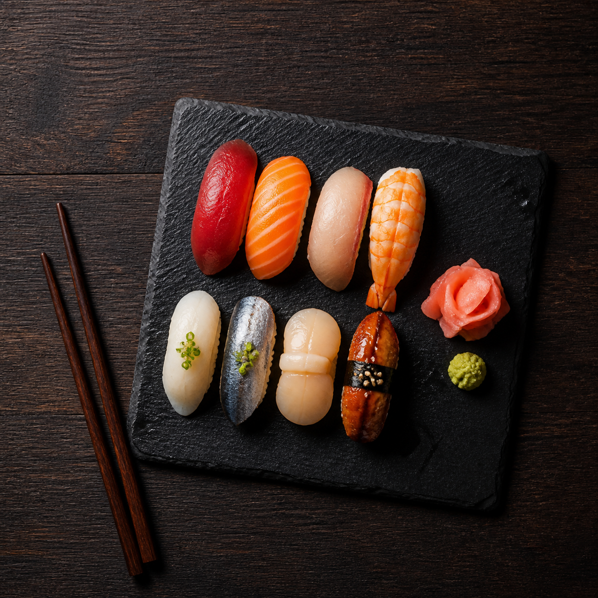</a><br><sub><b>Case 121</b> · <a href="#e-commerce-case-3-sushi-platter-top-down-with-chopsticks">提示词</a></sub><br><sub><a href="https://github.com/HiAPIAI/awesome-gpt-image-2-prompts">寿司拼盘俯拍</a> · <a href="https://x.com/hiapi_ai">@hiapi_ai</a></sub></td>
  </tr>
  <tr>
    <td align="center" width="33%" valign="top"><a href="https://www.hiapi.ai/draw?p=Q2xvc2UtdXAgb2YgYSBzaW5nbGUgc21hbGwgd2hpdGUgcG9yY2VsYWluIGVzcHJlc3NvIGN1cCBmaWxsZWQgd2l0aCBjcmVtYS10b3BwZWQgZXNwcmVzc28sIHJlc3Rpbmcgb24gYSBwb2xpc2hlZCB3aGl0ZSBDYXJyYXJhIG1hcmJsZSBjb3VudGVydG9wLiBBIHNtYWxsIGNsdXN0ZXIgb2Ygcm9hc3RlZCBkYXJrIGNvZmZlZSBiZWFucyBpcyBzY2F0dGVyZWQgdG8gdGhlIGxlZnQgb2YgdGhlIGN1cC4gU29mdCBnb2xkZW4gaG91ciB3aW5kb3cgbGlnaHQgZW50ZXJzIGZyb20gdGhlIHJpZ2h0LCBwcm9kdWNpbmcgYSBzaW5nbGUgc3BlY3VsYXIgaGlnaGxpZ2h0IG9uIHRoZSBjdXAgcmltIGFuZCBnZW50bGUgd2FybSB0b25lcyBhY3Jvc3MgdGhlIG1hcmJsZS4gU3F1YXJlIDE6MSBjb21wb3NpdGlvbiwgbm8gdGV4dCwgbm8gbG9nbywgbm8gd2F0ZXJtYXJrLiBFZGl0b3JpYWwgY2FmZSBicmFuZCBwaG90b2dyYXBoeSwgdWx0cmEgZGV0YWlsZWQgY3JlbWEgYnViYmxlcyBhbmQgYmVhbiB0ZXh0dXJlcy4%3D&amp;m=gpt-image-2&amp;utm_source=awesome-gpt-image-2-prompts&amp;utm_medium=github_readme&amp;utm_campaign=zh_gallery&amp;s=1%3A1"></a><br><sub><b>Case 122</b> · <a href="#e-commerce-case-4-espresso-cup-on-marble-with-beans">提示词</a></sub><br><sub><a href="https://github.com/HiAPIAI/awesome-gpt-image-2-prompts">大理石面浓缩咖啡</a> · <a href="https://x.com/hiapi_ai">@hiapi_ai</a></sub></td>
    <td align="center" width="33%" valign="top"><a href="https://www.hiapi.ai/draw?p=QSBmYWNldGVkIHJlY3Rhbmd1bGFyIGdsYXNzIHBlcmZ1bWUgYm90dGxlIGZpbGxlZCB3aXRoIHBhbGUgYW1iZXIgbGlxdWlkLCBzdGFuZGluZyBvbiBhIGRhcmsgbWF0dGUgc3VyZmFjZSBhZ2FpbnN0IGEgcHVyZSBibGFjayBiYWNrZ3JvdW5kLiBUaHJlZSBjcmlzcCBjdWJpYyBzaGFmdHMgb2Ygd2FybSB3aGl0ZSBsaWdodCBjdXQgZGlhZ29uYWxseSBhY3Jvc3MgdGhlIGJvdHRsZSwgcHJvZHVjaW5nIGhhcmQtZWRnZSByZWZsZWN0aW9ucyBvbiB0aGUgZ2xhc3MgZmFjZXRzIGFuZCBzaGFycCBoaWdobGlnaHRzIG9uIHRoZSBnb2xkIG1ldGFsIGNhcC4gTm8gbGFiZWwsIG5vIGJyYW5kIHRleHQsIG5vIHdhdGVybWFyay4gU3F1YXJlIDE6MSBoZXJvIGNvbXBvc2l0aW9uLCBsdXh1cnkgcHJvZHVjdCBwaG90b2dyYXBoeSwgcGhvdG9yZWFsaXN0aWMgZ2xhc3MgcmVmcmFjdGlvbnMsIHVsdHJhIGRldGFpbGVkLg%3D%3D&amp;m=gpt-image-2&amp;utm_source=awesome-gpt-image-2-prompts&amp;utm_medium=github_readme&amp;utm_campaign=zh_gallery&amp;s=1%3A1">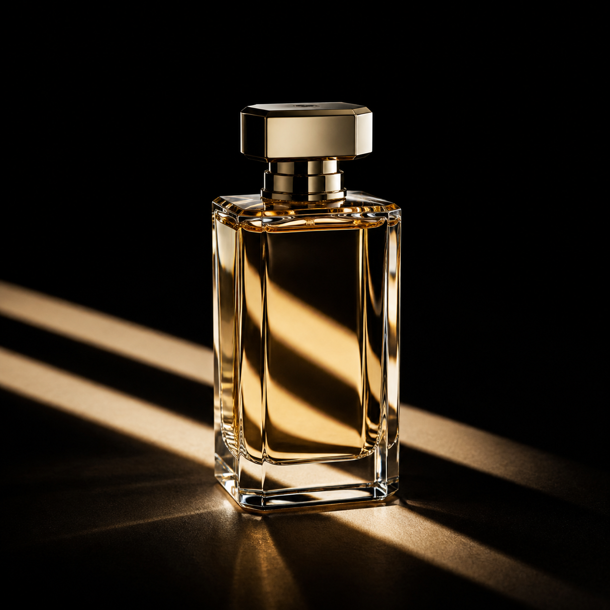</a><br><sub><b>Case 123</b> · <a href="#e-commerce-case-5-perfume-bottle-in-cubic-light-shafts">提示词</a></sub><br><sub><a href="https://github.com/HiAPIAI/awesome-gpt-image-2-prompts">几何光束香水瓶</a> · <a href="https://x.com/hiapi_ai">@hiapi_ai</a></sub></td>
    <td align="center" width="33%" valign="top"><a href="https://www.hiapi.ai/draw?p=QSBwYWlyIG9mIHNtYWxsIHdoaXRlIHdpcmVsZXNzIGVhcmJ1ZHMgcmVzdGluZyBvbiBhIG5lYXRseSBmb2xkZWQgc29mdCBiZWlnZSB0ZXJyeSB0b3dlbCwgd2l0aCB0aGVpciBjaGFyZ2luZyBjYXNlIG9wZW4gYmVoaW5kIHRoZW0gc2hvd2luZyBhIHNpbmdsZSBMRUQgZG90LiBCYWNrZ3JvdW5kIGlzIGEgY2xlYW4gb2ZmLXdoaXRlIHRleHR1cmVkIHdhbGwuIFNvZnQgZGlmZnVzZSBzdHVkaW8gbGlnaHQgZnJvbSBhYm92ZSBhbmQgc2xpZ2h0bHkgZnJvbnQuIEFwcGxlLXN0eWxlIG1pbmltYWwgcHJvZHVjdCBwaG90b2dyYXBoeS4gU3F1YXJlIDE6MSBjb21wb3NpdGlvbiwgbm8gdGV4dCwgbm8gbG9nbyBvbiB0aGUgZWFyYnVkcywgbm8gd2F0ZXJtYXJrLCBubyBoYW5kcy4gVWx0cmEgc2hhcnAgZm9jdXMsIHBob3RvcmVhbGlzdGljIGZhYnJpYyBhbmQgcGxhc3RpYyB0ZXh0dXJlcy4%3D&amp;m=gpt-image-2&amp;utm_source=awesome-gpt-image-2-prompts&amp;utm_medium=github_readme&amp;utm_campaign=zh_gallery&amp;s=1%3A1">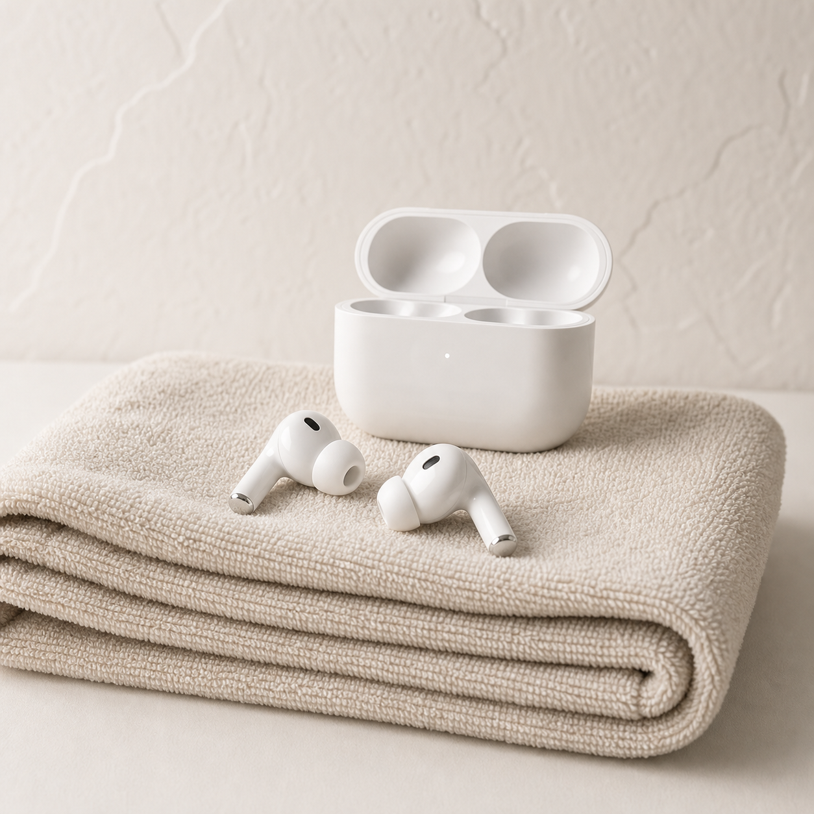</a><br><sub><b>Case 124</b> · <a href="#e-commerce-case-6-wireless-earbuds-on-folded-towel">提示词</a></sub><br><sub><a href="https://github.com/HiAPIAI/awesome-gpt-image-2-prompts">无线耳机折叠毛巾</a> · <a href="https://x.com/hiapi_ai">@hiapi_ai</a></sub></td>
  </tr>
  <tr>
    <td align="center" width="33%" valign="top"><a href="https://www.hiapi.ai/draw?p=QSBzdGFjayBvZiB0aHJlZSBwcmVtaXVtIGhvbGlkYXkgZ2lmdCBib3hlcyB3cmFwcGVkIGluIGRlZXAgZm9yZXN0IGdyZWVuIGFuZCBidXJndW5keSByZWQgcGFwZXJzLCBlYWNoIHRpZWQgd2l0aCBhIHRoaW4gZ29sZCBzYXRpbiByaWJib24gYW5kIGEgc21hbGwgZnJlc2ggcGluZSBzcHJpZyB0dWNrZWQgaW50byB0aGUgYm93LiBCYWNrZ3JvdW5kIGlzIGEgc29mdGx5IGJsdXJyZWQgd2FybSBpbnRlcmlvciB3aXRoIGJva2VoIGZhaXJ5IGxpZ2h0cy4gVG9wLWZyb250IHRocmVlLXF1YXJ0ZXIgYW5nbGUsIDQ6MyBob3Jpem9udGFsIGNvbXBvc2l0aW9uLiBTb2Z0IHdpbmRvdyBsaWdodCBmcm9tIHRoZSBsZWZ0LCBnZW50bGUgd2FybSBoaWdobGlnaHRzLiBObyB0ZXh0LCBubyBuYW1lIHRhZ3MsIG5vIGJyYW5kIGxvZ29zLCBubyB3YXRlcm1hcmsuIFByZW1pdW0gc2Vhc29uYWwgcmV0YWlsIHBob3RvZ3JhcGh5LCB1bHRyYSBkZXRhaWxlZCBwYXBlciB0ZXh0dXJlLCBzaGFycCByaWJib24gd2VhdmUu&amp;m=gpt-image-2&amp;utm_source=awesome-gpt-image-2-prompts&amp;utm_medium=github_readme&amp;utm_campaign=zh_gallery&amp;s=4%3A3"></a><br><sub><b>Case 125</b> · <a href="#e-commerce-case-7-holiday-gift-box-stack">提示词</a></sub><br><sub><a href="https://github.com/HiAPIAI/awesome-gpt-image-2-prompts">节日礼盒堆叠</a> · <a href="https://x.com/hiapi_ai">@hiapi_ai</a></sub></td>
    <td align="center" width="33%" valign="top"><a href="https://www.hiapi.ai/draw?p=VG9wLWRvd24gcHJvZHVjdCBzaG90IG9mIGZpdmUgb3BlbiBsaXBzdGljayBidWxsZXRzIGluIGEgY2xlYW4gaG9yaXpvbnRhbCByb3cgb24gYSBkZWVwIGJ1cmd1bmR5IHZlbHZldCB0cmF5LiBUaGUgbGlwc3RpY2sgc2hhZGVzIHJhbmdlIGZyb20gc29mdCBudWRlIHBpbmsgdGhyb3VnaCBjb3JhbCwgY2xhc3NpYyByZWQsIHBsdW0sIHRvIGRlZXAgd2luZSwgZWFjaCB0dWJlIGdsb3NzeSBibGFjayBtZXRhbCB3aXRoIGEgdGhpbiBnb2xkIGJhbmQuIFNvZnQgZGlyZWN0aW9uYWwgc3R1ZGlvIGxpZ2h0IGZyb20gdGhlIHVwcGVyIGxlZnQsIGdlbnRsZSBldmVuIHNoYWRvd3MgdW5kZXIgZWFjaCB0dWJlLiBTcXVhcmUgMToxIGNvbXBvc2l0aW9uLCBubyBicmFuZCB0ZXh0LCBubyB3YXRlcm1hcmssIG1hZ2F6aW5lIGJlYXV0eSBlZGl0b3JpYWwgc3R5bGluZy4gVWx0cmEgZGV0YWlsZWQgZmFicmljIHBpbGUsIHNoYXJwIGxpcHN0aWNrIGVkZ2VzLg%3D%3D&amp;m=gpt-image-2&amp;utm_source=awesome-gpt-image-2-prompts&amp;utm_medium=github_readme&amp;utm_campaign=zh_gallery&amp;s=1%3A1">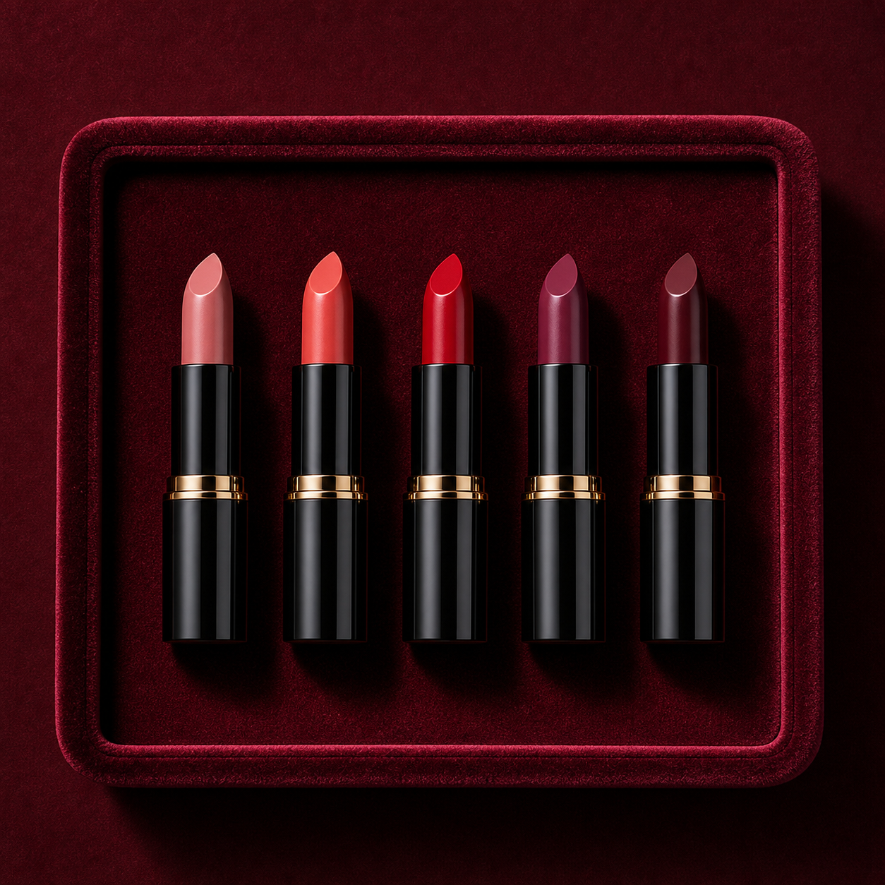</a><br><sub><b>Case 126</b> · <a href="#e-commerce-case-8-lipstick-lineup-on-velvet-tray">提示词</a></sub><br><sub><a href="https://github.com/HiAPIAI/awesome-gpt-image-2-prompts">丝绒托盘口红阵列</a> · <a href="https://x.com/hiapi_ai">@hiapi_ai</a></sub></td>
    <td align="center" width="33%" valign="top"><a href="https://www.hiapi.ai/draw?p=QSBwYWxlIG9hdG1lYWwgbGluZW4gc2hpcnQgbmVhdGx5IGZvbGRlZCBpbnRvIGEgY2xlYW4gcmVjdGFuZ2xlLCBwaG90b2dyYXBoZWQgZnJvbSBkaXJlY3RseSBhYm92ZSBvbiBhIHJ1c3RpYyBsaWdodCBvYWsgd29vZGVuIHRhYmxldG9wLiBCZXNpZGUgaXQgYSBzbWFsbCBzcHJpZyBvZiBkcmllZCBsYXZlbmRlciBhbmQgb25lIHRvcnRvaXNlc2hlbGwgYnV0dG9uLiBTb2Z0IGRpZmZ1c2UgbmF0dXJhbCB3aW5kb3cgbGlnaHQgZnJvbSB0aGUgdXBwZXIgbGVmdC4gTXVqaS1zdHlsZSBtaW5pbWFsaXN0IGZsYXQtbGF5LCA0OjMgaG9yaXpvbnRhbCBjb21wb3NpdGlvbiwgbm8gdGV4dCwgbm8gYnJhbmQgbGFiZWwgdmlzaWJsZSwgbm8gd2F0ZXJtYXJrLiBTaGFycCBsaW5lbiB3ZWF2ZSB0ZXh0dXJlLCBzdWJ0bGUgd29vZCBncmFpbiwgY2FsbSBlZGl0b3JpYWwgbW9vZC4%3D&amp;m=gpt-image-2&amp;utm_source=awesome-gpt-image-2-prompts&amp;utm_medium=github_readme&amp;utm_campaign=zh_gallery&amp;s=4%3A3">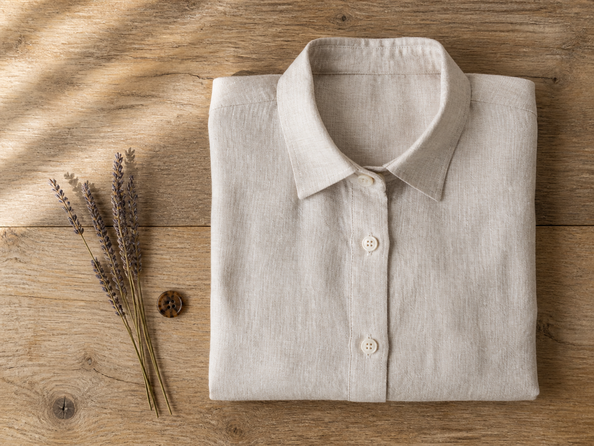</a><br><sub><b>Case 127</b> · <a href="#e-commerce-case-9-linen-shirt-folded-on-wood-surface">提示词</a></sub><br><sub><a href="https://github.com/HiAPIAI/awesome-gpt-image-2-prompts">亚麻衬衫木面折叠</a> · <a href="https://x.com/hiapi_ai">@hiapi_ai</a></sub></td>
  </tr>
  <tr>
    <td align="center" width="33%" valign="top"><a href="https://www.hiapi.ai/draw?p=QSBzaW5nbGUgbWF0dGUgY3JlYW0gY2VyYW1pYyBtdWcgZmlsbGVkIHdpdGggaG90IGJsYWNrIGNvZmZlZSwgd2l0aCBkZWxpY2F0ZSB2aXNpYmxlIHN0ZWFtIGN1cmxpbmcgdXB3YXJkIGFnYWluc3QgYSBzb2Z0bHkgYmx1cnJlZCB3YXJtLWdyZXkgZGVzayBzY2VuZSB3aXRoIGEgY2xvc2VkIG5vdGVib29rIGFuZCBhIHNtYWxsIGdyZWVuIHBsYW50LiBTaWRlIHRocmVlLXF1YXJ0ZXIgYW5nbGUsIHNvZnQgd2luZG93IGxpZ2h0IGZyb20gdGhlIHJpZ2h0LiBOb3Rpb24tc3R5bGUgbWluaW1hbGlzdCBTYWFTIGxpZmVzdHlsZSBwaG90b2dyYXBoeSwgc3F1YXJlIDE6MSBjb21wb3NpdGlvbi4gTm8gdGV4dCBvbiB0aGUgbXVnLCBubyBicmFuZCBsb2dvLCBubyB3YXRlcm1hcmsuIFBob3RvcmVhbGlzdGljLCBzaGFycCBmb2N1cyBvbiB0aGUgcmltIGFuZCBzdGVhbSwgZ2VudGxlIGJva2VoIGJhY2tncm91bmQu&amp;m=gpt-image-2&amp;utm_source=awesome-gpt-image-2-prompts&amp;utm_medium=github_readme&amp;utm_campaign=zh_gallery&amp;s=1%3A1"></a><br><sub><b>Case 128</b> · <a href="#e-commerce-case-10-ceramic-mug-with-steam">提示词</a></sub><br><sub><a href="https://github.com/HiAPIAI/awesome-gpt-image-2-prompts">陶瓷马克杯热气</a> · <a href="https://x.com/hiapi_ai">@hiapi_ai</a></sub></td>
    <td align="center" width="33%" valign="top"><a href="https://www.hiapi.ai/draw?p=SGFsZi1ib2R5IGVkaXRvcmlhbCBmYXNoaW9uIHBob3RvZ3JhcGggb2YgYSB5b3VuZyBFYXN0IEFzaWFuIHdvbWFuIGluIGhlciBsYXRlIHR3ZW50aWVzLCB3ZWFyaW5nIGFuIG92ZXJzaXplZCBuYXR1cmFsLWNvbG9yIGxpbmVuIGJsYXplciBvdmVyIGEgcGxhaW4gd2hpdGUgdGVlLCBoYW5kcyByZWxheGVkIGF0IGhlciBzaWRlcy4gU3RhbmRpbmcgYWdhaW5zdCBhIHN1bi13YXJtZWQgcGFsZSBiZWlnZSB3YWxsLCBnb2xkZW4gaG91ciBzaWRlIGxpZ2h0IGZyb20gdGhlIGxlZnQgY2FzdHMgYSBzb2Z0IGxvbmcgc2hhZG93LiBOYXR1cmFsIG1pbmltYWwgbWFrZXVwLCBoYWlyIGxvb3NlbHkgdHVja2VkIGJlaGluZCBvbmUgZWFyLiBWZXJ0aWNhbCA5OjE2IGNvbXBvc2l0aW9uLCBoZWFkIGNyb3Agc2xpZ2h0bHkgYWJvdmUgdGhlIGV5ZXMsIG5vIHRleHQsIG5vIGJyYW5kIGxhYmVsIHZpc2libGUgb24gdGhlIGJsYXplciwgbm8gd2F0ZXJtYXJrLiBQaG90b3JlYWxpc3RpYywgc3VidGxlIGZpbG0gZ3JhaW4sIG1hZ2F6aW5lIHRyeS1vbiBwaG90b2dyYXBoeSBxdWFsaXR5Lg%3D%3D&amp;m=gpt-image-2&amp;utm_source=awesome-gpt-image-2-prompts&amp;utm_medium=github_readme&amp;utm_campaign=zh_gallery&amp;s=9%3A16">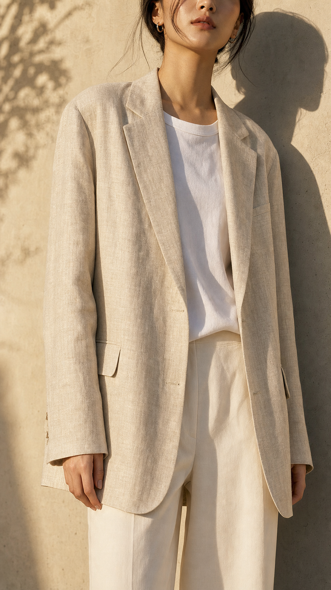</a><br><sub><b>Case 129</b> · <a href="#e-commerce-case-11-linen-blazer-try-on-half-body">提示词</a></sub><br><sub><a href="https://github.com/HiAPIAI/awesome-gpt-image-2-prompts">亚麻西装外套试穿</a> · <a href="https://x.com/hiapi_ai">@hiapi_ai</a></sub></td>
    <td align="center" width="33%" valign="top"><a href="https://www.hiapi.ai/draw?p=RnVsbC1ib2R5IGVkaXRvcmlhbCBwaG90b2dyYXBoIG9mIGEgeW91bmcgcGVyc29uIHN0YW5kaW5nIGFnYWluc3QgYSBuZXV0cmFsIGNvb2wtZ3JleSBjb25jcmV0ZSB3YWxsLCB3ZWFyaW5nIGEgc2xpZ2h0bHkgb3ZlcnNpemVkIHdhc2hlZCBpbmRpZ28gdmludGFnZSBkZW5pbSBqYWNrZXQgb3ZlciBhIHBsYWluIGNyZWFtIGNvdHRvbiB0LXNoaXJ0IGFuZCBzdHJhaWdodC1sZWcgbGlnaHQgd2FzaCBqZWFucywgc2ltcGxlIHdoaXRlIGxlYXRoZXIgc25lYWtlcnMuIEhhbmRzIHR1Y2tlZCBsb29zZWx5IGluIHRoZSBmcm9udCBqYWNrZXQgcG9ja2V0cywgcmVsYXhlZCBuYXR1cmFsIHBvc3R1cmUsIG1pbGQgY2FuZGlkIGV4cHJlc3Npb24uIERpZmZ1c2Ugb3ZlcmNhc3QgZGF5bGlnaHQsIHZlcnRpY2FsIDk6MTYgY29tcG9zaXRpb24sIGhlYWQgZnVsbHkgdmlzaWJsZSwgZmVldCB2aXNpYmxlIGF0IHRoZSBib3R0b20uIE5vIHRleHQsIG5vIGJyYW5kIHBhdGNoZXMgdmlzaWJsZSwgbm8gd2F0ZXJtYXJrLiBTdWJ0bGUgZmlsbSBncmFpbiwgcGhvdG9yZWFsaXN0aWMgZGVuaW0gdGV4dHVyZSwgZWRpdG9yaWFsIGZhc2hpb24gY2F0YWxvZ3VlIHF1YWxpdHku&amp;m=gpt-image-2&amp;utm_source=awesome-gpt-image-2-prompts&amp;utm_medium=github_readme&amp;utm_campaign=zh_gallery&amp;s=9%3A16">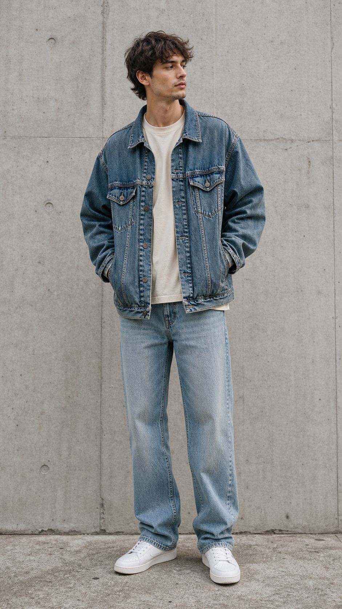</a><br><sub><b>Case 130</b> · <a href="#e-commerce-case-12-vintage-denim-jacket-try-on">提示词</a></sub><br><sub><a href="https://github.com/HiAPIAI/awesome-gpt-image-2-prompts">复古牛仔外套试穿</a> · <a href="https://x.com/hiapi_ai">@hiapi_ai</a></sub></td>
  </tr>
  <tr>
    <td align="center" width="33%" valign="top"><a href="https://www.hiapi.ai/draw?p=QSBzaW5nbGUgbWF0dGUga3JhZnQtcGFwZXItd3JhcHBlZCB2ZWdhbiBzbmFjayBiYXIgcmVzdGluZyBvbiBhIHJ1c3RpYyB3b29kZW4gc2xhdCBzdXJmYWNlLCB3aXRoIGEgc21hbGwgc2NhdHRlciBvZiByYXcgYWxtb25kcywgZGFyayBjaG9jb2xhdGUgY2h1bmtzLCBkcmllZCBjcmFuYmVycmllcyBhbmQgb2F0IGZsYWtlcyBhcm91bmQgaXQuIFNvZnQgd2FybSBuYXR1cmFsIGxpZ2h0IGZyb20gdGhlIHVwcGVyIHJpZ2h0LCBnZW50bGUgbG9uZyBzaGFkb3cgb24gdGhlIHdvb2QgZ3JhaW4uIFNxdWFyZSAxOjEgaGVybyBjb21wb3NpdGlvbiwgdG9wLXRocmVlLXF1YXJ0ZXIgYW5nbGUuIE5vIGJyYW5kIHRleHQgb24gdGhlIHdyYXBwZXIsIG5vIGxvZ29zLCBubyB3YXRlcm1hcmsuIFByZW1pdW0gaGVhbHRoeSBmb29kIHByb2R1Y3QgcGhvdG9ncmFwaHksIHVsdHJhIGRldGFpbGVkIHBhcGVyIHRleHR1cmUsIGNyaXNwIGluZ3JlZGllbnQgZGV0YWlsLCBtYWdhemluZSBjb3ZlciBxdWFsaXR5Lg%3D%3D&amp;m=gpt-image-2&amp;utm_source=awesome-gpt-image-2-prompts&amp;utm_medium=github_readme&amp;utm_campaign=zh_gallery&amp;s=1%3A1"></a><br><sub><b>Case 131</b> · <a href="#e-commerce-case-13-vegan-snack-bar-hero-on-wood-slat">提示词</a></sub><br><sub><a href="https://github.com/HiAPIAI/awesome-gpt-image-2-prompts">纯素能量棒木板特写</a> · <a href="https://x.com/hiapi_ai">@hiapi_ai</a></sub></td>
    <td align="center" width="33%" valign="top"><a href="https://www.hiapi.ai/draw?p=QSB0YWxsIHNxdWFyZS1zaG91bGRlcmVkIGFtYmVyIHdoaXNreSBib3R0bGUgd2l0aCBhIGJsYWNrIHdheC1zZWFsZWQgdG9wLCBzdGFuZGluZyBvbiBhIHBvbGlzaGVkIGRhcmsgd2FsbnV0IGJhciBjb3VudGVyLiBTaW5nbGUgd2FybSB0dW5nc3RlbiBiYWNrLWxpZ2h0IHByb2R1Y2VzIGEgc29mdCBoYWxvIGJlaGluZCB0aGUgYm90dGxlIGFuZCBhIHN1YnRsZSByZWZsZWN0aW9uIG9uIHRoZSBjb3VudGVyLiBCYWNrZ3JvdW5kIGlzIGEgZGVlcGx5IGJsdXJyZWQgZGFyayB3b29kIGFuZCBicmFzcyBiYXIgaW50ZXJpb3Igd2l0aCBnb2xkZW4gYm9rZWguIE5vIHRleHQgb24gdGhlIGxhYmVsLCBubyBicmFuZCBtYXJrLCBubyB3YXRlcm1hcmsuIFNxdWFyZSAxOjEgbHV4dXJ5IHNwaXJpdHMgcHJvZHVjdCBwaG90b2dyYXBoeSwgbW9vZHkgbG93LWtleSBsaWdodGluZywgcGhvdG9yZWFsaXN0aWMgZ2xhc3MgYW5kIGxpcXVpZCByZWZyYWN0aW9uLg%3D%3D&amp;m=gpt-image-2&amp;utm_source=awesome-gpt-image-2-prompts&amp;utm_medium=github_readme&amp;utm_campaign=zh_gallery&amp;s=1%3A1"></a><br><sub><b>Case 132</b> · <a href="#e-commerce-case-14-whisky-bottle-on-dark-bar-with-bokeh">提示词</a></sub><br><sub><a href="https://github.com/HiAPIAI/awesome-gpt-image-2-prompts">暗调酒吧威士忌特写</a> · <a href="https://x.com/hiapi_ai">@hiapi_ai</a></sub></td>
    <td align="center" width="33%" valign="top"><a href="https://www.hiapi.ai/draw?p=QSBmcm9zdGVkIGdsYXNzIGJvdHRsZSBvZiBkYXJrIGNvbGQgYnJldyBjb2ZmZWUgaGFsZi1zdWJtZXJnZWQgaW4gYSBzaGFsbG93IHN0YWlubGVzcyBzdGVlbCBib3dsIGZpbGxlZCB3aXRoIGNydXNoZWQgaWNlIGFuZCBhIGZldyB2aXNpYmxlIHdhdGVyIGRyb3BsZXRzIHJ1bm5pbmcgZG93biB0aGUgYm90dGxlLiBDb29sIGJsdWUgZGF5bGlnaHQgZnJvbSBhYm92ZSwgcmVmcmVzaGluZyBzdW1tZXIgbW9vZCwgc3F1YXJlIDE6MSBjb21wb3NpdGlvbi4gQmFja2dyb3VuZCBpcyBhIHNvZnQgYmx1cnJlZCBjb29sIGdyZXkgY29uY3JldGUgc3VyZmFjZS4gTm8gYnJhbmQgdGV4dCBvbiB0aGUgYm90dGxlLCBubyBsb2dvLCBubyB3YXRlcm1hcmsuIFBob3RvcmVhbGlzdGljIGNvbmRlbnNhdGlvbiBkcm9wbGV0cywgc2hhcnAgaWNlIHRleHR1cmUsIHByZW1pdW0gYmV2ZXJhZ2UgcHJvZHVjdCBwaG90b2dyYXBoeS4%3D&amp;m=gpt-image-2&amp;utm_source=awesome-gpt-image-2-prompts&amp;utm_medium=github_readme&amp;utm_campaign=zh_gallery&amp;s=1%3A1"></a><br><sub><b>Case 133</b> · <a href="#e-commerce-case-15-cold-brew-bottle-in-ice-bath">提示词</a></sub><br><sub><a href="https://github.com/HiAPIAI/awesome-gpt-image-2-prompts">冰镇冷萃咖啡瓶</a> · <a href="https://x.com/hiapi_ai">@hiapi_ai</a></sub></td>
  </tr>
  <tr>
    <td align="center" width="33%" valign="top"><a href="https://www.hiapi.ai/draw?p=QSBzbWFsbCBtYXR0ZSBzYWdlLWdyZWVuIGFsdW1pbml1bSBoYW5kIGNyZWFtIHR1YmUgbHlpbmcgb24gYSBjbGVhbiBvZmYtd2hpdGUgbGluZW4gc3VyZmFjZSwgd2l0aCBvbmUgZnJlc2ggZXVjYWx5cHR1cyBzcHJpZyBsYWlkIGRpYWdvbmFsbHkgYmVzaWRlIGl0LiBTb2Z0IGRpZmZ1c2UgZGF5bGlnaHQgZnJvbSBhYm92ZSwgZ2VudGxlIHNoYWRvd3MuIFNxdWFyZSAxOjEgbWluaW1hbCBuYXR1cmFsIGNvc21ldGljcyBwcm9kdWN0IHBob3RvZ3JhcGh5LiBObyBicmFuZCB0ZXh0IG9uIHRoZSB0dWJlLCBubyBsb2dvLCBubyB3YXRlcm1hcmsuIFBob3RvcmVhbGlzdGljIG1ldGFsIGFuZCBmYWJyaWMgdGV4dHVyZXMsIG1hZ2F6aW5lIGJlYXV0eSBlZGl0b3JpYWwgc3R5bGluZy4%3D&amp;m=gpt-image-2&amp;utm_source=awesome-gpt-image-2-prompts&amp;utm_medium=github_readme&amp;utm_campaign=zh_gallery&amp;s=1%3A1">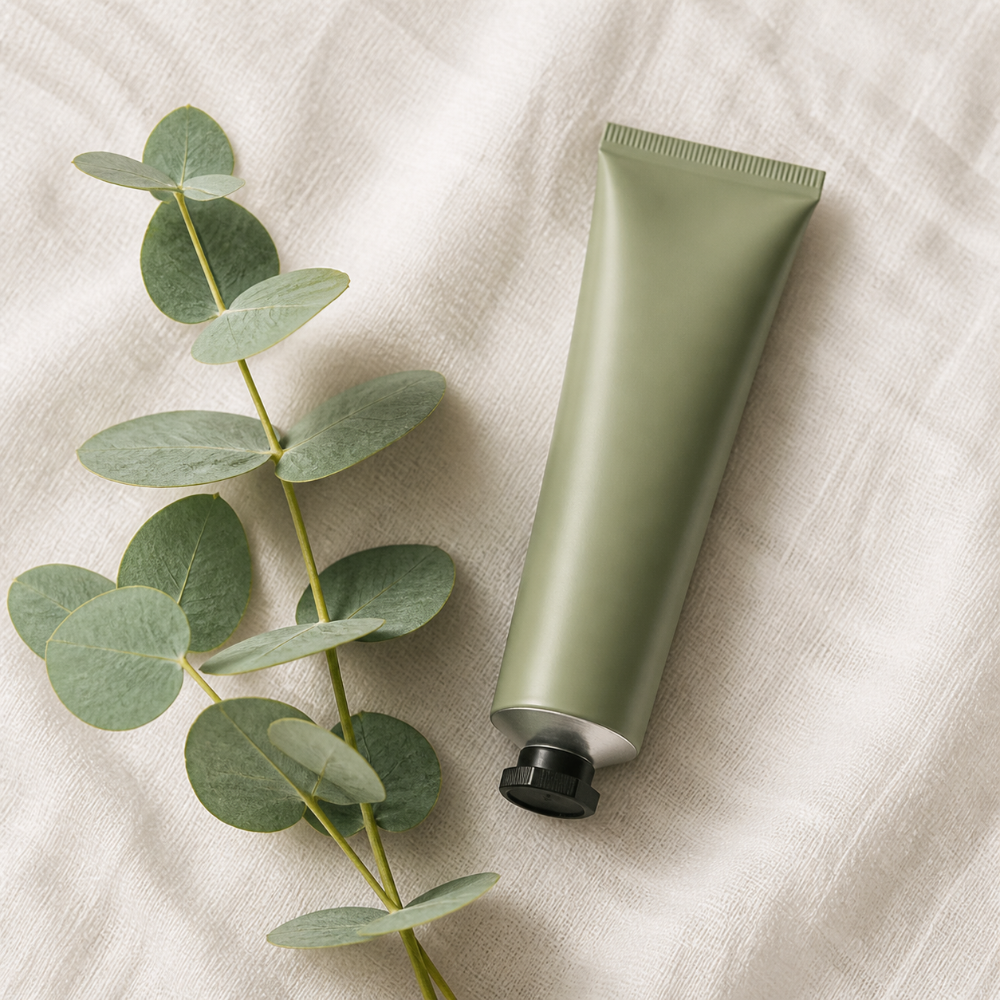</a><br><sub><b>Case 134</b> · <a href="#e-commerce-case-16-hand-cream-tube-with-botanical-sprig">提示词</a></sub><br><sub><a href="https://github.com/HiAPIAI/awesome-gpt-image-2-prompts">护手霜植物枝</a> · <a href="https://x.com/hiapi_ai">@hiapi_ai</a></sub></td>
    <td align="center" width="33%" valign="top"><a href="https://www.hiapi.ai/draw?p=Q2xvc2UtdXAgcHJvZHVjdCBwaG90b2dyYXBoIG9mIGEgc2xlZWsgYmxhY2sgc21hcnR3YXRjaCB3aXRoIGEgY2xlYW4gZGlnaXRhbCB3YXRjaGZhY2Ugc2hvd2luZyBhIGdlbmVyaWMgc3RlcCBjb3VudCBpbnRlcmZhY2UsIHdvcm4gb24gYSBmb3JlYXJtIHdpdGggYSBjYXN1YWwgb3V0ZG9vciBvbGl2ZS1ncmVlbiBqYWNrZXQgc2xlZXZlIHB1c2hlZCB1cC4gQmFja2dyb3VuZCBpcyBhIHNvZnRseSBibHVycmVkIGZvcmVzdCBpbiBnb2xkZW4gYXV0dW1uIGxpZ2h0IHdpdGggd2FybSBib2tlaC4gU3F1YXJlIDE6MSBsaWZlc3R5bGUgaGVybyBjb21wb3NpdGlvbiwgc2hhcnAgZm9jdXMgb24gdGhlIHdhdGNoIGZhY2UuIE5vIGJyYW5kIGxvZ28sIG5vIHNwZWNpZmljIGFwcCBuYW1lLCBubyB3YXRlcm1hcmsuIFBob3RvcmVhbGlzdGljIHNraW4gYW5kIG1ldGFsIHRleHR1cmVzLCBvdXRkb29yIGxpZmVzdHlsZSBwaG90b2dyYXBoeSBxdWFsaXR5Lg%3D%3D&amp;m=gpt-image-2&amp;utm_source=awesome-gpt-image-2-prompts&amp;utm_medium=github_readme&amp;utm_campaign=zh_gallery&amp;s=1%3A1">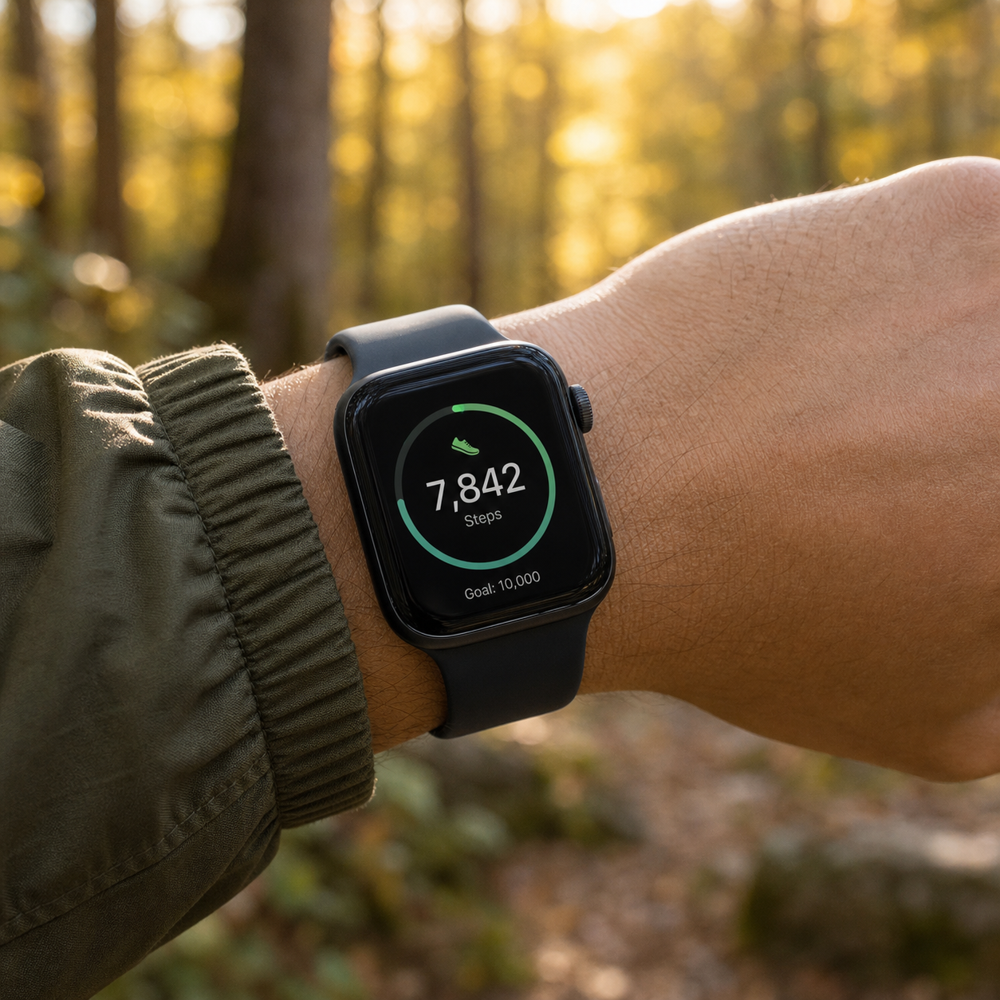</a><br><sub><b>Case 135</b> · <a href="#e-commerce-case-17-smartwatch-on-wrist-with-forest-bokeh">提示词</a></sub><br><sub><a href="https://github.com/HiAPIAI/awesome-gpt-image-2-prompts">森林背景智能手表</a> · <a href="https://x.com/hiapi_ai">@hiapi_ai</a></sub></td>
    <td align="center" width="33%" valign="top"><a href="https://www.hiapi.ai/draw?p=VG9wLWRvd24gdmlldyBvZiBhbiBvcGVuIHByZW1pdW0gTWlkLUF1dHVtbiBGZXN0aXZhbCBtb29uY2FrZSBnaWZ0IGJveCwgZGVlcCBjcmltc29uIGxhY3F1ZXJlZCBleHRlcmlvciB3aXRoIHN1YnRsZSBnb2xkIGNsb3VkIHBhdHRlcm5zIGVtYm9zc2VkIG9uIHRoZSBsaWQsIGludGVyaW9yIHRyYXkgc2hvd2luZyBmb3VyIG5lYXRseSBhcnJhbmdlZCByb3VuZCBtb29uY2FrZXMgd2l0aCBpbnRyaWNhdGUgZmxvd2VyIHBhdHRlcm5zIG9uIHRvcC4gQSBzaW5nbGUgc3ByaWcgb2YgZnJlc2ggb3NtYW50aHVzIGJsb3Nzb20gcmVzdHMgYmVzaWRlIHRoZSBib3guIFNvZnQgd2FybSBvdmVyaGVhZCBsaWdodCwgc3F1YXJlIDE6MSBjb21wb3NpdGlvbi4gTm8gYnJhbmQgdGV4dCwgbm8gY2FsbGlncmFwaHkgbG9nbywgbm8gd2F0ZXJtYXJrLiBQcmVtaXVtIHRyYWRpdGlvbmFsIENoaW5lc2Ugc2Vhc29uYWwgcHJvZHVjdCBwaG90b2dyYXBoeSwgcGhvdG9yZWFsaXN0aWMgbGFjcXVlciBzaGVlbiBhbmQgcGFzdHJ5IHRleHR1cmUu&amp;m=gpt-image-2&amp;utm_source=awesome-gpt-image-2-prompts&amp;utm_medium=github_readme&amp;utm_campaign=zh_gallery&amp;s=1%3A1">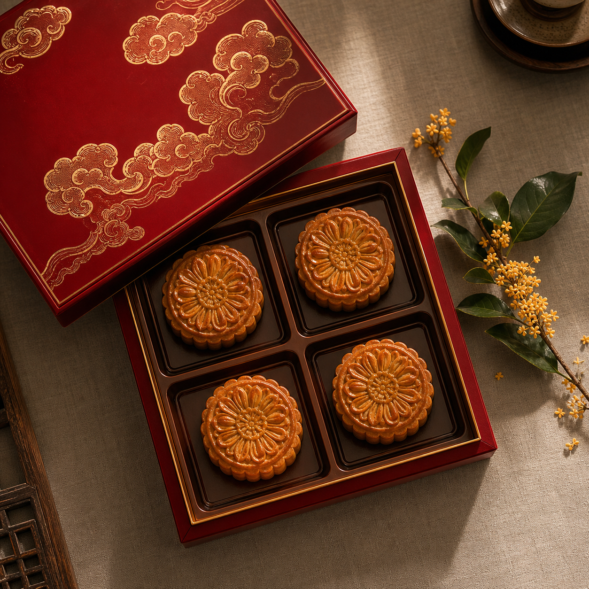</a><br><sub><b>Case 136</b> · <a href="#e-commerce-case-18-mooncake-gift-box-open-reveal">提示词</a></sub><br><sub><a href="https://github.com/HiAPIAI/awesome-gpt-image-2-prompts">月饼礼盒开启展示</a> · <a href="https://x.com/hiapi_ai">@hiapi_ai</a></sub></td>
  </tr>
  <tr>
    <td align="center" width="33%" valign="top"><a href="https://www.hiapi.ai/draw?p=QSByb3VuZCBtYXR0ZSBibGFjayBwcmVtaXVtIHRlYSB0aW4gcmVzdGluZyBvbiBhIHNtb290aCBncmV5IGNvbmNyZXRlIHRhYmxldG9wLCB3aXRoIGEgc21hbGwgRWFzdGVybiBtaW5pbWFsaXN0IGNlcmFtaWMgdGVhcG90IGluIHJhdyBzdG9uZXdhcmUgZ2xhemUgYW5kIG9uZSBzbWFsbCBjZWxhZG9uIGN1cCBiZXNpZGUgaXQuIEEgdGhpbiBjdXJsIG9mIHN0ZWFtIHJpc2VzIGZyb20gdGhlIGN1cC4gU29mdCBkaXJlY3Rpb25hbCBkYXlsaWdodCBmcm9tIHRoZSB1cHBlciBsZWZ0LCBnZW5lcm91cyBuZWdhdGl2ZSBzcGFjZSwgc3F1YXJlIDE6MSBjb21wb3NpdGlvbi4gTm8gYnJhbmQgdGV4dCBvbiB0aGUgdGluLCBubyBsb2dvLCBubyB3YXRlcm1hcmsuIFBob3RvcmVhbGlzdGljIGNlcmFtaWMgYW5kIG1ldGFsIHRleHR1cmVzLCBjYWxtIHplbiBicmFuZCBwaG90b2dyYXBoeSBxdWFsaXR5Lg%3D%3D&amp;m=gpt-image-2&amp;utm_source=awesome-gpt-image-2-prompts&amp;utm_medium=github_readme&amp;utm_campaign=zh_gallery&amp;s=1%3A1">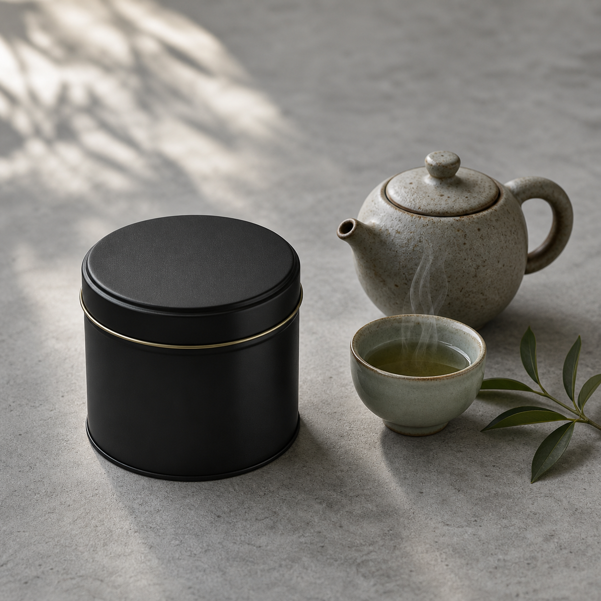</a><br><sub><b>Case 137</b> · <a href="#e-commerce-case-19-premium-tea-tin-lifestyle">提示词</a></sub><br><sub><a href="https://github.com/HiAPIAI/awesome-gpt-image-2-prompts">高端茶罐生活方式</a> · <a href="https://x.com/hiapi_ai">@hiapi_ai</a></sub></td>
    <td align="center" width="33%" valign="top"><a href="https://www.hiapi.ai/draw?p=VG9wLWRvd24gZmxhdC1sYXkgb2YgYSBuZWF0bHkgb3JnYW5pc2VkIGJhY2stdG8tc2Nob29sIHN0YXRpb25lcnkgYnVuZGxlIG9uIGEgY2xlYW4gcGFzdGVsIHBpbmsgc3VyZmFjZTogb25lIGNyZWFtIGxpbmVuLWJvdW5kIG5vdGVib29rLCBvbmUgc2xpbSBibGFjayBmb3VudGFpbiBwZW4sIHR3byB3b29kZW4gcGVuY2lscywgYSBzbWFsbCBicmFzcyBwYXBlciBjbGlwLCBhIHBhbGUgZ3JleSBlcmFzZXIsIGFuZCBhIHNtYWxsIGJ1bmNoIG9mIGRyaWVkIGJhYnkncyBicmVhdGggaW4gdGhlIHVwcGVyIGNvcm5lci4gU29mdCBkaWZmdXNlIG92ZXJoZWFkIGRheWxpZ2h0LiBTcXVhcmUgMToxIGNvbXBvc2l0aW9uLCBvcmdhbmlzZWQgZ3JpZCBhcnJhbmdlbWVudC4gTm8gYnJhbmQgdGV4dCBvbiBhbnkgaXRlbSwgbm8gbG9nb3MsIG5vIHdhdGVybWFyay4gTWFnYXppbmUgZmxhdC1sYXkgc3R5bGluZywgcGhvdG9yZWFsaXN0aWMgdGV4dHVyZXMsIHVsdHJhIGNyaXNwIGZvY3VzLg%3D%3D&amp;m=gpt-image-2&amp;utm_source=awesome-gpt-image-2-prompts&amp;utm_medium=github_readme&amp;utm_campaign=zh_gallery&amp;s=1%3A1"></a><br><sub><b>Case 138</b> · <a href="#e-commerce-case-20-stationery-bundle-flat-lay">提示词</a></sub><br><sub><a href="https://github.com/HiAPIAI/awesome-gpt-image-2-prompts">文具组合俯拍</a> · <a href="https://x.com/hiapi_ai">@hiapi_ai</a></sub></td>
  </tr>
</table>

---

# 完整 Prompt

每个案例都配有真实效果图、来源和作者。点击图片可在 HiAPI 预填生成；也可以复制 Prompt，把主题、人物、产品、城市或文案换成自己的内容。

<a id="e-commerce-case-1-cream-skincare-bottle-on-travertine"></a>

### Case 119: [护肤瓶米色石材静物](https://github.com/HiAPIAI/awesome-gpt-image-2-prompts)

作者: [@hiapi_ai](https://x.com/hiapi_ai) · 比例: `1:1` · 语言: `English`

<p align="center"><a href="https://www.hiapi.ai/draw?p=TWluaW1hbGlzdCBjb21tZXJjaWFsIHN0aWxsIGxpZmUgb2YgYSBzaW5nbGUgY3JlYW0tY29sb3JlZCBza2luY2FyZSBwdW1wIGJvdHRsZSBzdGFuZGluZyBvbiBhIHBvbGlzaGVkIHRyYXZlcnRpbmUgc3RvbmUgc3VyZmFjZS4gU29mdCB3YXJtIHdpbmRvdyBsaWdodCBmcm9tIHRoZSB1cHBlciBsZWZ0IGNhc3RzIGEgY2xlYW4gZWxvbmdhdGVkIHNoYWRvdyB0byB0aGUgcmlnaHQuIEJlaWdlLCBpdm9yeSBhbmQgcHV0dHkgcGFsZXR0ZSB3aXRoIHN1YnRsZSB2ZWluIHRleHR1cmUgaW4gdGhlIHN0b25lLiBTaGFycCBmb2N1cyBvbiB0aGUgYm90dGxlIGxhYmVsIGFyZWEsIHNoYWxsb3cgZGVwdGggb2YgZmllbGQsIG5vIHRleHQgb24gdGhlIGxhYmVsLCBubyBsb2dvLCBubyB3YXRlcm1hcmsuIEVkaXRvcmlhbCBlLWNvbW1lcmNlIGhlcm8gc2hvdCwgc3F1YXJlIDE6MSBjb21wb3NpdGlvbiwgcHJvZmVzc2lvbmFsIHByb2R1Y3QgcGhvdG9ncmFwaHksIHVsdHJhIGRldGFpbGVkIGdsYXNzIGFuZCBjZXJhbWljIHRleHR1cmVzLg%3D%3D&amp;m=gpt-image-2&amp;utm_source=awesome-gpt-image-2-prompts&amp;utm_medium=github_readme&amp;utm_campaign=zh_gallery&amp;s=1%3A1"></a></p>

<details>
<summary><b>展开并复制 Prompt</b></summary>

```text
Minimalist commercial still life of a single cream-colored skincare pump bottle standing on a polished travertine stone surface. Soft warm window light from the upper left casts a clean elongated shadow to the right. Beige, ivory and putty palette with subtle vein texture in the stone. Sharp focus on the bottle label area, shallow depth of field, no text on the label, no logo, no watermark. Editorial e-commerce hero shot, square 1:1 composition, professional product photography, ultra detailed glass and ceramic textures.
```

</details>

<a id="e-commerce-case-2-floating-sneaker-on-pastel-gradient"></a>

### Case 120: [粉彩渐变悬浮运动鞋](https://github.com/HiAPIAI/awesome-gpt-image-2-prompts)

作者: [@hiapi_ai](https://x.com/hiapi_ai) · 比例: `1:1` · 语言: `English`

<p align="center"><a href="https://www.hiapi.ai/draw?p=QSBzaW5nbGUgY2xlYW4gd2hpdGUtYW5kLW1pbnQgYXRobGV0aWMgc25lYWtlciBmbG9hdGluZyBzbGlnaHRseSBhYm92ZSBhIHNvZnQgcGluay10by1sYXZlbmRlciBwYXN0ZWwgZ3JhZGllbnQgYmFja2dyb3VuZCwgY2FzdGluZyBhIHNtYWxsIHNvZnQgc2hhZG93IGRpcmVjdGx5IGJlbmVhdGggaXQuIFN0dWRpbyBzcGxpdCBsaWdodGluZyB3aXRoIGEgc3VidGxlIHJpbSBoaWdobGlnaHQgb24gdGhlIHVwcGVyIGVkZ2Ugb2YgdGhlIHNob2UuIFNxdWFyZSAxOjEgZS1jb21tZXJjZSBoZXJvIGNvbXBvc2l0aW9uLCBubyBsYWNlcyBmbHlpbmcsIG5vIGxvZ29zLCBubyB0ZXh0IG92ZXJsYXlzLCBubyB3YXRlcm1hcmsuIENyaXNwIHByb2R1Y3QgcGhvdG9ncmFwaHksIHBob3RvcmVhbGlzdGljIGZhYnJpYyBhbmQgcnViYmVyIHRleHR1cmVzLCBtYWdhemluZSBjb3ZlciBxdWFsaXR5Lg%3D%3D&amp;m=gpt-image-2&amp;utm_source=awesome-gpt-image-2-prompts&amp;utm_medium=github_readme&amp;utm_campaign=zh_gallery&amp;s=1%3A1"></a></p>

<details>
<summary><b>展开并复制 Prompt</b></summary>

```text
A single clean white-and-mint athletic sneaker floating slightly above a soft pink-to-lavender pastel gradient background, casting a small soft shadow directly beneath it. Studio split lighting with a subtle rim highlight on the upper edge of the shoe. Square 1:1 e-commerce hero composition, no laces flying, no logos, no text overlays, no watermark. Crisp product photography, photorealistic fabric and rubber textures, magazine cover quality.
```

</details>

<a id="e-commerce-case-3-sushi-platter-top-down-with-chopsticks"></a>

### Case 121: [寿司拼盘俯拍](https://github.com/HiAPIAI/awesome-gpt-image-2-prompts)

作者: [@hiapi_ai](https://x.com/hiapi_ai) · 比例: `1:1` · 语言: `English`

<p align="center"><a href="https://www.hiapi.ai/draw?p=T3ZlcmhlYWQgdG9wLWRvd24gcGhvdG9ncmFwaCBvZiBhIGJsYWNrIHNsYXRlIHBsYXR0ZXIgaG9sZGluZyBlaWdodCBuZWF0bHkgYXJyYW5nZWQgcGllY2VzIG9mIG5pZ2lyaSBzdXNoaSBhbmQgYSBzbWFsbCBtb3VuZCBvZiBwaW5rIGdpbmdlciBhbmQgd2FzYWJpLCB3aXRoIHR3byBkYXJrIHdvb2RlbiBjaG9wc3RpY2tzIHJlc3RpbmcgYXQgYSBzbGlnaHQgZGlhZ29uYWwgYmVzaWRlIHRoZSBwbGF0dGVyLiBTdXJmYWNlIGlzIGRhcmsgc3RhaW5lZCBvYWsgd2l0aCBzdWJ0bGUgZ3JhaW4uIFdhcm0gdHVuZ3N0ZW4gc3R1ZGlvIGxpZ2h0IGZyb20gYSBzaW5nbGUgc29mdCBib3ggYWJvdmUtbGVmdC4gU3F1YXJlIDE6MSBmcmFtaW5nIHdpdGggZ2VuZXJvdXMgbmVnYXRpdmUgc3BhY2UgYXJvdW5kIHRoZSBwbGF0dGVyLiBObyB0ZXh0LCBubyB3YXRlcm1hcmssIG5vIGNoZWYgaGFuZCB2aXNpYmxlLiBQcmVtaXVtIGZvb2QgcGhvdG9ncmFwaHksIHNoYXJwIGZvY3VzLCBnbG9zc3kgcmljZSBncmFpbnMsIHNveSBjb25kZW5zYXRpb24gZHJvcGxldHMu&amp;m=gpt-image-2&amp;utm_source=awesome-gpt-image-2-prompts&amp;utm_medium=github_readme&amp;utm_campaign=zh_gallery&amp;s=1%3A1"></a></p>

<details>
<summary><b>展开并复制 Prompt</b></summary>

```text
Overhead top-down photograph of a black slate platter holding eight neatly arranged pieces of nigiri sushi and a small mound of pink ginger and wasabi, with two dark wooden chopsticks resting at a slight diagonal beside the platter. Surface is dark stained oak with subtle grain. Warm tungsten studio light from a single soft box above-left. Square 1:1 framing with generous negative space around the platter. No text, no watermark, no chef hand visible. Premium food photography, sharp focus, glossy rice grains, soy condensation droplets.
```

</details>

<a id="e-commerce-case-4-espresso-cup-on-marble-with-beans"></a>

### Case 122: [大理石面浓缩咖啡](https://github.com/HiAPIAI/awesome-gpt-image-2-prompts)

作者: [@hiapi_ai](https://x.com/hiapi_ai) · 比例: `1:1` · 语言: `English`

<p align="center"><a href="https://www.hiapi.ai/draw?p=Q2xvc2UtdXAgb2YgYSBzaW5nbGUgc21hbGwgd2hpdGUgcG9yY2VsYWluIGVzcHJlc3NvIGN1cCBmaWxsZWQgd2l0aCBjcmVtYS10b3BwZWQgZXNwcmVzc28sIHJlc3Rpbmcgb24gYSBwb2xpc2hlZCB3aGl0ZSBDYXJyYXJhIG1hcmJsZSBjb3VudGVydG9wLiBBIHNtYWxsIGNsdXN0ZXIgb2Ygcm9hc3RlZCBkYXJrIGNvZmZlZSBiZWFucyBpcyBzY2F0dGVyZWQgdG8gdGhlIGxlZnQgb2YgdGhlIGN1cC4gU29mdCBnb2xkZW4gaG91ciB3aW5kb3cgbGlnaHQgZW50ZXJzIGZyb20gdGhlIHJpZ2h0LCBwcm9kdWNpbmcgYSBzaW5nbGUgc3BlY3VsYXIgaGlnaGxpZ2h0IG9uIHRoZSBjdXAgcmltIGFuZCBnZW50bGUgd2FybSB0b25lcyBhY3Jvc3MgdGhlIG1hcmJsZS4gU3F1YXJlIDE6MSBjb21wb3NpdGlvbiwgbm8gdGV4dCwgbm8gbG9nbywgbm8gd2F0ZXJtYXJrLiBFZGl0b3JpYWwgY2FmZSBicmFuZCBwaG90b2dyYXBoeSwgdWx0cmEgZGV0YWlsZWQgY3JlbWEgYnViYmxlcyBhbmQgYmVhbiB0ZXh0dXJlcy4%3D&amp;m=gpt-image-2&amp;utm_source=awesome-gpt-image-2-prompts&amp;utm_medium=github_readme&amp;utm_campaign=zh_gallery&amp;s=1%3A1"></a></p>

<details>
<summary><b>展开并复制 Prompt</b></summary>

```text
Close-up of a single small white porcelain espresso cup filled with crema-topped espresso, resting on a polished white Carrara marble countertop. A small cluster of roasted dark coffee beans is scattered to the left of the cup. Soft golden hour window light enters from the right, producing a single specular highlight on the cup rim and gentle warm tones across the marble. Square 1:1 composition, no text, no logo, no watermark. Editorial cafe brand photography, ultra detailed crema bubbles and bean textures.
```

</details>

<a id="e-commerce-case-5-perfume-bottle-in-cubic-light-shafts"></a>

### Case 123: [几何光束香水瓶](https://github.com/HiAPIAI/awesome-gpt-image-2-prompts)

作者: [@hiapi_ai](https://x.com/hiapi_ai) · 比例: `1:1` · 语言: `English`

<p align="center"><a href="https://www.hiapi.ai/draw?p=QSBmYWNldGVkIHJlY3Rhbmd1bGFyIGdsYXNzIHBlcmZ1bWUgYm90dGxlIGZpbGxlZCB3aXRoIHBhbGUgYW1iZXIgbGlxdWlkLCBzdGFuZGluZyBvbiBhIGRhcmsgbWF0dGUgc3VyZmFjZSBhZ2FpbnN0IGEgcHVyZSBibGFjayBiYWNrZ3JvdW5kLiBUaHJlZSBjcmlzcCBjdWJpYyBzaGFmdHMgb2Ygd2FybSB3aGl0ZSBsaWdodCBjdXQgZGlhZ29uYWxseSBhY3Jvc3MgdGhlIGJvdHRsZSwgcHJvZHVjaW5nIGhhcmQtZWRnZSByZWZsZWN0aW9ucyBvbiB0aGUgZ2xhc3MgZmFjZXRzIGFuZCBzaGFycCBoaWdobGlnaHRzIG9uIHRoZSBnb2xkIG1ldGFsIGNhcC4gTm8gbGFiZWwsIG5vIGJyYW5kIHRleHQsIG5vIHdhdGVybWFyay4gU3F1YXJlIDE6MSBoZXJvIGNvbXBvc2l0aW9uLCBsdXh1cnkgcHJvZHVjdCBwaG90b2dyYXBoeSwgcGhvdG9yZWFsaXN0aWMgZ2xhc3MgcmVmcmFjdGlvbnMsIHVsdHJhIGRldGFpbGVkLg%3D%3D&amp;m=gpt-image-2&amp;utm_source=awesome-gpt-image-2-prompts&amp;utm_medium=github_readme&amp;utm_campaign=zh_gallery&amp;s=1%3A1"></a></p>

<details>
<summary><b>展开并复制 Prompt</b></summary>

```text
A faceted rectangular glass perfume bottle filled with pale amber liquid, standing on a dark matte surface against a pure black background. Three crisp cubic shafts of warm white light cut diagonally across the bottle, producing hard-edge reflections on the glass facets and sharp highlights on the gold metal cap. No label, no brand text, no watermark. Square 1:1 hero composition, luxury product photography, photorealistic glass refractions, ultra detailed.
```

</details>

<a id="e-commerce-case-6-wireless-earbuds-on-folded-towel"></a>

### Case 124: [无线耳机折叠毛巾](https://github.com/HiAPIAI/awesome-gpt-image-2-prompts)

作者: [@hiapi_ai](https://x.com/hiapi_ai) · 比例: `1:1` · 语言: `English`

<p align="center"><a href="https://www.hiapi.ai/draw?p=QSBwYWlyIG9mIHNtYWxsIHdoaXRlIHdpcmVsZXNzIGVhcmJ1ZHMgcmVzdGluZyBvbiBhIG5lYXRseSBmb2xkZWQgc29mdCBiZWlnZSB0ZXJyeSB0b3dlbCwgd2l0aCB0aGVpciBjaGFyZ2luZyBjYXNlIG9wZW4gYmVoaW5kIHRoZW0gc2hvd2luZyBhIHNpbmdsZSBMRUQgZG90LiBCYWNrZ3JvdW5kIGlzIGEgY2xlYW4gb2ZmLXdoaXRlIHRleHR1cmVkIHdhbGwuIFNvZnQgZGlmZnVzZSBzdHVkaW8gbGlnaHQgZnJvbSBhYm92ZSBhbmQgc2xpZ2h0bHkgZnJvbnQuIEFwcGxlLXN0eWxlIG1pbmltYWwgcHJvZHVjdCBwaG90b2dyYXBoeS4gU3F1YXJlIDE6MSBjb21wb3NpdGlvbiwgbm8gdGV4dCwgbm8gbG9nbyBvbiB0aGUgZWFyYnVkcywgbm8gd2F0ZXJtYXJrLCBubyBoYW5kcy4gVWx0cmEgc2hhcnAgZm9jdXMsIHBob3RvcmVhbGlzdGljIGZhYnJpYyBhbmQgcGxhc3RpYyB0ZXh0dXJlcy4%3D&amp;m=gpt-image-2&amp;utm_source=awesome-gpt-image-2-prompts&amp;utm_medium=github_readme&amp;utm_campaign=zh_gallery&amp;s=1%3A1"></a></p>

<details>
<summary><b>展开并复制 Prompt</b></summary>

```text
A pair of small white wireless earbuds resting on a neatly folded soft beige terry towel, with their charging case open behind them showing a single LED dot. Background is a clean off-white textured wall. Soft diffuse studio light from above and slightly front. Apple-style minimal product photography. Square 1:1 composition, no text, no logo on the earbuds, no watermark, no hands. Ultra sharp focus, photorealistic fabric and plastic textures.
```

</details>

<a id="e-commerce-case-7-holiday-gift-box-stack"></a>

### Case 125: [节日礼盒堆叠](https://github.com/HiAPIAI/awesome-gpt-image-2-prompts)

作者: [@hiapi_ai](https://x.com/hiapi_ai) · 比例: `4:3` · 语言: `English`

<p align="center"><a href="https://www.hiapi.ai/draw?p=QSBzdGFjayBvZiB0aHJlZSBwcmVtaXVtIGhvbGlkYXkgZ2lmdCBib3hlcyB3cmFwcGVkIGluIGRlZXAgZm9yZXN0IGdyZWVuIGFuZCBidXJndW5keSByZWQgcGFwZXJzLCBlYWNoIHRpZWQgd2l0aCBhIHRoaW4gZ29sZCBzYXRpbiByaWJib24gYW5kIGEgc21hbGwgZnJlc2ggcGluZSBzcHJpZyB0dWNrZWQgaW50byB0aGUgYm93LiBCYWNrZ3JvdW5kIGlzIGEgc29mdGx5IGJsdXJyZWQgd2FybSBpbnRlcmlvciB3aXRoIGJva2VoIGZhaXJ5IGxpZ2h0cy4gVG9wLWZyb250IHRocmVlLXF1YXJ0ZXIgYW5nbGUsIDQ6MyBob3Jpem9udGFsIGNvbXBvc2l0aW9uLiBTb2Z0IHdpbmRvdyBsaWdodCBmcm9tIHRoZSBsZWZ0LCBnZW50bGUgd2FybSBoaWdobGlnaHRzLiBObyB0ZXh0LCBubyBuYW1lIHRhZ3MsIG5vIGJyYW5kIGxvZ29zLCBubyB3YXRlcm1hcmsuIFByZW1pdW0gc2Vhc29uYWwgcmV0YWlsIHBob3RvZ3JhcGh5LCB1bHRyYSBkZXRhaWxlZCBwYXBlciB0ZXh0dXJlLCBzaGFycCByaWJib24gd2VhdmUu&amp;m=gpt-image-2&amp;utm_source=awesome-gpt-image-2-prompts&amp;utm_medium=github_readme&amp;utm_campaign=zh_gallery&amp;s=4%3A3"></a></p>

<details>
<summary><b>展开并复制 Prompt</b></summary>

```text
A stack of three premium holiday gift boxes wrapped in deep forest green and burgundy red papers, each tied with a thin gold satin ribbon and a small fresh pine sprig tucked into the bow. Background is a softly blurred warm interior with bokeh fairy lights. Top-front three-quarter angle, 4:3 horizontal composition. Soft window light from the left, gentle warm highlights. No text, no name tags, no brand logos, no watermark. Premium seasonal retail photography, ultra detailed paper texture, sharp ribbon weave.
```

</details>

<a id="e-commerce-case-8-lipstick-lineup-on-velvet-tray"></a>

### Case 126: [丝绒托盘口红阵列](https://github.com/HiAPIAI/awesome-gpt-image-2-prompts)

作者: [@hiapi_ai](https://x.com/hiapi_ai) · 比例: `1:1` · 语言: `English`

<p align="center"><a href="https://www.hiapi.ai/draw?p=VG9wLWRvd24gcHJvZHVjdCBzaG90IG9mIGZpdmUgb3BlbiBsaXBzdGljayBidWxsZXRzIGluIGEgY2xlYW4gaG9yaXpvbnRhbCByb3cgb24gYSBkZWVwIGJ1cmd1bmR5IHZlbHZldCB0cmF5LiBUaGUgbGlwc3RpY2sgc2hhZGVzIHJhbmdlIGZyb20gc29mdCBudWRlIHBpbmsgdGhyb3VnaCBjb3JhbCwgY2xhc3NpYyByZWQsIHBsdW0sIHRvIGRlZXAgd2luZSwgZWFjaCB0dWJlIGdsb3NzeSBibGFjayBtZXRhbCB3aXRoIGEgdGhpbiBnb2xkIGJhbmQuIFNvZnQgZGlyZWN0aW9uYWwgc3R1ZGlvIGxpZ2h0IGZyb20gdGhlIHVwcGVyIGxlZnQsIGdlbnRsZSBldmVuIHNoYWRvd3MgdW5kZXIgZWFjaCB0dWJlLiBTcXVhcmUgMToxIGNvbXBvc2l0aW9uLCBubyBicmFuZCB0ZXh0LCBubyB3YXRlcm1hcmssIG1hZ2F6aW5lIGJlYXV0eSBlZGl0b3JpYWwgc3R5bGluZy4gVWx0cmEgZGV0YWlsZWQgZmFicmljIHBpbGUsIHNoYXJwIGxpcHN0aWNrIGVkZ2VzLg%3D%3D&amp;m=gpt-image-2&amp;utm_source=awesome-gpt-image-2-prompts&amp;utm_medium=github_readme&amp;utm_campaign=zh_gallery&amp;s=1%3A1"></a></p>

<details>
<summary><b>展开并复制 Prompt</b></summary>

```text
Top-down product shot of five open lipstick bullets in a clean horizontal row on a deep burgundy velvet tray. The lipstick shades range from soft nude pink through coral, classic red, plum, to deep wine, each tube glossy black metal with a thin gold band. Soft directional studio light from the upper left, gentle even shadows under each tube. Square 1:1 composition, no brand text, no watermark, magazine beauty editorial styling. Ultra detailed fabric pile, sharp lipstick edges.
```

</details>

<a id="e-commerce-case-9-linen-shirt-folded-on-wood-surface"></a>

### Case 127: [亚麻衬衫木面折叠](https://github.com/HiAPIAI/awesome-gpt-image-2-prompts)

作者: [@hiapi_ai](https://x.com/hiapi_ai) · 比例: `4:3` · 语言: `English`

<p align="center"><a href="https://www.hiapi.ai/draw?p=QSBwYWxlIG9hdG1lYWwgbGluZW4gc2hpcnQgbmVhdGx5IGZvbGRlZCBpbnRvIGEgY2xlYW4gcmVjdGFuZ2xlLCBwaG90b2dyYXBoZWQgZnJvbSBkaXJlY3RseSBhYm92ZSBvbiBhIHJ1c3RpYyBsaWdodCBvYWsgd29vZGVuIHRhYmxldG9wLiBCZXNpZGUgaXQgYSBzbWFsbCBzcHJpZyBvZiBkcmllZCBsYXZlbmRlciBhbmQgb25lIHRvcnRvaXNlc2hlbGwgYnV0dG9uLiBTb2Z0IGRpZmZ1c2UgbmF0dXJhbCB3aW5kb3cgbGlnaHQgZnJvbSB0aGUgdXBwZXIgbGVmdC4gTXVqaS1zdHlsZSBtaW5pbWFsaXN0IGZsYXQtbGF5LCA0OjMgaG9yaXpvbnRhbCBjb21wb3NpdGlvbiwgbm8gdGV4dCwgbm8gYnJhbmQgbGFiZWwgdmlzaWJsZSwgbm8gd2F0ZXJtYXJrLiBTaGFycCBsaW5lbiB3ZWF2ZSB0ZXh0dXJlLCBzdWJ0bGUgd29vZCBncmFpbiwgY2FsbSBlZGl0b3JpYWwgbW9vZC4%3D&amp;m=gpt-image-2&amp;utm_source=awesome-gpt-image-2-prompts&amp;utm_medium=github_readme&amp;utm_campaign=zh_gallery&amp;s=4%3A3"></a></p>

<details>
<summary><b>展开并复制 Prompt</b></summary>

```text
A pale oatmeal linen shirt neatly folded into a clean rectangle, photographed from directly above on a rustic light oak wooden tabletop. Beside it a small sprig of dried lavender and one tortoiseshell button. Soft diffuse natural window light from the upper left. Muji-style minimalist flat-lay, 4:3 horizontal composition, no text, no brand label visible, no watermark. Sharp linen weave texture, subtle wood grain, calm editorial mood.
```

</details>

<a id="e-commerce-case-10-ceramic-mug-with-steam"></a>

### Case 128: [陶瓷马克杯热气](https://github.com/HiAPIAI/awesome-gpt-image-2-prompts)

作者: [@hiapi_ai](https://x.com/hiapi_ai) · 比例: `1:1` · 语言: `English`

<p align="center"><a href="https://www.hiapi.ai/draw?p=QSBzaW5nbGUgbWF0dGUgY3JlYW0gY2VyYW1pYyBtdWcgZmlsbGVkIHdpdGggaG90IGJsYWNrIGNvZmZlZSwgd2l0aCBkZWxpY2F0ZSB2aXNpYmxlIHN0ZWFtIGN1cmxpbmcgdXB3YXJkIGFnYWluc3QgYSBzb2Z0bHkgYmx1cnJlZCB3YXJtLWdyZXkgZGVzayBzY2VuZSB3aXRoIGEgY2xvc2VkIG5vdGVib29rIGFuZCBhIHNtYWxsIGdyZWVuIHBsYW50LiBTaWRlIHRocmVlLXF1YXJ0ZXIgYW5nbGUsIHNvZnQgd2luZG93IGxpZ2h0IGZyb20gdGhlIHJpZ2h0LiBOb3Rpb24tc3R5bGUgbWluaW1hbGlzdCBTYWFTIGxpZmVzdHlsZSBwaG90b2dyYXBoeSwgc3F1YXJlIDE6MSBjb21wb3NpdGlvbi4gTm8gdGV4dCBvbiB0aGUgbXVnLCBubyBicmFuZCBsb2dvLCBubyB3YXRlcm1hcmsuIFBob3RvcmVhbGlzdGljLCBzaGFycCBmb2N1cyBvbiB0aGUgcmltIGFuZCBzdGVhbSwgZ2VudGxlIGJva2VoIGJhY2tncm91bmQu&amp;m=gpt-image-2&amp;utm_source=awesome-gpt-image-2-prompts&amp;utm_medium=github_readme&amp;utm_campaign=zh_gallery&amp;s=1%3A1"></a></p>

<details>
<summary><b>展开并复制 Prompt</b></summary>

```text
A single matte cream ceramic mug filled with hot black coffee, with delicate visible steam curling upward against a softly blurred warm-grey desk scene with a closed notebook and a small green plant. Side three-quarter angle, soft window light from the right. Notion-style minimalist SaaS lifestyle photography, square 1:1 composition. No text on the mug, no brand logo, no watermark. Photorealistic, sharp focus on the rim and steam, gentle bokeh background.
```

</details>

<a id="e-commerce-case-11-linen-blazer-try-on-half-body"></a>

### Case 129: [亚麻西装外套试穿](https://github.com/HiAPIAI/awesome-gpt-image-2-prompts)

作者: [@hiapi_ai](https://x.com/hiapi_ai) · 比例: `9:16` · 语言: `English`

<p align="center"><a href="https://www.hiapi.ai/draw?p=SGFsZi1ib2R5IGVkaXRvcmlhbCBmYXNoaW9uIHBob3RvZ3JhcGggb2YgYSB5b3VuZyBFYXN0IEFzaWFuIHdvbWFuIGluIGhlciBsYXRlIHR3ZW50aWVzLCB3ZWFyaW5nIGFuIG92ZXJzaXplZCBuYXR1cmFsLWNvbG9yIGxpbmVuIGJsYXplciBvdmVyIGEgcGxhaW4gd2hpdGUgdGVlLCBoYW5kcyByZWxheGVkIGF0IGhlciBzaWRlcy4gU3RhbmRpbmcgYWdhaW5zdCBhIHN1bi13YXJtZWQgcGFsZSBiZWlnZSB3YWxsLCBnb2xkZW4gaG91ciBzaWRlIGxpZ2h0IGZyb20gdGhlIGxlZnQgY2FzdHMgYSBzb2Z0IGxvbmcgc2hhZG93LiBOYXR1cmFsIG1pbmltYWwgbWFrZXVwLCBoYWlyIGxvb3NlbHkgdHVja2VkIGJlaGluZCBvbmUgZWFyLiBWZXJ0aWNhbCA5OjE2IGNvbXBvc2l0aW9uLCBoZWFkIGNyb3Agc2xpZ2h0bHkgYWJvdmUgdGhlIGV5ZXMsIG5vIHRleHQsIG5vIGJyYW5kIGxhYmVsIHZpc2libGUgb24gdGhlIGJsYXplciwgbm8gd2F0ZXJtYXJrLiBQaG90b3JlYWxpc3RpYywgc3VidGxlIGZpbG0gZ3JhaW4sIG1hZ2F6aW5lIHRyeS1vbiBwaG90b2dyYXBoeSBxdWFsaXR5Lg%3D%3D&amp;m=gpt-image-2&amp;utm_source=awesome-gpt-image-2-prompts&amp;utm_medium=github_readme&amp;utm_campaign=zh_gallery&amp;s=9%3A16"></a></p>

<details>
<summary><b>展开并复制 Prompt</b></summary>

```text
Half-body editorial fashion photograph of a young East Asian woman in her late twenties, wearing an oversized natural-color linen blazer over a plain white tee, hands relaxed at her sides. Standing against a sun-warmed pale beige wall, golden hour side light from the left casts a soft long shadow. Natural minimal makeup, hair loosely tucked behind one ear. Vertical 9:16 composition, head crop slightly above the eyes, no text, no brand label visible on the blazer, no watermark. Photorealistic, subtle film grain, magazine try-on photography quality.
```

</details>

<a id="e-commerce-case-12-vintage-denim-jacket-try-on"></a>

### Case 130: [复古牛仔外套试穿](https://github.com/HiAPIAI/awesome-gpt-image-2-prompts)

作者: [@hiapi_ai](https://x.com/hiapi_ai) · 比例: `9:16` · 语言: `English`

<p align="center"><a href="https://www.hiapi.ai/draw?p=RnVsbC1ib2R5IGVkaXRvcmlhbCBwaG90b2dyYXBoIG9mIGEgeW91bmcgcGVyc29uIHN0YW5kaW5nIGFnYWluc3QgYSBuZXV0cmFsIGNvb2wtZ3JleSBjb25jcmV0ZSB3YWxsLCB3ZWFyaW5nIGEgc2xpZ2h0bHkgb3ZlcnNpemVkIHdhc2hlZCBpbmRpZ28gdmludGFnZSBkZW5pbSBqYWNrZXQgb3ZlciBhIHBsYWluIGNyZWFtIGNvdHRvbiB0LXNoaXJ0IGFuZCBzdHJhaWdodC1sZWcgbGlnaHQgd2FzaCBqZWFucywgc2ltcGxlIHdoaXRlIGxlYXRoZXIgc25lYWtlcnMuIEhhbmRzIHR1Y2tlZCBsb29zZWx5IGluIHRoZSBmcm9udCBqYWNrZXQgcG9ja2V0cywgcmVsYXhlZCBuYXR1cmFsIHBvc3R1cmUsIG1pbGQgY2FuZGlkIGV4cHJlc3Npb24uIERpZmZ1c2Ugb3ZlcmNhc3QgZGF5bGlnaHQsIHZlcnRpY2FsIDk6MTYgY29tcG9zaXRpb24sIGhlYWQgZnVsbHkgdmlzaWJsZSwgZmVldCB2aXNpYmxlIGF0IHRoZSBib3R0b20uIE5vIHRleHQsIG5vIGJyYW5kIHBhdGNoZXMgdmlzaWJsZSwgbm8gd2F0ZXJtYXJrLiBTdWJ0bGUgZmlsbSBncmFpbiwgcGhvdG9yZWFsaXN0aWMgZGVuaW0gdGV4dHVyZSwgZWRpdG9yaWFsIGZhc2hpb24gY2F0YWxvZ3VlIHF1YWxpdHku&amp;m=gpt-image-2&amp;utm_source=awesome-gpt-image-2-prompts&amp;utm_medium=github_readme&amp;utm_campaign=zh_gallery&amp;s=9%3A16"></a></p>

<details>
<summary><b>展开并复制 Prompt</b></summary>

```text
Full-body editorial photograph of a young person standing against a neutral cool-grey concrete wall, wearing a slightly oversized washed indigo vintage denim jacket over a plain cream cotton t-shirt and straight-leg light wash jeans, simple white leather sneakers. Hands tucked loosely in the front jacket pockets, relaxed natural posture, mild candid expression. Diffuse overcast daylight, vertical 9:16 composition, head fully visible, feet visible at the bottom. No text, no brand patches visible, no watermark. Subtle film grain, photorealistic denim texture, editorial fashion catalogue quality.
```

</details>

<a id="e-commerce-case-13-vegan-snack-bar-hero-on-wood-slat"></a>

### Case 131: [纯素能量棒木板特写](https://github.com/HiAPIAI/awesome-gpt-image-2-prompts)

作者: [@hiapi_ai](https://x.com/hiapi_ai) · 比例: `1:1` · 语言: `English`

<p align="center"><a href="https://www.hiapi.ai/draw?p=QSBzaW5nbGUgbWF0dGUga3JhZnQtcGFwZXItd3JhcHBlZCB2ZWdhbiBzbmFjayBiYXIgcmVzdGluZyBvbiBhIHJ1c3RpYyB3b29kZW4gc2xhdCBzdXJmYWNlLCB3aXRoIGEgc21hbGwgc2NhdHRlciBvZiByYXcgYWxtb25kcywgZGFyayBjaG9jb2xhdGUgY2h1bmtzLCBkcmllZCBjcmFuYmVycmllcyBhbmQgb2F0IGZsYWtlcyBhcm91bmQgaXQuIFNvZnQgd2FybSBuYXR1cmFsIGxpZ2h0IGZyb20gdGhlIHVwcGVyIHJpZ2h0LCBnZW50bGUgbG9uZyBzaGFkb3cgb24gdGhlIHdvb2QgZ3JhaW4uIFNxdWFyZSAxOjEgaGVybyBjb21wb3NpdGlvbiwgdG9wLXRocmVlLXF1YXJ0ZXIgYW5nbGUuIE5vIGJyYW5kIHRleHQgb24gdGhlIHdyYXBwZXIsIG5vIGxvZ29zLCBubyB3YXRlcm1hcmsuIFByZW1pdW0gaGVhbHRoeSBmb29kIHByb2R1Y3QgcGhvdG9ncmFwaHksIHVsdHJhIGRldGFpbGVkIHBhcGVyIHRleHR1cmUsIGNyaXNwIGluZ3JlZGllbnQgZGV0YWlsLCBtYWdhemluZSBjb3ZlciBxdWFsaXR5Lg%3D%3D&amp;m=gpt-image-2&amp;utm_source=awesome-gpt-image-2-prompts&amp;utm_medium=github_readme&amp;utm_campaign=zh_gallery&amp;s=1%3A1"></a></p>

<details>
<summary><b>展开并复制 Prompt</b></summary>

```text
A single matte kraft-paper-wrapped vegan snack bar resting on a rustic wooden slat surface, with a small scatter of raw almonds, dark chocolate chunks, dried cranberries and oat flakes around it. Soft warm natural light from the upper right, gentle long shadow on the wood grain. Square 1:1 hero composition, top-three-quarter angle. No brand text on the wrapper, no logos, no watermark. Premium healthy food product photography, ultra detailed paper texture, crisp ingredient detail, magazine cover quality.
```

</details>

<a id="e-commerce-case-14-whisky-bottle-on-dark-bar-with-bokeh"></a>

### Case 132: [暗调酒吧威士忌特写](https://github.com/HiAPIAI/awesome-gpt-image-2-prompts)

作者: [@hiapi_ai](https://x.com/hiapi_ai) · 比例: `1:1` · 语言: `English`

<p align="center"><a href="https://www.hiapi.ai/draw?p=QSB0YWxsIHNxdWFyZS1zaG91bGRlcmVkIGFtYmVyIHdoaXNreSBib3R0bGUgd2l0aCBhIGJsYWNrIHdheC1zZWFsZWQgdG9wLCBzdGFuZGluZyBvbiBhIHBvbGlzaGVkIGRhcmsgd2FsbnV0IGJhciBjb3VudGVyLiBTaW5nbGUgd2FybSB0dW5nc3RlbiBiYWNrLWxpZ2h0IHByb2R1Y2VzIGEgc29mdCBoYWxvIGJlaGluZCB0aGUgYm90dGxlIGFuZCBhIHN1YnRsZSByZWZsZWN0aW9uIG9uIHRoZSBjb3VudGVyLiBCYWNrZ3JvdW5kIGlzIGEgZGVlcGx5IGJsdXJyZWQgZGFyayB3b29kIGFuZCBicmFzcyBiYXIgaW50ZXJpb3Igd2l0aCBnb2xkZW4gYm9rZWguIE5vIHRleHQgb24gdGhlIGxhYmVsLCBubyBicmFuZCBtYXJrLCBubyB3YXRlcm1hcmsuIFNxdWFyZSAxOjEgbHV4dXJ5IHNwaXJpdHMgcHJvZHVjdCBwaG90b2dyYXBoeSwgbW9vZHkgbG93LWtleSBsaWdodGluZywgcGhvdG9yZWFsaXN0aWMgZ2xhc3MgYW5kIGxpcXVpZCByZWZyYWN0aW9uLg%3D%3D&amp;m=gpt-image-2&amp;utm_source=awesome-gpt-image-2-prompts&amp;utm_medium=github_readme&amp;utm_campaign=zh_gallery&amp;s=1%3A1"></a></p>

<details>
<summary><b>展开并复制 Prompt</b></summary>

```text
A tall square-shouldered amber whisky bottle with a black wax-sealed top, standing on a polished dark walnut bar counter. Single warm tungsten back-light produces a soft halo behind the bottle and a subtle reflection on the counter. Background is a deeply blurred dark wood and brass bar interior with golden bokeh. No text on the label, no brand mark, no watermark. Square 1:1 luxury spirits product photography, moody low-key lighting, photorealistic glass and liquid refraction.
```

</details>

<a id="e-commerce-case-15-cold-brew-bottle-in-ice-bath"></a>

### Case 133: [冰镇冷萃咖啡瓶](https://github.com/HiAPIAI/awesome-gpt-image-2-prompts)

作者: [@hiapi_ai](https://x.com/hiapi_ai) · 比例: `1:1` · 语言: `English`

<p align="center"><a href="https://www.hiapi.ai/draw?p=QSBmcm9zdGVkIGdsYXNzIGJvdHRsZSBvZiBkYXJrIGNvbGQgYnJldyBjb2ZmZWUgaGFsZi1zdWJtZXJnZWQgaW4gYSBzaGFsbG93IHN0YWlubGVzcyBzdGVlbCBib3dsIGZpbGxlZCB3aXRoIGNydXNoZWQgaWNlIGFuZCBhIGZldyB2aXNpYmxlIHdhdGVyIGRyb3BsZXRzIHJ1bm5pbmcgZG93biB0aGUgYm90dGxlLiBDb29sIGJsdWUgZGF5bGlnaHQgZnJvbSBhYm92ZSwgcmVmcmVzaGluZyBzdW1tZXIgbW9vZCwgc3F1YXJlIDE6MSBjb21wb3NpdGlvbi4gQmFja2dyb3VuZCBpcyBhIHNvZnQgYmx1cnJlZCBjb29sIGdyZXkgY29uY3JldGUgc3VyZmFjZS4gTm8gYnJhbmQgdGV4dCBvbiB0aGUgYm90dGxlLCBubyBsb2dvLCBubyB3YXRlcm1hcmsuIFBob3RvcmVhbGlzdGljIGNvbmRlbnNhdGlvbiBkcm9wbGV0cywgc2hhcnAgaWNlIHRleHR1cmUsIHByZW1pdW0gYmV2ZXJhZ2UgcHJvZHVjdCBwaG90b2dyYXBoeS4%3D&amp;m=gpt-image-2&amp;utm_source=awesome-gpt-image-2-prompts&amp;utm_medium=github_readme&amp;utm_campaign=zh_gallery&amp;s=1%3A1"></a></p>

<details>
<summary><b>展开并复制 Prompt</b></summary>

```text
A frosted glass bottle of dark cold brew coffee half-submerged in a shallow stainless steel bowl filled with crushed ice and a few visible water droplets running down the bottle. Cool blue daylight from above, refreshing summer mood, square 1:1 composition. Background is a soft blurred cool grey concrete surface. No brand text on the bottle, no logo, no watermark. Photorealistic condensation droplets, sharp ice texture, premium beverage product photography.
```

</details>

<a id="e-commerce-case-16-hand-cream-tube-with-botanical-sprig"></a>

### Case 134: [护手霜植物枝](https://github.com/HiAPIAI/awesome-gpt-image-2-prompts)

作者: [@hiapi_ai](https://x.com/hiapi_ai) · 比例: `1:1` · 语言: `English`

<p align="center"><a href="https://www.hiapi.ai/draw?p=QSBzbWFsbCBtYXR0ZSBzYWdlLWdyZWVuIGFsdW1pbml1bSBoYW5kIGNyZWFtIHR1YmUgbHlpbmcgb24gYSBjbGVhbiBvZmYtd2hpdGUgbGluZW4gc3VyZmFjZSwgd2l0aCBvbmUgZnJlc2ggZXVjYWx5cHR1cyBzcHJpZyBsYWlkIGRpYWdvbmFsbHkgYmVzaWRlIGl0LiBTb2Z0IGRpZmZ1c2UgZGF5bGlnaHQgZnJvbSBhYm92ZSwgZ2VudGxlIHNoYWRvd3MuIFNxdWFyZSAxOjEgbWluaW1hbCBuYXR1cmFsIGNvc21ldGljcyBwcm9kdWN0IHBob3RvZ3JhcGh5LiBObyBicmFuZCB0ZXh0IG9uIHRoZSB0dWJlLCBubyBsb2dvLCBubyB3YXRlcm1hcmsuIFBob3RvcmVhbGlzdGljIG1ldGFsIGFuZCBmYWJyaWMgdGV4dHVyZXMsIG1hZ2F6aW5lIGJlYXV0eSBlZGl0b3JpYWwgc3R5bGluZy4%3D&amp;m=gpt-image-2&amp;utm_source=awesome-gpt-image-2-prompts&amp;utm_medium=github_readme&amp;utm_campaign=zh_gallery&amp;s=1%3A1"></a></p>

<details>
<summary><b>展开并复制 Prompt</b></summary>

```text
A small matte sage-green aluminium hand cream tube lying on a clean off-white linen surface, with one fresh eucalyptus sprig laid diagonally beside it. Soft diffuse daylight from above, gentle shadows. Square 1:1 minimal natural cosmetics product photography. No brand text on the tube, no logo, no watermark. Photorealistic metal and fabric textures, magazine beauty editorial styling.
```

</details>

<a id="e-commerce-case-17-smartwatch-on-wrist-with-forest-bokeh"></a>

### Case 135: [森林背景智能手表](https://github.com/HiAPIAI/awesome-gpt-image-2-prompts)

作者: [@hiapi_ai](https://x.com/hiapi_ai) · 比例: `1:1` · 语言: `English`

<p align="center"><a href="https://www.hiapi.ai/draw?p=Q2xvc2UtdXAgcHJvZHVjdCBwaG90b2dyYXBoIG9mIGEgc2xlZWsgYmxhY2sgc21hcnR3YXRjaCB3aXRoIGEgY2xlYW4gZGlnaXRhbCB3YXRjaGZhY2Ugc2hvd2luZyBhIGdlbmVyaWMgc3RlcCBjb3VudCBpbnRlcmZhY2UsIHdvcm4gb24gYSBmb3JlYXJtIHdpdGggYSBjYXN1YWwgb3V0ZG9vciBvbGl2ZS1ncmVlbiBqYWNrZXQgc2xlZXZlIHB1c2hlZCB1cC4gQmFja2dyb3VuZCBpcyBhIHNvZnRseSBibHVycmVkIGZvcmVzdCBpbiBnb2xkZW4gYXV0dW1uIGxpZ2h0IHdpdGggd2FybSBib2tlaC4gU3F1YXJlIDE6MSBsaWZlc3R5bGUgaGVybyBjb21wb3NpdGlvbiwgc2hhcnAgZm9jdXMgb24gdGhlIHdhdGNoIGZhY2UuIE5vIGJyYW5kIGxvZ28sIG5vIHNwZWNpZmljIGFwcCBuYW1lLCBubyB3YXRlcm1hcmsuIFBob3RvcmVhbGlzdGljIHNraW4gYW5kIG1ldGFsIHRleHR1cmVzLCBvdXRkb29yIGxpZmVzdHlsZSBwaG90b2dyYXBoeSBxdWFsaXR5Lg%3D%3D&amp;m=gpt-image-2&amp;utm_source=awesome-gpt-image-2-prompts&amp;utm_medium=github_readme&amp;utm_campaign=zh_gallery&amp;s=1%3A1"></a></p>

<details>
<summary><b>展开并复制 Prompt</b></summary>

```text
Close-up product photograph of a sleek black smartwatch with a clean digital watchface showing a generic step count interface, worn on a forearm with a casual outdoor olive-green jacket sleeve pushed up. Background is a softly blurred forest in golden autumn light with warm bokeh. Square 1:1 lifestyle hero composition, sharp focus on the watch face. No brand logo, no specific app name, no watermark. Photorealistic skin and metal textures, outdoor lifestyle photography quality.
```

</details>

<a id="e-commerce-case-18-mooncake-gift-box-open-reveal"></a>

### Case 136: [月饼礼盒开启展示](https://github.com/HiAPIAI/awesome-gpt-image-2-prompts)

作者: [@hiapi_ai](https://x.com/hiapi_ai) · 比例: `1:1` · 语言: `English`

<p align="center"><a href="https://www.hiapi.ai/draw?p=VG9wLWRvd24gdmlldyBvZiBhbiBvcGVuIHByZW1pdW0gTWlkLUF1dHVtbiBGZXN0aXZhbCBtb29uY2FrZSBnaWZ0IGJveCwgZGVlcCBjcmltc29uIGxhY3F1ZXJlZCBleHRlcmlvciB3aXRoIHN1YnRsZSBnb2xkIGNsb3VkIHBhdHRlcm5zIGVtYm9zc2VkIG9uIHRoZSBsaWQsIGludGVyaW9yIHRyYXkgc2hvd2luZyBmb3VyIG5lYXRseSBhcnJhbmdlZCByb3VuZCBtb29uY2FrZXMgd2l0aCBpbnRyaWNhdGUgZmxvd2VyIHBhdHRlcm5zIG9uIHRvcC4gQSBzaW5nbGUgc3ByaWcgb2YgZnJlc2ggb3NtYW50aHVzIGJsb3Nzb20gcmVzdHMgYmVzaWRlIHRoZSBib3guIFNvZnQgd2FybSBvdmVyaGVhZCBsaWdodCwgc3F1YXJlIDE6MSBjb21wb3NpdGlvbi4gTm8gYnJhbmQgdGV4dCwgbm8gY2FsbGlncmFwaHkgbG9nbywgbm8gd2F0ZXJtYXJrLiBQcmVtaXVtIHRyYWRpdGlvbmFsIENoaW5lc2Ugc2Vhc29uYWwgcHJvZHVjdCBwaG90b2dyYXBoeSwgcGhvdG9yZWFsaXN0aWMgbGFjcXVlciBzaGVlbiBhbmQgcGFzdHJ5IHRleHR1cmUu&amp;m=gpt-image-2&amp;utm_source=awesome-gpt-image-2-prompts&amp;utm_medium=github_readme&amp;utm_campaign=zh_gallery&amp;s=1%3A1"></a></p>

<details>
<summary><b>展开并复制 Prompt</b></summary>

```text
Top-down view of an open premium Mid-Autumn Festival mooncake gift box, deep crimson lacquered exterior with subtle gold cloud patterns embossed on the lid, interior tray showing four neatly arranged round mooncakes with intricate flower patterns on top. A single sprig of fresh osmanthus blossom rests beside the box. Soft warm overhead light, square 1:1 composition. No brand text, no calligraphy logo, no watermark. Premium traditional Chinese seasonal product photography, photorealistic lacquer sheen and pastry texture.
```

</details>

<a id="e-commerce-case-19-premium-tea-tin-lifestyle"></a>

### Case 137: [高端茶罐生活方式](https://github.com/HiAPIAI/awesome-gpt-image-2-prompts)

作者: [@hiapi_ai](https://x.com/hiapi_ai) · 比例: `1:1` · 语言: `English`

<p align="center"><a href="https://www.hiapi.ai/draw?p=QSByb3VuZCBtYXR0ZSBibGFjayBwcmVtaXVtIHRlYSB0aW4gcmVzdGluZyBvbiBhIHNtb290aCBncmV5IGNvbmNyZXRlIHRhYmxldG9wLCB3aXRoIGEgc21hbGwgRWFzdGVybiBtaW5pbWFsaXN0IGNlcmFtaWMgdGVhcG90IGluIHJhdyBzdG9uZXdhcmUgZ2xhemUgYW5kIG9uZSBzbWFsbCBjZWxhZG9uIGN1cCBiZXNpZGUgaXQuIEEgdGhpbiBjdXJsIG9mIHN0ZWFtIHJpc2VzIGZyb20gdGhlIGN1cC4gU29mdCBkaXJlY3Rpb25hbCBkYXlsaWdodCBmcm9tIHRoZSB1cHBlciBsZWZ0LCBnZW5lcm91cyBuZWdhdGl2ZSBzcGFjZSwgc3F1YXJlIDE6MSBjb21wb3NpdGlvbi4gTm8gYnJhbmQgdGV4dCBvbiB0aGUgdGluLCBubyBsb2dvLCBubyB3YXRlcm1hcmsuIFBob3RvcmVhbGlzdGljIGNlcmFtaWMgYW5kIG1ldGFsIHRleHR1cmVzLCBjYWxtIHplbiBicmFuZCBwaG90b2dyYXBoeSBxdWFsaXR5Lg%3D%3D&amp;m=gpt-image-2&amp;utm_source=awesome-gpt-image-2-prompts&amp;utm_medium=github_readme&amp;utm_campaign=zh_gallery&amp;s=1%3A1"></a></p>

<details>
<summary><b>展开并复制 Prompt</b></summary>

```text
A round matte black premium tea tin resting on a smooth grey concrete tabletop, with a small Eastern minimalist ceramic teapot in raw stoneware glaze and one small celadon cup beside it. A thin curl of steam rises from the cup. Soft directional daylight from the upper left, generous negative space, square 1:1 composition. No brand text on the tin, no logo, no watermark. Photorealistic ceramic and metal textures, calm zen brand photography quality.
```

</details>

<a id="e-commerce-case-20-stationery-bundle-flat-lay"></a>

### Case 138: [文具组合俯拍](https://github.com/HiAPIAI/awesome-gpt-image-2-prompts)

作者: [@hiapi_ai](https://x.com/hiapi_ai) · 比例: `1:1` · 语言: `English`

<p align="center"><a href="https://www.hiapi.ai/draw?p=VG9wLWRvd24gZmxhdC1sYXkgb2YgYSBuZWF0bHkgb3JnYW5pc2VkIGJhY2stdG8tc2Nob29sIHN0YXRpb25lcnkgYnVuZGxlIG9uIGEgY2xlYW4gcGFzdGVsIHBpbmsgc3VyZmFjZTogb25lIGNyZWFtIGxpbmVuLWJvdW5kIG5vdGVib29rLCBvbmUgc2xpbSBibGFjayBmb3VudGFpbiBwZW4sIHR3byB3b29kZW4gcGVuY2lscywgYSBzbWFsbCBicmFzcyBwYXBlciBjbGlwLCBhIHBhbGUgZ3JleSBlcmFzZXIsIGFuZCBhIHNtYWxsIGJ1bmNoIG9mIGRyaWVkIGJhYnkncyBicmVhdGggaW4gdGhlIHVwcGVyIGNvcm5lci4gU29mdCBkaWZmdXNlIG92ZXJoZWFkIGRheWxpZ2h0LiBTcXVhcmUgMToxIGNvbXBvc2l0aW9uLCBvcmdhbmlzZWQgZ3JpZCBhcnJhbmdlbWVudC4gTm8gYnJhbmQgdGV4dCBvbiBhbnkgaXRlbSwgbm8gbG9nb3MsIG5vIHdhdGVybWFyay4gTWFnYXppbmUgZmxhdC1sYXkgc3R5bGluZywgcGhvdG9yZWFsaXN0aWMgdGV4dHVyZXMsIHVsdHJhIGNyaXNwIGZvY3VzLg%3D%3D&amp;m=gpt-image-2&amp;utm_source=awesome-gpt-image-2-prompts&amp;utm_medium=github_readme&amp;utm_campaign=zh_gallery&amp;s=1%3A1"></a></p>

<details>
<summary><b>展开并复制 Prompt</b></summary>

```text
Top-down flat-lay of a neatly organised back-to-school stationery bundle on a clean pastel pink surface: one cream linen-bound notebook, one slim black fountain pen, two wooden pencils, a small brass paper clip, a pale grey eraser, and a small bunch of dried baby's breath in the upper corner. Soft diffuse overhead daylight. Square 1:1 composition, organised grid arrangement. No brand text on any item, no logos, no watermark. Magazine flat-lay styling, photorealistic textures, ultra crisp focus.
```

</details>

---

## 继续浏览其他分类

- [人像与摄影](./portrait-photography.zh-CN.md) · 26 个案例
- [海报与插画](./poster-illustration.zh-CN.md) · 48 个案例
- [角色设计](./character-design.zh-CN.md) · 17 个案例
- [UI 与社交截图](./ui-social.zh-CN.md) · 31 个案例
- [模型测试与社区案例](./comparison-community.zh-CN.md) · 15 个案例
- [精选参考案例](./community-reference.zh-CN.md) · 17 个案例
- [广告与营销素材](./ad-creative.zh-CN.md) · 15 个案例

---

<div align="center">

**找到满意的效果了？去生成吧。**

GPT Image 2、Flux 等主流图像模型，一个 API Key 统一接入，按量计费无需订阅。

**[在 HiAPI 生成图像 →](https://www.hiapi.ai/zh/models/gpt-image-2?utm_source=github&utm_medium=readme&utm_campaign=awesome-gpt-image-2-prompts)**

[浏览图像模型](https://www.hiapi.ai/zh?utm_source=github&utm_medium=readme&utm_campaign=awesome-gpt-image-2-prompts) · [API 文档](https://docs.hiapi.ai/?utm_source=github&utm_medium=readme&utm_campaign=awesome-gpt-image-2-prompts) · [安装 Skill](https://github.com/HiAPIAI/hiapi-gpt-image-2-skill)

</div>
