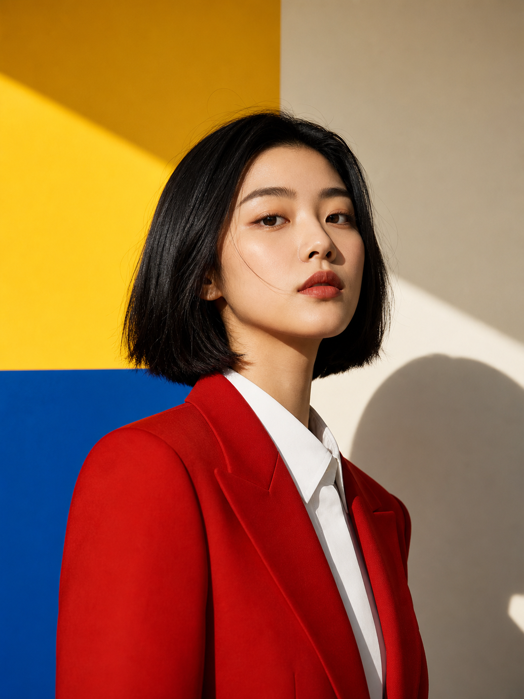
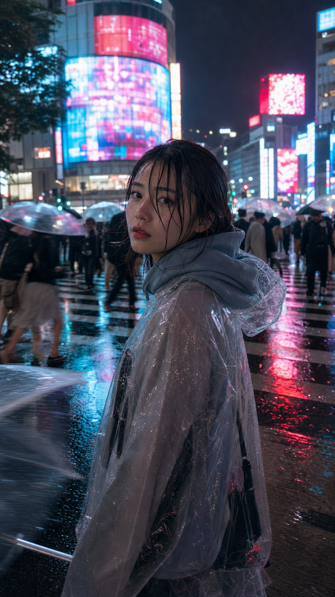
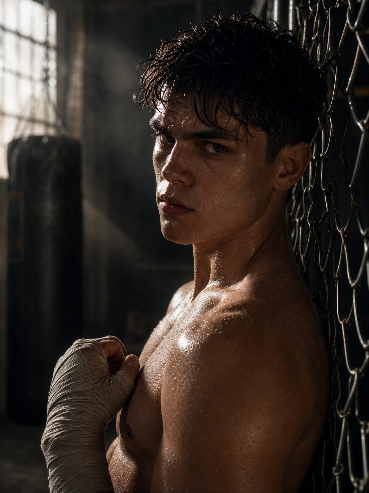

# 人像与摄影

[← 返回主目录](../README.zh-CN.md) · [English](portrait-photography.md) · [在 HiAPI 生成](https://www.hiapi.ai/zh/models/gpt-image-2?utm_source=github&utm_medium=readme&utm_campaign=awesome-gpt-image-2-prompts) · [API Key](https://www.hiapi.ai/zh/register?utm_source=github&utm_medium=readme&utm_campaign=awesome-gpt-image-2-prompts)

写真、人像、街拍、胶片和手机截图风格。

> 案例库 · 26 个案例

---

<table>
  <tr>
    <td align="center" width="33%" valign="top"><a href="https://www.hiapi.ai/draw?p=MzVtbSBmaWxtIHBob3RvZ3JhcGh5IHdpdGggaGFyc2ggY29udmVuaWVuY2Ugc3RvcmUgZmx1b3Jlc2NlbnQgbGlnaHRpbmcgbWl4ZWQgd2l0aCBjb2xvcmZ1bCBuZW9uIHNpZ25zIGZyb20gb3V0c2lkZSwgYXV0aGVudGljIGZpbG0gZ3JhaW4sIGhpZ2ggY29udHJhc3QsIHNsaWdodCBjb2xvciBjYXN0LCBjaW5lbWF0aWMgc3RyZWV0IGVkaXRvcmlhbCBzdHlsZSwgaW50aW1hdGUgbWVkaXVtIHNob3QsIGVhcmx5IDIwcyBzZXh5IENoaW5lc2UgZmVtYWxlIGlkb2wgd2l0aCB1bHRyYS1yZWFsaXN0aWMgZGVsaWNhdGUgcmVmaW5lZCBDaGluZXNlIGZlYXR1cmVzLCBzZWR1Y3RpdmUgYWxtb25kLXNoYXBlZCBmb3ggZXllcyB3aXRoIG5hdHVyYWwgZG91YmxlIGV5ZWxpZHMsIGhpZ2ggbm9zZSBicmlkZ2UsIHNtYWxsIHNoYXJwIFYtc2hhcGVkIGphd2xpbmUsIGZsYXdsZXNzIHBvcmNlbGFpbiBza2luIHdpdGggY29vbCBpdm9yeSB1bmRlcnRvbmUgYW5kIHZpc2libGUgc3BlY3VsYXIgaGlnaGxpZ2h0cyBmcm9tIGZsdW9yZXNjZW50IGxpZ2h0LCBzdWJ0bGUgc2tpbiB0ZXh0dXJlIGFuZCBtaWNybyBwb3JlcywgbmF0dXJhbCBkZXd5IG1ha2V1cCB3aXRoIHNvZnQgZmx1c2ggb24gY2hlZWtzLCBnbG9zc3kgbmF0dXJhbCBwaW5rIGxpcHMgc2xpZ2h0bHkgcGFydGVkLCBzdWJ0bGUgbmF0dXJhbCBmcmVja2xlcyBhY3Jvc3Mgbm9zZSBhbmQgY2hlZWtzLCBsb25nIGRhcmsgYnJvd24gaGFpciBpbiBhIG1lc3N5IGhpZ2ggcG9ueXRhaWwgd2l0aCBtYW55IGxvb3NlIHN0cmFuZHMgZmFsbGluZyBhcm91bmQgZmFjZSBhbmQgbmVjaywgd2VhcmluZyBhbiBvdmVyc2l6ZWQgd2hpdGUgYnV0dG9uLXVwIHNoaXJ0IGFzIHRoZSBvbmx5IHRvcCwgdW5idXR0b25lZCBhdCB0aGUgdG9wIHdpdGggZGVlcCBjbGVhdmFnZSBhbmQgbG9vc2VseSB0aWVkIGF0IHRoZSB3YWlzdCwgcGFpcmVkIHdpdGggYSB0aW55IGJsYWNrIHBsZWF0ZWQgbWluaSBza2lydCwgYmFyZWZvb3QgaW4gc2ltcGxlIHdoaXRlIHNsaWRlcywgc2VkdWN0aXZlIGNhc3VhbCBsZWFuaW5nIHBvc2UgYWdhaW5zdCB0aGUgZ2xhc3MgZG9vciBvZiBhIDI0LWhvdXIgY29udmVuaWVuY2Ugc3RvcmUgYXQgbGF0ZSBuaWdodCwgYm9keSBzbGlnaHRseSBhcmNoZWQsIG9uZSBsZWcgYmVudCB3aXRoIGZvb3QgcmVzdGluZyBhZ2FpbnN0IHRoZSBkb29yIGZyYW1lLCB0aGUgb3RoZXIgbGVnIHN0cmFpZ2h0LCBvbmUgaGFuZCBob2xkaW5nIGEgYm90dGxlIG9mIGljZWQgZHJpbmssIHRoZSBvdGhlciBoYW5kIGxpZ2h0bHkgcHVsbGluZyB0aGUgaGVtIG9mIGhlciBtaW5pIHNraXJ0LCBpbnRlbnNlbHkgc2VkdWN0aXZlIHBsYXlmdWwgeWV0IHNsaWdodGx5IHZ1bG5lcmFibGUgZ2F6ZSBzdHJhaWdodCBhdCB0aGUgdmlld2VyIHdpdGggc29mdCBkb2UgZXllcyBmdWxsIG9mIHF1aWV0IHRlbXB0YXRpb24gYW5kIHRlYXNpbmcgc21pbGUsIGJyaWdodCBjb2xkIGZsdW9yZXNjZW50IHN0b3JlIGxpZ2h0IGZyb20gaW5zaWRlIG1peGVkIHdpdGggcGluayBhbmQgYmx1ZSBuZW9uIGdsb3cgZnJvbSBvdXRzaWRlIHNpZ25zLCByZWFsaXN0aWMgcmVmbGVjdGlvbnMgb24gZ2xhc3MgZG9vciwgYmx1cnJlZCBjb252ZW5pZW5jZSBzdG9yZSBpbnRlcmlvciB3aXRoIHNoZWx2ZXMgYW5kIHNuYWNrcyBpbiBiYWNrZ3JvdW5kLCBhdXRoZW50aWMgMzVtbSBmaWxtIGNvbG9yIGdyYWRpbmcgd2l0aCBoYXJzaCBsaWdodGluZyBhbmQgbmVvbiBhY2NlbnRzLCBleHRyZW1lbHkgc2hhcnAgeWV0IHNvZnQgc2tpbiByZW5kZXJpbmcsIG5hdHVyYWwgaGFpciBzdHJhbmRzLCByZWFsaXN0aWMgZmFicmljIHdyaW5rbGVzIGFuZCBkcmFwZSBvbiB0aGUgb3ZlcnNpemVkIHNoaXJ0IGFuZCBtaW5pIHNraXJ0LCBubyBwbGFzdGljIHNraW4sIG5vIGRpZ2l0YWwgb3Zlci1zaGFycGVuaW5nLCBubyBhaXJicnVzaGluZywgbm8gYmxlbWlzaGVzLCBubyBtb2xlcywgbm8gb2lseSBza2luLCBubyB3YXRlcm1hcmssIG5vIHRleHQsIGF1dGhlbnRpYyBsYXRlLW5pZ2h0IGNvbnZlbmllbmNlIHN0b3JlIGF0bW9zcGhlcmU%3D&amp;m=gpt-image-2&amp;utm_source=awesome-gpt-image-2-prompts&amp;utm_medium=github_readme&amp;utm_campaign=zh_gallery&amp;s=16%3A9"></a><br><sub><b>Case 001</b> · <a href="#portrait-case-1-convenience-store-neon-portrait-by-bubblebrain">提示词</a></sub><br><sub><a href="https://x.com/BubbleBrain/status/2045167461147042202">便利店霓虹人像</a> · <a href="https://x.com/BubbleBrain">@BubbleBrain</a></sub></td>
    <td align="center" width="33%" valign="top"><a href="https://www.hiapi.ai/draw?p=R2VuZXJhdGUgYSBjaW5lbWF0aWMgbWluaW1hbCBwb3J0cmFpdCBvZiBhIHNvbGl0YXJ5IG1hbiBzdGFuZGluZyBpbiBhbiBpbnRlbnNlIG9yYW5nZSB0byByZWQgZ3JhZGllbnQgZW52aXJvbm1lbnQsIHN0cm9uZyBzaWxob3VldHRlIGxpZ2h0aW5nLCBkZWVwIHNoYWRvdyBjb250cmFzdCwgcmVmbGVjdGl2ZSBnbG9zc3kgZmxvb3IsIHN5bW1ldHJpY2FsIGNvbXBvc2l0aW9uLCBtaW5pbWFs&amp;m=gpt-image-2&amp;utm_source=awesome-gpt-image-2-prompts&amp;utm_medium=github_readme&amp;utm_campaign=zh_gallery&amp;s=1%3A1"></a><br><sub><b>Case 002</b> · <a href="#portrait-case-2-cinematic-minimal-portrait-by-iammiharbi">提示词</a></sub><br><sub><a href="https://x.com/iam_miharbi/status/2045151354679665101">电影感极简人像</a> · <a href="https://x.com/iam_miharbi">@iam_miharbi</a></sub></td>
    <td align="center" width="33%" valign="top"><a href="https://www.hiapi.ai/draw?p=MzVtbSBmaWxtIHBob3RvZ3JhcGh5LCB3YXJtIHZpbnRhZ2UgSmFwYW5lc2Ugb25zZW4gcnlva2FuIGFlc3RoZXRpYywgc29mdCBhbWJpZW50IHdvb2RlbiBsYW50ZXJuIGxpZ2h0aW5nIG1peGVkIHdpdGggZ2VudGxlIG5hdHVyYWwgd2luZG93IGxpZ2h0LCBzdWJ0bGUgZmlsbSBncmFpbiwgZ2VudGxlIGNvbG9yIHNoaWZ0LCBoaWdoIGF0bW9zcGhlcmUgZWRpdG9yaWFsIHN0eWxlLCBpbnRpbWF0ZSBtZWRpdW0gc2hvdCwgZWFybHkgMjBzIGJlYXV0aWZ1bCBDaGluZXNlIGZlbWFsZSBpZG9sIHdpdGggdWx0cmEtcmVhbGlzdGljIGRlbGljYXRlIHJlZmluZWQgQ2hpbmVzZSBmZWF0dXJlcywgc2VkdWN0aXZlIGFsbW9uZC1zaGFwZWQgZm94IGV5ZXMgd2l0aCBuYXR1cmFsIGRvdWJsZSBleWVsaWRzLCBoaWdoIG5vc2UgYnJpZGdlLCBzbWFsbCBzaGFycCBWLXNoYXBlZCBqYXdsaW5lLCBmbGF3bGVzcyBwb3JjZWxhaW4gc2tpbiB3aXRoIHdhcm0gaXZvcnkgdW5kZXJ0b25lLCB2aXNpYmxlIHN1YnRsZSBza2luIHRleHR1cmUgYW5kIG1pY3JvIHBvcmVzLCBzb2Z0IG5hdHVyYWwgbWFrZXVwIHdpdGggZGV3eSBnbG93LCBzdWJ0bGUgcm9zeSBmbHVzaCBvbiBjaGVla3MsIG5hdHVyYWwgc29mdCBwaW5rIGxpcHMgc2xpZ2h0bHkgcGFydGVkLCBsb25nIGRhcmsgYnJvd24gaGFpciB0aWVkIGluIGEgbG9vc2UgbG93IGJ1biB3aXRoIHNvbWUgbWVzc3kgc3RyYW5kcyBmYWxsaW5nIGFyb3VuZCBmYWNlIGFuZCBuZWNrLCB3ZWFyaW5nIGEgbG9vc2Ugd2hpdGUgeXVrYXRhICh0cmFkaXRpb25hbCBKYXBhbmVzZSBiYXRocm9iZSkgZGVsaWJlcmF0ZWx5IHNsaXBwZWQgb2ZmIG9uZSBzaG91bGRlciBhbmQgbG9vc2VseSB0aWVkIGF0IHRoZSB3YWlzdCwgdGhlIGZhYnJpYyBzbGlnaHRseSBvcGVuIHJldmVhbGluZyBzbW9vdGggc2tpbiBhbmQgc3VidGxlIGNsZWF2YWdlLCBiYXJlZm9vdCwgc2VkdWN0aXZlIHJlbGF4ZWQgc2l0dGluZyBwb3NlIG9uIHRoZSBlZGdlIG9mIGEgdHJhZGl0aW9uYWwgd29vZGVuIGVuZ2F3YSB2ZXJhbmRhIGF0IGEgdmludGFnZSBvbnNlbiByeW9rYW4sIGJvZHkgc2xpZ2h0bHkgdHVybmVkIHRvd2FyZCB0aGUgY2FtZXJhLCBvbmUgbGVnIGJlbnQgd2l0aCBmb290IHJlc3Rpbmcgb24gdGhlIHdvb2RlbiBmbG9vciwgdGhlIG90aGVyIGxlZyBnZW50bHkgZGFuZ2xpbmcsIG9uZSBoYW5kIGxpZ2h0bHkgaG9sZGluZyB0aGUgeXVrYXRhIGNvbGxhciwgdGhlIG90aGVyIGhhbmQgcmVzdGluZyBvbiB0aGUgd29vZGVuIGZsb29yIGJlaGluZCBoZXIgZm9yIHN1cHBvcnQsIHNvZnRseSBhcmNoZWQgYmFjayB0byBnZW50bHkgYWNjZW50dWF0ZSBjdXJ2ZXMsIGludGVuc2VseSBzZWR1Y3RpdmUgeWV0IGdlbnRsZSBhbmQgaW52aXRpbmcgZ2F6ZSBzdHJhaWdodCBhdCB0aGUgdmlld2VyIHdpdGggc29mdCBkb2UgZXllcyBmdWxsIG9mIHF1aWV0IHRlbXB0YXRpb24gYW5kIHdhcm10aCwgd2FybSB3b29kZW4gaW50ZXJpb3Igd2l0aCBwYXBlciBzbGlkaW5nIGRvb3JzIGFuZCBkaXN0YW50IHN0ZWFtaW5nIGhvdCBzcHJpbmcgaW4gc29mdCBmb2N1cywgZ2VudGxlIHJpbSBsaWdodGluZyBoaWdobGlnaHRpbmcgc2tpbiBhbmQgZmFicmljIHRleHR1cmUsIGF1dGhlbnRpYyB2aW50YWdlIGZpbG0gY29sb3IgZ3JhZGluZyB3aXRoIHdhcm0gdG9uZXMsIGV4dHJlbWVseSBzaGFycCB5ZXQgc29mdCBza2luIHJlbmRlcmluZywgbmF0dXJhbCBoYWlyIHN0cmFuZHMsIHJlYWxpc3RpYyBmYWJyaWMgd3JpbmtsZXMgYW5kIGRyYXBlIG9uIHRoZSB5dWthdGEsIG5vIHBsYXN0aWMgc2tpbiwgbm8gZGlnaXRhbCBvdmVyLXNoYXJwZW5pbmcsIG5vIGFpcmJydXNoaW5nLCBubyBibGVtaXNoZXMsIG5vIG1vbGVzLCBubyBvaWx5IHNraW4sIG5vIHdhdGVybWFyaywgbm8gdGV4dCwgYXV0aGVudGljIDM1bW0gZmlsbSBKYXBhbmVzZSBvbnNlbiByeW9rYW4gYXRtb3NwaGVyZQ%3D%3D&amp;m=gpt-image-2&amp;utm_source=awesome-gpt-image-2-prompts&amp;utm_medium=github_readme&amp;utm_campaign=zh_gallery"></a><br><sub><b>Case 003</b> · <a href="#portrait-case-3-japanese-onsen-ryokan-portrait-by-bubblebrain">提示词</a></sub><br><sub><a href="https://x.com/BubbleBrain/status/2045092449803284923">日式温泉旅馆人像</a> · <a href="https://x.com/BubbleBrain">@BubbleBrain</a></sub></td>
  </tr>
  <tr>
    <td align="center" width="33%" valign="top"><a href="https://www.hiapi.ai/draw?p=MzVtbSBjb2xvciBmaWxtIHBob3RvZ3JhcGh5IHdpdGggaGFyc2ggZGlyZWN0IG9uLWNhbWVyYSBmbGFzaCwgc3BlY3VsYXIgaGlnaGxpZ2h0cyBvbiBza2luIGFuZCBjbG90aGluZywgc3Ryb25nIGNhdGNobGlnaHRzIGluIGV5ZXMsIGhpZ2ggY29udHJhc3QgZmxhc2ggaWxsdW1pbmF0aW9uLCBhdXRoZW50aWMgZmlsbSBncmFpbiBhbmQgY29sb3Igc2hpZnQsIGhpZ2ggZmFzaGlvbiBmcmVzaCBpbm5vY2VudCBiYXNrZXRiYWxsIGNvdXJ0IGVkaXRvcmlhbCBzdHlsZSwgaW50aW1hdGUgZmlyc3QtcGVyc29uIGxvdy1hbmdsZSBQT1Ygc2hvdCBmcm9tIGJlbG93LCBlYXJseSAyMHMgc2V4eSBDaGluZXNlIGZlbWFsZSBpZG9sIHdpdGggdWx0cmEtcmVhbGlzdGljIGRlbGljYXRlIHJlZmluZWQgQ2hpbmVzZSBmZWF0dXJlcywgc2VkdWN0aXZlIGFsbW9uZC1zaGFwZWQgZm94IGV5ZXMgd2l0aCBuYXR1cmFsIGRvdWJsZSBleWVsaWRzLCBoaWdoIG5vc2UgYnJpZGdlLCBzbWFsbCBzaGFycCBWLXNoYXBlZCBqYXdsaW5lLCBmbGF3bGVzcyByZWFsaXN0aWMgcG9yY2VsYWluIHNraW4gd2l0aCBjb29sIGl2b3J5IHVuZGVydG9uZSBhbmQgdmlzaWJsZSBmbGFzaCBzcGVjdWxhciBoaWdobGlnaHRzLCBmaW5lIGRlbGljYXRlIHNraW4gdGV4dHVyZSB3aXRoIHN1YnRsZSBwb3JlcyBtaWNybyBkZXRhaWxzIGFuZCBuYXR1cmFsIGRld3kgZ2xvdyB1bmRlciBmbGFzaCwgZnJlc2ggbmF0dXJhbCBzcG9ydHkgbWFrZXVwIHdpdGggc29mdCBkZXd5IGdsb3csIHN1YnRsZSBuYXR1cmFsIGZsdXNoIG9uIGNoZWVrcywgbmF0dXJhbCBwaW5rIGxpcHMgc2xpZ2h0bHkgcGFydGVkLCBzdWJ0bGUgbmF0dXJhbCBmcmVja2xlcyBhY3Jvc3Mgbm9zZSBhbmQgY2hlZWtzLCBsb25nIGRhcmsgYnJvd24gaGFpciB0aWVkIGluIGEgaGlnaCBwbGF5ZnVsIHBvbnl0YWlsIHdpdGggc29tZSBsb29zZSBzdHJhbmRzIGZyYW1pbmcgdGhlIGZhY2UgYW5kIHJlYWxpc3RpYyBsb29zZSBzdHJhbmRzLCB3ZWFyaW5nIGEgbG9vc2Ugd2hpdGUgdGFuayB0b3AgYW5kIHdoaXRlIGhpZ2gtd2Fpc3RlZCBiYXNrZXRiYWxsIHNob3J0cywgd2hpdGUga25lZS1oaWdoIHNwb3J0cyBzb2Nrcywgc2VkdWN0aXZlIG5hdHVyYWwgbGVhbmluZyBwb3NlIGFnYWluc3QgdGhlIGJhc2tldGJhbGwgaG9vcCBwb2xlIG9uIHRoZSBvdXRkb29yIGNvdXJ0IGF0IGR1c2ssIGJvZHkgYW5nbGVkIHNpZGV3YXlzIHdpdGggbmF0dXJhbGx5IGFyY2hlZCBiYWNrIGFuZCBoaXBzIGdlbnRseSBwdXNoZWQgYmFjayB0byBhY2NlbnR1YXRlIHBlcmt5IHJvdW5kIGhpcHMgYW5kIHNleHkgYnV0dCBjdXJ2ZSwgb25lIGxlZyBuYXR1cmFsbHkgZXh0ZW5kZWQgZm9yd2FyZCB0b3dhcmQgdGhlIGNhbWVyYSBhbmQgdGhlIG90aGVyIGxlZyBzbGlnaHRseSBiZW50IHRvIGVtcGhhc2l6ZSBsb25nIHNleHkgbGVncywgYm90aCBoYW5kcyBsaWdodGx5IHJlc3Rpbmcgb24gdGhlIGJhc2tldGJhbGwgcG9sZSBhdCBzaG91bGRlciBoZWlnaHQsIGludGVuc2VseSBzZWR1Y3RpdmUgcGxheWZ1bCB5ZXQgcGl0aWFibGUgZG9lLWV5ZWQgZ2F6ZSBzdHJhaWdodCBhdCB0aGUgdmlld2VyIHdpdGggc29mdCB2dWxuZXJhYmxlIGxvbmdpbmcgZXllcyBhbmQgYSBnZW50bGUgdGVhc2luZyBzbWlsZSBmdWxsIG9mIHF1aWV0IHRlbXB0YXRpb24gYW5kIGRlc2lyZSwgaGFyc2ggZGlyZWN0IG9uLWNhbWVyYSBmbGFzaCBjcmVhdGluZyBzaGFycCBzcGVjdWxhciBoaWdobGlnaHRzIGFuZCBzdHJvbmcgY2F0Y2hsaWdodHMsIGJhY2tncm91bmQgd2l0aCBibHVycmVkIGJhc2tldGJhbGwgY291cnQgYW5kIGhvb3AgdW5kZXIgZHVzayBza3ksIGhpZ2ggY29udHJhc3QgZmlsbSBjb2xvciBncmFkaW5nIHdpdGggbmF0dXJhbCBmbGFzaCBsb29rLCBleHRyZW1lbHkgc2hhcnAgeWV0IHNvZnQgc2tpbiByZW5kZXJpbmcgd2l0aCBhdXRoZW50aWMgMzVtbSBkaXJlY3QgZmxhc2ggYWVzdGhldGljLCBuYXR1cmFsIGhhaXIgc3RyYW5kcywgcmVhbGlzdGljIGZhYnJpYyB0ZXh0dXJlIG9uIHRhbmsgdG9wIGFuZCBzaG9ydHMgd2l0aCBzb2NrcyBkZXRhaWwsIG5vIHBsYXN0aWMgc2tpbiwgbm8gZGlnaXRhbCBvdmVyLXNoYXJwZW5pbmcsIG5vIGFpcmJydXNoaW5nLCBubyBibGVtaXNoZXMsIG5vIG1vbGVzLCBubyBvaWx5IHNraW4sIG5vIHdhdGVybWFyaywgbm8gdGV4dCwgYXV0aGVudGljIDM1bW0gZGlyZWN0IGZsYXNoIGZpbG0gYmFza2V0YmFsbCBjb3VydCBsb29rIC0tYXIgOToxNg%3D%3D&amp;m=gpt-image-2&amp;utm_source=awesome-gpt-image-2-prompts&amp;utm_medium=github_readme&amp;utm_campaign=zh_gallery&amp;s=9%3A16"></a><br><sub><b>Case 004</b> · <a href="#portrait-case-4-35mm-flash-editorial-portrait-by-bubblebrain">提示词</a></sub><br><sub><a href="https://x.com/BubbleBrain/status/2045052982728016131">35mm 闪光时尚大片</a> · <a href="https://x.com/BubbleBrain">@BubbleBrain</a></sub></td>
    <td align="center" width="33%" valign="top"><a href="https://www.hiapi.ai/draw?p=QSBzdHVubmluZyAxOC15ZWFyLW9sZCBDaGluZXNlIGdpcmwgd2l0aCBhIHlvdXRoZnVsLCBwdXJlIGZhY2UgYW5kIHJlYWxpc3RpYyBza2luIHRleHR1cmUsIHNpdHRpbmcgb24gYSBjb3p5LCBzbGlnaHRseSBtZXNzeSBiZWQgaW4gaGVyIGJlZHJvb20uIFNoZSBpcyB0YWtpbmcgYSBtaXJyb3Igc2VsZmllIHdpdGggYSBzbWFydHBob25lLCBjYXB0dXJpbmcgYSBuYXR1cmFsIGFuZCBpbnRpbWF0ZSBtb21lbnQuIFdlYXJpbmcgY2FzdWFsIGdyYXkgbG91bmdld2VhciBhbmQgbmVhdCB3aGl0ZSBjcmV3IHNvY2tzLiBTb2Z0IG5hdHVyYWwgbGlnaHQgKGdvbGRlbiBob3VyKSBzdHJlYW1zIGluIGZyb20gYSBzaWRlIHdpbmRvdywgY3JlYXRpbmcgYSB3YXJtLCBtb29keSwgYW5kIGNpbmVtYXRpYyBhdG1vc3BoZXJlLiAzNW1tIGxlbnMsIHNoYXJwIGZvY3VzIG9uIHRoZSBzdWJqZWN0IGluIHRoZSBtaXJyb3IsIGRlcHRoIG9mIGZpZWxkIHdpdGggYSBiZWF1dGlmdWxseSBibHVycmVkIGJhY2tncm91bmQgKGJva2VoKS4gUGhvdG9yZWFsaXN0aWMsIDhLLCBoaWdoIHJlc29sdXRpb24sIHN0dWRpbyBxdWFsaXR5LCBtYXN0ZXJwaWVjZS4KTmVnYXRpdmUgUHJvbXB0czogbm8gZXh0cmEgbGltYnMsIG5vIGRlZm9ybWVkIGhhbmRzLCBubyBibHVyLCBubyBub2lzZSwgbm8gd2F0ZXJtYXJrLCBubyB0ZXh0LCBubyBjYXJ0b29uL2FuaW1lIHN0eWxlLiBBc3BlY3QgUmF0aW86IDM6NC4%3D&amp;m=gpt-image-2&amp;utm_source=awesome-gpt-image-2-prompts&amp;utm_medium=github_readme&amp;utm_campaign=zh_gallery&amp;s=3%3A4"></a><br><sub><b>Case 005</b> · <a href="#portrait-case-5-mirror-selfie-bedroom-portrait-by-shinning1010">提示词</a></sub><br><sub><a href="https://x.com/Shinning1010/status/2045002808903020962">卧室镜自拍人像</a> · <a href="https://x.com/Shinning1010">@Shinning1010</a></sub></td>
    <td align="center" width="33%" valign="top"><a href="https://www.hiapi.ai/draw?p=QW5hbG9nIDM1bW0gZmlsbSBwaG90b2dyYXBoeSwgc29mdCBhaXJ5IEphcGFuZXNlLXN0eWxlIGFlc3RoZXRpYywgZ2VudGxlIGRpZmZ1c2VkIG5hdHVyYWwgd2luZG93IGxpZ2h0LCBzbGlnaHQgb3ZlcmV4cG9zdXJlLCBwYXN0ZWwgdG9uZXMsIGxvdyBjb250cmFzdCwgc29mdCBoaWdobGlnaHRzLCBtaW5pbWFsIGluZG9vciBzZXR0aW5nIG5lYXIgYSB3aW5kb3cgd2l0aCB3aGl0ZSBjdXJ0YWlucywgY2xlYW4gbGlnaHQtY29sb3JlZCB3YWxsLCBuYXR1cmFsIGNvbXBvc2l0aW9uLCBleWUtbGV2ZWwsIHNsaWdodGx5IGNsb3NlciBmdWxsLWJvZHkgZnJhbWluZyAobWlkLXRoaWdoIHRvIGhlYWQpLCB5b3VuZyBFYXN0IEFzaWFuIHdvbWFuLCBuYXR1cmFsIG1pbmltYWwgbWFrZXVwLCBzb2Z0IHJlYWxpc3RpYyBza2luIHRleHR1cmUsIGxvbmcgc2xpZ2h0bHkgbWVzc3kgZGFyayBoYWlyLCBvdmVyc2l6ZWQgd2hpdGUgYnV0dG9uLXVwIHNoaXJ0LCBsaWdodCBjYXN1YWwgc2hvcnRzLCBiYXJlZm9vdCwgc2ltcGxlIGFuZCByZWxheGVkIHN0eWxpbmcsIHN0YW5kaW5nIG5hdHVyYWxseSB3aXRoIHJlbGF4ZWQgcG9zdHVyZSwgYXJtcyBsb29zZWx5IGF0IHNpZGVzIG9yIHNsaWdodGx5IGJlaGluZCwgZmFjaW5nIGNhbWVyYSwgZ2VudGxlIHNvZnQgc21pbGUsIHN1YnRsZSBzdGlsbG5lc3MsIGZvY3VzIG9uIGxpZ2h0LCBhaXIsIGFuZCBxdWlldCBldmVyeWRheSBtb29kLCBzb2Z0IGZpbG0gZ3JhaW4sIGRyZWFteSBhbmQgdW5kZXJzdGF0ZWQgYXRtb3NwaGVyZSAtLWFyIDk6MTY%3D&amp;m=gpt-image-2&amp;utm_source=awesome-gpt-image-2-prompts&amp;utm_medium=github_readme&amp;utm_campaign=zh_gallery&amp;s=9%3A16"></a><br><sub><b>Case 006</b> · <a href="#portrait-case-6-soft-airy-35mm-portrait-by-bubblebrain">提示词</a></sub><br><sub><a href="https://x.com/BubbleBrain/status/2046115431144902732">柔和空气感 35mm 人像</a> · <a href="https://x.com/BubbleBrain">@BubbleBrain</a></sub></td>
  </tr>
  <tr>
    <td align="center" width="33%" valign="top"><a href="https://www.hiapi.ai/draw?p=THV4dXJ5IEdsYW0gQmVhdXR5IFBvcnRyYWl0OiwgQmVhdXRpZnVsIEJsYWNrIHdvbWFuLCB5b3V0aGZ1bCBzcGlyaXQsIGNyZWFteSB2YW5pbGxhLCBzaWxrIHByZXNzLCBtYWhvZ2FueSByZWQsIHN1YnRsZSBjb25maWRlbmNlLCB0ZXh0dXJlZCBmYWJyaWMsIHNhcHBoaXJlIGJsdWUsIG1pbmltYWwgamV3ZWxyeSwgYmVhY2hzaWRlIGJyZWV6ZSwgbGVucyBmbGFyZSBlZmZlY3QsIG5vc3RhbGdpYywgY2luZW1hdGljIGxlbnMsIHN5bW1ldHJpY2FsIGNvbXBvc2l0aW9uLCBzb2Z0IGZvY3VzLCBoaWdoIGZhc2hpb24gcGhvdG9ncmFwaHksIG1vbm9jaHJvbWF0aWMsIGRld3kgZmluaXNoLCBteXN0ZXJpb3VzIHRlbnNpb24sIGxheWVyZWQgZWxlbWVudHM%3D&amp;m=gpt-image-2&amp;utm_source=awesome-gpt-image-2-prompts&amp;utm_medium=github_readme&amp;utm_campaign=zh_gallery&amp;s=1%3A1"></a><br><sub><b>Case 007</b> · <a href="#portrait-case-7-luxury-glam-beauty-portrait-by-patrickassale">提示词</a></sub><br><sub><a href="https://x.com/patrickassale/status/2044581766309060765">奢华魅力美妆人像</a> · <a href="https://x.com/patrickassale">@patrickassale</a></sub></td>
    <td align="center" width="33%" valign="top"><a href="https://www.hiapi.ai/draw?p=55Sf5oiQ5LiA5byg56uW54mI5omL5py65oiq5Zu%2B6aOO5qC855qE5Zu%2B54mH77yM5pW05L2T5q%2BU5L6L5o6l6L%2BRIDk6MTbjgILnlLvpnaLkuK3lv4PlgY%2FkuIrmmK%2FkuIDkvY3nnJ%2FkurogY29zZXLvvIzmia7mvJTvvIjop5LoibLlkI3np7DvvInnmoTkuozmrKHlhYPop5LoibLjgILkurrniankuLrlhpnlrp7po47moLzvvIzkvYbkupTlrpjnlaXluKbliqjmvKvmhJ%2FvvIznmq7ogqTnu4bohbvvvIznnLznnZvnqI3lpKfvvIzooajmg4XmuKnmn5TlnLDnnIvlkJHplZzlpLTvvIzlnZDlnKjlrqTlhoXnmoTkvJHpl7LlnLrmma%2FkuK3vvIzkvovlpoLlkpbllaHljoXmiJbphZLlkKflkKflj7DliY3vvIzog4zmma%2FmnInnrKblkIjlnLrmma%2FnmoTpgZPlhbfjgILnlLvpnaLmnIDkuIrmlrnliqDlhaXmiYvmnLrns7vnu5%2FnirbmgIHmoI8gVUnvvIzljIXmi6zml7bpl7TjgIHnlLXph4%2FjgIHkv6Hlj7fjgIHnvZHnu5znrYnlm77moIfvvIzorqnmlbTlvKDlm77nnIvotbfmnaXlg4%2FmiYvmnLrmiKrlm77jgILnlLvpnaLlupXpg6jlj6DliqDkuIDlnZflrr3lpKfnmoTljYrpgI%2FmmI4gZ2FsZ2FtZSDpo47moLzlr7nor53moYbvvIzlr7nor53moYblt6bkvqfmlL7kuIDkuKrkuI7nlLvpnaLkurrnianlr7nlupTnmoTliqjmvKvmiJYgUSDniYjlpLTlg4%2FvvJvlr7nor53moYblj7PkvqfmjpLniYjmloflrZfvvJrnrKzkuIDooYznlKjovoPlpKflrZfkvZPmmL7npLrkuI7liY3pnaLnm7jlkIznmoTop5LoibLlkI3lrZfvvIzkuIvpnaLkuIDliLDkuKTooYzmmL7npLrkuIDmrrXpgILlkIjov5nkuKrop5LoibLkurrorr7nmoTjgIHmuKnmn5TmsrvmhIjpo47moLznmoTnroDkvZPkuK3mloflj7Dor43vvIznlLHkvaDoh6rliqjliJvkvZzjgILlho3lnKjlr7nor53moYbkuIvmlrnliqDkuIDmnaHmk43kvZzmoI%2FvvIzku7%2FnhacgZ2FsZ2FtZSBVSeOAguaVtOS9k%2BmjjuagvOmrmOa4heOAgee7huiKguS4sOWvjOOAgeWFiee6v%2BaflOWSjOOAgeS6jOasoeWFg%2BS4juecn%2BS6uuWGmeecn%2BiHqueEtuiejeWQiOOAgg%3D%3D&amp;m=gpt-image-2&amp;utm_source=awesome-gpt-image-2-prompts&amp;utm_medium=github_readme&amp;utm_campaign=zh_gallery&amp;s=9%3A16"></a><br><sub><b>Case 008</b> · <a href="#portrait-case-8-916-cosplayer-portrait-screenshot-by-zoulinshen">提示词</a></sub><br><sub><a href="https://x.com/Zoulinshen/status/2045082518089810073">9:16 Cosplayer 人像截图</a> · <a href="https://x.com/Zoulinshen">@Zoulinshen</a></sub></td>
    <td align="center" width="33%" valign="top"><a href="https://www.hiapi.ai/draw?p=6K%2Bl55S76Z2i5Li65Lit6L%2BR5pmv77yM6YeH55So5bmz6KeG6ZWc5aS077yM6IGa54Sm5LqO5LiA5L2N5bm06L275aWz5oCn44CC5aW55Lul5LiD5YiG6Lqr6ZWc5aS05ZGI546w77yM6Lqr5L2T5Z2Q5ae%2F55Wl5bim5YC%2B5pac77yM6IeA6YOo5ZCR5ZCO5pKF6LW377yM5Y%2BM6IW%2F6Ieq54S25Lqk5Y%2Bg77yM5bem6IW%2F5Zyo5YmN77yM5Y%2Bz6IW%2F5Zyo5ZCO77yM6Iad55uW5b6u5bGI44CC5aW55bCG5LiK5Y2K6Lqr5ZCR5Y%2Bz5ZCO5pa55omt6L2s77yM5aS06YOo5YiZ6L2s5ZCR6ZWc5aS05pa55ZCR77yM5b2i5oiQ5LiA5Liq57uP5YW455qE4oCc5Zue55y44oCd5ae%2F5oCB77yM55uu5YWJ55u06KeG6ZWc5aS077yM55y856We5riF5r6I6ICM55Wl5bim5LiA5Lid5L%2BP55qu44CC5aW555qE5Y%2BR5Z6L5piv6JOs5p2%2B55qE5qOV6Imy6b2Q6IKp55%2Bt5Y%2BR77yM5YiY5rW36Ieq54S25Z6C6JC977yM5Y%2BR5bC%2B5b6u5Y2377yM5aaG5a655riF5reh6Ieq54S277yM5LuF5Zyo55y86YOo5pyJ6L275b6u55y857q%2F5Yu%2B5YuS77yM5ZSH6Imy5Li66Ieq54S26KO457KJ44CC55S76Z2i5pW05L2T6YeH55So6Ieq54S25pel5YWJ5ruk6ZWc77yM5YWJ57q%2F5LuO55S76Z2i5bem5LiK5pa55pac5bCE5YWl77yM5b2i5oiQ5p%2BU5ZKM55qE6YCG5YWJ6L2u5buT77yM6Z2i6YOo5ZKM6Lqr5L2T5Y%2Bz5L6n6KKr5rip5pqW55qE6YeR6Imy5YWJ57q%2F54Wn5Lqu77yM5bem5L6n5YiZ5b2i5oiQ6Ieq54S255qE6Zi05b2x6L%2BH5rih77yM5aKe5by65LqG56uL5L2T5oSf44CC54Gv5YWJ5pWI5p6c5piv5piO5Lqu55qE6Ieq54S25YWJ77yM5bim5pyJ6L275b6u55qE6ZWc5aS055yp5YWJ77yM6JCl6YCg5Ye65Y2I5ZCO6Ziz5YWJ55qE5rCb5Zu044CC5ouN5pGE6KeS5bqm5Li65bmz6KeG77yM5p6E5Zu%2B5LiK77yM5Lq654mp5Li75L2T5L2N5LqO55S76Z2i5Lit5YGP5Y%2Bz5L2N572u77yM6IOM5pmv5Lit55qE5paR6ams57q%2F5LiO6YGT6Lev57q%2F5p2h5b2i5oiQ6Ieq54S255qE5byV5a%2B857q%2F77yM5bCG6KeG57q%2F5byV5ZCR5Lq654mp44CC6IOM5pmv5Li65Z%2BO5biC6KGX6YGT77yM5YyF5ZCr6YGT6Lev44CB5paR6ams57q%2F44CB57u%2F5YyW5bim5ZKM6L%2Bc5aSE55qE6L2m6L6G77yM6IOM5pmv6KKr6YCC5bqm6Jma5YyW77yM5L2G5L6d54S25Y%2Bv6L6o6K%2BG5Ye65qCR5pyo44CB5oqk5qCP5ZKM5YGc5pS%2B55qE55S15Yqo6L2m562J5YWD57Sg77yM5p6E5Zu%2B5LiK5Yip55So5LqG5LiJ5YiG5rOV77yM5Lq654mp5L2N5LqO5Y%2Bz5L6n5LiJ5YiG5LmL5LiA5aSE77yM5aKe5by65LqG55S76Z2i55qE5bmz6KGh5oSf44CC5Li75L2T56m%2F552A5LiA5Lu25Yab57u%2F6Imy6L%2B35b2p5Zu%2B5qGI55qE6L%2Be5bi95Y2r6KGj77yM5LiL6Lqr5pCt6YWN6buR6Imy55%2Bt6KOk77yM6ISa56m%2F55m96Imy6auY5biu6L%2BQ5Yqo6Z6L6YWN55m96Imy5Lit562S6KKc44CC6IOM5YyF5Li66buR6Imy77yM5bim5pyJ5qmZ6buE6Imy6KOF6aWw5p2h57q55ZKM5LiA5Liq5qmZ6Imy5q%2Bb57uS5oyC5Lu277yM5p2Q6LSo5Li65biG5biD5ZKM55qu6Z2p5ou85o6l44CC5pW05L2T6aOO5qC85Li66KGX5aS05LyR6Zey6aOO77yM6IKi5L2T6K%2Bt6KiA5pS%2B5p2%2B6Ieq54S277yM6KGo5oOF55Wl5bim5aW95aWH5LiO5L%2BP55qu77yM5pW05L2T5ZGI546w5Ye65LiA56eN6ZqP5oCn44CB6Z2S5pil44CB5YWF5ruh5rS75Yqb55qE6YO95biC5bCR5aWz5b2i6LGh44CC&amp;m=gpt-image-2&amp;utm_source=awesome-gpt-image-2-prompts&amp;utm_medium=github_readme&amp;utm_campaign=zh_gallery"></a><br><sub><b>Case 009</b> · <a href="#portrait-case-9-urban-turn-back-street-portrait-by-tz2022">提示词</a></sub><br><sub><a href="https://x.com/Tz_2022/status/2045892003775361198">城市回眸街拍人像</a> · <a href="https://x.com/Tz_2022">@Tz_2022</a></sub></td>
  </tr>
  <tr>
    <td align="center" width="33%" valign="top"><a href="https://www.hiapi.ai/draw?p=IlNhbSBBbHRtYW4gb24gYSBza2F0ZWJvYXJkIGF0IGEgc2thdGVwYXJrIHdpdGggbm8gcGVvcGxlLiI%3D&amp;m=gpt-image-2&amp;utm_source=awesome-gpt-image-2-prompts&amp;utm_medium=github_readme&amp;utm_campaign=zh_gallery"></a><br><sub><b>Case 010</b> · <a href="#portrait-case-10-sam-altman-skatepark-snapshot-by-malek1173989">提示词</a></sub><br><sub><a href="https://x.com/Malek1173989/status/2045836887684694395">Sam Altman 滑板场快照</a> · <a href="https://x.com/Malek1173989">@Malek1173989</a></sub></td>
    <td align="center" width="33%" valign="top"><a href="https://www.hiapi.ai/draw?p=OToxNiB2ZXJ0aWNhbCwgS29yZWFuIGlkb2wgcG9ydHJhaXQgcGhvdG9zaG9vdCwgM3gzIGdyaWQgKG5pbmUgZnJhbWVzKSwgc2FtZSBwZXJzb24gaW4gYWxsIGltYWdlcywgY29uc2lzdGVudCBmYWNpYWwgZmVhdHVyZXMgYW5kIHN0eWxpbmcsIHNvZnQgYmxhY2sgbWlzdCBmaWx0ZXIgZWZmZWN0LCBsb3dlcmVkIGNvbnRyYXN0LCBibG9vbWluZyBoaWdobGlnaHRzLCBzdWJ0bGUgZ2xvdyBhcm91bmQgbGlnaHQgc291cmNlcw%3D%3D&amp;m=gpt-image-2&amp;utm_source=awesome-gpt-image-2-prompts&amp;utm_medium=github_readme&amp;utm_campaign=zh_gallery&amp;s=9%3A16"></a><br><sub><b>Case 011</b> · <a href="#portrait-case-11-korean-idol-3x3-grid-portrait-by-bubblebrain">提示词</a></sub><br><sub><a href="https://x.com/BubbleBrain/status/2046268941941850575">韩系偶像 3x3 九宫格人像</a> · <a href="https://x.com/BubbleBrain">@BubbleBrain</a></sub></td>
    <td align="center" width="33%" valign="top"><a href="https://www.hiapi.ai/draw?p=bW9iaWxlIHBob25lIHBob3RvLCBvbGQgQ0NEIGNhbWVyYSBhZXN0aGV0aWMsIGhhcnNoIGZsYXNoLCBncmFpbnksIGRpbSBtZXNzeSBpbmRvb3IgbGlnaHRpbmcsIGNhbmRpZCBzbmFwc2hvdCBmZWVsaW5nLCBzbGlnaHQgbW90aW9uIGJsdXIsIHlvdW5nIEtvcmVhbiBmZW1hbGUgaWRvbCwgc29mdCBpbm5vY2VudCBsb29r&amp;m=gpt-image-2&amp;utm_source=awesome-gpt-image-2-prompts&amp;utm_medium=github_readme&amp;utm_campaign=zh_gallery"></a><br><sub><b>Case 012</b> · <a href="#portrait-case-12-ccd-camera-flash-korean-idol-by-bubblebrain">提示词</a></sub><br><sub><a href="https://x.com/BubbleBrain/status/2046190539213885806">CCD 闪光韩系偶像人像</a> · <a href="https://x.com/BubbleBrain">@BubbleBrain</a></sub></td>
  </tr>
  <tr>
    <td align="center" width="33%" valign="top"><a href="https://www.hiapi.ai/draw?p=OToxNiB2ZXJ0aWNhbCDigJQgYSAzeDMgZ3JpZCBjb2xsYWdlIChuaW5lIGltYWdlcykgZm9ybWluZyBhIEtvcmVhbiBpZG9sIHBvcnRyYWl0IHBob3Rvc2hvb3Qgc2VyaWVzLiBFYWNoIGZyYW1lIGZlYXR1cmVzIHRoZSBzYW1lIHlvdW5nIEtvcmVhbiBmZW1hbGUgaWRvbCwgbWFpbnRhaW5pbmcgMTAwJSBjb25zaXN0ZW5jeSBpbiBmYWNpYWwgZmVhdHVyZXMsIHByb3BvcnRpb25zLCBoYWlyc3R5bGUsIGFuZCBpZGVudGl0eSBhY3Jvc3MgYWxsIG5pbmUgc2hvdHMuICAgTmF0dXJhbCwgdWx0cmEtcmVhbGlzdGljIHNraW4gdGV4dHVyZSwgbm8gcmV0b3VjaGluZywgbm8gc21vb3RoaW5nLiBDbGVhbiBpZG9sLXN0eWxlIG1pbmltYWwgbWFrZXVwLCBzb2Z0IGdsb3csIHN1YnRsZSBpbXBlcmZlY3Rpb25zLiAgIEhhaXI6IGxvbmcsIHZvbHVtaW5vdXMgZGFyayBoYWlyLCBzbGlnaHRseSB0b3VzbGVkLCBjb25zaXN0ZW50IGFjcm9zcyBhbGwgZnJhbWVzIChuYXR1cmFsIGxvb3NlIGZsb3csIHNsaWdodCBtb3ZlbWVudCkuICBPdXRmaXQ6IGNvaGVzaXZlIEtvcmVhbiBpZG9sIHBob3Rvc2hvb3Qgc3R5bGluZyDigJQgd2hpdGUgc2hpcnQgKyBzaG9ydCBib3R0b21zIChvciBzaW1wbGUgbmV1dHJhbC10b25lZCBvdXRmaXQpLCB5b3V0aGZ1bCwgY2xlYW4sIHNsaWdodGx5IGNhc3VhbCBidXQgc3R5bGVkLiBTYW1lIG91dGZpdCBhY3Jvc3MgYWxsIGZyYW1lcy4gIFNldHRpbmc6IG1pbmltYWwgc3R1ZGlvIG9yIHNpbXBsZSBpbmRvb3IgZW52aXJvbm1lbnQgKHBsYWluIHdhbGwsIHNvZnQgd2luZG93IGxpZ2h0LCBjbGVhbiBiYWNrZ3JvdW5kKS4gRm9jdXMgb24gc3ViamVjdCwgbm90IGVudmlyb25tZW50LiAgTGlnaHRpbmc6IHNvZnQgZGlmZnVzZWQgbmF0dXJhbCBsaWdodCwgZ2VudGxlIGhpZ2hsaWdodHMsIGxvdyBjb250cmFzdCwgc2xpZ2h0bHkgYWlyeSB0b25lcywgc3VidGxlIGZpbG0tbGlrZSBzb2Z0bmVzcy4gIENhbWVyYSBzdHlsZTogaW50aW1hdGUgcG9ydHJhaXQgcGhvdG9ncmFwaHksIHNsaWdodGx5IGhhbmRoZWxkIGZlZWwsIHN1YnRsZSBpbXBlcmZlY3Rpb25zIChtaW5vciBncmFpbiwgc2xpZ2h0IGJsdXIgaW4gbW90aW9uIGZyYW1lcywgaW1wZXJmZWN0IGZyYW1pbmcpLiAgRnJhbWUgYnJlYWtkb3duICgzeDMgZ3JpZCk6ICBUb3Agcm93OiAtIFRvcCBsZWZ0OiBzdGFuZGluZyBuYXR1cmFsbHksIGxvb2tpbmcgc2xpZ2h0bHkgYXdheSwgcmVsYXhlZCBleHByZXNzaW9uIC0gVG9wIGNlbnRlcjogZmFjaW5nIGNhbWVyYSwgY2FzdWFsIG1pZC1tb3Rpb24gKGhhaXIgb3IgYm9keSBzbGlnaHQgbW92ZW1lbnQpIC0gVG9wIHJpZ2h0OiBzbGlnaHQgc2lkZSBhbmdsZSwgc29mdCBnYXplLCBuYXR1cmFsIGNhbmRpZCBmZWVsICBNaWRkbGUgcm93OiAtIENlbnRlciBsZWZ0OiBsb29raW5nIHNsaWdodGx5IHVwd2FyZCwgc29mdCB0aG91Z2h0ZnVsIGV4cHJlc3Npb24gLSBDZW50ZXI6IGNsb3NlLXVwIHBvcnRyYWl0LCBkaXJlY3QgZXllIGNvbnRhY3QsIGdlbnRsZSBpZG9sIHNtaWxlIC0gQ2VudGVyIHJpZ2h0OiB0dXJuaW5nIGJvZHkgc2xpZ2h0bHksIG1pZC1tb3Rpb24gY2FuZGlkIGZyYW1lICBCb3R0b20gcm93OiAtIEJvdHRvbSBsZWZ0OiBzZWF0ZWQgb3IgbGVhbmluZyBjYXN1YWxseSwgcmVsYXhlZCBwb3N0dXJlIC0gQm90dG9tIGNlbnRlcjogYmFjayBwYXJ0aWFsbHkgdHVybmVkLCBsb29raW5nIG92ZXIgc2hvdWxkZXIgdG93YXJkIGNhbWVyYSAtIEJvdHRvbSByaWdodDogc3RhbmRpbmcgY2xvc2UgdG8gZnJhbWUsIHNsaWdodGx5IHBsYXlmdWwgb3Igc29mdCBleHByZXNzaW9uICBNb29kOiBLb3JlYW4gaWRvbCBwaG90b2Jvb2sgLyBwaG90b2NhcmQgYWVzdGhldGljLCBpbnRpbWF0ZSwgc29mdCwgbmF0dXJhbCwgZXZlcnlkYXkgY2hhcm0uICBRdWFsaXR5OiB1bHRyYS1yZWFsaXN0aWMsIDhLIGRldGFpbCwgc3VidGxlIGFuYWxvZyBmaWxtIGdyYWluLCBuYXR1cmFsIGltcGVyZmVjdGlvbnMsIHNvZnQgZHJlYW15IHRvbmU%3D&amp;m=gpt-image-2&amp;utm_source=awesome-gpt-image-2-prompts&amp;utm_medium=github_readme&amp;utm_campaign=zh_gallery&amp;s=9%3A16"></a><br><sub><b>Case 013</b> · <a href="#portrait-case-13-korean-idol-3x3-collage-portrait-by-bubblebrain">提示词</a></sub><br><sub><a href="https://x.com/BubbleBrain/status/2046151898621993364">韩系偶像 3x3 拼贴人像</a> · <a href="https://x.com/BubbleBrain">@BubbleBrain</a></sub></td>
    <td align="center" width="33%" valign="top"><a href="https://www.hiapi.ai/draw?p=OToxNiB2ZXJ0aWNhbCDigJQgZWRpdG9yaWFsIHBvcnRyYWl0LCBzaW5nbGUgc3ViamVjdCAgc29mdCBibGFjayBtaXN0IGZpbHRlciwgc3VidGxlIGhhemUsIGdlbnRsZSBoaWdobGlnaHQgYmxvb20sIG11dGVkIHRvbmVzICBtaW5pbWFsIGluZG9vciBzcGFjZSwgY2xlYW4gYmFja2dyb3VuZCwgc2xpZ2h0IHRleHR1cmUgIHlvdW5nIEtvcmVhbiB3b21hbiwgbWluaW1hbCBtYWtldXAsIG5hdHVyYWwgc2tpbiB0ZXh0dXJlICBvdXRmaXQ6IGZpdHRlZCByaWJiZWQga25pdCB0b3Agb3Igc29mdCBjYW1pc29sZSBsYXllcmVkIHVuZGVyIGEgbG9vc2Ugc2hpcnQsIHBhaXJlZCB3aXRoIGhpZ2gtd2Fpc3RlZCBzaG9ydHMgb3Igc2tpcnQ7IGZhYnJpYyBzbGlnaHRseSBjbGluZ3MgdG8gYm9keSBzaGFwZSwgc29mdCBhbmQgbmF0dXJhbCwgbm8gcmV2ZWFsaW5nIGVsZW1lbnRzICBoYWlyOiBzbGlnaHRseSBtZXNzeSwgbmF0dXJhbCB2b2x1bWUgIHBvc2U6IHNpdHRpbmcgb24gZmxvb3Igd2l0aCBvbmUgbGVnIGJlbnQgYW5kIHRoZSBvdGhlciByZWxheGVkLCBib2R5IHNsaWdodGx5IGxlYW5pbmcsIHNob3VsZGVycyBub3QgYWxpZ25lZCwgaGVhZCB0aWx0ZWQgIGNvbXBvc2l0aW9uOiBzdWJqZWN0IHNsaWdodGx5IG9mZi1jZW50ZXIsIG5lZ2F0aXZlIHNwYWNlIHByZXNlbnQgIGV4cHJlc3Npb246IGNhbG0sIHNsaWdodGx5IGRpc3RhbnQsIG5hdHVyYWwgbGlwcyAgbGlnaHRpbmc6IHNvZnQgc2lkZSBsaWdodCwgZ2VudGxlIHNoYWRvdyBmYWxsb2ZmICBtb29kOiB1bmRlcnN0YXRlZCwgcXVpZXQsIHN1YnRseSBzZW5zdWFsIHRocm91Z2ggbmF0dXJhbCBib2R5IGxpbmVzLCByZWxheGVkIGFuZCB1bnBvc2VkICBxdWFsaXR5OiBmaW5lIGdyYWluLCBzbGlnaHQgc29mdG5lc3MsIHJlYWxpc3RpYyBsb29r&amp;m=gpt-image-2&amp;utm_source=awesome-gpt-image-2-prompts&amp;utm_medium=github_readme&amp;utm_campaign=zh_gallery&amp;s=9%3A16"></a><br><sub><b>Case 014</b> · <a href="#portrait-case-14-soft-black-mist-editorial-portrait-by-bubblebrain">提示词</a></sub><br><sub><a href="https://x.com/BubbleBrain/status/2046434670724907395">柔黑雾感编辑人像</a> · <a href="https://x.com/BubbleBrain">@BubbleBrain</a></sub></td>
    <td align="center" width="33%" valign="top"><a href="https://www.hiapi.ai/draw?p=OToxNiB2ZXJ0aWNhbCDigJQgSmFwYW5lc2UgRnVqaSBmaWxtIHN0eWxlIHBvcnRyYWl0LCBzaW5nbGUgc3ViamVjdCAgRnVqaWZpbG0gYW5hbG9nIGFlc3RoZXRpYyAoUHJvIDQwMEggLyBTdXBlcmlhIGZlZWwpLCBzb2Z0IHBhc3RlbCB0b25lcywgc2xpZ2h0IGdyZWVuLW1hZ2VudGEgc2hpZnQsIGxvdyBjb250cmFzdCwgZ2VudGxlIGhpZ2hsaWdodCByb2xsLW9mZiwgZmluZSBmaWxtIGdyYWluLCBzdWJ0bGUgaGFsYXRpb24sIHNsaWdodCB2aWduZXR0ZSAgYnJpZ2h0IG5hdHVyYWwgZGF5bGlnaHQsIGRpZmZ1c2VkIHN1bmxpZ2h0IHRocm91Z2ggd2luZG93LCBzb2Z0IHNoYWRvd3MsIGFpcnkgYXRtb3NwaGVyZSAgeW91bmcgSmFwYW5lc2UgZmVtYWxlIGlkb2wsIG5hdHVyYWwgbWluaW1hbCBtYWtldXAsIGZyZXNoIGdsb3dpbmcgc2tpbiwgcmVhbGlzdGljIHRleHR1cmUsIHNsaWdodCBpbXBlcmZlY3Rpb25zICBvdXRmaXQ6IEphcGFuZXNlIHNjaG9vbCB1bmlmb3JtIChzYWlsb3Itc3R5bGUgb3IgYmxhemVyIHVuaWZvcm0pLCBuZWF0bHkgc3R5bGVkLCBub24tcmV2ZWFsaW5nLCB5b3V0aGZ1bCBhbmQgY2xlYW4gIGhhaXI6IG5hdHVyYWwgZGFyayBoYWlyLCBzdHJhaWdodCBvciBzb2Z0bHkgZmxvd2luZywgYSBmZXcgbG9vc2Ugc3RyYW5kcyAgcG9zZTogZnJvbnQtZmFjaW5nIG9yIHNsaWdodCBhbmdsZSB0b3dhcmQgY2FtZXJhLCByZWxheGVkIHBvc3R1cmU7IG9uZSBoYW5kIGdlbnRseSBob2xkaW5nIGEgc3RyYXdiZXJyeSBuZWFyIGxpcHMsIG1pZC1hY3Rpb24gYXMgaWYgYWJvdXQgdG8gdGFrZSBhIGJpdGU7IHNob3VsZGVycyByZWxheGVkLCBzdWJ0bGUgbmF0dXJhbCBib2R5IGN1cnZlICBleHByZXNzaW9uOiBzb2Z0IHBsYXlmdWwgZ2F6ZSwgbGlnaHQgc21pbGUgb3IgbmV1dHJhbCBsaXBzLCBnZW50bGUgZXllIGNvbnRhY3Qgd2l0aCBjYW1lcmEgIHNldHRpbmc6IG1pbmltYWwgaW5kb29yIG5lYXIgd2luZG93IG9yIHNpbXBsZSBvdXRkb29yIGNvcm5lciwgY2xlYW4gYmFja2dyb3VuZCwgZXZlcnlkYXkgYXRtb3NwaGVyZSAgY29tcG9zaXRpb246IHNsaWdodGx5IG9mZi1jZW50ZXIgZnJhbWluZywgaW50aW1hdGUgZGlzdGFuY2UsIGNhbmRpZCBmZWVsICBtb29kOiBmcmVzaCwgeW91dGhmdWwsIHN3ZWV0IGV2ZXJ5ZGF5IG1vbWVudCwgdW5kZXJzdGF0ZWQgY2hhcm0gIHF1YWxpdHk6IHVsdHJhLXJlYWxpc3RpYywgYW5hbG9nIGZpbG0gbG9vaywgbmF0dXJhbCBpbXBlcmZlY3Rpb25zLCBzb2Z0IGRyZWFteSBmaW5pc2g%3D&amp;m=gpt-image-2&amp;utm_source=awesome-gpt-image-2-prompts&amp;utm_medium=github_readme&amp;utm_campaign=zh_gallery&amp;s=9%3A16"></a><br><sub><b>Case 015</b> · <a href="#portrait-case-15-fujifilm-strawberry-school-portrait-by-bubblebrain">提示词</a></sub><br><sub><a href="https://x.com/BubbleBrain/status/2046483268019884384">富士草莓校园人像</a> · <a href="https://x.com/BubbleBrain">@BubbleBrain</a></sub></td>
  </tr>
  <tr>
    <td align="center" width="33%" valign="top"><a href="https://www.hiapi.ai/draw?p=OToxNiB2ZXJ0aWNhbCDigJQgS29yZWFuIGlkb2wgcG9ydHJhaXQgcGhvdG9ncmFwaHksIHNpbmdsZSBzdWJqZWN0ICBzb2Z0IGJsYWNrIG1pc3QgZmlsdGVyIGVmZmVjdCwgbG93ZXJlZCBjb250cmFzdCwgZ2VudGxlIGhpZ2hsaWdodCBibG9vbSwgc3VidGxlIGdsb3csIHNvZnQgZGlmZnVzaW9uLCBzbGlnaHRseSBmYWRlZCBibGFja3MgIG1pbmltYWwgaW5kb29yIHNldHRpbmcgbmVhciB3aW5kb3csIHdoaXRlIGN1cnRhaW5zLCBjbGVhbiBsaWdodC10b25lZCBiYWNrZ3JvdW5kICB5b3VuZyBLb3JlYW4gZmVtYWxlIGlkb2wsIG5hdHVyYWwgbWluaW1hbCBtYWtldXAsIGRld3kgcmVhbGlzdGljIHNraW4gdGV4dHVyZSwgc3VidGxlIGltcGVyZmVjdGlvbnMgIG91dGZpdDogb3ZlcnNpemVkIHdoaXRlIGJ1dHRvbi11cCBzaGlydCArIHNob3J0IGJvdHRvbXMsIHNsaWdodGx5IGxvb3NlIGZpdCwgc29mdCBhbmQgY2FzdWFsIHN0eWxpbmcsIG5vIHJldmVhbGluZyBlbGVtZW50cyAgaGFpcjogbG9uZyBkYXJrIGhhaXIsIHNsaWdodGx5IG1lc3N5LCBuYXR1cmFsIHZvbHVtZSwgc29mdGx5IGZsb3dpbmcgIHBvc2U6IHJlbGF4ZWQgc3RhbmRpbmcgb3Igc2xpZ2h0IGxlYW4sIGJvZHkgc3VidGx5IGFuZ2xlZCwgb25lIGxlZyBzbGlnaHRseSBmb3J3YXJkLCBzaG91bGRlcnMgcmVsYXhlZDsgb25lIGhhbmQgbGlnaHRseSB0b3VjaGluZyBjb2xsYXIgb3IgcmVzdGluZyBuZWFyIG5lY2tsaW5lLCB0aGUgb3RoZXIgcmVsYXhlZDsgZ2VudGxlIGJvZHkgY3VydmUgd2l0aG91dCBleGFnZ2VyYXRpb24gIGV4cHJlc3Npb246IHNvZnQgY3V0ZSBzbWlsZSwgc2xpZ2h0bHkgcGxheWZ1bCBleWVzLCBkaXJlY3Qgb3Igc2xpZ2h0bHkgb2ZmLWNhbWVyYSBnYXplICBjYW1lcmE6IGNsb3NlIHRvIG1pZC1ib2R5IGZyYW1pbmcsIGV5ZS1sZXZlbCwgaW50aW1hdGUgZGlzdGFuY2UsIHNsaWdodCBoYW5kaGVsZCBmZWVsICBsaWdodGluZzogZGlmZnVzZWQgbmF0dXJhbCBkYXlsaWdodCwgc29mdCBzaGFkb3dzLCBnZW50bGUgbGlnaHQgd3JhcHBpbmcgYXJvdW5kIGZhY2UgYW5kIGJvZHkgIG1vb2Q6IGN1dGUgeWV0IHN1YnRseSBzZW5zdWFsLCBpbnRpbWF0ZSwgZXZlcnlkYXkgc29mdG5lc3MsIHF1aWV0IHJvbWFudGljIGF0bW9zcGhlcmUgIHF1YWxpdHk6IHVsdHJhLXJlYWxpc3RpYywgZmluZSBmaWxtIGdyYWluLCBzbGlnaHQgc29mdG5lc3MgYXQgZWRnZXMsIG5hdHVyYWwgaW1wZXJmZWN0aW9ucywgZHJlYW15IHVuZGVyc3RhdGVkIHRvbmU%3D&amp;m=gpt-image-2&amp;utm_source=awesome-gpt-image-2-prompts&amp;utm_medium=github_readme&amp;utm_campaign=zh_gallery&amp;s=9%3A16"></a><br><sub><b>Case 016</b> · <a href="#portrait-case-16-soft-black-mist-idol-portrait-by-bubblebrain">提示词</a></sub><br><sub><a href="https://x.com/BubbleBrain/status/2046518189509734903">柔黑雾感偶像人像</a> · <a href="https://x.com/BubbleBrain">@BubbleBrain</a></sub></td>
    <td align="center" width="33%" valign="top"><a href="https://www.hiapi.ai/draw?p=OToxNiB2ZXJ0aWNhbCDigJQgSmFwYW5lc2UgRnVqaSBmaWxtIHN0eWxlIGNvdXBsZSBwb3J0cmFpdCwgdHdvIHN1YmplY3RzICBGdWppZmlsbSBhbmFsb2cgYWVzdGhldGljIChQcm8gNDAwSCAvIFN1cGVyaWEgZmVlbCksIHNvZnQgcGFzdGVsIHRvbmVzLCBzbGlnaHQgZ3JlZW4tbWFnZW50YSBzaGlmdCwgbG93IGNvbnRyYXN0LCBnZW50bGUgaGlnaGxpZ2h0IHJvbGwtb2ZmLCBmaW5lIGZpbG0gZ3JhaW4sIHN1YnRsZSBoYWxhdGlvbiAgYnJpZ2h0IG5hdHVyYWwgZGF5bGlnaHQsIGRpZmZ1c2VkIHN1bmxpZ2h0IHRocm91Z2ggd2luZG93LCBzb2Z0IHNoYWRvd3MsIGFpcnkgYXRtb3NwaGVyZSAgeW91bmcgSmFwYW5lc2UgY291cGxlLCBuYXR1cmFsIG1pbmltYWwgbWFrZXVwLCByZWFsaXN0aWMgc2tpbiB0ZXh0dXJlLCBzbGlnaHQgaW1wZXJmZWN0aW9ucyAgZmVtYWxlIG91dGZpdDogb3ZlcnNpemVkIGJ1dHRvbi11cCBzaGlydCB3aXRoIGxvb3NlIHNob3J0cywgcmVsYXhlZCBmaXQsIHNvZnQgY2FzdWFsIHN0eWxpbmcgICBtYWxlIG91dGZpdDogc2ltcGxlIHQtc2hpcnQgb3IgbGlnaHQgc2hpcnQsIGNsZWFuIGFuZCB1bmRlcnN0YXRlZCAgaGFpcjogbmF0dXJhbCwgc2xpZ2h0bHkgdG91c2xlZCBmb3IgYm90aCAgcG9zZTogY2xvc2UgaW50aW1hdGUgZGlzdGFuY2Ug4oCUIHNpdHRpbmcgb3Igc3RhbmRpbmcgY2xvc2UgdG9nZXRoZXI7IHRoZSBnaXJsIGdlbnRseSBsZWFuaW5nIHRvd2FyZCBoaW0sIG9uZSBoYW5kIGxpZ2h0bHkgcmVzdGluZyBvbiBoaXMgc2hvdWxkZXIgb3IgY2hlc3Q7IHRoZSBib3kgc2xpZ2h0bHkgbGVhbmluZyBpbiwgZmFjZXMgY2xvc2UsIGFsbW9zdCB0b3VjaGluZywgY2FwdHVyaW5nIHRoZSBtb21lbnQganVzdCBiZWZvcmUgYSBraXNzICBleHByZXNzaW9uOiBzb2Z0IHNtaWxlcyBvciBnZW50bGUgZ2F6ZSB0b3dhcmQgZWFjaCBvdGhlciwgcmVsYXhlZCBhbmQgbmF0dXJhbCwgZW1vdGlvbmFsIGNvbm5lY3Rpb24gdmlzaWJsZSAgY2FtZXJhOiBjbG9zZSBmcmFtaW5nICh3YWlzdC11cCksIGV5ZS1sZXZlbCwgaW50aW1hdGUgZGlzdGFuY2UsIHNsaWdodCBoYW5kaGVsZCBmZWVsICBzZXR0aW5nOiBtaW5pbWFsIGluZG9vciBuZWFyIHdpbmRvdywgbGlnaHQgY3VydGFpbnMsIGNsZWFuIHNvZnQgYmFja2dyb3VuZCAgbGlnaHRpbmc6IGRpZmZ1c2VkIGRheWxpZ2h0LCBnZW50bGUgaGlnaGxpZ2h0IGJsb29tLCBzb2Z0IHNoYWRvdyB0cmFuc2l0aW9ucyAgbW9vZDogd2FybSwgcm9tYW50aWMsIGludGltYXRlIGV2ZXJ5ZGF5IG1vbWVudCwgbmF0dXJhbCBhZmZlY3Rpb24gIHF1YWxpdHk6IHVsdHJhLXJlYWxpc3RpYywgYW5hbG9nIGZpbG0gbG9vaywgZmluZSBncmFpbiwgc2xpZ2h0IHNvZnRuZXNzLCBuYXR1cmFsIGltcGVyZmVjdGlvbnM%3D&amp;m=gpt-image-2&amp;utm_source=awesome-gpt-image-2-prompts&amp;utm_medium=github_readme&amp;utm_campaign=zh_gallery&amp;s=9%3A16"></a><br><sub><b>Case 017</b> · <a href="#portrait-case-17-fujifilm-couple-portrait-by-bubblebrain">提示词</a></sub><br><sub><a href="https://x.com/BubbleBrain/status/2046502288102170757">富士胶片情侣人像</a> · <a href="https://x.com/BubbleBrain">@BubbleBrain</a></sub></td>
    <td align="center" width="33%" valign="top"><a href="https://www.hiapi.ai/draw?p=5qC55o2u5L2g5a%2B55oiR55qE6K6k55%2BlIOe7meaIkeeUn%2BaIkOS4gOS4quKAnOS9oOiupOivhueahOaIkeKAneeahCDlm77niYc%3D&amp;m=gpt-image-2&amp;utm_source=awesome-gpt-image-2-prompts&amp;utm_medium=github_readme&amp;utm_campaign=zh_gallery"></a><br><sub><b>Case 018</b> · <a href="#portrait-case-18-ai-self-perception-portrait-by-80vul">提示词</a></sub><br><sub><a href="https://x.com/80vul/status/2046218165961753047">AI 自我感知人像</a> · <a href="https://x.com/80vul">@80vul</a></sub></td>
  </tr>
  <tr>
    <td align="center" width="33%" valign="top"><a href="https://www.hiapi.ai/draw?p=RWRpdG9yaWFsIDM6NCBzdHVkaW8gcG9ydHJhaXQgb2YgYSB5b3VuZyBFYXN0IEFzaWFuIHdvbWFuIHdpdGggc2hvcnQgYm9iYmVkIGJsYWNrIGhhaXIsIHdlYXJpbmcgYSBzaGFycGx5IHRhaWxvcmVkIHByaW1hcnktcmVkIGJsYXplciBvdmVyIGEgY2xlYW4gd2hpdGUgc2hpcnQuIFN0YW5kaW5nIGluIGZyb250IG9mIGEgQmF1aGF1cy1zdHlsZSBnZW9tZXRyaWMgc3R1ZGlvIGJhY2tkcm9wOiBsYXJnZSBmbGF0IGJsb2NrcyBvZiBwcmltYXJ5IHllbGxvdywgcHJpbWFyeSBibHVlLCBhbmQgd2FybSBjcmVhbSBwYWludGVkIGluIGNsZWFuIHJlY3RhbmdsZXMuIFN0cm9uZyBkaXJlY3Rpb25hbCBzdHVkaW8ga2V5IGxpZ2h0IGZyb20gdGhlIHJpZ2h0IGNhc3RpbmcgaGFyZCBnZW9tZXRyaWMgc2hhZG93cyBhY3Jvc3MgdGhlIGJhY2tkcm9wLiBDb25maWRlbnQgbmV1dHJhbCBleHByZXNzaW9uIGxvb2tpbmcganVzdCBwYXN0IHRoZSBjYW1lcmEuIDM6NCB2ZXJ0aWNhbCBjb21wb3NpdGlvbiwgaGVhZCBhbmQgc2hvdWxkZXJzIGZyYW1pbmcuIE5vIGJyYW5kIGxvZ28sIG5vIGpld2VscnkgdGV4dCwgbm8gd2F0ZXJtYXJrLiBNYWdhemluZSBmYXNoaW9uIGVkaXRvcmlhbCBxdWFsaXR5LCBwaG90b3JlYWxpc3RpYyBza2luIGFuZCBmYWJyaWMgdGV4dHVyZXMsIHVsdHJhIHNoYXJwIGZvY3VzLg%3D%3D&amp;m=gpt-image-2&amp;utm_source=awesome-gpt-image-2-prompts&amp;utm_medium=github_readme&amp;utm_campaign=zh_gallery&amp;s=3%3A4"></a><br><sub><b>Case 164</b> · <a href="#portrait-photography-case-19-editorial-female-portrait-bauhaus-studio">提示词</a></sub><br><sub><a href="https://github.com/HiAPIAI/awesome-gpt-image-2-prompts">包豪斯风格女性时装肖像</a> · <a href="https://x.com/hiapi_ai">@hiapi_ai</a></sub></td>
    <td align="center" width="33%" valign="top"><a href="https://www.hiapi.ai/draw?p=VmVydGljYWwgOToxNiBjYW5kaWQgc3RyZWV0IHBvcnRyYWl0IG9mIGEgeW91bmcgd29tYW4gaW4gYSBjbGVhciBwbGFzdGljIHJhaW5jb2F0IG92ZXIgYSBob29kZWQgc3dlYXRzaGlydCwgd2Fsa2luZyB0aHJvdWdoIGEgcmFpbi1zb2FrZWQgU2hpYnV5YSBpbnRlcnNlY3Rpb24gYXQgbmlnaHQuIE1hc3NpdmUgbmVvbiBiaWxsYm9hcmRzIGluIHBpbmssIGN5YW4gYW5kIHJlZCByZWZsZWN0ZWQgb24gdGhlIHdldCBwYXZlbWVudCBhcm91bmQgaGVyIGZlZXQuIFNsaWdodCBtb3Rpb24gYmx1ciBvbiB0aGUgdW1icmVsbGEgc2hlIGNhcnJpZXMuIFdldCBoYWlyIHN0cmFuZHMgc3RpY2tpbmcgdG8gaGVyIGNoZWVrcywgc29mdCBtYWtldXAsIGNhbG0gZXhwcmVzc2lvbi4gUGhvbmUtc2hvdCBmcmFtaW5nIGFlc3RoZXRpYywgdmVydGljYWwgY29tcG9zaXRpb24uIE5vIHJlYWwgYnJhbmQgbmFtZXMgb24gdGhlIGJpbGxib2FyZHMsIG5vIHJlYWRhYmxlIHRleHQsIG5vIHdhdGVybWFyay4gQ2luZW1hdGljIHN0cmVldCBwaG90b2dyYXBoeSBxdWFsaXR5IHdpdGggc3VidGxlIDM1bW0gZ3JhaW4sIHBob3RvcmVhbGlzdGljIHJhaW4gZHJvcGxldHMu&amp;m=gpt-image-2&amp;utm_source=awesome-gpt-image-2-prompts&amp;utm_medium=github_readme&amp;utm_campaign=zh_gallery&amp;s=9%3A16"></a><br><sub><b>Case 165</b> · <a href="#portrait-photography-case-20-street-portrait-tokyo-shibuya-rain-night">提示词</a></sub><br><sub><a href="https://github.com/HiAPIAI/awesome-gpt-image-2-prompts">东京涩谷雨夜街头肖像</a> · <a href="https://x.com/hiapi_ai">@hiapi_ai</a></sub></td>
    <td align="center" width="33%" valign="top"><a href="https://www.hiapi.ai/draw?p=Mzo0IHZlcnRpY2FsIGRvY3VtZW50YXJ5IHBob3RvZ3JhcGggb2YgYSBtaWQtY2FyZWVyIGNoZWYgaW5zaWRlIGEgYnVzeSBwcm9mZXNzaW9uYWwga2l0Y2hlbiwgY2FwdHVyZWQgbWlkLWFjdGlvbiB3aGlsZSBwbGF0aW5nIGEgZGlzaC4gSGVhdCBzaGltbWVyIHJpc2luZyBmcm9tIGEgcGFuIGluIHRoZSBmb3JlZ3JvdW5kLCBmYWludCBzdGVhbSBibHVycmluZyBhcm91bmQgaGltLCBmb2N1c2VkIGludGVuc2UgZXhwcmVzc2lvbi4gV2hpdGUgZG91YmxlLWJyZWFzdGVkIGNoZWYgamFja2V0IHNtdWRnZWQgd2l0aCBzYXVjZSBvbiB0aGUgY2hlc3QsIHNsZWV2ZXMgcm9sbGVkIHVwIHNob3dpbmcgZm9yZWFybXMuIFdhcm0gb3ZlcmhlYWQgc2VydmljZSBsaWdodCwgc2xpZ2h0IG1vdGlvbiBibHVyIG9uIHRoZSBwbGF0aW5nIGhhbmQuIFZlcnRpY2FsIDM6NCBmcmFtaW5nLCBzbGlnaHRseSBsb3cgYW5nbGUuIE5vIHJlc3RhdXJhbnQgbmFtZSBvbiB0aGUgYXByb24sIG5vIGxvZ28sIG5vIHdhdGVybWFyay4gUHJlbWl1bSBmb29kIGRvY3VtZW50YXJ5IHBob3RvZ3JhcGh5IHF1YWxpdHksIHBob3RvcmVhbGlzdGljIHNraW4gc3dlYXQgZGV0YWlsIGFuZCBmYWJyaWMgdGV4dHVyZXMu&amp;m=gpt-image-2&amp;utm_source=awesome-gpt-image-2-prompts&amp;utm_medium=github_readme&amp;utm_campaign=zh_gallery&amp;s=3%3A4"></a><br><sub><b>Case 166</b> · <a href="#portrait-photography-case-21-documentary-chef-mid-action">提示词</a></sub><br><sub><a href="https://github.com/HiAPIAI/awesome-gpt-image-2-prompts">纪实风格厨师工作中</a> · <a href="https://x.com/hiapi_ai">@hiapi_ai</a></sub></td>
  </tr>
  <tr>
    <td align="center" width="33%" valign="top"><a href="https://www.hiapi.ai/draw?p=VmVydGljYWwgOToxNiBraW5ldGljIHBvcnRyYWl0IG9mIGEgdGVlbmFnZSBza2F0ZWJvYXJkZXIgbWlkLWZyYW1lIGF0IHRoZSB0b3Agb2YgYSB3b29kZW4gaGFsZiBwaXBlIGF0IHN1bnNldCwgYm9hcmQgYW5nbGVkIGp1c3QgcGFzdCB0aGUgbGlwLCBib2R5IGluIGEgc2xpZ2h0IGNyb3VjaCByZWFkeSB0byBkcm9wLiBTdHJvbmcgZ29sZGVuIGJhY2tsaWdodCByaW0tbGlnaHRpbmcgdGhlIHNpbGhvdWV0dGUsIGR1c3QgcGFydGljbGVzIGNhdWdodCBpbiB0aGUgYWlyIGFyb3VuZCBoaW0uIEZhZGVkIGxvb3NlIHQtc2hpcnQgYW5kIGRlbmltIHNob3J0cywgc2N1ZmZlZCBzbmVha2Vycy4gVmVydGljYWwgY29tcG9zaXRpb24sIGR5bmFtaWMgYnV0IHNoYXJwIGZvY3VzIG9uIHRoZSBza2F0ZXIuIE5vIGJyYW5kIHN0aWNrZXIgb24gdGhlIGRlY2ssIG5vIGxvZ28gb24gdGhlIGNsb3RoaW5nLCBubyB3YXRlcm1hcmsuIFByZW1pdW0geW91dGggc3BvcnQgZG9jdW1lbnRhcnkgcGhvdG9ncmFwaHkgcXVhbGl0eSB3aXRoIHN1YnRsZSBtb3Rpb24gYmx1ciwgcGhvdG9yZWFsaXN0aWMgdGV4dHVyZXMu&amp;m=gpt-image-2&amp;utm_source=awesome-gpt-image-2-prompts&amp;utm_medium=github_readme&amp;utm_campaign=zh_gallery&amp;s=9%3A16"></a><br><sub><b>Case 167</b> · <a href="#portrait-photography-case-22-skater-portrait-half-pipe-backlight">提示词</a></sub><br><sub><a href="https://github.com/HiAPIAI/awesome-gpt-image-2-prompts">U 池逆光滑板少年</a> · <a href="https://x.com/hiapi_ai">@hiapi_ai</a></sub></td>
    <td align="center" width="33%" valign="top"><a href="https://www.hiapi.ai/draw?p=Mzo0IHZlcnRpY2FsIGNsZWFuIG1vZGVybiBjb3Jwb3JhdGUgaGVhZHNob3Qgb2YgYW4gRWFzdCBBc2lhbiB3b21hbiBpbiBoZXIgZWFybHkgZm9ydGllcywgd2VhcmluZyBhIGNoYXJjb2FsIGdyZXkgd29vbCBibGF6ZXIgb3ZlciBhIHNpbXBsZSB3aGl0ZSBzaWxrIHRvcC4gQ29uZmlkZW50IGNvbXBvc2VkIGV4cHJlc3Npb24sIHNsaWdodCBzbWlsZSwgYXJtcyByZWxheGVkLiBTb2Z0IG5hdHVyYWwgd2luZG93IGxpZ2h0IGZyb20gdGhlIHVwcGVyIGxlZnQsIHNpbXBsZSBzZWFtbGVzcyBjb29sIGdyZXkgYmFja2Ryb3AuIFRpZ2h0IGhlYWQtYW5kLXNob3VsZGVycyBmcmFtaW5nLCB2ZXJ0aWNhbCAzOjQgY29tcG9zaXRpb24uIFNoYXJwIGNhdGNobGlnaHQgaW4gYm90aCBleWVzLCBzdWJ0bGUgaGlnaGxpZ2h0IG9uIGNoZWVrYm9uZXMuIE5vIGNvbXBhbnkgbG9nbyB2aXNpYmxlLCBubyBicmFuZCBwaW4sIG5vIHdhdGVybWFyay4gUHJlbWl1bSBleGVjdXRpdmUgcG9ydHJhaXQgcGhvdG9ncmFwaHkgcXVhbGl0eSwgcGhvdG9yZWFsaXN0aWMgc2tpbiB0ZXh0dXJlLCBtYWdhemluZSBidXNpbmVzcyBwcm9maWxlIGFlc3RoZXRpYy4%3D&amp;m=gpt-image-2&amp;utm_source=awesome-gpt-image-2-prompts&amp;utm_medium=github_readme&amp;utm_campaign=zh_gallery&amp;s=3%3A4"></a><br><sub><b>Case 168</b> · <a href="#portrait-photography-case-23-ceo-headshot-modern-corporate">提示词</a></sub><br><sub><a href="https://github.com/HiAPIAI/awesome-gpt-image-2-prompts">现代企业 CEO 商务肖像</a> · <a href="https://x.com/hiapi_ai">@hiapi_ai</a></sub></td>
    <td align="center" width="33%" valign="top"><a href="https://www.hiapi.ai/draw?p=VmVydGljYWwgOToxNiBqb3lmdWwgZmVzdGl2YWwgcG9ydHJhaXQgb2YgYSB5b3VuZyB3b21hbiBtaWQtbGF1Z2ggYXQgYSBIb2xpIGZlc3RpdmFsLCBoZXIgZmFjZSBhbmQgd2hpdGUga3VydGEgcGFydGlhbGx5IGNvYXRlZCBpbiBicmlnaHQgcGluaywgeWVsbG93IGFuZCB0dXJxdW9pc2UgY29sb3IgcG93ZGVyLiBBIGJ1cnN0IG9mIGNvbG9yIHBvd2RlciBzdXNwZW5kZWQgbWlkLWFpciBhcm91bmQgaGVyIGhlYWQgZnJvbSBzb21lb25lIG9mZnNjcmVlbi4gQnJpbGxpYW50IGxhdGUtbW9ybmluZyBzdW5saWdodCwgZHVzdCBwYXJ0aWNsZXMgZ2xvd2luZyBpbiB0aGUgbGlnaHQuIFRpZ2h0IHZlcnRpY2FsIGZyYW1pbmcgZnJvbSBjaGVzdCB1cCwgaGVhZCBzbGlnaHRseSB0aHJvd24gYmFjayBpbiBkZWxpZ2h0LiBObyBmZXN0aXZhbCBicmFuZGluZywgbm8gdGV4dCwgbm8gd2F0ZXJtYXJrLiBQcmVtaXVtIGRvY3VtZW50YXJ5IHBob3RvZ3JhcGh5IHF1YWxpdHksIHNoYXJwIGZvY3VzIG9uIGhlciBmYWNlIHdpdGggc3VidGxlIG1vdGlvbiBibHVyIG9uIHRoZSBwb3dkZXIgY2xvdWQsIHBob3RvcmVhbGlzdGljIHNraW4gYW5kIHBpZ21lbnQgdGV4dHVyZXMu&amp;m=gpt-image-2&amp;utm_source=awesome-gpt-image-2-prompts&amp;utm_medium=github_readme&amp;utm_campaign=zh_gallery&amp;s=9%3A16"></a><br><sub><b>Case 169</b> · <a href="#portrait-photography-case-24-festival-portrait-holi-color-powder">提示词</a></sub><br><sub><a href="https://github.com/HiAPIAI/awesome-gpt-image-2-prompts">胡里彩粉节肖像</a> · <a href="https://x.com/hiapi_ai">@hiapi_ai</a></sub></td>
  </tr>
  <tr>
    <td align="center" width="33%" valign="top"><a href="https://www.hiapi.ai/draw?p=Mzo0IHZlcnRpY2FsIGRyYW1hdGljIGF0aGxldGUgcG9ydHJhaXQgb2YgYSB5b3VuZyBib3hlciBsZWFuaW5nIGFnYWluc3QgYSBjaGFpbi1saW5rIGZlbmNlIGluc2lkZSBhbiBvbGQgaW5kdXN0cmlhbCBib3hpbmcgZ3ltLCBpbGx1bWluYXRlZCBieSBhIHNpbmdsZSBoaWdoLWNvbnRyYXN0IFJlbWJyYW5kdC1zdHlsZSB3aW5kb3cgbGlnaHQgZnJvbSB0aGUgdXBwZXIgbGVmdC4gU3dlYXQgYmVhZGluZyBvbiB0aGUgYnJvdyBhbmQgYmFyZSBzaG91bGRlcnMsIGhhbmQgd3JhcHMgc3RpbGwgb24sIGludGVuc2UgZm9jdXNlZCBnYXplIGp1c3QgcGFzdCB0aGUgY2FtZXJhLiBEYXJrIG1vb2R5IGJhY2tncm91bmQgd2l0aCBhIGZhZGVkIG91dC1vZi1mb2N1cyBoZWF2eSBiYWcgaW4gdGhlIGNvcm5lci4gVmVydGljYWwgMzo0IGZyYW1pbmcsIGhlYWQgYW5kIGNoZXN0LiBObyBicmFuZCBsb2dvIG9uIHRoZSB3cmFwcywgbm8gZ3ltIHNpZ25hZ2UsIG5vIHdhdGVybWFyay4gQ2luZW1hdGljIHNwb3J0cyBwb3J0cmFpdHVyZSBxdWFsaXR5LCBwaG90b3JlYWxpc3RpYyBza2luIHN3ZWF0IGRldGFpbCBhbmQgZHVzdC1saXQgYWlyLg%3D%3D&amp;m=gpt-image-2&amp;utm_source=awesome-gpt-image-2-prompts&amp;utm_medium=github_readme&amp;utm_campaign=zh_gallery&amp;s=3%3A4"></a><br><sub><b>Case 170</b> · <a href="#portrait-photography-case-25-athlete-portrait-boxing-gym-sweat-detail">提示词</a></sub><br><sub><a href="https://github.com/HiAPIAI/awesome-gpt-image-2-prompts">拳击馆运动员细节肖像</a> · <a href="https://x.com/hiapi_ai">@hiapi_ai</a></sub></td>
    <td align="center" width="33%" valign="top"><a href="https://www.hiapi.ai/draw?p=MTY6OSBob3Jpem9udGFsIGNpbmVtYXRpYyBjb3VwbGUgcG9ydHJhaXQgc2hvdCBmcm9tIGJlaGluZCBhcyBhIHlvdW5nIGNvdXBsZSB3YWxrcyBoYW5kLWluLWhhbmQgZG93biBhIGxlYWYtc3RyZXduIGZvcmVzdCBwYXRoIGluIGRlZXAgYXV0dW1uLiBCb3RoIHdlYXJpbmcga25pdHRlZCBuZXV0cmFsIHN3ZWF0ZXJzIGFuZCBkYXJrIGplYW5zLCBubyBmYWNlcyB2aXNpYmxlLiBXYXJtIGxhdGUtYWZ0ZXJub29uIGdvbGRlbiBob3VyIGxpZ2h0IGZpbHRlcmluZyB0aHJvdWdoIG9yYW5nZSBhbmQgYW1iZXIgbGVhdmVzLCBzb2Z0IGxlbnMgZmxhcmUuIFRoZSBwYXRoIGN1cnZlcyBnZW50bHkgYXdheSB0byB0aGUgcmlnaHQuIEVkZ2UtdG8tZWRnZSBjb21wb3NpdGlvbiB3aXRoIGdlbmVyb3VzIGNhbm9weSBhYm92ZSBhbmQgYSB0aGljayBjYXJwZXQgb2YgZmFsbGVuIGxlYXZlcyBiZWxvdy4gTm8gdGV4dCBvdmVybGF5cywgbm8gd2F0ZXJtYXJrLiBDaW5lbWF0aWMgcmVsYXRpb25zaGlwIHBvcnRyYWl0IHBob3RvZ3JhcGh5IHF1YWxpdHksIHBob3RvcmVhbGlzdGljIGZvbGlhZ2UgYW5kIGZhYnJpYyB0ZXh0dXJlcyB3aXRoIHN1YnRsZSAzNW1tIGdyYWluLg%3D%3D&amp;m=gpt-image-2&amp;utm_source=awesome-gpt-image-2-prompts&amp;utm_medium=github_readme&amp;utm_campaign=zh_gallery&amp;s=16%3A9"></a><br><sub><b>Case 171</b> · <a href="#portrait-photography-case-26-couple-portrait-autumn-forest-path">提示词</a></sub><br><sub><a href="https://github.com/HiAPIAI/awesome-gpt-image-2-prompts">秋季森林情侣背影</a> · <a href="https://x.com/hiapi_ai">@hiapi_ai</a></sub></td>
  </tr>
</table>

---

# 完整 Prompt

每个案例都配有真实效果图、来源和作者。点击图片可在 HiAPI 预填生成；也可以复制 Prompt，把主题、人物、产品、城市或文案换成自己的内容。

<a id="portrait-case-1-convenience-store-neon-portrait-by-bubblebrain"></a>

### Case 001: [便利店霓虹人像](https://x.com/BubbleBrain/status/2045167461147042202)

作者: [@BubbleBrain](https://x.com/BubbleBrain) · 比例: `16:9` · 语言: `English`

<p align="center"><a href="https://www.hiapi.ai/draw?p=MzVtbSBmaWxtIHBob3RvZ3JhcGh5IHdpdGggaGFyc2ggY29udmVuaWVuY2Ugc3RvcmUgZmx1b3Jlc2NlbnQgbGlnaHRpbmcgbWl4ZWQgd2l0aCBjb2xvcmZ1bCBuZW9uIHNpZ25zIGZyb20gb3V0c2lkZSwgYXV0aGVudGljIGZpbG0gZ3JhaW4sIGhpZ2ggY29udHJhc3QsIHNsaWdodCBjb2xvciBjYXN0LCBjaW5lbWF0aWMgc3RyZWV0IGVkaXRvcmlhbCBzdHlsZSwgaW50aW1hdGUgbWVkaXVtIHNob3QsIGVhcmx5IDIwcyBzZXh5IENoaW5lc2UgZmVtYWxlIGlkb2wgd2l0aCB1bHRyYS1yZWFsaXN0aWMgZGVsaWNhdGUgcmVmaW5lZCBDaGluZXNlIGZlYXR1cmVzLCBzZWR1Y3RpdmUgYWxtb25kLXNoYXBlZCBmb3ggZXllcyB3aXRoIG5hdHVyYWwgZG91YmxlIGV5ZWxpZHMsIGhpZ2ggbm9zZSBicmlkZ2UsIHNtYWxsIHNoYXJwIFYtc2hhcGVkIGphd2xpbmUsIGZsYXdsZXNzIHBvcmNlbGFpbiBza2luIHdpdGggY29vbCBpdm9yeSB1bmRlcnRvbmUgYW5kIHZpc2libGUgc3BlY3VsYXIgaGlnaGxpZ2h0cyBmcm9tIGZsdW9yZXNjZW50IGxpZ2h0LCBzdWJ0bGUgc2tpbiB0ZXh0dXJlIGFuZCBtaWNybyBwb3JlcywgbmF0dXJhbCBkZXd5IG1ha2V1cCB3aXRoIHNvZnQgZmx1c2ggb24gY2hlZWtzLCBnbG9zc3kgbmF0dXJhbCBwaW5rIGxpcHMgc2xpZ2h0bHkgcGFydGVkLCBzdWJ0bGUgbmF0dXJhbCBmcmVja2xlcyBhY3Jvc3Mgbm9zZSBhbmQgY2hlZWtzLCBsb25nIGRhcmsgYnJvd24gaGFpciBpbiBhIG1lc3N5IGhpZ2ggcG9ueXRhaWwgd2l0aCBtYW55IGxvb3NlIHN0cmFuZHMgZmFsbGluZyBhcm91bmQgZmFjZSBhbmQgbmVjaywgd2VhcmluZyBhbiBvdmVyc2l6ZWQgd2hpdGUgYnV0dG9uLXVwIHNoaXJ0IGFzIHRoZSBvbmx5IHRvcCwgdW5idXR0b25lZCBhdCB0aGUgdG9wIHdpdGggZGVlcCBjbGVhdmFnZSBhbmQgbG9vc2VseSB0aWVkIGF0IHRoZSB3YWlzdCwgcGFpcmVkIHdpdGggYSB0aW55IGJsYWNrIHBsZWF0ZWQgbWluaSBza2lydCwgYmFyZWZvb3QgaW4gc2ltcGxlIHdoaXRlIHNsaWRlcywgc2VkdWN0aXZlIGNhc3VhbCBsZWFuaW5nIHBvc2UgYWdhaW5zdCB0aGUgZ2xhc3MgZG9vciBvZiBhIDI0LWhvdXIgY29udmVuaWVuY2Ugc3RvcmUgYXQgbGF0ZSBuaWdodCwgYm9keSBzbGlnaHRseSBhcmNoZWQsIG9uZSBsZWcgYmVudCB3aXRoIGZvb3QgcmVzdGluZyBhZ2FpbnN0IHRoZSBkb29yIGZyYW1lLCB0aGUgb3RoZXIgbGVnIHN0cmFpZ2h0LCBvbmUgaGFuZCBob2xkaW5nIGEgYm90dGxlIG9mIGljZWQgZHJpbmssIHRoZSBvdGhlciBoYW5kIGxpZ2h0bHkgcHVsbGluZyB0aGUgaGVtIG9mIGhlciBtaW5pIHNraXJ0LCBpbnRlbnNlbHkgc2VkdWN0aXZlIHBsYXlmdWwgeWV0IHNsaWdodGx5IHZ1bG5lcmFibGUgZ2F6ZSBzdHJhaWdodCBhdCB0aGUgdmlld2VyIHdpdGggc29mdCBkb2UgZXllcyBmdWxsIG9mIHF1aWV0IHRlbXB0YXRpb24gYW5kIHRlYXNpbmcgc21pbGUsIGJyaWdodCBjb2xkIGZsdW9yZXNjZW50IHN0b3JlIGxpZ2h0IGZyb20gaW5zaWRlIG1peGVkIHdpdGggcGluayBhbmQgYmx1ZSBuZW9uIGdsb3cgZnJvbSBvdXRzaWRlIHNpZ25zLCByZWFsaXN0aWMgcmVmbGVjdGlvbnMgb24gZ2xhc3MgZG9vciwgYmx1cnJlZCBjb252ZW5pZW5jZSBzdG9yZSBpbnRlcmlvciB3aXRoIHNoZWx2ZXMgYW5kIHNuYWNrcyBpbiBiYWNrZ3JvdW5kLCBhdXRoZW50aWMgMzVtbSBmaWxtIGNvbG9yIGdyYWRpbmcgd2l0aCBoYXJzaCBsaWdodGluZyBhbmQgbmVvbiBhY2NlbnRzLCBleHRyZW1lbHkgc2hhcnAgeWV0IHNvZnQgc2tpbiByZW5kZXJpbmcsIG5hdHVyYWwgaGFpciBzdHJhbmRzLCByZWFsaXN0aWMgZmFicmljIHdyaW5rbGVzIGFuZCBkcmFwZSBvbiB0aGUgb3ZlcnNpemVkIHNoaXJ0IGFuZCBtaW5pIHNraXJ0LCBubyBwbGFzdGljIHNraW4sIG5vIGRpZ2l0YWwgb3Zlci1zaGFycGVuaW5nLCBubyBhaXJicnVzaGluZywgbm8gYmxlbWlzaGVzLCBubyBtb2xlcywgbm8gb2lseSBza2luLCBubyB3YXRlcm1hcmssIG5vIHRleHQsIGF1dGhlbnRpYyBsYXRlLW5pZ2h0IGNvbnZlbmllbmNlIHN0b3JlIGF0bW9zcGhlcmU%3D&amp;m=gpt-image-2&amp;utm_source=awesome-gpt-image-2-prompts&amp;utm_medium=github_readme&amp;utm_campaign=zh_gallery&amp;s=16%3A9"></a></p>

<details>
<summary><b>展开并复制 Prompt</b></summary>

```text
35mm film photography with harsh convenience store fluorescent lighting mixed with colorful neon signs from outside, authentic film grain, high contrast, slight color cast, cinematic street editorial style, intimate medium shot, early 20s sexy Chinese female idol with ultra-realistic delicate refined Chinese features, seductive almond-shaped fox eyes with natural double eyelids, high nose bridge, small sharp V-shaped jawline, flawless porcelain skin with cool ivory undertone and visible specular highlights from fluorescent light, subtle skin texture and micro pores, natural dewy makeup with soft flush on cheeks, glossy natural pink lips slightly parted, subtle natural freckles across nose and cheeks, long dark brown hair in a messy high ponytail with many loose strands falling around face and neck, wearing an oversized white button-up shirt as the only top, unbuttoned at the top with deep cleavage and loosely tied at the waist, paired with a tiny black pleated mini skirt, barefoot in simple white slides, seductive casual leaning pose against the glass door of a 24-hour convenience store at late night, body slightly arched, one leg bent with foot resting against the door frame, the other leg straight, one hand holding a bottle of iced drink, the other hand lightly pulling the hem of her mini skirt, intensely seductive playful yet slightly vulnerable gaze straight at the viewer with soft doe eyes full of quiet temptation and teasing smile, bright cold fluorescent store light from inside mixed with pink and blue neon glow from outside signs, realistic reflections on glass door, blurred convenience store interior with shelves and snacks in background, authentic 35mm film color grading with harsh lighting and neon accents, extremely sharp yet soft skin rendering, natural hair strands, realistic fabric wrinkles and drape on the oversized shirt and mini skirt, no plastic skin, no digital over-sharpening, no airbrushing, no blemishes, no moles, no oily skin, no watermark, no text, authentic late-night convenience store atmosphere
```

</details>

<a id="portrait-case-2-cinematic-minimal-portrait-by-iammiharbi"></a>

### Case 002: [电影感极简人像](https://x.com/iam_miharbi/status/2045151354679665101)

作者: [@iam_miharbi](https://x.com/iam_miharbi) · 比例: `1:1` · 语言: `English`

<p align="center"><a href="https://www.hiapi.ai/draw?p=R2VuZXJhdGUgYSBjaW5lbWF0aWMgbWluaW1hbCBwb3J0cmFpdCBvZiBhIHNvbGl0YXJ5IG1hbiBzdGFuZGluZyBpbiBhbiBpbnRlbnNlIG9yYW5nZSB0byByZWQgZ3JhZGllbnQgZW52aXJvbm1lbnQsIHN0cm9uZyBzaWxob3VldHRlIGxpZ2h0aW5nLCBkZWVwIHNoYWRvdyBjb250cmFzdCwgcmVmbGVjdGl2ZSBnbG9zc3kgZmxvb3IsIHN5bW1ldHJpY2FsIGNvbXBvc2l0aW9uLCBtaW5pbWFs&amp;m=gpt-image-2&amp;utm_source=awesome-gpt-image-2-prompts&amp;utm_medium=github_readme&amp;utm_campaign=zh_gallery&amp;s=1%3A1"></a></p>

<details>
<summary><b>展开并复制 Prompt</b></summary>

```text
Generate a cinematic minimal portrait of a solitary man standing in an intense orange to red gradient environment, strong silhouette lighting, deep shadow contrast, reflective glossy floor, symmetrical composition, minimal
```

</details>

<a id="portrait-case-3-japanese-onsen-ryokan-portrait-by-bubblebrain"></a>

### Case 003: [日式温泉旅馆人像](https://x.com/BubbleBrain/status/2045092449803284923)

作者: [@BubbleBrain](https://x.com/BubbleBrain) · 比例: `auto` · 语言: `English`

<p align="center"><a href="https://www.hiapi.ai/draw?p=MzVtbSBmaWxtIHBob3RvZ3JhcGh5LCB3YXJtIHZpbnRhZ2UgSmFwYW5lc2Ugb25zZW4gcnlva2FuIGFlc3RoZXRpYywgc29mdCBhbWJpZW50IHdvb2RlbiBsYW50ZXJuIGxpZ2h0aW5nIG1peGVkIHdpdGggZ2VudGxlIG5hdHVyYWwgd2luZG93IGxpZ2h0LCBzdWJ0bGUgZmlsbSBncmFpbiwgZ2VudGxlIGNvbG9yIHNoaWZ0LCBoaWdoIGF0bW9zcGhlcmUgZWRpdG9yaWFsIHN0eWxlLCBpbnRpbWF0ZSBtZWRpdW0gc2hvdCwgZWFybHkgMjBzIGJlYXV0aWZ1bCBDaGluZXNlIGZlbWFsZSBpZG9sIHdpdGggdWx0cmEtcmVhbGlzdGljIGRlbGljYXRlIHJlZmluZWQgQ2hpbmVzZSBmZWF0dXJlcywgc2VkdWN0aXZlIGFsbW9uZC1zaGFwZWQgZm94IGV5ZXMgd2l0aCBuYXR1cmFsIGRvdWJsZSBleWVsaWRzLCBoaWdoIG5vc2UgYnJpZGdlLCBzbWFsbCBzaGFycCBWLXNoYXBlZCBqYXdsaW5lLCBmbGF3bGVzcyBwb3JjZWxhaW4gc2tpbiB3aXRoIHdhcm0gaXZvcnkgdW5kZXJ0b25lLCB2aXNpYmxlIHN1YnRsZSBza2luIHRleHR1cmUgYW5kIG1pY3JvIHBvcmVzLCBzb2Z0IG5hdHVyYWwgbWFrZXVwIHdpdGggZGV3eSBnbG93LCBzdWJ0bGUgcm9zeSBmbHVzaCBvbiBjaGVla3MsIG5hdHVyYWwgc29mdCBwaW5rIGxpcHMgc2xpZ2h0bHkgcGFydGVkLCBsb25nIGRhcmsgYnJvd24gaGFpciB0aWVkIGluIGEgbG9vc2UgbG93IGJ1biB3aXRoIHNvbWUgbWVzc3kgc3RyYW5kcyBmYWxsaW5nIGFyb3VuZCBmYWNlIGFuZCBuZWNrLCB3ZWFyaW5nIGEgbG9vc2Ugd2hpdGUgeXVrYXRhICh0cmFkaXRpb25hbCBKYXBhbmVzZSBiYXRocm9iZSkgZGVsaWJlcmF0ZWx5IHNsaXBwZWQgb2ZmIG9uZSBzaG91bGRlciBhbmQgbG9vc2VseSB0aWVkIGF0IHRoZSB3YWlzdCwgdGhlIGZhYnJpYyBzbGlnaHRseSBvcGVuIHJldmVhbGluZyBzbW9vdGggc2tpbiBhbmQgc3VidGxlIGNsZWF2YWdlLCBiYXJlZm9vdCwgc2VkdWN0aXZlIHJlbGF4ZWQgc2l0dGluZyBwb3NlIG9uIHRoZSBlZGdlIG9mIGEgdHJhZGl0aW9uYWwgd29vZGVuIGVuZ2F3YSB2ZXJhbmRhIGF0IGEgdmludGFnZSBvbnNlbiByeW9rYW4sIGJvZHkgc2xpZ2h0bHkgdHVybmVkIHRvd2FyZCB0aGUgY2FtZXJhLCBvbmUgbGVnIGJlbnQgd2l0aCBmb290IHJlc3Rpbmcgb24gdGhlIHdvb2RlbiBmbG9vciwgdGhlIG90aGVyIGxlZyBnZW50bHkgZGFuZ2xpbmcsIG9uZSBoYW5kIGxpZ2h0bHkgaG9sZGluZyB0aGUgeXVrYXRhIGNvbGxhciwgdGhlIG90aGVyIGhhbmQgcmVzdGluZyBvbiB0aGUgd29vZGVuIGZsb29yIGJlaGluZCBoZXIgZm9yIHN1cHBvcnQsIHNvZnRseSBhcmNoZWQgYmFjayB0byBnZW50bHkgYWNjZW50dWF0ZSBjdXJ2ZXMsIGludGVuc2VseSBzZWR1Y3RpdmUgeWV0IGdlbnRsZSBhbmQgaW52aXRpbmcgZ2F6ZSBzdHJhaWdodCBhdCB0aGUgdmlld2VyIHdpdGggc29mdCBkb2UgZXllcyBmdWxsIG9mIHF1aWV0IHRlbXB0YXRpb24gYW5kIHdhcm10aCwgd2FybSB3b29kZW4gaW50ZXJpb3Igd2l0aCBwYXBlciBzbGlkaW5nIGRvb3JzIGFuZCBkaXN0YW50IHN0ZWFtaW5nIGhvdCBzcHJpbmcgaW4gc29mdCBmb2N1cywgZ2VudGxlIHJpbSBsaWdodGluZyBoaWdobGlnaHRpbmcgc2tpbiBhbmQgZmFicmljIHRleHR1cmUsIGF1dGhlbnRpYyB2aW50YWdlIGZpbG0gY29sb3IgZ3JhZGluZyB3aXRoIHdhcm0gdG9uZXMsIGV4dHJlbWVseSBzaGFycCB5ZXQgc29mdCBza2luIHJlbmRlcmluZywgbmF0dXJhbCBoYWlyIHN0cmFuZHMsIHJlYWxpc3RpYyBmYWJyaWMgd3JpbmtsZXMgYW5kIGRyYXBlIG9uIHRoZSB5dWthdGEsIG5vIHBsYXN0aWMgc2tpbiwgbm8gZGlnaXRhbCBvdmVyLXNoYXJwZW5pbmcsIG5vIGFpcmJydXNoaW5nLCBubyBibGVtaXNoZXMsIG5vIG1vbGVzLCBubyBvaWx5IHNraW4sIG5vIHdhdGVybWFyaywgbm8gdGV4dCwgYXV0aGVudGljIDM1bW0gZmlsbSBKYXBhbmVzZSBvbnNlbiByeW9rYW4gYXRtb3NwaGVyZQ%3D%3D&amp;m=gpt-image-2&amp;utm_source=awesome-gpt-image-2-prompts&amp;utm_medium=github_readme&amp;utm_campaign=zh_gallery"></a></p>

<details>
<summary><b>展开并复制 Prompt</b></summary>

```text
35mm film photography, warm vintage Japanese onsen ryokan aesthetic, soft ambient wooden lantern lighting mixed with gentle natural window light, subtle film grain, gentle color shift, high atmosphere editorial style, intimate medium shot, early 20s beautiful Chinese female idol with ultra-realistic delicate refined Chinese features, seductive almond-shaped fox eyes with natural double eyelids, high nose bridge, small sharp V-shaped jawline, flawless porcelain skin with warm ivory undertone, visible subtle skin texture and micro pores, soft natural makeup with dewy glow, subtle rosy flush on cheeks, natural soft pink lips slightly parted, long dark brown hair tied in a loose low bun with some messy strands falling around face and neck, wearing a loose white yukata (traditional Japanese bathrobe) deliberately slipped off one shoulder and loosely tied at the waist, the fabric slightly open revealing smooth skin and subtle cleavage, barefoot, seductive relaxed sitting pose on the edge of a traditional wooden engawa veranda at a vintage onsen ryokan, body slightly turned toward the camera, one leg bent with foot resting on the wooden floor, the other leg gently dangling, one hand lightly holding the yukata collar, the other hand resting on the wooden floor behind her for support, softly arched back to gently accentuate curves, intensely seductive yet gentle and inviting gaze straight at the viewer with soft doe eyes full of quiet temptation and warmth, warm wooden interior with paper sliding doors and distant steaming hot spring in soft focus, gentle rim lighting highlighting skin and fabric texture, authentic vintage film color grading with warm tones, extremely sharp yet soft skin rendering, natural hair strands, realistic fabric wrinkles and drape on the yukata, no plastic skin, no digital over-sharpening, no airbrushing, no blemishes, no moles, no oily skin, no watermark, no text, authentic 35mm film Japanese onsen ryokan atmosphere
```

</details>

<a id="portrait-case-4-35mm-flash-editorial-portrait-by-bubblebrain"></a>

### Case 004: [35mm 闪光时尚大片](https://x.com/BubbleBrain/status/2045052982728016131)

作者: [@BubbleBrain](https://x.com/BubbleBrain) · 比例: `9:16` · 语言: `English`

<p align="center"><a href="https://www.hiapi.ai/draw?p=MzVtbSBjb2xvciBmaWxtIHBob3RvZ3JhcGh5IHdpdGggaGFyc2ggZGlyZWN0IG9uLWNhbWVyYSBmbGFzaCwgc3BlY3VsYXIgaGlnaGxpZ2h0cyBvbiBza2luIGFuZCBjbG90aGluZywgc3Ryb25nIGNhdGNobGlnaHRzIGluIGV5ZXMsIGhpZ2ggY29udHJhc3QgZmxhc2ggaWxsdW1pbmF0aW9uLCBhdXRoZW50aWMgZmlsbSBncmFpbiBhbmQgY29sb3Igc2hpZnQsIGhpZ2ggZmFzaGlvbiBmcmVzaCBpbm5vY2VudCBiYXNrZXRiYWxsIGNvdXJ0IGVkaXRvcmlhbCBzdHlsZSwgaW50aW1hdGUgZmlyc3QtcGVyc29uIGxvdy1hbmdsZSBQT1Ygc2hvdCBmcm9tIGJlbG93LCBlYXJseSAyMHMgc2V4eSBDaGluZXNlIGZlbWFsZSBpZG9sIHdpdGggdWx0cmEtcmVhbGlzdGljIGRlbGljYXRlIHJlZmluZWQgQ2hpbmVzZSBmZWF0dXJlcywgc2VkdWN0aXZlIGFsbW9uZC1zaGFwZWQgZm94IGV5ZXMgd2l0aCBuYXR1cmFsIGRvdWJsZSBleWVsaWRzLCBoaWdoIG5vc2UgYnJpZGdlLCBzbWFsbCBzaGFycCBWLXNoYXBlZCBqYXdsaW5lLCBmbGF3bGVzcyByZWFsaXN0aWMgcG9yY2VsYWluIHNraW4gd2l0aCBjb29sIGl2b3J5IHVuZGVydG9uZSBhbmQgdmlzaWJsZSBmbGFzaCBzcGVjdWxhciBoaWdobGlnaHRzLCBmaW5lIGRlbGljYXRlIHNraW4gdGV4dHVyZSB3aXRoIHN1YnRsZSBwb3JlcyBtaWNybyBkZXRhaWxzIGFuZCBuYXR1cmFsIGRld3kgZ2xvdyB1bmRlciBmbGFzaCwgZnJlc2ggbmF0dXJhbCBzcG9ydHkgbWFrZXVwIHdpdGggc29mdCBkZXd5IGdsb3csIHN1YnRsZSBuYXR1cmFsIGZsdXNoIG9uIGNoZWVrcywgbmF0dXJhbCBwaW5rIGxpcHMgc2xpZ2h0bHkgcGFydGVkLCBzdWJ0bGUgbmF0dXJhbCBmcmVja2xlcyBhY3Jvc3Mgbm9zZSBhbmQgY2hlZWtzLCBsb25nIGRhcmsgYnJvd24gaGFpciB0aWVkIGluIGEgaGlnaCBwbGF5ZnVsIHBvbnl0YWlsIHdpdGggc29tZSBsb29zZSBzdHJhbmRzIGZyYW1pbmcgdGhlIGZhY2UgYW5kIHJlYWxpc3RpYyBsb29zZSBzdHJhbmRzLCB3ZWFyaW5nIGEgbG9vc2Ugd2hpdGUgdGFuayB0b3AgYW5kIHdoaXRlIGhpZ2gtd2Fpc3RlZCBiYXNrZXRiYWxsIHNob3J0cywgd2hpdGUga25lZS1oaWdoIHNwb3J0cyBzb2Nrcywgc2VkdWN0aXZlIG5hdHVyYWwgbGVhbmluZyBwb3NlIGFnYWluc3QgdGhlIGJhc2tldGJhbGwgaG9vcCBwb2xlIG9uIHRoZSBvdXRkb29yIGNvdXJ0IGF0IGR1c2ssIGJvZHkgYW5nbGVkIHNpZGV3YXlzIHdpdGggbmF0dXJhbGx5IGFyY2hlZCBiYWNrIGFuZCBoaXBzIGdlbnRseSBwdXNoZWQgYmFjayB0byBhY2NlbnR1YXRlIHBlcmt5IHJvdW5kIGhpcHMgYW5kIHNleHkgYnV0dCBjdXJ2ZSwgb25lIGxlZyBuYXR1cmFsbHkgZXh0ZW5kZWQgZm9yd2FyZCB0b3dhcmQgdGhlIGNhbWVyYSBhbmQgdGhlIG90aGVyIGxlZyBzbGlnaHRseSBiZW50IHRvIGVtcGhhc2l6ZSBsb25nIHNleHkgbGVncywgYm90aCBoYW5kcyBsaWdodGx5IHJlc3Rpbmcgb24gdGhlIGJhc2tldGJhbGwgcG9sZSBhdCBzaG91bGRlciBoZWlnaHQsIGludGVuc2VseSBzZWR1Y3RpdmUgcGxheWZ1bCB5ZXQgcGl0aWFibGUgZG9lLWV5ZWQgZ2F6ZSBzdHJhaWdodCBhdCB0aGUgdmlld2VyIHdpdGggc29mdCB2dWxuZXJhYmxlIGxvbmdpbmcgZXllcyBhbmQgYSBnZW50bGUgdGVhc2luZyBzbWlsZSBmdWxsIG9mIHF1aWV0IHRlbXB0YXRpb24gYW5kIGRlc2lyZSwgaGFyc2ggZGlyZWN0IG9uLWNhbWVyYSBmbGFzaCBjcmVhdGluZyBzaGFycCBzcGVjdWxhciBoaWdobGlnaHRzIGFuZCBzdHJvbmcgY2F0Y2hsaWdodHMsIGJhY2tncm91bmQgd2l0aCBibHVycmVkIGJhc2tldGJhbGwgY291cnQgYW5kIGhvb3AgdW5kZXIgZHVzayBza3ksIGhpZ2ggY29udHJhc3QgZmlsbSBjb2xvciBncmFkaW5nIHdpdGggbmF0dXJhbCBmbGFzaCBsb29rLCBleHRyZW1lbHkgc2hhcnAgeWV0IHNvZnQgc2tpbiByZW5kZXJpbmcgd2l0aCBhdXRoZW50aWMgMzVtbSBkaXJlY3QgZmxhc2ggYWVzdGhldGljLCBuYXR1cmFsIGhhaXIgc3RyYW5kcywgcmVhbGlzdGljIGZhYnJpYyB0ZXh0dXJlIG9uIHRhbmsgdG9wIGFuZCBzaG9ydHMgd2l0aCBzb2NrcyBkZXRhaWwsIG5vIHBsYXN0aWMgc2tpbiwgbm8gZGlnaXRhbCBvdmVyLXNoYXJwZW5pbmcsIG5vIGFpcmJydXNoaW5nLCBubyBibGVtaXNoZXMsIG5vIG1vbGVzLCBubyBvaWx5IHNraW4sIG5vIHdhdGVybWFyaywgbm8gdGV4dCwgYXV0aGVudGljIDM1bW0gZGlyZWN0IGZsYXNoIGZpbG0gYmFza2V0YmFsbCBjb3VydCBsb29rIC0tYXIgOToxNg%3D%3D&amp;m=gpt-image-2&amp;utm_source=awesome-gpt-image-2-prompts&amp;utm_medium=github_readme&amp;utm_campaign=zh_gallery&amp;s=9%3A16"></a></p>

<details>
<summary><b>展开并复制 Prompt</b></summary>

```text
35mm color film photography with harsh direct on-camera flash, specular highlights on skin and clothing, strong catchlights in eyes, high contrast flash illumination, authentic film grain and color shift, high fashion fresh innocent basketball court editorial style, intimate first-person low-angle POV shot from below, early 20s sexy Chinese female idol with ultra-realistic delicate refined Chinese features, seductive almond-shaped fox eyes with natural double eyelids, high nose bridge, small sharp V-shaped jawline, flawless realistic porcelain skin with cool ivory undertone and visible flash specular highlights, fine delicate skin texture with subtle pores micro details and natural dewy glow under flash, fresh natural sporty makeup with soft dewy glow, subtle natural flush on cheeks, natural pink lips slightly parted, subtle natural freckles across nose and cheeks, long dark brown hair tied in a high playful ponytail with some loose strands framing the face and realistic loose strands, wearing a loose white tank top and white high-waisted basketball shorts, white knee-high sports socks, seductive natural leaning pose against the basketball hoop pole on the outdoor court at dusk, body angled sideways with naturally arched back and hips gently pushed back to accentuate perky round hips and sexy butt curve, one leg naturally extended forward toward the camera and the other leg slightly bent to emphasize long sexy legs, both hands lightly resting on the basketball pole at shoulder height, intensely seductive playful yet pitiable doe-eyed gaze straight at the viewer with soft vulnerable longing eyes and a gentle teasing smile full of quiet temptation and desire, harsh direct on-camera flash creating sharp specular highlights and strong catchlights, background with blurred basketball court and hoop under dusk sky, high contrast film color grading with natural flash look, extremely sharp yet soft skin rendering with authentic 35mm direct flash aesthetic, natural hair strands, realistic fabric texture on tank top and shorts with socks detail, no plastic skin, no digital over-sharpening, no airbrushing, no blemishes, no moles, no oily skin, no watermark, no text, authentic 35mm direct flash film basketball court look --ar 9:16
```

</details>

<a id="portrait-case-5-mirror-selfie-bedroom-portrait-by-shinning1010"></a>

### Case 005: [卧室镜自拍人像](https://x.com/Shinning1010/status/2045002808903020962)

作者: [@Shinning1010](https://x.com/Shinning1010) · 比例: `3:4` · 语言: `English`

<p align="center"><a href="https://www.hiapi.ai/draw?p=QSBzdHVubmluZyAxOC15ZWFyLW9sZCBDaGluZXNlIGdpcmwgd2l0aCBhIHlvdXRoZnVsLCBwdXJlIGZhY2UgYW5kIHJlYWxpc3RpYyBza2luIHRleHR1cmUsIHNpdHRpbmcgb24gYSBjb3p5LCBzbGlnaHRseSBtZXNzeSBiZWQgaW4gaGVyIGJlZHJvb20uIFNoZSBpcyB0YWtpbmcgYSBtaXJyb3Igc2VsZmllIHdpdGggYSBzbWFydHBob25lLCBjYXB0dXJpbmcgYSBuYXR1cmFsIGFuZCBpbnRpbWF0ZSBtb21lbnQuIFdlYXJpbmcgY2FzdWFsIGdyYXkgbG91bmdld2VhciBhbmQgbmVhdCB3aGl0ZSBjcmV3IHNvY2tzLiBTb2Z0IG5hdHVyYWwgbGlnaHQgKGdvbGRlbiBob3VyKSBzdHJlYW1zIGluIGZyb20gYSBzaWRlIHdpbmRvdywgY3JlYXRpbmcgYSB3YXJtLCBtb29keSwgYW5kIGNpbmVtYXRpYyBhdG1vc3BoZXJlLiAzNW1tIGxlbnMsIHNoYXJwIGZvY3VzIG9uIHRoZSBzdWJqZWN0IGluIHRoZSBtaXJyb3IsIGRlcHRoIG9mIGZpZWxkIHdpdGggYSBiZWF1dGlmdWxseSBibHVycmVkIGJhY2tncm91bmQgKGJva2VoKS4gUGhvdG9yZWFsaXN0aWMsIDhLLCBoaWdoIHJlc29sdXRpb24sIHN0dWRpbyBxdWFsaXR5LCBtYXN0ZXJwaWVjZS4KTmVnYXRpdmUgUHJvbXB0czogbm8gZXh0cmEgbGltYnMsIG5vIGRlZm9ybWVkIGhhbmRzLCBubyBibHVyLCBubyBub2lzZSwgbm8gd2F0ZXJtYXJrLCBubyB0ZXh0LCBubyBjYXJ0b29uL2FuaW1lIHN0eWxlLiBBc3BlY3QgUmF0aW86IDM6NC4%3D&amp;m=gpt-image-2&amp;utm_source=awesome-gpt-image-2-prompts&amp;utm_medium=github_readme&amp;utm_campaign=zh_gallery&amp;s=3%3A4"></a></p>

<details>
<summary><b>展开并复制 Prompt</b></summary>

```text
A stunning 18-year-old Chinese girl with a youthful, pure face and realistic skin texture, sitting on a cozy, slightly messy bed in her bedroom. She is taking a mirror selfie with a smartphone, capturing a natural and intimate moment. Wearing casual gray loungewear and neat white crew socks. Soft natural light (golden hour) streams in from a side window, creating a warm, moody, and cinematic atmosphere. 35mm lens, sharp focus on the subject in the mirror, depth of field with a beautifully blurred background (bokeh). Photorealistic, 8K, high resolution, studio quality, masterpiece.
Negative Prompts: no extra limbs, no deformed hands, no blur, no noise, no watermark, no text, no cartoon/anime style. Aspect Ratio: 3:4.
```

</details>

<a id="portrait-case-6-soft-airy-35mm-portrait-by-bubblebrain"></a>

### Case 006: [柔和空气感 35mm 人像](https://x.com/BubbleBrain/status/2046115431144902732)

作者: [@BubbleBrain](https://x.com/BubbleBrain) · 比例: `9:16` · 语言: `English`

<p align="center"><a href="https://www.hiapi.ai/draw?p=QW5hbG9nIDM1bW0gZmlsbSBwaG90b2dyYXBoeSwgc29mdCBhaXJ5IEphcGFuZXNlLXN0eWxlIGFlc3RoZXRpYywgZ2VudGxlIGRpZmZ1c2VkIG5hdHVyYWwgd2luZG93IGxpZ2h0LCBzbGlnaHQgb3ZlcmV4cG9zdXJlLCBwYXN0ZWwgdG9uZXMsIGxvdyBjb250cmFzdCwgc29mdCBoaWdobGlnaHRzLCBtaW5pbWFsIGluZG9vciBzZXR0aW5nIG5lYXIgYSB3aW5kb3cgd2l0aCB3aGl0ZSBjdXJ0YWlucywgY2xlYW4gbGlnaHQtY29sb3JlZCB3YWxsLCBuYXR1cmFsIGNvbXBvc2l0aW9uLCBleWUtbGV2ZWwsIHNsaWdodGx5IGNsb3NlciBmdWxsLWJvZHkgZnJhbWluZyAobWlkLXRoaWdoIHRvIGhlYWQpLCB5b3VuZyBFYXN0IEFzaWFuIHdvbWFuLCBuYXR1cmFsIG1pbmltYWwgbWFrZXVwLCBzb2Z0IHJlYWxpc3RpYyBza2luIHRleHR1cmUsIGxvbmcgc2xpZ2h0bHkgbWVzc3kgZGFyayBoYWlyLCBvdmVyc2l6ZWQgd2hpdGUgYnV0dG9uLXVwIHNoaXJ0LCBsaWdodCBjYXN1YWwgc2hvcnRzLCBiYXJlZm9vdCwgc2ltcGxlIGFuZCByZWxheGVkIHN0eWxpbmcsIHN0YW5kaW5nIG5hdHVyYWxseSB3aXRoIHJlbGF4ZWQgcG9zdHVyZSwgYXJtcyBsb29zZWx5IGF0IHNpZGVzIG9yIHNsaWdodGx5IGJlaGluZCwgZmFjaW5nIGNhbWVyYSwgZ2VudGxlIHNvZnQgc21pbGUsIHN1YnRsZSBzdGlsbG5lc3MsIGZvY3VzIG9uIGxpZ2h0LCBhaXIsIGFuZCBxdWlldCBldmVyeWRheSBtb29kLCBzb2Z0IGZpbG0gZ3JhaW4sIGRyZWFteSBhbmQgdW5kZXJzdGF0ZWQgYXRtb3NwaGVyZSAtLWFyIDk6MTY%3D&amp;m=gpt-image-2&amp;utm_source=awesome-gpt-image-2-prompts&amp;utm_medium=github_readme&amp;utm_campaign=zh_gallery&amp;s=9%3A16"></a></p>

<details>
<summary><b>展开并复制 Prompt</b></summary>

```text
Analog 35mm film photography, soft airy Japanese-style aesthetic, gentle diffused natural window light, slight overexposure, pastel tones, low contrast, soft highlights, minimal indoor setting near a window with white curtains, clean light-colored wall, natural composition, eye-level, slightly closer full-body framing (mid-thigh to head), young East Asian woman, natural minimal makeup, soft realistic skin texture, long slightly messy dark hair, oversized white button-up shirt, light casual shorts, barefoot, simple and relaxed styling, standing naturally with relaxed posture, arms loosely at sides or slightly behind, facing camera, gentle soft smile, subtle stillness, focus on light, air, and quiet everyday mood, soft film grain, dreamy and understated atmosphere --ar 9:16
```

</details>

<a id="portrait-case-7-luxury-glam-beauty-portrait-by-patrickassale"></a>

### Case 007: [奢华魅力美妆人像](https://x.com/patrickassale/status/2044581766309060765)

作者: [@patrickassale](https://x.com/patrickassale) · 比例: `1:1` · 语言: `English`

<p align="center"><a href="https://www.hiapi.ai/draw?p=THV4dXJ5IEdsYW0gQmVhdXR5IFBvcnRyYWl0OiwgQmVhdXRpZnVsIEJsYWNrIHdvbWFuLCB5b3V0aGZ1bCBzcGlyaXQsIGNyZWFteSB2YW5pbGxhLCBzaWxrIHByZXNzLCBtYWhvZ2FueSByZWQsIHN1YnRsZSBjb25maWRlbmNlLCB0ZXh0dXJlZCBmYWJyaWMsIHNhcHBoaXJlIGJsdWUsIG1pbmltYWwgamV3ZWxyeSwgYmVhY2hzaWRlIGJyZWV6ZSwgbGVucyBmbGFyZSBlZmZlY3QsIG5vc3RhbGdpYywgY2luZW1hdGljIGxlbnMsIHN5bW1ldHJpY2FsIGNvbXBvc2l0aW9uLCBzb2Z0IGZvY3VzLCBoaWdoIGZhc2hpb24gcGhvdG9ncmFwaHksIG1vbm9jaHJvbWF0aWMsIGRld3kgZmluaXNoLCBteXN0ZXJpb3VzIHRlbnNpb24sIGxheWVyZWQgZWxlbWVudHM%3D&amp;m=gpt-image-2&amp;utm_source=awesome-gpt-image-2-prompts&amp;utm_medium=github_readme&amp;utm_campaign=zh_gallery&amp;s=1%3A1"></a></p>

<details>
<summary><b>展开并复制 Prompt</b></summary>

```text
Luxury Glam Beauty Portrait:, Beautiful Black woman, youthful spirit, creamy vanilla, silk press, mahogany red, subtle confidence, textured fabric, sapphire blue, minimal jewelry, beachside breeze, lens flare effect, nostalgic, cinematic lens, symmetrical composition, soft focus, high fashion photography, monochromatic, dewy finish, mysterious tension, layered elements
```

</details>

<a id="portrait-case-8-916-cosplayer-portrait-screenshot-by-zoulinshen"></a>

### Case 008: [9:16 Cosplayer 人像截图](https://x.com/Zoulinshen/status/2045082518089810073)

作者: [@Zoulinshen](https://x.com/Zoulinshen) · 比例: `9:16` · 语言: `中文`

<p align="center"><a href="https://www.hiapi.ai/draw?p=55Sf5oiQ5LiA5byg56uW54mI5omL5py65oiq5Zu%2B6aOO5qC855qE5Zu%2B54mH77yM5pW05L2T5q%2BU5L6L5o6l6L%2BRIDk6MTbjgILnlLvpnaLkuK3lv4PlgY%2FkuIrmmK%2FkuIDkvY3nnJ%2FkurogY29zZXLvvIzmia7mvJTvvIjop5LoibLlkI3np7DvvInnmoTkuozmrKHlhYPop5LoibLjgILkurrniankuLrlhpnlrp7po47moLzvvIzkvYbkupTlrpjnlaXluKbliqjmvKvmhJ%2FvvIznmq7ogqTnu4bohbvvvIznnLznnZvnqI3lpKfvvIzooajmg4XmuKnmn5TlnLDnnIvlkJHplZzlpLTvvIzlnZDlnKjlrqTlhoXnmoTkvJHpl7LlnLrmma%2FkuK3vvIzkvovlpoLlkpbllaHljoXmiJbphZLlkKflkKflj7DliY3vvIzog4zmma%2FmnInnrKblkIjlnLrmma%2FnmoTpgZPlhbfjgILnlLvpnaLmnIDkuIrmlrnliqDlhaXmiYvmnLrns7vnu5%2FnirbmgIHmoI8gVUnvvIzljIXmi6zml7bpl7TjgIHnlLXph4%2FjgIHkv6Hlj7fjgIHnvZHnu5znrYnlm77moIfvvIzorqnmlbTlvKDlm77nnIvotbfmnaXlg4%2FmiYvmnLrmiKrlm77jgILnlLvpnaLlupXpg6jlj6DliqDkuIDlnZflrr3lpKfnmoTljYrpgI%2FmmI4gZ2FsZ2FtZSDpo47moLzlr7nor53moYbvvIzlr7nor53moYblt6bkvqfmlL7kuIDkuKrkuI7nlLvpnaLkurrnianlr7nlupTnmoTliqjmvKvmiJYgUSDniYjlpLTlg4%2FvvJvlr7nor53moYblj7PkvqfmjpLniYjmloflrZfvvJrnrKzkuIDooYznlKjovoPlpKflrZfkvZPmmL7npLrkuI7liY3pnaLnm7jlkIznmoTop5LoibLlkI3lrZfvvIzkuIvpnaLkuIDliLDkuKTooYzmmL7npLrkuIDmrrXpgILlkIjov5nkuKrop5LoibLkurrorr7nmoTjgIHmuKnmn5TmsrvmhIjpo47moLznmoTnroDkvZPkuK3mloflj7Dor43vvIznlLHkvaDoh6rliqjliJvkvZzjgILlho3lnKjlr7nor53moYbkuIvmlrnliqDkuIDmnaHmk43kvZzmoI%2FvvIzku7%2FnhacgZ2FsZ2FtZSBVSeOAguaVtOS9k%2BmjjuagvOmrmOa4heOAgee7huiKguS4sOWvjOOAgeWFiee6v%2BaflOWSjOOAgeS6jOasoeWFg%2BS4juecn%2BS6uuWGmeecn%2BiHqueEtuiejeWQiOOAgg%3D%3D&amp;m=gpt-image-2&amp;utm_source=awesome-gpt-image-2-prompts&amp;utm_medium=github_readme&amp;utm_campaign=zh_gallery&amp;s=9%3A16"></a></p>

<details>
<summary><b>展开并复制 Prompt</b></summary>

```text
生成一张竖版手机截图风格的图片，整体比例接近 9:16。画面中心偏上是一位真人 coser，扮演（角色名称）的二次元角色。人物为写实风格，但五官略带动漫感，皮肤细腻，眼睛稍大，表情温柔地看向镜头，坐在室内的休闲场景中，例如咖啡厅或酒吧吧台前，背景有符合场景的道具。画面最上方加入手机系统状态栏 UI，包括时间、电量、信号、网络等图标，让整张图看起来像手机截图。画面底部叠加一块宽大的半透明 galgame 风格对话框，对话框左侧放一个与画面人物对应的动漫或 Q 版头像；对话框右侧排版文字：第一行用较大字体显示与前面相同的角色名字，下面一到两行显示一段适合这个角色人设的、温柔治愈风格的简体中文台词，由你自动创作。再在对话框下方加一条操作栏，仿照 galgame UI。整体风格高清、细节丰富、光线柔和、二次元与真人写真自然融合。
```

</details>

<a id="portrait-case-9-urban-turn-back-street-portrait-by-tz2022"></a>

### Case 009: [城市回眸街拍人像](https://x.com/Tz_2022/status/2045892003775361198)

作者: [@Tz_2022](https://x.com/Tz_2022) · 比例: `auto` · 语言: `中文`

<p align="center"><a href="https://www.hiapi.ai/draw?p=6K%2Bl55S76Z2i5Li65Lit6L%2BR5pmv77yM6YeH55So5bmz6KeG6ZWc5aS077yM6IGa54Sm5LqO5LiA5L2N5bm06L275aWz5oCn44CC5aW55Lul5LiD5YiG6Lqr6ZWc5aS05ZGI546w77yM6Lqr5L2T5Z2Q5ae%2F55Wl5bim5YC%2B5pac77yM6IeA6YOo5ZCR5ZCO5pKF6LW377yM5Y%2BM6IW%2F6Ieq54S25Lqk5Y%2Bg77yM5bem6IW%2F5Zyo5YmN77yM5Y%2Bz6IW%2F5Zyo5ZCO77yM6Iad55uW5b6u5bGI44CC5aW55bCG5LiK5Y2K6Lqr5ZCR5Y%2Bz5ZCO5pa55omt6L2s77yM5aS06YOo5YiZ6L2s5ZCR6ZWc5aS05pa55ZCR77yM5b2i5oiQ5LiA5Liq57uP5YW455qE4oCc5Zue55y44oCd5ae%2F5oCB77yM55uu5YWJ55u06KeG6ZWc5aS077yM55y856We5riF5r6I6ICM55Wl5bim5LiA5Lid5L%2BP55qu44CC5aW555qE5Y%2BR5Z6L5piv6JOs5p2%2B55qE5qOV6Imy6b2Q6IKp55%2Bt5Y%2BR77yM5YiY5rW36Ieq54S25Z6C6JC977yM5Y%2BR5bC%2B5b6u5Y2377yM5aaG5a655riF5reh6Ieq54S277yM5LuF5Zyo55y86YOo5pyJ6L275b6u55y857q%2F5Yu%2B5YuS77yM5ZSH6Imy5Li66Ieq54S26KO457KJ44CC55S76Z2i5pW05L2T6YeH55So6Ieq54S25pel5YWJ5ruk6ZWc77yM5YWJ57q%2F5LuO55S76Z2i5bem5LiK5pa55pac5bCE5YWl77yM5b2i5oiQ5p%2BU5ZKM55qE6YCG5YWJ6L2u5buT77yM6Z2i6YOo5ZKM6Lqr5L2T5Y%2Bz5L6n6KKr5rip5pqW55qE6YeR6Imy5YWJ57q%2F54Wn5Lqu77yM5bem5L6n5YiZ5b2i5oiQ6Ieq54S255qE6Zi05b2x6L%2BH5rih77yM5aKe5by65LqG56uL5L2T5oSf44CC54Gv5YWJ5pWI5p6c5piv5piO5Lqu55qE6Ieq54S25YWJ77yM5bim5pyJ6L275b6u55qE6ZWc5aS055yp5YWJ77yM6JCl6YCg5Ye65Y2I5ZCO6Ziz5YWJ55qE5rCb5Zu044CC5ouN5pGE6KeS5bqm5Li65bmz6KeG77yM5p6E5Zu%2B5LiK77yM5Lq654mp5Li75L2T5L2N5LqO55S76Z2i5Lit5YGP5Y%2Bz5L2N572u77yM6IOM5pmv5Lit55qE5paR6ams57q%2F5LiO6YGT6Lev57q%2F5p2h5b2i5oiQ6Ieq54S255qE5byV5a%2B857q%2F77yM5bCG6KeG57q%2F5byV5ZCR5Lq654mp44CC6IOM5pmv5Li65Z%2BO5biC6KGX6YGT77yM5YyF5ZCr6YGT6Lev44CB5paR6ams57q%2F44CB57u%2F5YyW5bim5ZKM6L%2Bc5aSE55qE6L2m6L6G77yM6IOM5pmv6KKr6YCC5bqm6Jma5YyW77yM5L2G5L6d54S25Y%2Bv6L6o6K%2BG5Ye65qCR5pyo44CB5oqk5qCP5ZKM5YGc5pS%2B55qE55S15Yqo6L2m562J5YWD57Sg77yM5p6E5Zu%2B5LiK5Yip55So5LqG5LiJ5YiG5rOV77yM5Lq654mp5L2N5LqO5Y%2Bz5L6n5LiJ5YiG5LmL5LiA5aSE77yM5aKe5by65LqG55S76Z2i55qE5bmz6KGh5oSf44CC5Li75L2T56m%2F552A5LiA5Lu25Yab57u%2F6Imy6L%2B35b2p5Zu%2B5qGI55qE6L%2Be5bi95Y2r6KGj77yM5LiL6Lqr5pCt6YWN6buR6Imy55%2Bt6KOk77yM6ISa56m%2F55m96Imy6auY5biu6L%2BQ5Yqo6Z6L6YWN55m96Imy5Lit562S6KKc44CC6IOM5YyF5Li66buR6Imy77yM5bim5pyJ5qmZ6buE6Imy6KOF6aWw5p2h57q55ZKM5LiA5Liq5qmZ6Imy5q%2Bb57uS5oyC5Lu277yM5p2Q6LSo5Li65biG5biD5ZKM55qu6Z2p5ou85o6l44CC5pW05L2T6aOO5qC85Li66KGX5aS05LyR6Zey6aOO77yM6IKi5L2T6K%2Bt6KiA5pS%2B5p2%2B6Ieq54S277yM6KGo5oOF55Wl5bim5aW95aWH5LiO5L%2BP55qu77yM5pW05L2T5ZGI546w5Ye65LiA56eN6ZqP5oCn44CB6Z2S5pil44CB5YWF5ruh5rS75Yqb55qE6YO95biC5bCR5aWz5b2i6LGh44CC&amp;m=gpt-image-2&amp;utm_source=awesome-gpt-image-2-prompts&amp;utm_medium=github_readme&amp;utm_campaign=zh_gallery"></a></p>

<details>
<summary><b>展开并复制 Prompt</b></summary>

```text
该画面为中近景，采用平视镜头，聚焦于一位年轻女性。她以七分身镜头呈现，身体坐姿略带倾斜，臀部向后撅起，双腿自然交叠，左腿在前，右腿在后，膝盖微屈。她将上半身向右后方扭转，头部则转向镜头方向，形成一个经典的“回眸”姿态，目光直视镜头，眼神清澈而略带一丝俏皮。她的发型是蓬松的棕色齐肩短发，刘海自然垂落，发尾微卷，妆容清淡自然，仅在眼部有轻微眼线勾勒，唇色为自然裸粉。画面整体采用自然日光滤镜，光线从画面左上方斜射入，形成柔和的逆光轮廓，面部和身体右侧被温暖的金色光线照亮，左侧则形成自然的阴影过渡，增强了立体感。灯光效果是明亮的自然光，带有轻微的镜头眩光，营造出午后阳光的氛围。拍摄角度为平视，构图上，人物主体位于画面中偏右位置，背景中的斑马线与道路线条形成自然的引导线，将视线引向人物。背景为城市街道，包含道路、斑马线、绿化带和远处的车辆，背景被适度虚化，但依然可辨识出树木、护栏和停放的电动车等元素，构图上利用了三分法，人物位于右侧三分之一处，增强了画面的平衡感。主体穿着一件军绿色迷彩图案的连帽卫衣，下身搭配黑色短裤，脚穿白色高帮运动鞋配白色中筒袜。背包为黑色，带有橙黄色装饰条纹和一个橙色毛绒挂件，材质为帆布和皮革拼接。整体风格为街头休闲风，肢体语言放松自然，表情略带好奇与俏皮，整体呈现出一种随性、青春、充满活力的都市少女形象。
```

</details>

<a id="portrait-case-10-sam-altman-skatepark-snapshot-by-malek1173989"></a>

### Case 010: [Sam Altman 滑板场快照](https://x.com/Malek1173989/status/2045836887684694395)

作者: [@Malek1173989](https://x.com/Malek1173989) · 比例: `auto` · 语言: `English`

<p align="center"><a href="https://www.hiapi.ai/draw?p=IlNhbSBBbHRtYW4gb24gYSBza2F0ZWJvYXJkIGF0IGEgc2thdGVwYXJrIHdpdGggbm8gcGVvcGxlLiI%3D&amp;m=gpt-image-2&amp;utm_source=awesome-gpt-image-2-prompts&amp;utm_medium=github_readme&amp;utm_campaign=zh_gallery"></a></p>

<details>
<summary><b>展开并复制 Prompt</b></summary>

```text
"Sam Altman on a skateboard at a skatepark with no people."
```

</details>

<a id="portrait-case-11-korean-idol-3x3-grid-portrait-by-bubblebrain"></a>

### Case 011: [韩系偶像 3x3 九宫格人像](https://x.com/BubbleBrain/status/2046268941941850575)

作者: [@BubbleBrain](https://x.com/BubbleBrain) · 比例: `9:16` · 语言: `English`

<p align="center"><a href="https://www.hiapi.ai/draw?p=OToxNiB2ZXJ0aWNhbCwgS29yZWFuIGlkb2wgcG9ydHJhaXQgcGhvdG9zaG9vdCwgM3gzIGdyaWQgKG5pbmUgZnJhbWVzKSwgc2FtZSBwZXJzb24gaW4gYWxsIGltYWdlcywgY29uc2lzdGVudCBmYWNpYWwgZmVhdHVyZXMgYW5kIHN0eWxpbmcsIHNvZnQgYmxhY2sgbWlzdCBmaWx0ZXIgZWZmZWN0LCBsb3dlcmVkIGNvbnRyYXN0LCBibG9vbWluZyBoaWdobGlnaHRzLCBzdWJ0bGUgZ2xvdyBhcm91bmQgbGlnaHQgc291cmNlcw%3D%3D&amp;m=gpt-image-2&amp;utm_source=awesome-gpt-image-2-prompts&amp;utm_medium=github_readme&amp;utm_campaign=zh_gallery&amp;s=9%3A16"></a></p>

<details>
<summary><b>展开并复制 Prompt</b></summary>

```text
9:16 vertical, Korean idol portrait photoshoot, 3x3 grid (nine frames), same person in all images, consistent facial features and styling, soft black mist filter effect, lowered contrast, blooming highlights, subtle glow around light sources
```

</details>

<a id="portrait-case-12-ccd-camera-flash-korean-idol-by-bubblebrain"></a>

### Case 012: [CCD 闪光韩系偶像人像](https://x.com/BubbleBrain/status/2046190539213885806)

作者: [@BubbleBrain](https://x.com/BubbleBrain) · 比例: `auto` · 语言: `English`

<p align="center"><a href="https://www.hiapi.ai/draw?p=bW9iaWxlIHBob25lIHBob3RvLCBvbGQgQ0NEIGNhbWVyYSBhZXN0aGV0aWMsIGhhcnNoIGZsYXNoLCBncmFpbnksIGRpbSBtZXNzeSBpbmRvb3IgbGlnaHRpbmcsIGNhbmRpZCBzbmFwc2hvdCBmZWVsaW5nLCBzbGlnaHQgbW90aW9uIGJsdXIsIHlvdW5nIEtvcmVhbiBmZW1hbGUgaWRvbCwgc29mdCBpbm5vY2VudCBsb29r&amp;m=gpt-image-2&amp;utm_source=awesome-gpt-image-2-prompts&amp;utm_medium=github_readme&amp;utm_campaign=zh_gallery"></a></p>

<details>
<summary><b>展开并复制 Prompt</b></summary>

```text
mobile phone photo, old CCD camera aesthetic, harsh flash, grainy, dim messy indoor lighting, candid snapshot feeling, slight motion blur, young Korean female idol, soft innocent look
```

</details>

<a id="portrait-case-13-korean-idol-3x3-collage-portrait-by-bubblebrain"></a>

### Case 013: [韩系偶像 3x3 拼贴人像](https://x.com/BubbleBrain/status/2046151898621993364)

作者: [@BubbleBrain](https://x.com/BubbleBrain) · 比例: `9:16` · 语言: `English`

<p align="center"><a href="https://www.hiapi.ai/draw?p=OToxNiB2ZXJ0aWNhbCDigJQgYSAzeDMgZ3JpZCBjb2xsYWdlIChuaW5lIGltYWdlcykgZm9ybWluZyBhIEtvcmVhbiBpZG9sIHBvcnRyYWl0IHBob3Rvc2hvb3Qgc2VyaWVzLiBFYWNoIGZyYW1lIGZlYXR1cmVzIHRoZSBzYW1lIHlvdW5nIEtvcmVhbiBmZW1hbGUgaWRvbCwgbWFpbnRhaW5pbmcgMTAwJSBjb25zaXN0ZW5jeSBpbiBmYWNpYWwgZmVhdHVyZXMsIHByb3BvcnRpb25zLCBoYWlyc3R5bGUsIGFuZCBpZGVudGl0eSBhY3Jvc3MgYWxsIG5pbmUgc2hvdHMuICAgTmF0dXJhbCwgdWx0cmEtcmVhbGlzdGljIHNraW4gdGV4dHVyZSwgbm8gcmV0b3VjaGluZywgbm8gc21vb3RoaW5nLiBDbGVhbiBpZG9sLXN0eWxlIG1pbmltYWwgbWFrZXVwLCBzb2Z0IGdsb3csIHN1YnRsZSBpbXBlcmZlY3Rpb25zLiAgIEhhaXI6IGxvbmcsIHZvbHVtaW5vdXMgZGFyayBoYWlyLCBzbGlnaHRseSB0b3VzbGVkLCBjb25zaXN0ZW50IGFjcm9zcyBhbGwgZnJhbWVzIChuYXR1cmFsIGxvb3NlIGZsb3csIHNsaWdodCBtb3ZlbWVudCkuICBPdXRmaXQ6IGNvaGVzaXZlIEtvcmVhbiBpZG9sIHBob3Rvc2hvb3Qgc3R5bGluZyDigJQgd2hpdGUgc2hpcnQgKyBzaG9ydCBib3R0b21zIChvciBzaW1wbGUgbmV1dHJhbC10b25lZCBvdXRmaXQpLCB5b3V0aGZ1bCwgY2xlYW4sIHNsaWdodGx5IGNhc3VhbCBidXQgc3R5bGVkLiBTYW1lIG91dGZpdCBhY3Jvc3MgYWxsIGZyYW1lcy4gIFNldHRpbmc6IG1pbmltYWwgc3R1ZGlvIG9yIHNpbXBsZSBpbmRvb3IgZW52aXJvbm1lbnQgKHBsYWluIHdhbGwsIHNvZnQgd2luZG93IGxpZ2h0LCBjbGVhbiBiYWNrZ3JvdW5kKS4gRm9jdXMgb24gc3ViamVjdCwgbm90IGVudmlyb25tZW50LiAgTGlnaHRpbmc6IHNvZnQgZGlmZnVzZWQgbmF0dXJhbCBsaWdodCwgZ2VudGxlIGhpZ2hsaWdodHMsIGxvdyBjb250cmFzdCwgc2xpZ2h0bHkgYWlyeSB0b25lcywgc3VidGxlIGZpbG0tbGlrZSBzb2Z0bmVzcy4gIENhbWVyYSBzdHlsZTogaW50aW1hdGUgcG9ydHJhaXQgcGhvdG9ncmFwaHksIHNsaWdodGx5IGhhbmRoZWxkIGZlZWwsIHN1YnRsZSBpbXBlcmZlY3Rpb25zIChtaW5vciBncmFpbiwgc2xpZ2h0IGJsdXIgaW4gbW90aW9uIGZyYW1lcywgaW1wZXJmZWN0IGZyYW1pbmcpLiAgRnJhbWUgYnJlYWtkb3duICgzeDMgZ3JpZCk6ICBUb3Agcm93OiAtIFRvcCBsZWZ0OiBzdGFuZGluZyBuYXR1cmFsbHksIGxvb2tpbmcgc2xpZ2h0bHkgYXdheSwgcmVsYXhlZCBleHByZXNzaW9uIC0gVG9wIGNlbnRlcjogZmFjaW5nIGNhbWVyYSwgY2FzdWFsIG1pZC1tb3Rpb24gKGhhaXIgb3IgYm9keSBzbGlnaHQgbW92ZW1lbnQpIC0gVG9wIHJpZ2h0OiBzbGlnaHQgc2lkZSBhbmdsZSwgc29mdCBnYXplLCBuYXR1cmFsIGNhbmRpZCBmZWVsICBNaWRkbGUgcm93OiAtIENlbnRlciBsZWZ0OiBsb29raW5nIHNsaWdodGx5IHVwd2FyZCwgc29mdCB0aG91Z2h0ZnVsIGV4cHJlc3Npb24gLSBDZW50ZXI6IGNsb3NlLXVwIHBvcnRyYWl0LCBkaXJlY3QgZXllIGNvbnRhY3QsIGdlbnRsZSBpZG9sIHNtaWxlIC0gQ2VudGVyIHJpZ2h0OiB0dXJuaW5nIGJvZHkgc2xpZ2h0bHksIG1pZC1tb3Rpb24gY2FuZGlkIGZyYW1lICBCb3R0b20gcm93OiAtIEJvdHRvbSBsZWZ0OiBzZWF0ZWQgb3IgbGVhbmluZyBjYXN1YWxseSwgcmVsYXhlZCBwb3N0dXJlIC0gQm90dG9tIGNlbnRlcjogYmFjayBwYXJ0aWFsbHkgdHVybmVkLCBsb29raW5nIG92ZXIgc2hvdWxkZXIgdG93YXJkIGNhbWVyYSAtIEJvdHRvbSByaWdodDogc3RhbmRpbmcgY2xvc2UgdG8gZnJhbWUsIHNsaWdodGx5IHBsYXlmdWwgb3Igc29mdCBleHByZXNzaW9uICBNb29kOiBLb3JlYW4gaWRvbCBwaG90b2Jvb2sgLyBwaG90b2NhcmQgYWVzdGhldGljLCBpbnRpbWF0ZSwgc29mdCwgbmF0dXJhbCwgZXZlcnlkYXkgY2hhcm0uICBRdWFsaXR5OiB1bHRyYS1yZWFsaXN0aWMsIDhLIGRldGFpbCwgc3VidGxlIGFuYWxvZyBmaWxtIGdyYWluLCBuYXR1cmFsIGltcGVyZmVjdGlvbnMsIHNvZnQgZHJlYW15IHRvbmU%3D&amp;m=gpt-image-2&amp;utm_source=awesome-gpt-image-2-prompts&amp;utm_medium=github_readme&amp;utm_campaign=zh_gallery&amp;s=9%3A16"></a></p>

<details>
<summary><b>展开并复制 Prompt</b></summary>

```text
9:16 vertical — a 3x3 grid collage (nine images) forming a Korean idol portrait photoshoot series. Each frame features the same young Korean female idol, maintaining 100% consistency in facial features, proportions, hairstyle, and identity across all nine shots.   Natural, ultra-realistic skin texture, no retouching, no smoothing. Clean idol-style minimal makeup, soft glow, subtle imperfections.   Hair: long, voluminous dark hair, slightly tousled, consistent across all frames (natural loose flow, slight movement).  Outfit: cohesive Korean idol photoshoot styling — white shirt + short bottoms (or simple neutral-toned outfit), youthful, clean, slightly casual but styled. Same outfit across all frames.  Setting: minimal studio or simple indoor environment (plain wall, soft window light, clean background). Focus on subject, not environment.  Lighting: soft diffused natural light, gentle highlights, low contrast, slightly airy tones, subtle film-like softness.  Camera style: intimate portrait photography, slightly handheld feel, subtle imperfections (minor grain, slight blur in motion frames, imperfect framing).  Frame breakdown (3x3 grid):  Top row: - Top left: standing naturally, looking slightly away, relaxed expression - Top center: facing camera, casual mid-motion (hair or body slight movement) - Top right: slight side angle, soft gaze, natural candid feel  Middle row: - Center left: looking slightly upward, soft thoughtful expression - Center: close-up portrait, direct eye contact, gentle idol smile - Center right: turning body slightly, mid-motion candid frame  Bottom row: - Bottom left: seated or leaning casually, relaxed posture - Bottom center: back partially turned, looking over shoulder toward camera - Bottom right: standing close to frame, slightly playful or soft expression  Mood: Korean idol photobook / photocard aesthetic, intimate, soft, natural, everyday charm.  Quality: ultra-realistic, 8K detail, subtle analog film grain, natural imperfections, soft dreamy tone
```

</details>

<a id="portrait-case-14-soft-black-mist-editorial-portrait-by-bubblebrain"></a>

### Case 014: [柔黑雾感编辑人像](https://x.com/BubbleBrain/status/2046434670724907395)

作者: [@BubbleBrain](https://x.com/BubbleBrain) · 比例: `9:16` · 语言: `English`

<p align="center"><a href="https://www.hiapi.ai/draw?p=OToxNiB2ZXJ0aWNhbCDigJQgZWRpdG9yaWFsIHBvcnRyYWl0LCBzaW5nbGUgc3ViamVjdCAgc29mdCBibGFjayBtaXN0IGZpbHRlciwgc3VidGxlIGhhemUsIGdlbnRsZSBoaWdobGlnaHQgYmxvb20sIG11dGVkIHRvbmVzICBtaW5pbWFsIGluZG9vciBzcGFjZSwgY2xlYW4gYmFja2dyb3VuZCwgc2xpZ2h0IHRleHR1cmUgIHlvdW5nIEtvcmVhbiB3b21hbiwgbWluaW1hbCBtYWtldXAsIG5hdHVyYWwgc2tpbiB0ZXh0dXJlICBvdXRmaXQ6IGZpdHRlZCByaWJiZWQga25pdCB0b3Agb3Igc29mdCBjYW1pc29sZSBsYXllcmVkIHVuZGVyIGEgbG9vc2Ugc2hpcnQsIHBhaXJlZCB3aXRoIGhpZ2gtd2Fpc3RlZCBzaG9ydHMgb3Igc2tpcnQ7IGZhYnJpYyBzbGlnaHRseSBjbGluZ3MgdG8gYm9keSBzaGFwZSwgc29mdCBhbmQgbmF0dXJhbCwgbm8gcmV2ZWFsaW5nIGVsZW1lbnRzICBoYWlyOiBzbGlnaHRseSBtZXNzeSwgbmF0dXJhbCB2b2x1bWUgIHBvc2U6IHNpdHRpbmcgb24gZmxvb3Igd2l0aCBvbmUgbGVnIGJlbnQgYW5kIHRoZSBvdGhlciByZWxheGVkLCBib2R5IHNsaWdodGx5IGxlYW5pbmcsIHNob3VsZGVycyBub3QgYWxpZ25lZCwgaGVhZCB0aWx0ZWQgIGNvbXBvc2l0aW9uOiBzdWJqZWN0IHNsaWdodGx5IG9mZi1jZW50ZXIsIG5lZ2F0aXZlIHNwYWNlIHByZXNlbnQgIGV4cHJlc3Npb246IGNhbG0sIHNsaWdodGx5IGRpc3RhbnQsIG5hdHVyYWwgbGlwcyAgbGlnaHRpbmc6IHNvZnQgc2lkZSBsaWdodCwgZ2VudGxlIHNoYWRvdyBmYWxsb2ZmICBtb29kOiB1bmRlcnN0YXRlZCwgcXVpZXQsIHN1YnRseSBzZW5zdWFsIHRocm91Z2ggbmF0dXJhbCBib2R5IGxpbmVzLCByZWxheGVkIGFuZCB1bnBvc2VkICBxdWFsaXR5OiBmaW5lIGdyYWluLCBzbGlnaHQgc29mdG5lc3MsIHJlYWxpc3RpYyBsb29r&amp;m=gpt-image-2&amp;utm_source=awesome-gpt-image-2-prompts&amp;utm_medium=github_readme&amp;utm_campaign=zh_gallery&amp;s=9%3A16"></a></p>

<details>
<summary><b>展开并复制 Prompt</b></summary>

```text
9:16 vertical — editorial portrait, single subject  soft black mist filter, subtle haze, gentle highlight bloom, muted tones  minimal indoor space, clean background, slight texture  young Korean woman, minimal makeup, natural skin texture  outfit: fitted ribbed knit top or soft camisole layered under a loose shirt, paired with high-waisted shorts or skirt; fabric slightly clings to body shape, soft and natural, no revealing elements  hair: slightly messy, natural volume  pose: sitting on floor with one leg bent and the other relaxed, body slightly leaning, shoulders not aligned, head tilted  composition: subject slightly off-center, negative space present  expression: calm, slightly distant, natural lips  lighting: soft side light, gentle shadow falloff  mood: understated, quiet, subtly sensual through natural body lines, relaxed and unposed  quality: fine grain, slight softness, realistic look
```

</details>

<a id="portrait-case-15-fujifilm-strawberry-school-portrait-by-bubblebrain"></a>

### Case 015: [富士草莓校园人像](https://x.com/BubbleBrain/status/2046483268019884384)

作者: [@BubbleBrain](https://x.com/BubbleBrain) · 比例: `9:16` · 语言: `English`

<p align="center"><a href="https://www.hiapi.ai/draw?p=OToxNiB2ZXJ0aWNhbCDigJQgSmFwYW5lc2UgRnVqaSBmaWxtIHN0eWxlIHBvcnRyYWl0LCBzaW5nbGUgc3ViamVjdCAgRnVqaWZpbG0gYW5hbG9nIGFlc3RoZXRpYyAoUHJvIDQwMEggLyBTdXBlcmlhIGZlZWwpLCBzb2Z0IHBhc3RlbCB0b25lcywgc2xpZ2h0IGdyZWVuLW1hZ2VudGEgc2hpZnQsIGxvdyBjb250cmFzdCwgZ2VudGxlIGhpZ2hsaWdodCByb2xsLW9mZiwgZmluZSBmaWxtIGdyYWluLCBzdWJ0bGUgaGFsYXRpb24sIHNsaWdodCB2aWduZXR0ZSAgYnJpZ2h0IG5hdHVyYWwgZGF5bGlnaHQsIGRpZmZ1c2VkIHN1bmxpZ2h0IHRocm91Z2ggd2luZG93LCBzb2Z0IHNoYWRvd3MsIGFpcnkgYXRtb3NwaGVyZSAgeW91bmcgSmFwYW5lc2UgZmVtYWxlIGlkb2wsIG5hdHVyYWwgbWluaW1hbCBtYWtldXAsIGZyZXNoIGdsb3dpbmcgc2tpbiwgcmVhbGlzdGljIHRleHR1cmUsIHNsaWdodCBpbXBlcmZlY3Rpb25zICBvdXRmaXQ6IEphcGFuZXNlIHNjaG9vbCB1bmlmb3JtIChzYWlsb3Itc3R5bGUgb3IgYmxhemVyIHVuaWZvcm0pLCBuZWF0bHkgc3R5bGVkLCBub24tcmV2ZWFsaW5nLCB5b3V0aGZ1bCBhbmQgY2xlYW4gIGhhaXI6IG5hdHVyYWwgZGFyayBoYWlyLCBzdHJhaWdodCBvciBzb2Z0bHkgZmxvd2luZywgYSBmZXcgbG9vc2Ugc3RyYW5kcyAgcG9zZTogZnJvbnQtZmFjaW5nIG9yIHNsaWdodCBhbmdsZSB0b3dhcmQgY2FtZXJhLCByZWxheGVkIHBvc3R1cmU7IG9uZSBoYW5kIGdlbnRseSBob2xkaW5nIGEgc3RyYXdiZXJyeSBuZWFyIGxpcHMsIG1pZC1hY3Rpb24gYXMgaWYgYWJvdXQgdG8gdGFrZSBhIGJpdGU7IHNob3VsZGVycyByZWxheGVkLCBzdWJ0bGUgbmF0dXJhbCBib2R5IGN1cnZlICBleHByZXNzaW9uOiBzb2Z0IHBsYXlmdWwgZ2F6ZSwgbGlnaHQgc21pbGUgb3IgbmV1dHJhbCBsaXBzLCBnZW50bGUgZXllIGNvbnRhY3Qgd2l0aCBjYW1lcmEgIHNldHRpbmc6IG1pbmltYWwgaW5kb29yIG5lYXIgd2luZG93IG9yIHNpbXBsZSBvdXRkb29yIGNvcm5lciwgY2xlYW4gYmFja2dyb3VuZCwgZXZlcnlkYXkgYXRtb3NwaGVyZSAgY29tcG9zaXRpb246IHNsaWdodGx5IG9mZi1jZW50ZXIgZnJhbWluZywgaW50aW1hdGUgZGlzdGFuY2UsIGNhbmRpZCBmZWVsICBtb29kOiBmcmVzaCwgeW91dGhmdWwsIHN3ZWV0IGV2ZXJ5ZGF5IG1vbWVudCwgdW5kZXJzdGF0ZWQgY2hhcm0gIHF1YWxpdHk6IHVsdHJhLXJlYWxpc3RpYywgYW5hbG9nIGZpbG0gbG9vaywgbmF0dXJhbCBpbXBlcmZlY3Rpb25zLCBzb2Z0IGRyZWFteSBmaW5pc2g%3D&amp;m=gpt-image-2&amp;utm_source=awesome-gpt-image-2-prompts&amp;utm_medium=github_readme&amp;utm_campaign=zh_gallery&amp;s=9%3A16"></a></p>

<details>
<summary><b>展开并复制 Prompt</b></summary>

```text
9:16 vertical — Japanese Fuji film style portrait, single subject  Fujifilm analog aesthetic (Pro 400H / Superia feel), soft pastel tones, slight green-magenta shift, low contrast, gentle highlight roll-off, fine film grain, subtle halation, slight vignette  bright natural daylight, diffused sunlight through window, soft shadows, airy atmosphere  young Japanese female idol, natural minimal makeup, fresh glowing skin, realistic texture, slight imperfections  outfit: Japanese school uniform (sailor-style or blazer uniform), neatly styled, non-revealing, youthful and clean  hair: natural dark hair, straight or softly flowing, a few loose strands  pose: front-facing or slight angle toward camera, relaxed posture; one hand gently holding a strawberry near lips, mid-action as if about to take a bite; shoulders relaxed, subtle natural body curve  expression: soft playful gaze, light smile or neutral lips, gentle eye contact with camera  setting: minimal indoor near window or simple outdoor corner, clean background, everyday atmosphere  composition: slightly off-center framing, intimate distance, candid feel  mood: fresh, youthful, sweet everyday moment, understated charm  quality: ultra-realistic, analog film look, natural imperfections, soft dreamy finish
```

</details>

<a id="portrait-case-16-soft-black-mist-idol-portrait-by-bubblebrain"></a>

### Case 016: [柔黑雾感偶像人像](https://x.com/BubbleBrain/status/2046518189509734903)

作者: [@BubbleBrain](https://x.com/BubbleBrain) · 比例: `9:16` · 语言: `English`

<p align="center"><a href="https://www.hiapi.ai/draw?p=OToxNiB2ZXJ0aWNhbCDigJQgS29yZWFuIGlkb2wgcG9ydHJhaXQgcGhvdG9ncmFwaHksIHNpbmdsZSBzdWJqZWN0ICBzb2Z0IGJsYWNrIG1pc3QgZmlsdGVyIGVmZmVjdCwgbG93ZXJlZCBjb250cmFzdCwgZ2VudGxlIGhpZ2hsaWdodCBibG9vbSwgc3VidGxlIGdsb3csIHNvZnQgZGlmZnVzaW9uLCBzbGlnaHRseSBmYWRlZCBibGFja3MgIG1pbmltYWwgaW5kb29yIHNldHRpbmcgbmVhciB3aW5kb3csIHdoaXRlIGN1cnRhaW5zLCBjbGVhbiBsaWdodC10b25lZCBiYWNrZ3JvdW5kICB5b3VuZyBLb3JlYW4gZmVtYWxlIGlkb2wsIG5hdHVyYWwgbWluaW1hbCBtYWtldXAsIGRld3kgcmVhbGlzdGljIHNraW4gdGV4dHVyZSwgc3VidGxlIGltcGVyZmVjdGlvbnMgIG91dGZpdDogb3ZlcnNpemVkIHdoaXRlIGJ1dHRvbi11cCBzaGlydCArIHNob3J0IGJvdHRvbXMsIHNsaWdodGx5IGxvb3NlIGZpdCwgc29mdCBhbmQgY2FzdWFsIHN0eWxpbmcsIG5vIHJldmVhbGluZyBlbGVtZW50cyAgaGFpcjogbG9uZyBkYXJrIGhhaXIsIHNsaWdodGx5IG1lc3N5LCBuYXR1cmFsIHZvbHVtZSwgc29mdGx5IGZsb3dpbmcgIHBvc2U6IHJlbGF4ZWQgc3RhbmRpbmcgb3Igc2xpZ2h0IGxlYW4sIGJvZHkgc3VidGx5IGFuZ2xlZCwgb25lIGxlZyBzbGlnaHRseSBmb3J3YXJkLCBzaG91bGRlcnMgcmVsYXhlZDsgb25lIGhhbmQgbGlnaHRseSB0b3VjaGluZyBjb2xsYXIgb3IgcmVzdGluZyBuZWFyIG5lY2tsaW5lLCB0aGUgb3RoZXIgcmVsYXhlZDsgZ2VudGxlIGJvZHkgY3VydmUgd2l0aG91dCBleGFnZ2VyYXRpb24gIGV4cHJlc3Npb246IHNvZnQgY3V0ZSBzbWlsZSwgc2xpZ2h0bHkgcGxheWZ1bCBleWVzLCBkaXJlY3Qgb3Igc2xpZ2h0bHkgb2ZmLWNhbWVyYSBnYXplICBjYW1lcmE6IGNsb3NlIHRvIG1pZC1ib2R5IGZyYW1pbmcsIGV5ZS1sZXZlbCwgaW50aW1hdGUgZGlzdGFuY2UsIHNsaWdodCBoYW5kaGVsZCBmZWVsICBsaWdodGluZzogZGlmZnVzZWQgbmF0dXJhbCBkYXlsaWdodCwgc29mdCBzaGFkb3dzLCBnZW50bGUgbGlnaHQgd3JhcHBpbmcgYXJvdW5kIGZhY2UgYW5kIGJvZHkgIG1vb2Q6IGN1dGUgeWV0IHN1YnRseSBzZW5zdWFsLCBpbnRpbWF0ZSwgZXZlcnlkYXkgc29mdG5lc3MsIHF1aWV0IHJvbWFudGljIGF0bW9zcGhlcmUgIHF1YWxpdHk6IHVsdHJhLXJlYWxpc3RpYywgZmluZSBmaWxtIGdyYWluLCBzbGlnaHQgc29mdG5lc3MgYXQgZWRnZXMsIG5hdHVyYWwgaW1wZXJmZWN0aW9ucywgZHJlYW15IHVuZGVyc3RhdGVkIHRvbmU%3D&amp;m=gpt-image-2&amp;utm_source=awesome-gpt-image-2-prompts&amp;utm_medium=github_readme&amp;utm_campaign=zh_gallery&amp;s=9%3A16"></a></p>

<details>
<summary><b>展开并复制 Prompt</b></summary>

```text
9:16 vertical — Korean idol portrait photography, single subject  soft black mist filter effect, lowered contrast, gentle highlight bloom, subtle glow, soft diffusion, slightly faded blacks  minimal indoor setting near window, white curtains, clean light-toned background  young Korean female idol, natural minimal makeup, dewy realistic skin texture, subtle imperfections  outfit: oversized white button-up shirt + short bottoms, slightly loose fit, soft and casual styling, no revealing elements  hair: long dark hair, slightly messy, natural volume, softly flowing  pose: relaxed standing or slight lean, body subtly angled, one leg slightly forward, shoulders relaxed; one hand lightly touching collar or resting near neckline, the other relaxed; gentle body curve without exaggeration  expression: soft cute smile, slightly playful eyes, direct or slightly off-camera gaze  camera: close to mid-body framing, eye-level, intimate distance, slight handheld feel  lighting: diffused natural daylight, soft shadows, gentle light wrapping around face and body  mood: cute yet subtly sensual, intimate, everyday softness, quiet romantic atmosphere  quality: ultra-realistic, fine film grain, slight softness at edges, natural imperfections, dreamy understated tone
```

</details>

<a id="portrait-case-17-fujifilm-couple-portrait-by-bubblebrain"></a>

### Case 017: [富士胶片情侣人像](https://x.com/BubbleBrain/status/2046502288102170757)

作者: [@BubbleBrain](https://x.com/BubbleBrain) · 比例: `9:16` · 语言: `English`

<p align="center"><a href="https://www.hiapi.ai/draw?p=OToxNiB2ZXJ0aWNhbCDigJQgSmFwYW5lc2UgRnVqaSBmaWxtIHN0eWxlIGNvdXBsZSBwb3J0cmFpdCwgdHdvIHN1YmplY3RzICBGdWppZmlsbSBhbmFsb2cgYWVzdGhldGljIChQcm8gNDAwSCAvIFN1cGVyaWEgZmVlbCksIHNvZnQgcGFzdGVsIHRvbmVzLCBzbGlnaHQgZ3JlZW4tbWFnZW50YSBzaGlmdCwgbG93IGNvbnRyYXN0LCBnZW50bGUgaGlnaGxpZ2h0IHJvbGwtb2ZmLCBmaW5lIGZpbG0gZ3JhaW4sIHN1YnRsZSBoYWxhdGlvbiAgYnJpZ2h0IG5hdHVyYWwgZGF5bGlnaHQsIGRpZmZ1c2VkIHN1bmxpZ2h0IHRocm91Z2ggd2luZG93LCBzb2Z0IHNoYWRvd3MsIGFpcnkgYXRtb3NwaGVyZSAgeW91bmcgSmFwYW5lc2UgY291cGxlLCBuYXR1cmFsIG1pbmltYWwgbWFrZXVwLCByZWFsaXN0aWMgc2tpbiB0ZXh0dXJlLCBzbGlnaHQgaW1wZXJmZWN0aW9ucyAgZmVtYWxlIG91dGZpdDogb3ZlcnNpemVkIGJ1dHRvbi11cCBzaGlydCB3aXRoIGxvb3NlIHNob3J0cywgcmVsYXhlZCBmaXQsIHNvZnQgY2FzdWFsIHN0eWxpbmcgICBtYWxlIG91dGZpdDogc2ltcGxlIHQtc2hpcnQgb3IgbGlnaHQgc2hpcnQsIGNsZWFuIGFuZCB1bmRlcnN0YXRlZCAgaGFpcjogbmF0dXJhbCwgc2xpZ2h0bHkgdG91c2xlZCBmb3IgYm90aCAgcG9zZTogY2xvc2UgaW50aW1hdGUgZGlzdGFuY2Ug4oCUIHNpdHRpbmcgb3Igc3RhbmRpbmcgY2xvc2UgdG9nZXRoZXI7IHRoZSBnaXJsIGdlbnRseSBsZWFuaW5nIHRvd2FyZCBoaW0sIG9uZSBoYW5kIGxpZ2h0bHkgcmVzdGluZyBvbiBoaXMgc2hvdWxkZXIgb3IgY2hlc3Q7IHRoZSBib3kgc2xpZ2h0bHkgbGVhbmluZyBpbiwgZmFjZXMgY2xvc2UsIGFsbW9zdCB0b3VjaGluZywgY2FwdHVyaW5nIHRoZSBtb21lbnQganVzdCBiZWZvcmUgYSBraXNzICBleHByZXNzaW9uOiBzb2Z0IHNtaWxlcyBvciBnZW50bGUgZ2F6ZSB0b3dhcmQgZWFjaCBvdGhlciwgcmVsYXhlZCBhbmQgbmF0dXJhbCwgZW1vdGlvbmFsIGNvbm5lY3Rpb24gdmlzaWJsZSAgY2FtZXJhOiBjbG9zZSBmcmFtaW5nICh3YWlzdC11cCksIGV5ZS1sZXZlbCwgaW50aW1hdGUgZGlzdGFuY2UsIHNsaWdodCBoYW5kaGVsZCBmZWVsICBzZXR0aW5nOiBtaW5pbWFsIGluZG9vciBuZWFyIHdpbmRvdywgbGlnaHQgY3VydGFpbnMsIGNsZWFuIHNvZnQgYmFja2dyb3VuZCAgbGlnaHRpbmc6IGRpZmZ1c2VkIGRheWxpZ2h0LCBnZW50bGUgaGlnaGxpZ2h0IGJsb29tLCBzb2Z0IHNoYWRvdyB0cmFuc2l0aW9ucyAgbW9vZDogd2FybSwgcm9tYW50aWMsIGludGltYXRlIGV2ZXJ5ZGF5IG1vbWVudCwgbmF0dXJhbCBhZmZlY3Rpb24gIHF1YWxpdHk6IHVsdHJhLXJlYWxpc3RpYywgYW5hbG9nIGZpbG0gbG9vaywgZmluZSBncmFpbiwgc2xpZ2h0IHNvZnRuZXNzLCBuYXR1cmFsIGltcGVyZmVjdGlvbnM%3D&amp;m=gpt-image-2&amp;utm_source=awesome-gpt-image-2-prompts&amp;utm_medium=github_readme&amp;utm_campaign=zh_gallery&amp;s=9%3A16"></a></p>

<details>
<summary><b>展开并复制 Prompt</b></summary>

```text
9:16 vertical — Japanese Fuji film style couple portrait, two subjects  Fujifilm analog aesthetic (Pro 400H / Superia feel), soft pastel tones, slight green-magenta shift, low contrast, gentle highlight roll-off, fine film grain, subtle halation  bright natural daylight, diffused sunlight through window, soft shadows, airy atmosphere  young Japanese couple, natural minimal makeup, realistic skin texture, slight imperfections  female outfit: oversized button-up shirt with loose shorts, relaxed fit, soft casual styling   male outfit: simple t-shirt or light shirt, clean and understated  hair: natural, slightly tousled for both  pose: close intimate distance — sitting or standing close together; the girl gently leaning toward him, one hand lightly resting on his shoulder or chest; the boy slightly leaning in, faces close, almost touching, capturing the moment just before a kiss  expression: soft smiles or gentle gaze toward each other, relaxed and natural, emotional connection visible  camera: close framing (waist-up), eye-level, intimate distance, slight handheld feel  setting: minimal indoor near window, light curtains, clean soft background  lighting: diffused daylight, gentle highlight bloom, soft shadow transitions  mood: warm, romantic, intimate everyday moment, natural affection  quality: ultra-realistic, analog film look, fine grain, slight softness, natural imperfections
```

</details>

<a id="portrait-case-18-ai-self-perception-portrait-by-80vul"></a>

### Case 018: [AI 自我感知人像](https://x.com/80vul/status/2046218165961753047)

作者: [@80vul](https://x.com/80vul) · 比例: `auto` · 语言: `中文`

<p align="center"><a href="https://www.hiapi.ai/draw?p=5qC55o2u5L2g5a%2B55oiR55qE6K6k55%2BlIOe7meaIkeeUn%2BaIkOS4gOS4quKAnOS9oOiupOivhueahOaIkeKAneeahCDlm77niYc%3D&amp;m=gpt-image-2&amp;utm_source=awesome-gpt-image-2-prompts&amp;utm_medium=github_readme&amp;utm_campaign=zh_gallery"></a></p>

<details>
<summary><b>展开并复制 Prompt</b></summary>

```text
根据你对我的认知 给我生成一个“你认识的我”的 图片
```

</details>

<a id="portrait-photography-case-19-editorial-female-portrait-bauhaus-studio"></a>

### Case 164: [包豪斯风格女性时装肖像](https://github.com/HiAPIAI/awesome-gpt-image-2-prompts)

作者: [@hiapi_ai](https://x.com/hiapi_ai) · 比例: `3:4` · 语言: `English`

<p align="center"><a href="https://www.hiapi.ai/draw?p=RWRpdG9yaWFsIDM6NCBzdHVkaW8gcG9ydHJhaXQgb2YgYSB5b3VuZyBFYXN0IEFzaWFuIHdvbWFuIHdpdGggc2hvcnQgYm9iYmVkIGJsYWNrIGhhaXIsIHdlYXJpbmcgYSBzaGFycGx5IHRhaWxvcmVkIHByaW1hcnktcmVkIGJsYXplciBvdmVyIGEgY2xlYW4gd2hpdGUgc2hpcnQuIFN0YW5kaW5nIGluIGZyb250IG9mIGEgQmF1aGF1cy1zdHlsZSBnZW9tZXRyaWMgc3R1ZGlvIGJhY2tkcm9wOiBsYXJnZSBmbGF0IGJsb2NrcyBvZiBwcmltYXJ5IHllbGxvdywgcHJpbWFyeSBibHVlLCBhbmQgd2FybSBjcmVhbSBwYWludGVkIGluIGNsZWFuIHJlY3RhbmdsZXMuIFN0cm9uZyBkaXJlY3Rpb25hbCBzdHVkaW8ga2V5IGxpZ2h0IGZyb20gdGhlIHJpZ2h0IGNhc3RpbmcgaGFyZCBnZW9tZXRyaWMgc2hhZG93cyBhY3Jvc3MgdGhlIGJhY2tkcm9wLiBDb25maWRlbnQgbmV1dHJhbCBleHByZXNzaW9uIGxvb2tpbmcganVzdCBwYXN0IHRoZSBjYW1lcmEuIDM6NCB2ZXJ0aWNhbCBjb21wb3NpdGlvbiwgaGVhZCBhbmQgc2hvdWxkZXJzIGZyYW1pbmcuIE5vIGJyYW5kIGxvZ28sIG5vIGpld2VscnkgdGV4dCwgbm8gd2F0ZXJtYXJrLiBNYWdhemluZSBmYXNoaW9uIGVkaXRvcmlhbCBxdWFsaXR5LCBwaG90b3JlYWxpc3RpYyBza2luIGFuZCBmYWJyaWMgdGV4dHVyZXMsIHVsdHJhIHNoYXJwIGZvY3VzLg%3D%3D&amp;m=gpt-image-2&amp;utm_source=awesome-gpt-image-2-prompts&amp;utm_medium=github_readme&amp;utm_campaign=zh_gallery&amp;s=3%3A4"></a></p>

<details>
<summary><b>展开并复制 Prompt</b></summary>

```text
Editorial 3:4 studio portrait of a young East Asian woman with short bobbed black hair, wearing a sharply tailored primary-red blazer over a clean white shirt. Standing in front of a Bauhaus-style geometric studio backdrop: large flat blocks of primary yellow, primary blue, and warm cream painted in clean rectangles. Strong directional studio key light from the right casting hard geometric shadows across the backdrop. Confident neutral expression looking just past the camera. 3:4 vertical composition, head and shoulders framing. No brand logo, no jewelry text, no watermark. Magazine fashion editorial quality, photorealistic skin and fabric textures, ultra sharp focus.
```

</details>

<a id="portrait-photography-case-20-street-portrait-tokyo-shibuya-rain-night"></a>

### Case 165: [东京涩谷雨夜街头肖像](https://github.com/HiAPIAI/awesome-gpt-image-2-prompts)

作者: [@hiapi_ai](https://x.com/hiapi_ai) · 比例: `9:16` · 语言: `English`

<p align="center"><a href="https://www.hiapi.ai/draw?p=VmVydGljYWwgOToxNiBjYW5kaWQgc3RyZWV0IHBvcnRyYWl0IG9mIGEgeW91bmcgd29tYW4gaW4gYSBjbGVhciBwbGFzdGljIHJhaW5jb2F0IG92ZXIgYSBob29kZWQgc3dlYXRzaGlydCwgd2Fsa2luZyB0aHJvdWdoIGEgcmFpbi1zb2FrZWQgU2hpYnV5YSBpbnRlcnNlY3Rpb24gYXQgbmlnaHQuIE1hc3NpdmUgbmVvbiBiaWxsYm9hcmRzIGluIHBpbmssIGN5YW4gYW5kIHJlZCByZWZsZWN0ZWQgb24gdGhlIHdldCBwYXZlbWVudCBhcm91bmQgaGVyIGZlZXQuIFNsaWdodCBtb3Rpb24gYmx1ciBvbiB0aGUgdW1icmVsbGEgc2hlIGNhcnJpZXMuIFdldCBoYWlyIHN0cmFuZHMgc3RpY2tpbmcgdG8gaGVyIGNoZWVrcywgc29mdCBtYWtldXAsIGNhbG0gZXhwcmVzc2lvbi4gUGhvbmUtc2hvdCBmcmFtaW5nIGFlc3RoZXRpYywgdmVydGljYWwgY29tcG9zaXRpb24uIE5vIHJlYWwgYnJhbmQgbmFtZXMgb24gdGhlIGJpbGxib2FyZHMsIG5vIHJlYWRhYmxlIHRleHQsIG5vIHdhdGVybWFyay4gQ2luZW1hdGljIHN0cmVldCBwaG90b2dyYXBoeSBxdWFsaXR5IHdpdGggc3VidGxlIDM1bW0gZ3JhaW4sIHBob3RvcmVhbGlzdGljIHJhaW4gZHJvcGxldHMu&amp;m=gpt-image-2&amp;utm_source=awesome-gpt-image-2-prompts&amp;utm_medium=github_readme&amp;utm_campaign=zh_gallery&amp;s=9%3A16"></a></p>

<details>
<summary><b>展开并复制 Prompt</b></summary>

```text
Vertical 9:16 candid street portrait of a young woman in a clear plastic raincoat over a hooded sweatshirt, walking through a rain-soaked Shibuya intersection at night. Massive neon billboards in pink, cyan and red reflected on the wet pavement around her feet. Slight motion blur on the umbrella she carries. Wet hair strands sticking to her cheeks, soft makeup, calm expression. Phone-shot framing aesthetic, vertical composition. No real brand names on the billboards, no readable text, no watermark. Cinematic street photography quality with subtle 35mm grain, photorealistic rain droplets.
```

</details>

<a id="portrait-photography-case-21-documentary-chef-mid-action"></a>

### Case 166: [纪实风格厨师工作中](https://github.com/HiAPIAI/awesome-gpt-image-2-prompts)

作者: [@hiapi_ai](https://x.com/hiapi_ai) · 比例: `3:4` · 语言: `English`

<p align="center"><a href="https://www.hiapi.ai/draw?p=Mzo0IHZlcnRpY2FsIGRvY3VtZW50YXJ5IHBob3RvZ3JhcGggb2YgYSBtaWQtY2FyZWVyIGNoZWYgaW5zaWRlIGEgYnVzeSBwcm9mZXNzaW9uYWwga2l0Y2hlbiwgY2FwdHVyZWQgbWlkLWFjdGlvbiB3aGlsZSBwbGF0aW5nIGEgZGlzaC4gSGVhdCBzaGltbWVyIHJpc2luZyBmcm9tIGEgcGFuIGluIHRoZSBmb3JlZ3JvdW5kLCBmYWludCBzdGVhbSBibHVycmluZyBhcm91bmQgaGltLCBmb2N1c2VkIGludGVuc2UgZXhwcmVzc2lvbi4gV2hpdGUgZG91YmxlLWJyZWFzdGVkIGNoZWYgamFja2V0IHNtdWRnZWQgd2l0aCBzYXVjZSBvbiB0aGUgY2hlc3QsIHNsZWV2ZXMgcm9sbGVkIHVwIHNob3dpbmcgZm9yZWFybXMuIFdhcm0gb3ZlcmhlYWQgc2VydmljZSBsaWdodCwgc2xpZ2h0IG1vdGlvbiBibHVyIG9uIHRoZSBwbGF0aW5nIGhhbmQuIFZlcnRpY2FsIDM6NCBmcmFtaW5nLCBzbGlnaHRseSBsb3cgYW5nbGUuIE5vIHJlc3RhdXJhbnQgbmFtZSBvbiB0aGUgYXByb24sIG5vIGxvZ28sIG5vIHdhdGVybWFyay4gUHJlbWl1bSBmb29kIGRvY3VtZW50YXJ5IHBob3RvZ3JhcGh5IHF1YWxpdHksIHBob3RvcmVhbGlzdGljIHNraW4gc3dlYXQgZGV0YWlsIGFuZCBmYWJyaWMgdGV4dHVyZXMu&amp;m=gpt-image-2&amp;utm_source=awesome-gpt-image-2-prompts&amp;utm_medium=github_readme&amp;utm_campaign=zh_gallery&amp;s=3%3A4"></a></p>

<details>
<summary><b>展开并复制 Prompt</b></summary>

```text
3:4 vertical documentary photograph of a mid-career chef inside a busy professional kitchen, captured mid-action while plating a dish. Heat shimmer rising from a pan in the foreground, faint steam blurring around him, focused intense expression. White double-breasted chef jacket smudged with sauce on the chest, sleeves rolled up showing forearms. Warm overhead service light, slight motion blur on the plating hand. Vertical 3:4 framing, slightly low angle. No restaurant name on the apron, no logo, no watermark. Premium food documentary photography quality, photorealistic skin sweat detail and fabric textures.
```

</details>

<a id="portrait-photography-case-22-skater-portrait-half-pipe-backlight"></a>

### Case 167: [U 池逆光滑板少年](https://github.com/HiAPIAI/awesome-gpt-image-2-prompts)

作者: [@hiapi_ai](https://x.com/hiapi_ai) · 比例: `9:16` · 语言: `English`

<p align="center"><a href="https://www.hiapi.ai/draw?p=VmVydGljYWwgOToxNiBraW5ldGljIHBvcnRyYWl0IG9mIGEgdGVlbmFnZSBza2F0ZWJvYXJkZXIgbWlkLWZyYW1lIGF0IHRoZSB0b3Agb2YgYSB3b29kZW4gaGFsZiBwaXBlIGF0IHN1bnNldCwgYm9hcmQgYW5nbGVkIGp1c3QgcGFzdCB0aGUgbGlwLCBib2R5IGluIGEgc2xpZ2h0IGNyb3VjaCByZWFkeSB0byBkcm9wLiBTdHJvbmcgZ29sZGVuIGJhY2tsaWdodCByaW0tbGlnaHRpbmcgdGhlIHNpbGhvdWV0dGUsIGR1c3QgcGFydGljbGVzIGNhdWdodCBpbiB0aGUgYWlyIGFyb3VuZCBoaW0uIEZhZGVkIGxvb3NlIHQtc2hpcnQgYW5kIGRlbmltIHNob3J0cywgc2N1ZmZlZCBzbmVha2Vycy4gVmVydGljYWwgY29tcG9zaXRpb24sIGR5bmFtaWMgYnV0IHNoYXJwIGZvY3VzIG9uIHRoZSBza2F0ZXIuIE5vIGJyYW5kIHN0aWNrZXIgb24gdGhlIGRlY2ssIG5vIGxvZ28gb24gdGhlIGNsb3RoaW5nLCBubyB3YXRlcm1hcmsuIFByZW1pdW0geW91dGggc3BvcnQgZG9jdW1lbnRhcnkgcGhvdG9ncmFwaHkgcXVhbGl0eSB3aXRoIHN1YnRsZSBtb3Rpb24gYmx1ciwgcGhvdG9yZWFsaXN0aWMgdGV4dHVyZXMu&amp;m=gpt-image-2&amp;utm_source=awesome-gpt-image-2-prompts&amp;utm_medium=github_readme&amp;utm_campaign=zh_gallery&amp;s=9%3A16"></a></p>

<details>
<summary><b>展开并复制 Prompt</b></summary>

```text
Vertical 9:16 kinetic portrait of a teenage skateboarder mid-frame at the top of a wooden half pipe at sunset, board angled just past the lip, body in a slight crouch ready to drop. Strong golden backlight rim-lighting the silhouette, dust particles caught in the air around him. Faded loose t-shirt and denim shorts, scuffed sneakers. Vertical composition, dynamic but sharp focus on the skater. No brand sticker on the deck, no logo on the clothing, no watermark. Premium youth sport documentary photography quality with subtle motion blur, photorealistic textures.
```

</details>

<a id="portrait-photography-case-23-ceo-headshot-modern-corporate"></a>

### Case 168: [现代企业 CEO 商务肖像](https://github.com/HiAPIAI/awesome-gpt-image-2-prompts)

作者: [@hiapi_ai](https://x.com/hiapi_ai) · 比例: `3:4` · 语言: `English`

<p align="center"><a href="https://www.hiapi.ai/draw?p=Mzo0IHZlcnRpY2FsIGNsZWFuIG1vZGVybiBjb3Jwb3JhdGUgaGVhZHNob3Qgb2YgYW4gRWFzdCBBc2lhbiB3b21hbiBpbiBoZXIgZWFybHkgZm9ydGllcywgd2VhcmluZyBhIGNoYXJjb2FsIGdyZXkgd29vbCBibGF6ZXIgb3ZlciBhIHNpbXBsZSB3aGl0ZSBzaWxrIHRvcC4gQ29uZmlkZW50IGNvbXBvc2VkIGV4cHJlc3Npb24sIHNsaWdodCBzbWlsZSwgYXJtcyByZWxheGVkLiBTb2Z0IG5hdHVyYWwgd2luZG93IGxpZ2h0IGZyb20gdGhlIHVwcGVyIGxlZnQsIHNpbXBsZSBzZWFtbGVzcyBjb29sIGdyZXkgYmFja2Ryb3AuIFRpZ2h0IGhlYWQtYW5kLXNob3VsZGVycyBmcmFtaW5nLCB2ZXJ0aWNhbCAzOjQgY29tcG9zaXRpb24uIFNoYXJwIGNhdGNobGlnaHQgaW4gYm90aCBleWVzLCBzdWJ0bGUgaGlnaGxpZ2h0IG9uIGNoZWVrYm9uZXMuIE5vIGNvbXBhbnkgbG9nbyB2aXNpYmxlLCBubyBicmFuZCBwaW4sIG5vIHdhdGVybWFyay4gUHJlbWl1bSBleGVjdXRpdmUgcG9ydHJhaXQgcGhvdG9ncmFwaHkgcXVhbGl0eSwgcGhvdG9yZWFsaXN0aWMgc2tpbiB0ZXh0dXJlLCBtYWdhemluZSBidXNpbmVzcyBwcm9maWxlIGFlc3RoZXRpYy4%3D&amp;m=gpt-image-2&amp;utm_source=awesome-gpt-image-2-prompts&amp;utm_medium=github_readme&amp;utm_campaign=zh_gallery&amp;s=3%3A4"></a></p>

<details>
<summary><b>展开并复制 Prompt</b></summary>

```text
3:4 vertical clean modern corporate headshot of an East Asian woman in her early forties, wearing a charcoal grey wool blazer over a simple white silk top. Confident composed expression, slight smile, arms relaxed. Soft natural window light from the upper left, simple seamless cool grey backdrop. Tight head-and-shoulders framing, vertical 3:4 composition. Sharp catchlight in both eyes, subtle highlight on cheekbones. No company logo visible, no brand pin, no watermark. Premium executive portrait photography quality, photorealistic skin texture, magazine business profile aesthetic.
```

</details>

<a id="portrait-photography-case-24-festival-portrait-holi-color-powder"></a>

### Case 169: [胡里彩粉节肖像](https://github.com/HiAPIAI/awesome-gpt-image-2-prompts)

作者: [@hiapi_ai](https://x.com/hiapi_ai) · 比例: `9:16` · 语言: `English`

<p align="center"><a href="https://www.hiapi.ai/draw?p=VmVydGljYWwgOToxNiBqb3lmdWwgZmVzdGl2YWwgcG9ydHJhaXQgb2YgYSB5b3VuZyB3b21hbiBtaWQtbGF1Z2ggYXQgYSBIb2xpIGZlc3RpdmFsLCBoZXIgZmFjZSBhbmQgd2hpdGUga3VydGEgcGFydGlhbGx5IGNvYXRlZCBpbiBicmlnaHQgcGluaywgeWVsbG93IGFuZCB0dXJxdW9pc2UgY29sb3IgcG93ZGVyLiBBIGJ1cnN0IG9mIGNvbG9yIHBvd2RlciBzdXNwZW5kZWQgbWlkLWFpciBhcm91bmQgaGVyIGhlYWQgZnJvbSBzb21lb25lIG9mZnNjcmVlbi4gQnJpbGxpYW50IGxhdGUtbW9ybmluZyBzdW5saWdodCwgZHVzdCBwYXJ0aWNsZXMgZ2xvd2luZyBpbiB0aGUgbGlnaHQuIFRpZ2h0IHZlcnRpY2FsIGZyYW1pbmcgZnJvbSBjaGVzdCB1cCwgaGVhZCBzbGlnaHRseSB0aHJvd24gYmFjayBpbiBkZWxpZ2h0LiBObyBmZXN0aXZhbCBicmFuZGluZywgbm8gdGV4dCwgbm8gd2F0ZXJtYXJrLiBQcmVtaXVtIGRvY3VtZW50YXJ5IHBob3RvZ3JhcGh5IHF1YWxpdHksIHNoYXJwIGZvY3VzIG9uIGhlciBmYWNlIHdpdGggc3VidGxlIG1vdGlvbiBibHVyIG9uIHRoZSBwb3dkZXIgY2xvdWQsIHBob3RvcmVhbGlzdGljIHNraW4gYW5kIHBpZ21lbnQgdGV4dHVyZXMu&amp;m=gpt-image-2&amp;utm_source=awesome-gpt-image-2-prompts&amp;utm_medium=github_readme&amp;utm_campaign=zh_gallery&amp;s=9%3A16"></a></p>

<details>
<summary><b>展开并复制 Prompt</b></summary>

```text
Vertical 9:16 joyful festival portrait of a young woman mid-laugh at a Holi festival, her face and white kurta partially coated in bright pink, yellow and turquoise color powder. A burst of color powder suspended mid-air around her head from someone offscreen. Brilliant late-morning sunlight, dust particles glowing in the light. Tight vertical framing from chest up, head slightly thrown back in delight. No festival branding, no text, no watermark. Premium documentary photography quality, sharp focus on her face with subtle motion blur on the powder cloud, photorealistic skin and pigment textures.
```

</details>

<a id="portrait-photography-case-25-athlete-portrait-boxing-gym-sweat-detail"></a>

### Case 170: [拳击馆运动员细节肖像](https://github.com/HiAPIAI/awesome-gpt-image-2-prompts)

作者: [@hiapi_ai](https://x.com/hiapi_ai) · 比例: `3:4` · 语言: `English`

<p align="center"><a href="https://www.hiapi.ai/draw?p=Mzo0IHZlcnRpY2FsIGRyYW1hdGljIGF0aGxldGUgcG9ydHJhaXQgb2YgYSB5b3VuZyBib3hlciBsZWFuaW5nIGFnYWluc3QgYSBjaGFpbi1saW5rIGZlbmNlIGluc2lkZSBhbiBvbGQgaW5kdXN0cmlhbCBib3hpbmcgZ3ltLCBpbGx1bWluYXRlZCBieSBhIHNpbmdsZSBoaWdoLWNvbnRyYXN0IFJlbWJyYW5kdC1zdHlsZSB3aW5kb3cgbGlnaHQgZnJvbSB0aGUgdXBwZXIgbGVmdC4gU3dlYXQgYmVhZGluZyBvbiB0aGUgYnJvdyBhbmQgYmFyZSBzaG91bGRlcnMsIGhhbmQgd3JhcHMgc3RpbGwgb24sIGludGVuc2UgZm9jdXNlZCBnYXplIGp1c3QgcGFzdCB0aGUgY2FtZXJhLiBEYXJrIG1vb2R5IGJhY2tncm91bmQgd2l0aCBhIGZhZGVkIG91dC1vZi1mb2N1cyBoZWF2eSBiYWcgaW4gdGhlIGNvcm5lci4gVmVydGljYWwgMzo0IGZyYW1pbmcsIGhlYWQgYW5kIGNoZXN0LiBObyBicmFuZCBsb2dvIG9uIHRoZSB3cmFwcywgbm8gZ3ltIHNpZ25hZ2UsIG5vIHdhdGVybWFyay4gQ2luZW1hdGljIHNwb3J0cyBwb3J0cmFpdHVyZSBxdWFsaXR5LCBwaG90b3JlYWxpc3RpYyBza2luIHN3ZWF0IGRldGFpbCBhbmQgZHVzdC1saXQgYWlyLg%3D%3D&amp;m=gpt-image-2&amp;utm_source=awesome-gpt-image-2-prompts&amp;utm_medium=github_readme&amp;utm_campaign=zh_gallery&amp;s=3%3A4"></a></p>

<details>
<summary><b>展开并复制 Prompt</b></summary>

```text
3:4 vertical dramatic athlete portrait of a young boxer leaning against a chain-link fence inside an old industrial boxing gym, illuminated by a single high-contrast Rembrandt-style window light from the upper left. Sweat beading on the brow and bare shoulders, hand wraps still on, intense focused gaze just past the camera. Dark moody background with a faded out-of-focus heavy bag in the corner. Vertical 3:4 framing, head and chest. No brand logo on the wraps, no gym signage, no watermark. Cinematic sports portraiture quality, photorealistic skin sweat detail and dust-lit air.
```

</details>

<a id="portrait-photography-case-26-couple-portrait-autumn-forest-path"></a>

### Case 171: [秋季森林情侣背影](https://github.com/HiAPIAI/awesome-gpt-image-2-prompts)

作者: [@hiapi_ai](https://x.com/hiapi_ai) · 比例: `16:9` · 语言: `English`

<p align="center"><a href="https://www.hiapi.ai/draw?p=MTY6OSBob3Jpem9udGFsIGNpbmVtYXRpYyBjb3VwbGUgcG9ydHJhaXQgc2hvdCBmcm9tIGJlaGluZCBhcyBhIHlvdW5nIGNvdXBsZSB3YWxrcyBoYW5kLWluLWhhbmQgZG93biBhIGxlYWYtc3RyZXduIGZvcmVzdCBwYXRoIGluIGRlZXAgYXV0dW1uLiBCb3RoIHdlYXJpbmcga25pdHRlZCBuZXV0cmFsIHN3ZWF0ZXJzIGFuZCBkYXJrIGplYW5zLCBubyBmYWNlcyB2aXNpYmxlLiBXYXJtIGxhdGUtYWZ0ZXJub29uIGdvbGRlbiBob3VyIGxpZ2h0IGZpbHRlcmluZyB0aHJvdWdoIG9yYW5nZSBhbmQgYW1iZXIgbGVhdmVzLCBzb2Z0IGxlbnMgZmxhcmUuIFRoZSBwYXRoIGN1cnZlcyBnZW50bHkgYXdheSB0byB0aGUgcmlnaHQuIEVkZ2UtdG8tZWRnZSBjb21wb3NpdGlvbiB3aXRoIGdlbmVyb3VzIGNhbm9weSBhYm92ZSBhbmQgYSB0aGljayBjYXJwZXQgb2YgZmFsbGVuIGxlYXZlcyBiZWxvdy4gTm8gdGV4dCBvdmVybGF5cywgbm8gd2F0ZXJtYXJrLiBDaW5lbWF0aWMgcmVsYXRpb25zaGlwIHBvcnRyYWl0IHBob3RvZ3JhcGh5IHF1YWxpdHksIHBob3RvcmVhbGlzdGljIGZvbGlhZ2UgYW5kIGZhYnJpYyB0ZXh0dXJlcyB3aXRoIHN1YnRsZSAzNW1tIGdyYWluLg%3D%3D&amp;m=gpt-image-2&amp;utm_source=awesome-gpt-image-2-prompts&amp;utm_medium=github_readme&amp;utm_campaign=zh_gallery&amp;s=16%3A9"></a></p>

<details>
<summary><b>展开并复制 Prompt</b></summary>

```text
16:9 horizontal cinematic couple portrait shot from behind as a young couple walks hand-in-hand down a leaf-strewn forest path in deep autumn. Both wearing knitted neutral sweaters and dark jeans, no faces visible. Warm late-afternoon golden hour light filtering through orange and amber leaves, soft lens flare. The path curves gently away to the right. Edge-to-edge composition with generous canopy above and a thick carpet of fallen leaves below. No text overlays, no watermark. Cinematic relationship portrait photography quality, photorealistic foliage and fabric textures with subtle 35mm grain.
```

</details>

---

## 继续浏览其他分类

- [海报与插画](./poster-illustration.zh-CN.md) · 48 个案例
- [角色设计](./character-design.zh-CN.md) · 17 个案例
- [UI 与社交截图](./ui-social.zh-CN.md) · 31 个案例
- [模型测试与社区案例](./comparison-community.zh-CN.md) · 15 个案例
- [精选参考案例](./community-reference.zh-CN.md) · 17 个案例
- [电商与产品](./e-commerce.zh-CN.md) · 20 个案例
- [广告与营销素材](./ad-creative.zh-CN.md) · 15 个案例

---

<div align="center">

**找到满意的效果了？去生成吧。**

GPT Image 2、Flux 等主流图像模型，一个 API Key 统一接入，按量计费无需订阅。

**[在 HiAPI 生成图像 →](https://www.hiapi.ai/zh/models/gpt-image-2?utm_source=github&utm_medium=readme&utm_campaign=awesome-gpt-image-2-prompts)**

[浏览图像模型](https://www.hiapi.ai/zh?utm_source=github&utm_medium=readme&utm_campaign=awesome-gpt-image-2-prompts) · [API 文档](https://docs.hiapi.ai/?utm_source=github&utm_medium=readme&utm_campaign=awesome-gpt-image-2-prompts) · [安装 Skill](https://github.com/HiAPIAI/hiapi-gpt-image-2-skill)

</div>
